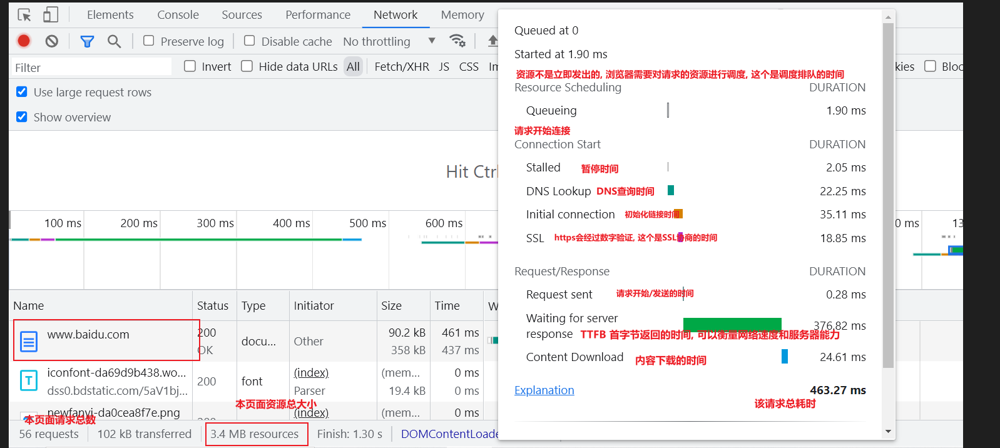
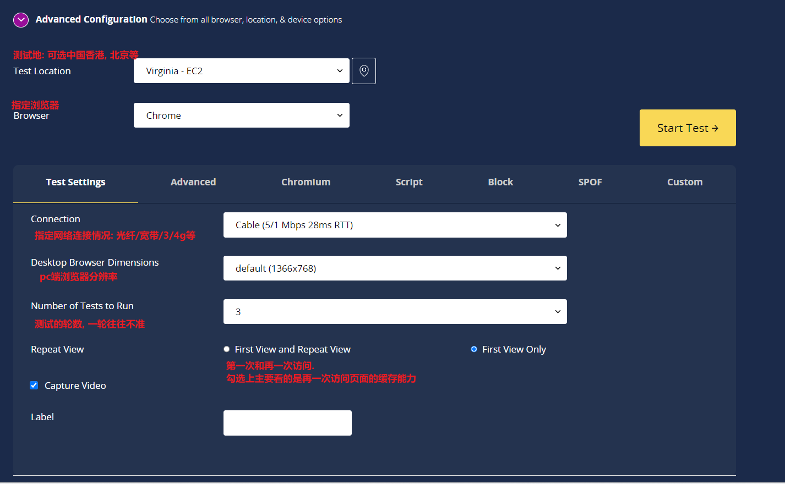
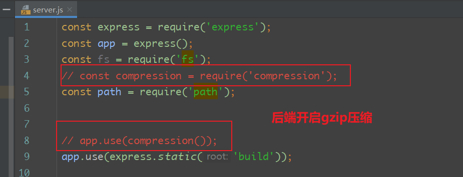
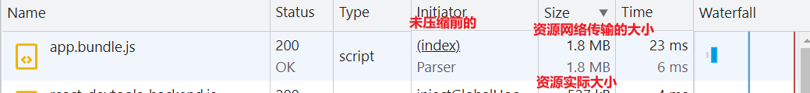
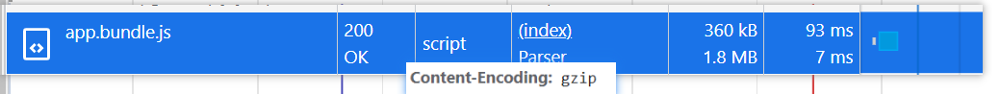
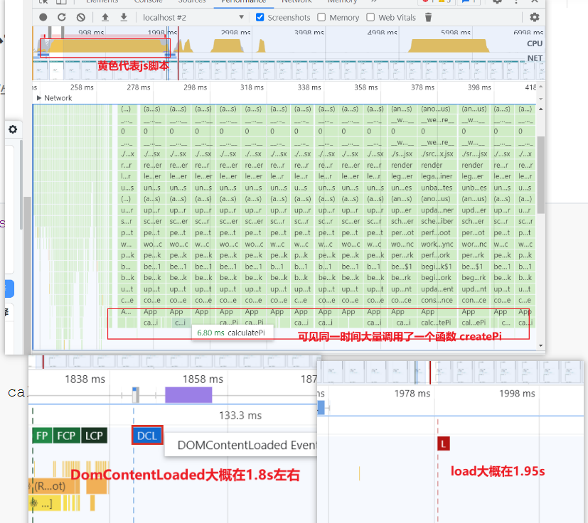
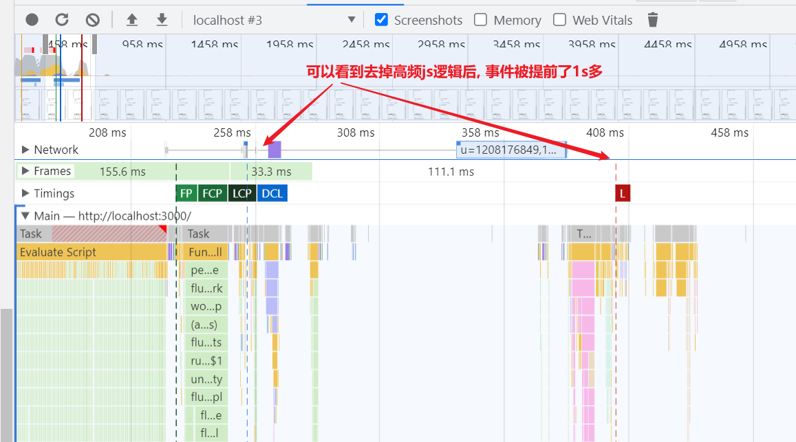
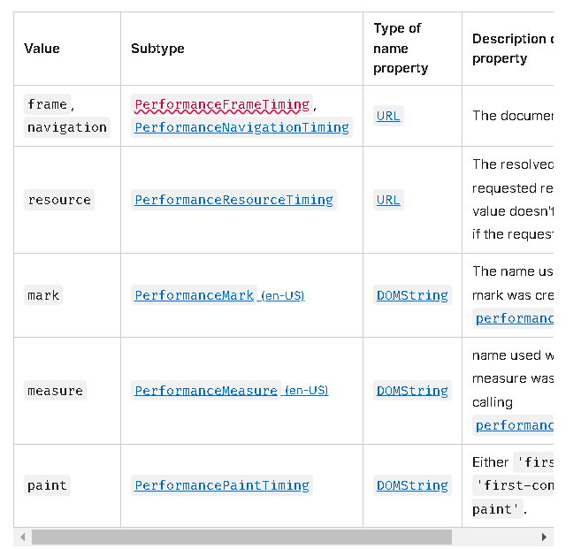
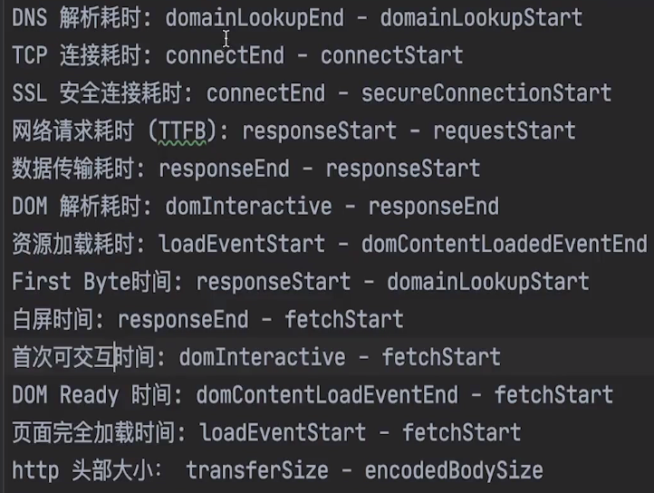
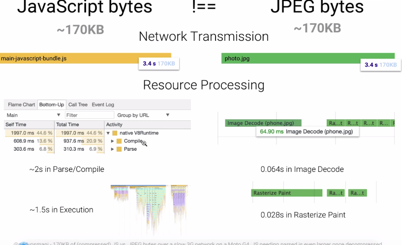

# Web性能优化

## Google对于网页性能的几个指标

1. **FCP: (first contentful paint) 第一次页面渲染**
   - 第一次渲染DOM内容的时间(render a bit of content of DOM)
2. **FP (first Paint)**
   - 第一次渲染时间, 渲染的是第一个像素的时间, 和FCP的区别在于, FCP是第一个DOM内容的渲染时间, 这个是第一次渲染时间, 可能是背景颜色
3. **LCP: (lagest contentful paint) 最大元素内容的渲染**
   -  渲染最大的图片或者文本的渲染时间(the largest image or text paint)
4. **CLS: (cumulative layout shift) 页面元素累计偏移量**
   - 越小越好, 页面的布局变化的越快, 用户体验就会越差
5. **FID: (first input delay) 第一次输入延迟**
   - 第一次点击, 或者输入后到内容显示的延迟, 指的是js脚本和用户之间的交互时间, 越短越好
6. **Speed Index 速度指数**
   - 指的是内容填充页面的平均速度, 它主要用于测量页面内容在视觉上填充的速度。通常会使用这个指标来进行性能的比较
7. **TTFB: (Time to First Byte): 首字节获得时间.**
   - 指的是网络请求发出(不包括DNS解析, TCP链接建立, SSL协商, 是真正的发出)------->服务器解析(包括数据库查表,返回数据所需的耗时) -----> 客户端获得数据(不需要渲染数据, 获得即可), 这个指标可以衡量网络的情况以及后端处理数据的速度 
8. **TTI:（Time to Interactive) : 可交互时间”**
   - 表示网页第一次 完全达到可交互状态的时间点。可交互状态指的是页面上的UI组件是可以交互的（可以响应按钮的点击或在文本框输入文字等)
9. **DCL(DomContentLoaded DOM解析的时间)**
   - DOM解析渲染完毕的时间
10. **L (Loaded)**
  - 页面完全渲染完成的时间, 包括页面上的一切资源,比如image图片的加载时间, css的加载时间,Dom渲染的时间等等


## 认识实验室数据和真实数据的偏差

> 即使在lightHouse中勾选了clear storage (清除缓存影响)  simulated throtting (模拟低性能设备), 经过测试的数据也一定是与实际不相符的. 真实的用户可能比想象的更差. 


## Network的瀑布流(waterfall)



## ChromDev tools 命令大全

### 查看当前页面帧数

> 每一帧都是静止的图象，快速连续地显示帧(图像)便形成了运动的假象，
>
> 帧数是所有图像(帧)的总数, 英文: frames. 帧率(frame rate)是每秒中能显示帧的总数, 英文
> 为FPS(frames per second). 
>
> 帧数越大, 视频/动画越平滑, 小于60FPS的动画/视频会给用户带来肉眼可见的卡顿

1. 在google devtools 中 按住 ctrl + shift + p
2. 输入 FPS 或者 show frames per second(FPS) meter


### 截图

1. ctrl + shift + p
2. show capture 

### 阻止当前页面发起某个请求

> 此命令可衡量当页面不加载某个js/css时候对页面是否有影响

1. ctrl + shift + p
2. show network request blocking(或者直接输入 blocking)
3. 勾选上  enable network request blocking  
4. 添加禁止的文件

## RAIL模型
> 用于评估页面性能一些指标

1. R: Response 
   - 不是指的AJAX的响应, 而是指页面的响应, 比如点击button后的响应, input输入后的响应
   - 小于50ms为佳
2. A: Animation
   - 动画
   - 大于60FPS则会让用户有明显的卡顿, 换算成毫秒,则为 1帧 / 16.6ms, 考虑到浏览器绘制动画也需要
     时间, 大约6ms/帧, 所以动画应该优化到 10ms/帧 也就是100FPS左右
3. I: Idle
   - 主线程空闲的时间
   - 只有让主线程空闲时间很多, 才能在用户交互的时候, 迅速的反应,不能让主线程一直处于
     繁忙状态, 应增加主线程的空闲时间. **减少长任务**
4. L: Load
   - 完成资源加载(包括解析, 渲染)并且和用户可以交互
   - 小于5s

## 性能测量工具

### https://www.webpagetest.org
> 一个测试网站性能的网站, 在全国各地铺设服务器, 输入url和一些选项, 便能利用铺设的服务器
> 对网站性能测试, 并出示详细的性能报告
>
1. 页面指标的介绍
   - 
   - 
   - 


### LightHouse

> 谷歌开发者工具对于页面性能检测的一个选项卡工具

1.  clear storage : 清除缓存与cookie等, 录制页面时, 应该勾选上, 尽量模拟用户第一次点击进页面
2.  simulated throtting : 开发人员电脑一般比用户的要好, 勾选上这个可以模拟电脑的低性能
3.  device : 运行的设备 desktop: pc端 / mobile :移动端
4.  lighthouse运行时, 应该与测试的页面剥离开(指把开发者工具单独拖出去), 以防止影响页面的大小
5.  generate report : 重新启动当前页面, 并生成性能报告, 大约30s


### 练习: 测试 b站, 掘金 和知乎的 FCP, LCP 和 CLS

|      | FCP   | CLS   | LCP   |
| ---- | ----- | ----- | ----- |
| b站   | 1.1 s | 0.006 | 1.3 s |
| 掘金   | 0.9 s | 0.035 | 2.8 s |
| 知乎   | 0.8 s | 0.069 | 1.4 s |

## 性能优化手段

### 1. 后端开启gzip压缩, 对文件进行压缩

> 对文件开启gzip压缩可以让文件在网络上传输的大小降低, 缩减传输时间
> 响应头上加 Content-Encoding:gzip

node服务器


压缩前时间对比


压缩后时间对比



### 2. 减少首屏中不必要的的js逻辑
> load事件为页面中的css, 图片, js脚本, DOM结构都加载完后触发的事件


**阻塞代码**

```jsx
class App extends React.Component {
    constructor(props) {
        super(props);
        // 1500ms内一直走逻辑
        this.calculatePi(1500); // 测试密集计算对性能的影响
    }

    calculatePi(duration) {
        const start = new Date().getTime();
        while (new Date().getTime() < start + duration) {
            // TODO(Dereck): figure out the Math problem
            // console.log(1);
        }
    }
// ...省略
}
```

**优化前的performance选项卡**


**优化后的performance选项卡**



## 
> js提供的可测量性能的API

1. 可测量性能的"条目"
 - frame和navigation 提供了html加载过程的完整的生命周期时间点. 从输入url敲回车到onload所有资源加载完的各个关键时间点(包括上个页面的卸载, 重定向, 缓存, DNS查询, 建立TCP链接, 发出请求, 响应, 处理数据, onload加载完成等 ). 详细图见navigation entry lifecycle 和各个时间结算表
 - resource主要测量了资源的生命周期, 包括css,script,image等
 - paint 主要测量一些关于页面绘制的性能之间, 包括FP和FCP
 - measure 手动测量两个时间点见的性能. 常与performance.mark搭配使用
 - 
2. performance.getEntries() 按照startTime排序
   - 返回从加载url到触发方法时间内, 包含的所有条目的生命周期
3. performance.getEntriesByType() 按照startTime排序
   - 返回从加载url到触发方法时间节点内, 包含的指定条目的生命周期
4. performance.getEntriesByName() 按照startTime排序
   - 返回触发方法时间节点内, 包含的指定名称的生命周期
5. performance.mark(name)
   - 可以在某个时间点打点, 记录其开始事件. 再在另一个事件点打点, 再利用performance.measure衡量两个点之间的性能
```js
const {performance, PerformanceObserver} = require('perf_hooks')
const add = (a, b) => a + b

const ob = new PerformanceObserver((list) => {
  console.log(list.getEntries()[0])
})

ob.observe({
  entryTypes:['measure']
})

performance.mark('start')
for (let i = 0; i < 10000000; i++) {
  add(1, 2)
}
add(1,'a11')

for (let i = 0; i < 10000000; i++) {
  add(2, 3)
}
const end = performance.mark('end')
performance.measure('measure_start_end', 'start', 'end')


```
6. PerformaceObserver
   - 1-5的API只能在某个时间点测性能, 该API是只要性能条目产生了就能获得, 更灵活
   - 可以当某个或者某些性能条目被记录下来的, 调用回调函数
```js
var observer = new PerformanceObserver(function(list, obj) {
  var entries = list.getEntries();
  for (var i=0; i < entries.length; i++) {
  // Process "mark" and "frame" events
  }
});
observer.observe({entryTypes: ["mark", "frame"]});
```
7. 监视长任务
- 执行耗时>50ms的任务就被称为长任务. 用户最少需要60FPS的帧数也就是16.6ms显示一帧才不会觉得 
  卡顿. >50ms的任务, 很容易让用户感觉到卡顿所以需要检测长任务, 进行优化

```js
var observer = new PerformanceObserver(function(list, obj) {

});
observer.observe({entryTypes: ["longtask"]});
```


## navigation entry lifecycle 和各个时间结算表
> 下图的navigation的生命周期, 像resource和其他条目的生命周期可能比这个短





## 关键渲染路径

> **关键渲染路径**是浏览器将 HTML，CSS 和 JavaScript 转换为屏幕上的像素所经历的步骤序列。
>
> ​	--- MDN 

关键渲染路径 (Critical Render Path) 指html响应到绘制出图像的过程. 其包括DOM树, CSSOM树, Render树的构建和layout布局和paint绘制


简单的解释一下

1. **DOM树+CSSOM树 = Render(layout)树**  
   - ( html和css解析后生成两棵树, 再合成一个包含着结构和样式信息的树, 称为render树. 其中display:none的节点, 不进入render树 )
2. **layout布局** 
   - (计算视图需要的位置信息, 比如offsetWidth等 一个溢出auto的div, 滚动条的大小位置等信息, 比如解析实体符号的换行, 将信息注入layout 树)  
3. **paint绘制** 
   - (将图形画出来)
4. **composite复合** 
   - (绘制是在不同可能图层上做的, 复合即将不同的图层组合起来, 形成最终的绘制效果, 此过程由复合线程控制, 不由主线程控制)


## 优化回流 

### 优化回流之读写分离

频繁的读写操作会导致强制回流(forced layout)


如 offsetWdith读取宽度后再通过 style.width设置宽度, 此时会发生强制回流, 频繁的强制回流会导致时间消耗


解决方案 :

通过 fastdom库, 将读写分离, 从读写读写 变成读读写写.  取消每次动画帧的强制回流


```js
const update = (timestamp) => {
    const imgs = document.querySelectorAll('.MuiCardMedia-img')
    for (let i = 0; i < imgs.length; i++) {
      fastdom.measure(() => {
        const img = imgs[i]
        const top = img.offsetTop

        fastdom.mutate(() => {
          img.style.width = (
            (Math.sin(top + timestamp / 1000) + 1) * 500
          ) + 'px'
        })
      })
    }

    window.requestAnimationFrame(update)
  }

  window.addEventListener('load', update)
```


### 优化回流之tranfrom与opacity与图层

利用transform 和 opcity 代替修改位置信息的DOM操作

修改transform 和 opacity的animation或者transition只会触发图层的复合. 而不会触发回流. 

通过performance选项卡可以看到, 使用transform进行的位移, 主线程未出现 重绘和回流的操作

猜测是由 复合线程做的处理 再复合图层, 所以主线程可以更多精力处理其他js


浏览器会为做动画的元素开一个图层(transform/transition), 也可以利用css的will-change提前指定为那些元素开启图层, 优化性能


## window.requestAnimationFrame

requestAnimationFrame(cb)

由浏览器调度, 在当前电脑刷新率下, 刷新前一帧前调用

即:   raf(回调中涉及重绘或者回流代码) ---> 布局 ---> 重绘 --> 屏幕刷新一帧


## 昂贵的js

> 下图是来自google团队的分享



根据如图可以看出 

请求同样是170kb的js文件和图片的时间开销是不同的

其中网络请求的时间是相同的3.4s

但是浏览器解析js花了3.5s左右, 包括编译和执行js代码

解析图片只花了28ms左右


由此可见, js的时间开销更大, 我们应该对js的进行适当的优化, 使编辑和执行的速度加快


### js优化之写出饥饿解析(earger parse)与 lazy parsing 懒解析

> 这部分内容, 让我感到不真实, 网上又找不到相关资料, 所以不记录. 大概内容可以看下边链接进行回顾

http://www.manongjc.com/detail/55-ybqzslbnydqituz.html


## 图片优化

### 1. 图片格式

1. jpg / jpeg 
   - 色彩感强, 高压缩比. 30kb --> 5kb 且影响图片质量小
   - 缺点: 边缘和纹理处理不好
   - 适合: 经过压缩后显示为大图片, 背景图
2. png
   - 支持背景透明
   - 和jpg近似的压缩比, 边缘和纹理处理比jpg好. 但质量比jpg大. 适合logo
3. webp
   - google推出图片格式, 压缩更高, 质量更小. 截止至今浏览器兼容性还可以
   - 淘宝用的是webp

总结: 对于非电商这种图片巨多的网站, 其实更需要关注的是怎么压缩图片, 而不是极致的图片格式


### 2. 优化图片

1. 图片懒加载

   - 在滑动到对应视口时候再加载该图片, 如使用react-lazy-load-image-component包

2. 渐进式图片

   - 主要优化用户体验, 加载某一张图片时候先出一个模糊的效果, 再逐渐加载成清晰的图片
   - 依赖于图片本身的功能, 需要美工出一张图片, 前端加载即可. 或者有现成的js库(progressive-image等), 或者在线转换工具自己搞
   - 参考文章:https://blog.csdn.net/example440982/article/details/121554438

3. 响应式图片

   - 同一种效果, 在不同的设备上加载不同的图片. 避免了小设备加载大图片等浪费问题

   - 依赖于image标签自带的srcset属性, 可以指定不同分辨率下的src. 参考文档https://developer.mozilla.org/zh-CN/docs/Web/API/HTMLImageElement/srcset

   - 依赖于image标签自带的sizes属性. 可以指定不同分辨率下图片的大小

   - ```css
     <!DOCTYPE html>
     <html lang="en">
     <head>
             <meta charset="UTF-8">
     </head>
     <body>
             
     </body>
     </html>
     ```

## 自定义字体优化

> 在项目中可能会使用某些字体, 需要用户下载

1. 通过@font-face引入字体包 https://developer.mozilla.org/zh-CN/docs/Web/CSS/@font-face
2. 通过unicode-range:指定字体包应用范围: https://developer.mozilla.org/en-US/docs/Web/CSS/@font-face/unicode-range
3. 通过 font-display指定合适的闪烁策略 https://developer.mozilla.org/zh-CN/docs/Web/CSS/@font-face/font-display


## Http优化


### Gzip压缩

gzip压缩可以通过webpack的插件在前端开启， 也可以通过配置Nginx在请求时候由服务端动态生成。 都可以用来减少网络传输过程中的时间。 浏览器能自动解析gzip压缩后的文件

```js
// 前端开启gzip压缩， 配置了以后会生成.gz文件， 还需要配置nginx， 让请求时候优先返回.gz文件
// 以下是@craco配置
const CompressionWebpackPlugin = require('compression-webpack-plugin')

configure: webpackConfig => {
      /* plugins */
      whenProd(() => {
        webpackConfig.plugins = [
          ...webpackConfig.plugins,
          /* gzip压缩 */
          new CompressionWebpackPlugin({
            test: /\.(html|js|css)/
          })
        ]
      })
}
```


### http之Keep-Alive

> http协议会自动的开启keep-alive， 其特点就是访问相同的域名， 不会进行多次tcp链接的建立
>
> 减少耗时。 同时可以通过配置nginx配置更详细的keep-alive设置
>
> 可以在响应报文中看到  connection：keep-alive


### 开启http缓存技术

利用浏览器的缓存技术， 在一定时间内不必每次都请求相同文件， 优化加载速度


同样需要后端通过配置nginx来配置文件的响应头， 从而告诉浏览器哪些文件采用什么缓存策略


其中强缓存相关的响应头是

Cache-Control/expiers  

前者是相对时间或者 “no-cache”这样的字符， 后者是绝对时间。 目的是告诉浏览器这个资源在规定的时间内不需要请求服务器， 直接走缓存。 其中Cache-Control的优先级比后者高。


其中协商缓存相关的响应头是

If-None-Match和Etag

If-Modifierd-Since和last-modifierd


协商缓存即： 过了强缓存的约定时间后， 客户端会携带者一个凭证问问服务端文件是否修改过， 如果没有修改服务端返回304 如果修改了返回200


Etag是由服务端为每个文件生成的唯一hash值， 如果更新了就重新生成新的。 客户端在发起协商缓存时， 会在If-None-Match中带着上一次的Etag， 与服务端的Etag进行对比。 如果相同则返回304


last-modifierd与Etag类似， 不过是一组文件的修改的时间。 有一些问题： 比如服务端和客户端的时间可能不同， 时间的精度等


### 服务端渲染SSR

可以通过Next等现有框架做服务端渲染， 将html绘制好后返回给浏览器， 让浏览器直接渲染， 增加首屏渲染速度

## webapck

### 提升构建速度

1. 为esnlint, babel开启缓存, 关闭缓存文件压缩

2. 多线程打包(为eslint,babel,terser-webpack-plugin提供多线程能力

3. dll 动态链接库

4. modules的OneOf 只匹配一个loader

5. Rule.include or Rule.exclude

   - 可以给eslint, babel指定检查和编译的文件范围. 比如只包括src下的文件​

### 减少代码体积

1. tree shaking

   - 依赖于ESmodule, 在webpack中只要使用ESmodule的模块自动开启tree shaking

2. 提取babel-runtime运行时代码为单独chunk

   - ```js
     // 依赖@babel/babel-transform-runtime
     {
       "plugins": [
         [
           "@babel/plugin-transform-runtime",
           {
             "absoluteRuntime": false,
             "corejs": false,
             "helpers": true,
             "regenerator": true,
             "version": "7.0.0-beta.0"
           }
         ]
       ]
     }

     ```

3. 自动压缩本地图片， 使用imagemin

   - 无损压缩与有损压缩	https://www.wordpresshy.com/306283 

   - webapck/imagemin文档： https://webpack.js.org/plugins/image-minimizer-webpack-plugin/#root

   - ```js
     // @craco配置  
     // 以下是有损压缩
     const ImageMinimizerPlugin = require('image-minimizer-webpack-plugin')

     whenProd(() => {
             webpackConfig.optimization.minimizer.push(
               new ImageMinimizerPlugin({
                 minimizer: {
                   implementation: ImageMinimizerPlugin.imageminMinify, // 共有imageminMinify和squooshMinify两种模式
                   options: {
                     plugins: [
                       ['gifsicle', { interlaced: true }],
                       [
                         'mozjpeg',
                         {
                           // 图片压缩质量
                           quality: 50,
                           //是否开启渐进式图片
                           progressive: true
                         }
                       ],
                       ['pngquant', { quality: [0.3, 0.5] }],
                       [
                         'svgo',
                         {
                           plugins: [
                             'preset-default',
                             {
                               name: 'removeViewBox',
                               active: false
                             },
                             {
                               name: 'addAttributesToSVGElement',
                               params: {
                                 attributes: [
                                   { xmlns: 'http://www.w3.org/2000/svg' }
                                 ]
                               }
                             }
                           ]
                         }
                       ]
                     ]
                   }
                 }
               })
             )
           })
     ```

   - ​


   - 只能压缩本地图片, 外链图片需要使用其他手段处理

4. 代码分割与preload/prefetch

   - ```js
     // 代码分割
     // 代码分割主要作用是为了更好的缓存
         whenProd(() => {
             webpackConfig.optimization.runtimeChunk = 'single'// 为weboack runtime单独打包成一个chunk
             webpackConfig.optimization.splitChunks = {
               ...webpackConfig.optimization.splitChunks,
               chunks: 'all',
               cacheGroups: {
                 vendors: {
                   name: 'chunk-libs',
                   test: /[\\/]node_modules[\\/]/,
                   reuseExistingChunk: true,
                   priority: 10
                 },
                 react: {
                   name: 'chunk-react',
                   test: /(react|react-dom)/,
                   priority: 20,
                   chunks: 'initial'
                 },
                 antd: {
                   name: 'chunk-antd',
                   test: /[\\/]node_modules[\\/]antd/,
                   priority: 25
                 },
                 components: {
                   name: 'chunk-components',
                   test: path.resolve(__dirname, 'src/components'),
                   priority: 15,
                   minChunks: 2,
                   reuseExistingChunk: true
                 }
               }
             }
           })
     ```

   - ​

###优化代码性能 

1. js兼容性配置-babel与corejs
   - @babel/preset-env集成了babel的一些预设插件, 包括对js兼容性的插件, 默认只有ES6的Polify, 如果想支持更新的语法. babel集成了corejs, 这是一个ES6+的polify库, 需要通过配置preset-env的选项
2. pwa
   - 在离线状态下也能访问App , webpack插件名为: workbox-webpack-plugin


##什么是loader
1. 从执行顺序上说 分为： preloader ---> normalloader --> inline loader --> postloader
2. 从功能上来说又分为同步loader， 异步loader和pitch loader
3. loader的执行阶段为 先顺序执行pitch， 再逆序执行normal-loader。 若有pitch中return了则会发生熔断
4. 熔断指的是当前loader和后面的loader不再执行， 前面的loader会执行

## 自定义loader
> loader就是通过Commonjs， 暴露的一个函数， 在解析文件时候会被执行

### 同步loader
```js
// content: 文件的内容， 为字符串
// map：sourceMap相关
// meta： 别的loader传递的参数

module.exports = function(content， map， meta) {
    return content // 必须将content返回
}

// 或者
// 这种方法不需要如return
// 只需要调用this身上的callback方法
// callback的第一个参数是错误对象， 如果有的话。
// 这样可以让下个loader接受到错误信息
module.exports = function(content, map, meta){
    this.callback(err, content, map, meta)
}
```


### 异步loader

```js
module.exports = function(content, map, meta){
   const callback = this.async()
   setTimeout(() => {
       callback(err, map, meta)	
   })
}
```


### 原生loader
> 原生loader一般处理图片等资源。 可以获得buffer数据

```js
function testLoader (content){
    // console.log(content)  // content是Buffer数据
}

testLoader.raw = true 

module.exports = testLoader
```

### pitch loader
> 在loader执行之前执行
> pitch 的执行顺序类似于捕获阶段（从前向后， 在所有loader执行之前）
> loader的执行顺序类似于冒泡， 从后向前（在所有pitch之后）
> pitch 中若return了结果， 本次的loader以及后面的所有的loader和pitch将不会执行， 之前的loader依然会被调用

```js
module.exports = function(){}
module.exports.pitch = function(){} // 给loader身上挂载pitch方法即为pitch loader
```

### loader API
<a href="https://webpack.docschina.org/api/loaders">loader Api</a>


### 移除console的loader


```js
module.exports = function (content) {
    // console.log(typeof content);  content默认是文件内容字符串
    const logReg = /console\.log\(.*\);?/g 
    
    return content.replace(logReg, '') 
}
```


### 简易版file-loader
<a href="https://www.bbsmax.com/A/A2dmGgjOJe">什么是JSON scheme</a>
```js
const {interpolateName } = require('loader-utils')
const schema = {
    type: 'object',
    properties: {
        filename: {
            type:"string"
        }
    }
}

module.exports = function (content) { 
    // 当loader函数身上的raw属性为true时候， content接受的是文件的buffer
    // 0. 生成新的文件名
    const { filename } = this.getOptions(schema) // 
    const newFilename = interpolateName(this, filename, {
        content
    })
    // 1. 根据buffer生成图片， 要求图片名唯一
    this.emitFile(newFilename, content)

    // 2. 返回一段js脚本， 用文件的路径代替图片模块
    // 不要忘了加引号
    return `export default '${newFilename}'`
}

module.exports.raw = true
```

## 什么是plugin
在webpack的构建过程中， 通过暴露的钩子嵌入一些执行的逻辑， 从而丰富整个webpack构建过程。 是为了弥补loader不能做到的事情的功能
文档： <a href="https://webpack.docschina.org/contribute/writing-a-plugin/">webpack plugin</a>

### 自定义BannerWebpackPlugin
> 为每个js 或者 css资源生成作者注释信息的插件

注意点：
1. 每个插件都是构造函数或者类。 且必须有能访问到的apply方法
2. compilier是整个webpack构建中的对象， 只构建一次。compilation是每个入口chunk都会构建一个的对象
3. 绑定hook的基本规则是 compiler.hooks.具体的hook.绑定方式(tapAsync/tap/tapPromise) 
4. compilation.assets可以获得此次编译的所有资源， 通过添加或删除assets可以影响输出的文件
5. 每一个asset都是一个{ size（）{}， source（）{} } 形状的对象。 size方法返回该资源的大小， source方法返回该资源的实际内容（Buffer或者String）

```js
class BannerWebpackPlugin { 
    constructor(options = {}) {
        this.options = options
     }
    apply(compiler) {
        // 获取hook， 然后通过tap：通过注册 tapAsync： 异步注测 tapPromise：异步promise注册hook
        compiler.hooks.emit.tap('BannerWebpackPlugin', (compilation) => {
            const extensions = ['js','css'] // 规定只给js和css文件加注释， 其他的比如图片不加注释
            const assets = compilation.assets
            
            const assetKey = Object.keys(assets).filter((key) => {
                const extenssion = key.split('.').at(-1)
                return extensions.includes(extenssion)
            })

            const author = `
               /**
                * Author: ${this.options.author} 
                * Data: ${new Date()} 
                * 
                * **/
            `
            assetKey.forEach(key => {
            
                const asset = assets[key].source()

                assets[key] = {
                    size(){
                        return asset.length + author.length
                    },
                    source(){
                        return  author + asset
                    }
                }
            })

        })
     }
}

module.exports = BannerWebpackPlugin
```


### 自定义AnalyzeWebpackPlugin
> 生成每个包的大小分析文件

```js
class AnalyzeWebpackPlugin { 
    constructor(options = {}) {
     /* 需要的话自行添加 */    
    }
    apply(compiler) { 
        compiler.hooks.emit.tap('AnalyzeWebpackPlugin', (compilation) => { 
            const assets = compilation.assets
            
            let md = `| 序号 | 资源名称 | 资源大小 |\n| --- | --- | --- |`

            Object.entries(assets).forEach(([name, file],index) => { 
                md += `\n| ${index} | ${name} | ${file.size()} |`
            })

            assets['analyze-report.md'] = {
                size() { 
                    return md.length
                },
                source() { 
                    return md
                }
            }
        })
    }
}

module.exports = AnalyzeWebpackPlugin
```