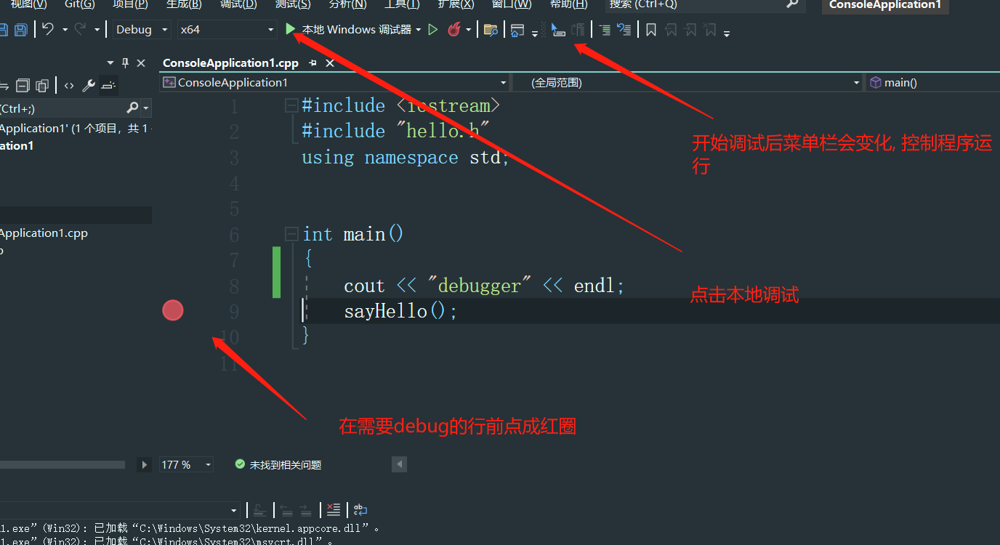

# C++

## VS操作

### vs中如何格式化代码

在 Visual Studio 中，可以使用内置的格式化功能来格式化代码。以下是格式化代码的步骤：

1. 打开要格式化的文件。
2. 选择要格式化的代码部分。您可以选择整个文件或仅选择某个部分。
3. 打开“编辑”菜单，并选择“高级”->“格式化文档”或“格式化选定内容”。
4. 等待 Visual Studio 格式化代码。
5. 查看代码格式是否符合您的要求。如果不符合，可以撤销格式化，或者尝试不同的格式化选项。

另外，您也可以使用快捷键 Ctrl + K，Ctrl + D 来格式化整个文档，或者使用 Ctrl + K，Ctrl + F 来格式化选定的文本。如果您想要自定义代码格式化选项，可以打开“工具”菜单->“选项”，然后选择“文本编辑器”->“C#”->“代码样式”来进行设置。


### vs中注释的快捷键

在 Visual Studio 中，有以下两种常用的快捷键可以注释代码：

1. 注释选定的行或代码块：选定要注释的行或代码块，然后按下快捷键 Ctrl + K，Ctrl + C。
2. 取消选定行或代码块的注释：选定要取消注释的行或代码块，然后按下快捷键 Ctrl + K，Ctrl + U。

需要注意的是，这些快捷键在不同的语言和文件类型中可能会有所不同，因此请确保您在正确的上下文中使用这些快捷键。另外，如果您希望自定义这些快捷键，可以打开“工具”菜单->“选项”，然后选择“环境”->“键盘”，在搜索框中输入“注释”来查找并更改相应的快捷键设置。


## vs中只编译不运行的快捷键

在 Visual Studio 中，可以使用以下快捷键只编译代码而不运行程序：

1. 编译当前项目：按下快捷键 `Ctrl + Shift + B`，即可编译当前项目。
2. 编译当前打开的文件：选中当前打开的文件，然后按下快捷键 `Ctrl + F7`，即可编译当前文件。

需要注意的是，这些快捷键在不同版本的 Visual Studio 中可能会有所不同，因此请根据您使用的版本和上下文选择相应的快捷键。另外，编译后的程序需要手动运行，可以通过在命令行窗口中输入程序的可执行文件名来运行程序。


## c++基础模板

```c++
#include <iostream>
using namespace std; // 使用命名空间std. 则cout就不用std::cout了

int main()
{
	cout << "你好" << endl; //cout想控制台输出. endl代表一行结束. << 分隔符
}
```


## 常量

### 宏常量

```c++
#include <iostream>
using namespace std;

//1. 宏常量不用声明类型. 不正确:#define double PI 3.1415926
//2. 宏常量不用等号 不正确: #define PI = 3.1415926
//3. 宏常量后不能使用分号.不正确: #define PI = 3.1415926;
//4. 宏常量拥有全局作用域
#define PI 3.1415926

int main()
{
	cout << PI << endl;
}

```

### const 修饰的常量

```c++
#include <iostream>
using namespace std;

int main()
{
	const double PI = 3.1415926; // 在数据类型前加const关键词
	cout << PI << endl;
}
```


## bool类型的隐式转换

```c++
#include <iostream>
using namespace std;

int main()
{  
	// 在c++中, false == 0, true == 1. 真值会被隐式转换为1, 假值会被隐式转换为0
	const bool b1 = 0; // 0
	const bool b2 = 1; // 1
	const bool b3 = 12314; // 1
	const bool b4 = "12312"; // 1
	const bool b5 = true; // 1
	const bool b6 = false; // 0
	const bool b7 = NULL; // 0

	cout << "b1: " << b1 << "\n"
		<< "b2: " << b2 << "\n"
		<< "b3: " << b3 << "\n"
		<< "b4: " << b4 << "\n"
		<< "b5: " << b5 << "\n"
		<< "b6: " << b6 << "\n"
		<< "b7: " << b7 << "\n"
		<< endl;
}
```


```cpp
void main() {
	// 在括号中会自动隐式转换
	if (100) {
		cout << "你好" << endl;
	}
}
```


## c++11初始化

> 在linux环境下需要加 -std=c++11

```c++
#include <iostream>
using namespace std;

int main()
{  
	// 小括号赋值
	int num1(10);
	bool flag(true);
	string text("你好");

	// 中括号赋值
	double price{ 5.2 };
	string html{ "<span>你好</span>" };

	cout<< 
		num1 << "\n" <<
		flag << "\n" <<
		text << "\n" <<
		price << "\n" <<
		html << "\n" <<
	endl;
}
```

## c++11初始化晋级

结构体中与类的初始化

```cpp
struct Point {
    int x, y;
};

Point p1 = {1, 2}; // 结构体初始化
Point p2 = {};     // 所有成员初始化为默认值

class Person {
public:
    std::string name;
    int age;
    Person(const std::string& n, int a) : name(n), age(a) {}
};

Person person = {"Alice", 30}; // 类初始化，调用构造函数
```

返回值中的应用

```cpp
struct Person {
	string name;
	int age;
};

Person getPerson() {
	return { "张三", 17 };
}
```

```cpp
struct Vector2D {
    double x, y;

    Vector2D operator+(const Vector2D& other) {
        return {x + other.x, y + other.y};
    }
};
```


## c++11原始字面量

> 更方便的描述字符串

语法: 

``string str1 =  R “表述(raw string)表述”`

特点:

1. 可以换行, 无视转义反斜杠
2. 括号两旁的注释字符串必须相同

```c++
int main()
{
	
	// 支持换行, span必须是两对, 五十反斜杠
	string str1 = R"span( 
		<span>
			你好
		</span>	
	)span";

	cout << str1 << endl;
}

void main() {
	string str = R"(\n)"; // 无视反斜杠, 两侧注释可以省略
	cout << str << endl; // 输出\n
}
```


## goto语句

```c++
#include <iostream>
using namespace std;

// c++中可以给起行号
int main()
{
row1:
	cout << "这是第一行" << endl;
	goto row3;  // 跳转到第三行
row2:
	cout << "这是第二行" << endl;
row3:
	cout << "这是第三行" << endl;
}
```

## 作用域

### 全局作用域

```c++
#include <iostream>
using namespace std;

// 全局作用域
int MAX_AGE = 20000;

int main()
{
	cout << MAX_AGE << endl;
}
```

### 函数作用域

```c++
#include <iostream>
using namespace std;

void func1();
void func2();

int main()
{
	func1();
	func2();
}

void func1()
{
	int a = 1;
}

void func2()
{
	cout << a << endl; // 报错不能访问另外函数中a
}

```

### 块作用域

```c++
#include <iostream>
using namespace std;

int main()
{
	if (true)
	{
		int a = 1;
	};

	cout << a << endl; // 不能访问a
}

```

## c++中的分号

在 C++ 中，语句以分号（;）结尾。一般来说，除了以下几种情况，所有语句都需要以分号结尾：

1. 类的定义

   类的定义中，不需要在最后的右括号后加分号。

2. 函数定义

   函数定义的末尾不需要加分号，只需要在函数体的末尾加上右花括号即可。

3. 条件编译指令

    条件编译指令中，不需要在末尾加上分号。

例如：

```
cppCopy code
#ifdef DEBUG
    std::cout << "Debugging is enabled." << std::endl;
#endif

```

4. 初始值设定项

   在变量定义时，如果使用初始值设定项（使用 = 符号赋值），则不需要在末尾加上分号。例如：

```
cppCopy code
int a = 1, b = 2;
```

5. 跳出语句

   跳出语句（如 break、continue 和 return）在语句末尾不需要加分号，因为它们本身就是语句的结束符。	

   总之，大多数情况下，C++ 中的语句都需要以分号结尾，只有上述特殊情况下才不需要。

## static 修饰的静态变量

> 函数内的静态变量只能被该函数访问. 

```c++
#include <iostream>
using namespace std;

void fn1();

int main()
{
	fn1(); // 1
	fn1(); // 2
	fn1(); // 3
}

void fn1()
{
	static int a = 1;
	cout << a++ << endl;
}

```

## :: 访问全局变量

```c++
#include <iostream>
using namespace std;

void fn1();

int main()
{
	fn1(); 
}

int a = 2;
void fn1()
{
	// 在变量前加 ::变量名, 代表访问全局变量
	int a = 1;
	cout << a << endl; // 输出1 
	cout << ::a << endl; // 输出2 
}

```

## c++算数运算的细节

**除数不要为0**

1. 整型除法(包括取模运算), 被除数为0, 程序异常退出
2. 浮点数除法, 被除数为0, 结果无限大

```c++
#include <iostream>
using namespace std;


int main()
{
	int a = 1;
	int b = 0;
	cout << a / b << endl; // 程序异常退出
}

```

```c++
#include <iostream>
using namespace std;


int main()
{
	int a = 1;
	double b = 0; // 浮点数0
	cout << a / b << endl; // 输infinite
}

```

**除法运算的类型**

1. 整数与浮点数运算 = 浮点数
2. 整数 / 整数 = 整数 

```c++
#include <iostream>
using namespace std;


int main()
{
	int a = 1;
	double b = 0.1;
	cout << a + b << endl; // 1.1
  	cout << a * b << endl; // 0.1
  	cout << 200 / 3 << endl;  // 输出66 整型
}

```

## 函数分文件编写

> 函数在实际开发中一般分文件编写

1. .h 文件是头文件, 存放函数/结构体/类的定义和引入其他的头文件

2. .cpp文件是程序文件, 存放函数/结构体/类的实现, 和引入自己的头文件

3. 主程序在使用时候只需要引入对应的头文件

4. 引入系统头文件使用#include<文件名>  引入自定义头文件使用#include "文件名"


hello.h头文件

```c++
#pragma once
#include <iostream>
using namespace std;

void sayHello();
```


hello.cpp 文件

```c++
#include "hello.h";

void sayHello()
{
	cout << "你好" << endl;
}
```

main函数

```c++
#include <iostream>
#include "hello.h"
using namespace std;


int main()
{
	sayHello();
}

```


   ## 使用VS debug程序

> 1.  在断点程序前√红圆圈
> 2.  开启本地调试
> 3.  在菜单栏中控制程序的运行




## sizeof 测量变量/数据类型的内存大小

1. 可以测量数据类型本身: sizeof(int)
2. 可以测量变量/字面量: sizeof(a)  sizeof(10)
3. 测量变量/字面量时可以不加(), 但是测量数据类型本身必须加() : sizeof(a) 或者 sizeof a 都可以
4. 得到的是所占内存的字节数, 数据类型是int
5. 相同数据类型在不同操作系统中所占内存大小 ==可能== 不同


## c++ 的数据类型

c++中基本数据类型分成四大种

1. 整数型
2. 字符型
3. 布尔型
4. 浮点型


基础知识:

1. bit  == 位. 计算机靠二进制存储数据, 如 001, 其中每一位就称为1bit, 1bit只有两种可能, 0或者1
2. byte == 字节. 字节是计算机存储容量的一种计量单位. 一字节有8位/bit. 举例如: 0000 0000


整数型

- 根据数值的大小分有三种short, int, long, 以及加上unsigned代表对应的无符号的数据类型. 共计6种
- c++11推出了long long表示更大的整数类型.


整数类型所占内存大小

| 数据类型           | 解释           | 所占字节                     | 取值范围            | 备注                                       |
| -------------- | ------------ | ------------------------ | --------------- | ---------------------------------------- |
| unsigned short | 无符号short     | 2                        | [0, 65535]      | 1个byte == 8bit. 那么2字节有16位, 共能存储 $2{^{16} = 65536}$个数字, 故取值范围为 [0, 65535] |
| short          | 有符号short     | 2                        | [-32768, 32767] | 因为带符号, 最高位代表符号位.故正数能存储  $2{^{15} = 32768}$ 个数字, 负数也能存储$2{^{15} = 32768}$个数字. 给取值范围为[-32768, 32767] |
| int            | 有符号int       | 4                        | --略--           | -- 略---                                  |
| unsigned int   | 无符号int       | 4                        | --略--           | -- 略---                                  |
| long           | 有符号long      | 32位操作系统 4字节;64位操作系统 8字节; | --略--           | -- 略---                                  |
|                |              |                          |                 |                                          |
| unsigned long  | 无符号long      | 32位操作系统 4字节;64位操作系统 8字节; | --略--           | -- 略---                                  |
| long long      | 有符号long long | 8                        | --略--           | -- 略---                                  |


字符型

1. 字符型所占1字节. 有符号signed char范围为[-128, 127], 无符号字符unsigned范围为[0, 255]
2. 字符型本质是将字符转为对应的ASCII码整数, 存储这个整数
3. 字符可以强转成整形 
4. 在c++中可以写c风格(char[])的字符串, 也可以写c++风格字符串(string)

```c++
int main()
{
	char a = 97; // 输出a, 证明char本质是ASCII码存储
	cout << a << endl; 
}
```

```c++
int main()
{
	char str1[]  = "我是字符串"; // c风格字符串, char数组
	string str2 = "我是字符串2"; // c++风格字符串
}
```


布尔型

1. 布尔型所占1字节
2. 布尔型底层用0代表false, 用1代表true


浮点型

1. float 所占4字节, 有效位数为7位
2. double所占8字节, 有效位数15位
3. long double 所占字节与有效位数不低于double, VS中占8字节, Linux占16字节
4. 有效位数记忆小技巧: 2 * 字节数 - 1
5. 有效数既包括小数点前的数, 也包括小数点后的数


## 数据类型转换

> c++中的数据类型转换分为两种
>
> 1. 自动数据类型转换
> 2. 强制数据类型转换


**自动类型转换**

1. 多种数据类型运算, 向高类型转换

   ```c++
   int main()
   {
   	char a('a'); // 97
   	int b(10); // 10
   	double c(20.0);// 20.0

   	// 朝更高精度计算, 输出127.000000000000
   	cout << sizeof (a + b + c) << endl; // 8字节, double数据类型
   }
   ```

2. 整形和浮点数运算必得浮点数, 即使整形所占字节大. 优先级比第一条规则高

   ```c++
   int main()
   {
   	long long num1 = 1000; //占8字节
   	float num2 = 3.2; // 占4字节

   	cout << num1 - num2 << endl; // 996.8
   	cout << sizeof(num1 - num2) << endl; // 4字节, 即float
   }

   ```

3. 声明与字面量类型不同时候会自动转化类型, 以声明为主

   ```c++

   int main()
   {
   	int a = 3.1415;

   	cout << a << endl; // 输出3, 将浮点数字面量转成了int, 并且丢失了精度
   	cout << sizeof(a) << endl; 
   }
   ```

   ​

**强制类型转换**

在类型前可以强制类型转换

```c++
int main()
{
	int a = (int)3.1415;

	cout << a << endl; 
}
```


## 类型别名

>给系统的类型起别名, 方便使用


作用1: 类型写的字符太多了, 很麻烦, 可以用类型别名定义标识符

```c++
int main()
{
	// 无符号整形
	typedef unsigned int uint;
	// 长整形
	typedef long long llong;
	// 无符号长整形
	typedef unsigned long long ullong;

	uint a = 255;
	llong b = 655;
	ullong c = 2000;

	cout << a << endl;
	cout << b << endl;
	cout << c << endl;
}
```

作用2: 屏蔽不同系统的类型所占内存大小, 做兼容

```c++
int main()
{
	// 在windows中longlong占8字节, 64位
	typedef long long int64_t; // 定义1

	// 在linux中long占8字节, 64位
	typedef long int64_t; // 定义2

	// 在程序中只使用int64_t, 在windows下引入第一个定义, 在linux下引入第二个定义
	// 就可以消除在windows上使用long为4字节, 在linux下使用long为8字节可能带来的风险
}
```


## 指针

> 指针是变量所占内存的第一个内存地址, 比如一个int所占4字节, 指针保存的就i是int第一个字节的内存地址


1. 取地址符号: &变量. 即可取出变量的内存地址, 16进制保存

   ```c++
   int main()
   {
   	int a = 10;
   	cout << &a << endl; // 0000009868CFFAD4
   }
   ```

   ​

2. 指针语法:  数据类型 * 名称 = 内存地址

   ```c++
   int main()
   {
   	int b = 200;
   	int* a = &b; // 指针只能保存内存地址, 所以要先取地址再赋值

   	cout << a << endl; //000000FBCD12F8E4
   }
   ```

   ​

3. 指针大小

   - 32位操作系统下, 指针永远占4字节, 无论什么数据类型
   - 64位操作系统下, 指针永远占8字节, 无论什么数据类型

   ```c++
   int main()
   {
       int b = 200;
   	int* a = &b; 

   	cout << sizeof a << endl; //输出8; int为4字节, 但是指针的内存在64操作系统下不管什么数据类型都占8字节
   }
   ```

   ​

4. cout 输出指针会导致输出字符串, 可以采用void * 强转, 或者转为long long十进制


## 指针操作

**通过指针修改数据**

```c++
#include <iostream>
using namespace std;

int main()
{ 
	int num = 10;
	int* num_ptr = &num;
	*num_ptr = 20; // 通过指针修改数据
	cout << num << endl;  //20
}

```

**函数地址传递VS值传递**

```c++
void func(int num1, int* num2)
{
	num1 = 200;
	cout << "num1:" << num1 << endl; //值传递
	*num2 = 200;
	cout << "num2:" << num2 << endl; //引用传递
}
```

## 指针与常量

**常量指针**

语法: const int* num1
特点: 不能通过解引用修改值, 可以重新赋值
应用特点: 函数中的形参指针, 表示不修改此指针中的值

```c++
void func(const int* num1)
{	
	int num2 = 200;
	num1 = &num2; // 可以重新赋值指针
	*num1 = 200; // 编译器报错: 表达式必须是可修改的左值

}
int main()
{
	int num1 = 10;
	func(&num1);
}

```


**指针常量**

语法: int* const num

特点: 指针不能重新赋值, 可以通过解引用重新赋值. 而且初始化的时候必须赋初始值

```js
int main()
{
	int num1 = 10;
	// int* const num2; // 不初始化报错
	int* const num2 = &num1;
	*num2 = 200; // 可以解引用赋值
	num2 = NULL; // 不能对指针重新赋值
}

```


**常指针常量**

语法: const int* const num

特点: 既不能给指针重新赋值, 也不通过解引用重新赋值. 而且初始化的时候必须赋初始值


## 任意指针

语法: void* 指针名

特点: 任意指针可以是任意的数据类型的指针., 但解引用且必须强制类型转换成具体类型

应用场景: 不适合写死的函数的形参指针

```c++
#include <iostream>
using namespace std;

void func(void* ptr) 
{
	cout << R"(ptr的内存地址是: )" << ptr << endl;
	// *ptr = 10; // 不能直接解引用, 需要强制类型转换
	*(int*)ptr = 200; // 先强转为具体类型, 再解引用
}
int main()
{
	int num1 = 10;
	func(&num1);
	cout << num1 << endl;
}

```

## new和delete控制堆内存空间

```c++
#include <iostream>
using namespace std;


int main()
{
	int* num1 = new int(10); 
	delete num1; // 释放num1的内存空间
}

```

## 空指针与野指针

**空指针**

定义: 指针指向的地址为空的指针

特点: 0和NULL和nullptr都可以作为空指针, 对空指针解引用会引发程序崩溃

应用: 为了保证程序的健壮, 在代码中增加对空指针的判断

```c++
int main()
{
	int* p1 = NULL;
	int* p2 = 0;
	int* p3 = nullptr; // c11新增初始化空指针的方式
}

```

**野指针**

定义: 没有明确指向地址的指针

特点: 对野指针解引用 ==可能== 会导致程序崩溃

出现场景: 

1. 未给指针赋初始值, 后面也忘了, 拿来就用 
   - 解决方法: 赋值为空指针


2. delete了指针, 但是忘了, 还继续用 
   - delete指针后, 让指针指向空
3. 函数返回了栈内变量的地址
   -  不返回就可以
4. c++将arr[i]解释为指针, 当指针越界时候即为野指针


## 函数指针与回调函数

语法:  

int   (* callback)(int num1, int num2);

返回值类型  (指针变量名) (形参列表)

特点: 其中形参列表中的变量名可以省略.

```c++
#include <stdio.h>
#include <iostream>
using namespace std;


void animation(int delay, void (*cb)(bool flag)) {
	cout << delay << "s后执行" << endl;
	// cb(true); // c++风格回调
	cb(true); // c++风格回调
	(*cb)(true); // c风格回调
}

void cb(bool flag) {
	if (flag) {
		cout << "回调函数" << endl;
	}
}
int main() {
	animation(100, cb);
	return 0;
}
```

## 一维数组声明, memset, memcpy函数

memccpy(destination, source, size)

memset(destination, value, size)

```c++
#include <iostream>
using namespace std;

int main()
{
	int nums[5] = { 1,2,3,4,5 };

	// 1. sizeof(数组)可以得到数组所占内存大小. 只对基本数据类型有效
	for (int i = 0; i < sizeof(nums) / sizeof(int); i++) 
	{
		int num = nums[i];
		cout << num << endl;
	}

	int nums2[5] = {}; // 2. 数组空位默认用0填充
	memcpy(nums2, nums, sizeof(nums)); // 复制数组的方法
	memset(nums2,0, sizeof(nums)); // 清空数组的方法
}

```


## 指针的加法, 一维数组的运算表示法

**指针的加法**

指针 + 1 = 原指针地址 + 1 * 该地址地址的存储的数据类型的大小


例子1

```c++
#include <iostream>
using namespace std;


int main() {
	char* a = new char('中');

	printf("a指针的内存地址为:%d\n",&a);
	printf("a指针+1的内存地址为:%d\n", &a + 1); // &a存储的是指针, 在64操作系统上, 指针占8B
	// a指针的内存地址为:1339030520
	// a指针 + 1的内存地址为:1339030528
	return 0;
}
```

例子2

```cpp
#include <iostream>
using namespace std;


int main() {
	char a = '中';

	printf("a指针的内存地址为:%d\n",&a);
	printf("a指针+1的内存地址为:%d\n", &a + 1);  // &a存储的是字符,占1B
   // a指针的内存地址为:154138564
   // a指针 + 1的内存地址为 : 154138565
	return 0;
}
```


**一维数组的运算表示法**

c++将数组名解释为数组的首地址, 除了sizeof(数组名)时候, 返回数组的总地址

**数组[n] == *(数组名 + n)  即利用加法得到地址再解引用**

```c++
#include <iostream>
using namespace std;


int main() {
	// nums[2]为数组的下标表示法, *(nums+2)为数组的指针运算表示法
	int arr[5] = { 1,2,3,4,5 };
	printf("第一个元素是: %d\n", *arr);
	printf("第二个元素是: %d\n",*(arr + 1));
	printf("第三个元素是: %d\n", *(arr + 2));
	printf("第四个元素是: %d\n", *(arr + 3));
	printf("第五个元素是: %d\n", *(arr + 4));
	return 0;
}
```


## 函数中形参为数组

形参列表中的数组变量是数组指针的语法糖

void func (int arr[], int len){}   

等价于

void func(int* arr, int len){} 


**注意点: 形参为数组, 尽量传递数组的长度**.

因为在函数中中的数组指针为指向数组首地址的指针, 不是数组名, 对其用sizeof得到的永远是数据类型所占内存的大小

```c++
#include <iostream>
using namespace std;

void func(int arr[], int len)
{
	//指针所占的内存大小: 如果操作系统是64位，则占8个字节；如果操作系统是32位，则占4个字节。
	cout << R"(数组大小为: )" << sizeof(arr) << endl; // Except: 4 * 4 = 16, Output: 8
	cout << R"(数组长度为: )" << sizeof(len) << endl; // Except: 4
}
int main()
{
	int nums[4] = { 1,2,3,4 }, len = sizeof(nums) / sizeof (int);

	cout << R"(数组大小为: )" << sizeof(nums) << endl; // Except: 4 * 4 = 16
	cout << R"(数组长度为: )" << len << endl; // Except: 4

	func(nums, len);
	
}

```


**不传递数组长度的解决办法**

1. **使用特殊值来标识数组的末尾**：有时候，你可以约定一种特殊的值（例如，0或-1）来表示数组的末尾，而不显式传递数组的长度。这种方法在C字符串中很常见，字符串以空字符 '\0' 结尾。

   ```cpp
   void func(int arr[]) {
       int i = 0;
       while (arr[i] != 0) {
           // 在函数中使用arr来操作数组
           i++;
       }
   }
   ```

2. **使用标准库容器**：如果你使用C++，可以使用标准库容器如`std::vector`，它们自动管理了数组的大小，无需显式传递长度。

   ```cpp
   #include <vector>
   void func(std::vector<int> &arr) {
       // 在函数中使用arr来操作数组
   }
   ```


## 防止new声明的数组空间溢出

> 可以在new时候跟(std::nothrow), 如果分配失败, 返回nullptr

```c++
#include <iostream>
using namespace std;


int main()
{
	int* nums = new (std::nothrow) int[100000000000];
	if (nums == nullptr) 
	{
		cout << "数组分配空间失败" << endl;
	}
	else
	{
		cout << "数组分配空间成功" << endl;
	}
}

```


## 数组的qsort函数

```c++
#include <iostream>
using namespace std;

int compare_func(const void* a, const void* b){
	return *(int*)a - *(int*)b;
};

int main()
{
	int* nums = new int[5]{ 1,22,1,55,2 };

	// qsort(排序数组指针, 数组的数量, 数组的大小, 比较函数)
	
	qsort(nums, 5, 4, compare_func);

	for (int i = 0; i < 5; i++)
	{
		cout << *(nums + i) << endl;
	}
}

```


**静态数组与动态数组**

静态声明长度必须是常量, 动态声明长度可以使变量

1. **静态数组声明：**

   静态数组是在编译时期分配内存，其大小在声明时确定，无法动态改变。

   例如：
   ```cpp
   int numbers[5]; // 声明一个包含 5 个整数的数组
   double values[10]; // 声明一个包含 10 个双精度浮点数的数组
   ```

2. **动态数组声明（使用动态内存分配）：**

   动态数组是在运行时通过动态内存分配来创建的，其大小可以根据需要进行更改。在C++中，通常使用`new`和`delete`或者`std::vector`来管理动态数组。

   使用 `new` 和 `delete`：

   例如：
   ```cpp
   int* dynamicArray = new int[20]; // 创建包含 20 个整数的动态数组
   delete[] dynamicArray; // 释放内存
   ```

   使用 `std::vector`（推荐的动态数组容器）：

   例如：
   ```cpp
   #include <vector>
   std::vector<int> dynamicVector(10); // 创建一个包含 10 个整数的动态数组
   ```

3. 二维数组的动态声明

   vector: 

   ```c++
   #include <vector>
   std::vector<std::vector<dataType>> arrayName(rowCount, std::vector<dataType>(columnCount));
   ```

   两个指针

   ```c++
   int** arr;
   int n = 10;
   arr = new int*[n];
   for (int i = 0; i < n; i++) {
       arr[i] = new int[n];
   }
   ```

   ## 指针形参与引用形参

   1. **指针形参 `int* num2`：**

      这个形参是一个指向整数的指针。在函数内部，您可以通过解引用该指针来访问传递给函数的整数值。指针传递允许在函数内部修改指向的值，也可以在函数外部对传递的指针进行更改。

      ```cpp
      void func(int* num2) {
          *num2 = 42; // 修改传递的整数值
      }

      int main() {
          int num = 10;
          func(&num); // 传递整数的地址
          // 现在 num 的值变为 42
          return 0;
      }
      ```

   2. **引用形参 `int &num3`：**

      这个形参是一个整数的引用。引用允许您在函数内部通过别名修改函数外部传递的值，实际上是原值的一个别名。与指针不同，引用不需要使用地址运算符（`&`）进行传递，而且在函数内外部的语法上更为一致。

      ```cpp
      void func(int &num3) {
          num3 = 42; // 修改传递的整数值
      }

      int main() {
          int num = 10;
          func(num); // 传递整数的引用
          // 现在 num 的值变为 42
          return 0;
      }
      ```

   总结: 引用形参实际上是传递了别名, 用取址符号取地址

   ​

   ​


## malloc和 free函数

在C和C++编程中，`malloc` 和 `free` 是用于动态内存分配和释放的函数。

1. **`malloc` 函数：**

   `malloc`（Memory Allocation）是C和C++中的函数，用于在运行时从堆（heap）中分配一块指定大小的内存空间。它接受一个参数，即要分配的内存大小（以字节为单位），并返回一个指向新分配内存的指针。

   例如：
   ```c
   int* ptr = (int*)malloc(5 * sizeof(int)); // 分配足够存放 5 个整数的内存空间
   ```

2. **`free` 函数：**

   `free` 函数用于释放通过 `malloc` 或相关函数分配的动态内存。当不再需要使用分配的内存块时，应该使用 `free` 将其归还给系统，以便系统可以重新利用这些内存块。

   例如：
   ```c
   free(ptr); // 释放之前分配的内存
   ```

请注意以下几点：

- `malloc` 分配的内存是在堆上，不同于栈上的局部变量，因此需要手动释放。
- 释放已经被释放的内存会导致未定义行为，因此确保只释放分配的内存一次。
- 在C++中，推荐使用 `new` 和 `delete` 运算符来执行动态内存分配和释放，它们提供了更好的类型安全性和更好的异常处理能力。

示例（C++）：
```cpp
int* ptr = new int[5]; // 动态分配一个包含 5 个整数的数组
delete[] ptr; // 释放分配的内存
```

请注意，为了避免内存泄漏和不确定的行为，分配的内存应在不再使用时进行释放。


##  结构体

在C++中，结构体（struct）是一种用户自定义的数据类型，它允许你组合不同类型的数据成员以表示一个复杂的数据结构。与C语言相比，C++的结构体更加强大，可以包含成员函数、构造函数、析构函数等。

以下是C++中结构体的一些用法示例：

1. **定义结构体：**

   ```cpp
   struct Person {
       std::string name;
       int age;
   };
   ```

2. **声明结构体变量：**

   ```cpp
   Person person1; // 声明一个Person类型的变量
   person1.name = "Alice";
   person1.age = 25;

   Person person2 = {"Bob", 30}; // 声明并初始化结构体变量
   ```

3. **成员函数：**

   在C++中，结构体可以包含成员函数。这就是与C语言中的结构体最大的不同之一。

   ```cpp
   struct Circle {
       double radius;
       
       double getArea() {
           return 3.14159 * radius * radius;
       }
   };

   Circle myCircle;
   myCircle.radius = 5.0;
   double area = myCircle.getArea(); // 调用成员函数
   ```

4. **构造函数：**

   ```cpp
   struct Point {
       int x, y;

       // 构造函数
       Point(int _x, int _y) : x(_x), y(_y) {}
   };

   Point p1(3, 4);
   ```

5. **访问控制：**

   与类一样，结构体中的成员可以设置为`public`、`private` 或 `protected`，用于控制其在类外的可见性。

   ```cpp
   struct Rectangle {
   private:
       int width, height;

   public:
       void setDimensions(int w, int h) {
           width = w;
           height = h;
       }
   };

   Rectangle r;
   r.setDimensions(10, 20); // 可以调用公有成员函数
   // r.width = 5; // 不能直接访问私有成员
   ```

6. **运算符重载：**

   与类一样，你也可以在结构体中重载运算符，实现特定的操作。

   ```cpp
   struct Vector2D {
       double x, y;

       Vector2D operator+(const Vector2D& other) {
           return {x + other.x, y + other.y};
       }
   };

   Vector2D v1 = {2.0, 3.0};
   Vector2D v2 = {1.0, 2.0};
   Vector2D result = v1 + v2; // 运算符重载
   ```


## 二分查找

```c++
#include<iostream>
using namespace std;

int binary_search(int arr[], int length, int target) {
  int left = 0;
  int right = length - 1;
  int mid;

  while (left <= right) {
    mid = (left + right) / 2;

    if (arr[mid] > target)  right = mid - 1;
    else if (arr[mid] < target) left = mid + 1;
    else return mid;
  }
};


int main() {
  int arr[] = { 1,2,3,4,5,6,7 };

  cout << binary_search(arr, sizeof(arr) / sizeof(int), 3);
  return 0;
};
```

## C风格字符串

1) C风格字符串用char[]表示, 其最后一位必须为0

2) 初始化字符串

- 错误的初始化方式: char name[11]; 未手动初始, 11位里都是垃圾字符


- char name[11] = { 0 }. 将所有字符初始化为0, 其中第11位为C风格字符串的结尾0

3) 清空字符串

- memset(字符串, 填充值, 占用内存空间的大小)

4) 字符串方法

- 拷贝: strcpy(目标字符, 源字符串)
- 指定拷贝: strncpy( 目标字符, 原字符串, 拷贝的位数 )
- 拼接: strcat( 目标字符, 原字符串 ), 将原字符串拼接到目标字符串后
- 指定拼接: strncat( 目标字符, 原字符串, 指定的位数 )


## 二维数组

```cpp
// int arr[行数][列数]
int arr[4][4] = {
  {1,2,3,4},
  {1,2,3,4},
  {1,2,3,4},
  {1,2,3,4},
};
```


