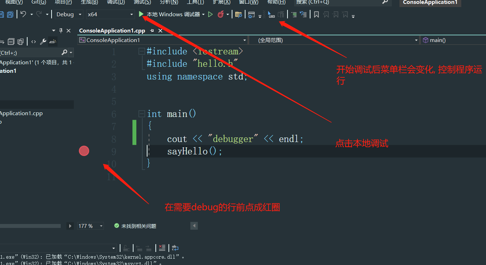
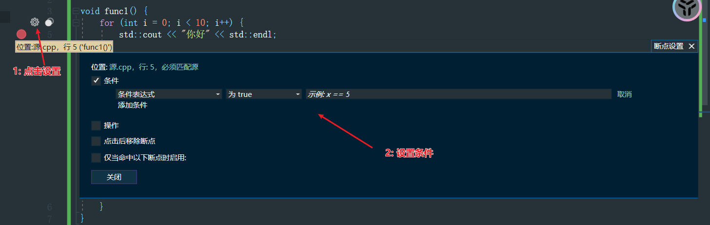
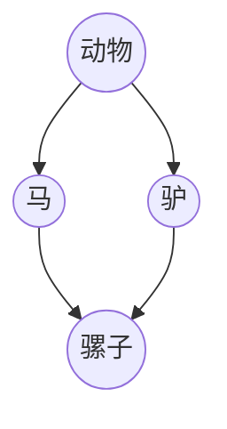
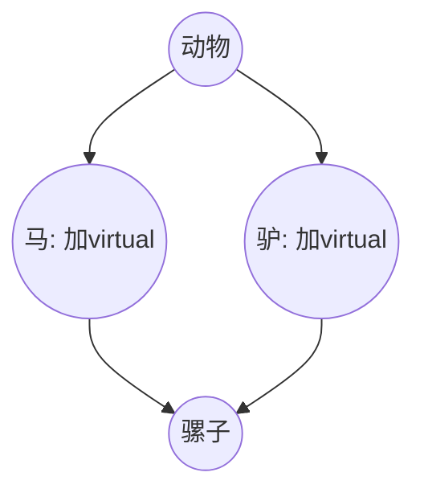
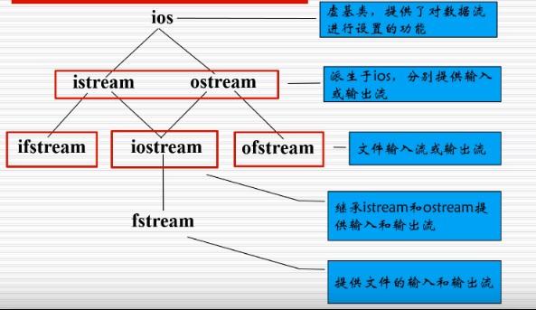
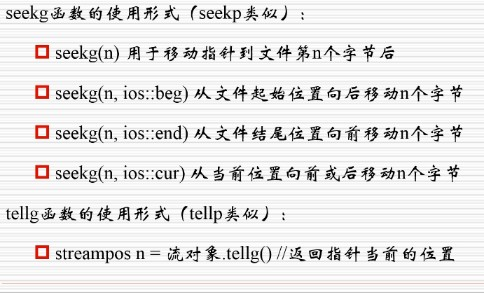
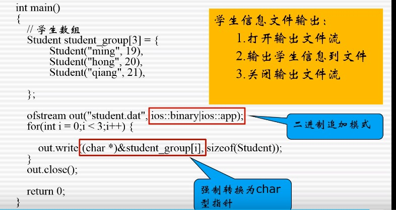
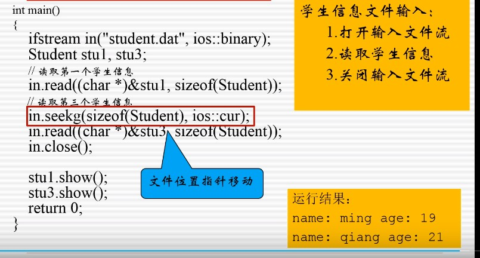

## cpp

### 一 . cpp基础


#### 1.1 命名规范

1) 标识符命名只能以"数字", "字母", "下划线组成" 且不能以数字开头

2) 命名规范

- 函数和命名空间: ``小写_小写``
- 变量: 小驼峰
- 常量: ``大写_大写``


#### 1.2 数据类型

整数型

| 整数型  | 关键字                    | 空间大小                                     |
| ---- | ---------------------- | ---------------------------------------- |
| 短整型  | short / unsigned short | 2B                                       |
| 整形   | int / unsigned short   | 4B                                       |
| 长整型  | long / unsigned long   | windows : 4B<br />非windows, 32位: 4B<br />非windows, 64位: 8B |
| 长长整形 | long long              | 8B                                       |


字符型 

字符型在存储的时候存储的是ASCII对应的整数 

| 数据类型 | 关键词                  | 空间大小                        |
| ---- | -------------------- | --------------------------- |
| 字符型  | char / unsigned char | 英文(ASCII码系): 1B<br />中文: 2B |


布尔型

| 数据类型 | 关键词  | 空间大小 |
| ---- | ---- | ---- |
| 布尔型  | bool | 1B   |


浮点型

1) 有效位数 = 小数点前 + 小数点后的所有位数

2) 有效位数 = 2 * 空间大小 - 1. ( 只是为了简便记忆, 无实际意义 )

| 数据类型 | 关键词         | 空间大小                        | 有效位数            |
|------|-------------| --------------------------- | --------------- |
| 单精度  | float       | 4B                          | 2 * 4 - 1 = 7位  |
| 双精度  | double      | 8B                          | 2 * 8 - 1 = 15位 |
| 多精度  | long double | Windows: 8B<br />Linux: 16B | 不低于15位          |


#### 1.3 常量

```cpp
#include<iostream>
using namespace std;

int main() {
	// 局部常量
	// 注意: 局部常量必须在"初始化时候赋值"
	const float Pi = 3.13;
	return 0;
};
```

####  1.4 数据类型转换

> cpp中的数据类型转换分为两种
>
> 1. 自动数据类型转换
> 2. 强制数据类型转换

**自动类型转换**

1. 多种数据类型运算, 向高类型转换

   ```cpp
   int main() {
     int a(10); // 4字节
     char b(96); // 1字节
	 long long c(3); // 8字节

	 cout << sizeof(a + b + c) << endl; // 输出8
   }
   ```

2. 整形和浮点数运算必得浮点数, 即使整形所占字节大. 优先级比第一条规则高

   ```cpp
   int main(){
     long long num1 = 1000; //占8字节
     float num2 = 3.2; // 占4字节

     cout << num1 - num2 << endl; // 996.8
     cout << sizeof(num1 - num2) << endl; // 4字节, 即float
   }

   ```

3. 声明与字面量类型不同时候会自动转化类型, 以声明为主

   ```cpp
   int main(){
     int a = 3.1415;

     cout << a << endl; // 输出3, 将浮点数字面量转成了int, 并且丢失了精度
     cout << sizeof(a) << endl; 
   }
   ```

   ​

**强制类型转换**

在类型前可以强制类型转换

```cpp
int main(){
  int a = (int)3.1415;

  cout << a << endl; 
}
```


#### 1.5 输入与输出

```cpp
#include<iostream>

int main() {
	int age;

	std::cout << "请输入年龄: " << std::endl;
	std::cin >> age;
	std::cout << "您的年龄是: " << age << std::endl;
	return 0;
};
```

注意: 布尔型的变量只能输入0或者1

```cpp
#include<iostream>
using namespace std;

int main() {
	int flag;

	std::cout << "您是否已婚?: " << std::endl;
	std::cin >> flag; //只能输入0或者1, 不能输入true或者false
	cout << (flag ? "已婚" : "未婚") << endl;
	return 0;
};
```

####  1.6 输入输出提高

1) 缓冲区

```cpp
#include<iostream>
using namespace std;

int main() {
	int num1; 
	float num2;
	string str;

	// 假设输入的次序为 3.14 1 abc
	cin >> num1 >> num2 >> str;

	// 输出的顺序为: 3,0.14,1
	/*原因是cin会将3.14 1 abc存储缓冲区, 在cout的时候依次从count中取值
	故先取整形3赋值给num1, 浮点0.14赋值给浮点型num2, 1会被误认为字符串赋值给str. 最后的abc没读取*/
	cout << num1 << num2 << str << endl;
	return 0;
};
```


2) 控制台错误处理

-  判断: 判断输入的正确性

```cpp
#include<iostream>
using namespace std;

int main() {
  int num1;
  cout << "请输入int整数" << endl;
  cin >> num1;


  if (cin.good()) {
    cout << "您输入的数据类型是正确的" << endl;
  }

  if (cin.fail()) {
    cout << "您输入的数据类型是错误的" << endl;
  }
  return 0;
};
```

- 处理:  1. 恢复状态 2.清空缓冲区

```cpp
#include<iostream>
using namespace std;

int main() {
  int num1;
  cout << "请输入int整数" << endl; 
  cin >> num1; // 当输入的值违法时候, 会发生错误, cin会出现失败状态

  if (cin.fail()) {
    cin.clear(); // 1. 清空cin的状态
    cin.ignore(numeric_limits<streamsize>::max()); // 2. 清空缓冲区
  }
  // 接着后续操作
  return 0;
};
```


#### 1.7 宏定义

> 宏定义的本质是在编译期间的字符串替换

```cpp
#include<iostream>
using namespace std;

#define EXP_1 2 + 2 //宏定义不加"数据类型", 不加"数据类型", 不加"分号"
#define EXP_2 (2 + 2)

int main() {
  // 等价于: cout << 2 + 2 * 2 + 2 << endl;
  cout << EXP_1 * EXP_1 << endl; //输出8

  // 等价于: cout <<  (2 + 2) * (2 + 2) << endl;
  cout << EXP_2 * EXP_2 << endl; // 输出16
};
```


#### 1.8 命名空间

1) 声明与使用

```cpp
#include<iostream>
using namespace std;

namespace a {
  namespace b {
    int num1 = 10;
  }
};

int b = 100;
int main() {
  // 分隔符: 命名空间用::做路径分隔符
  cout << a::b::num1 << endl;

  // 读取全局变量: 只有::代表显示的声明读取全局变量
  cout << ::b << endl;
};
```


2) 变量冲突: 释放不同命名空间变量产生的冲突,  释放一个命名空间变量和当前作用域变量的冲突

```cpp
namespace a {
  int num = 10;
};

namespace b {
  int num = 10;
}


int main() {
  // 不同命名空间: 释放不同命名空间变量产生的冲突
  using namespace a;
  using namespace b;
  cout << num << endl; // 不允许读取num
};
```

```cpp
namespace a {
  int num = 10;
};

int main() {
  // 一个命名空间: 释放一个命名空间变量和当前作用域变量的冲突
  int num = 1000;
  using namespace a;

  cout << num << endl; // 输出1000, 优先读取当前作用域的变量
};
```

#### 1.9 goto语句

```cpp
#include <iostream>
using namespace std;

// cpp中可以给起行号
int main() {
row1:
	cout << "这是第一行" << endl;
	goto row3;  // 跳转到第三行
row2:
	cout << "这是第二行" << endl;
row3:
	cout << "这是第三行" << endl;
}
```

#### 1.10 sizeof()
> 计算变量（或数据类型）在当前系统中占用内存的字节数.sizeof 运算符可用于获取类、结构体、和其他用户自定义数据类型的大小

1. 当测量基本数据类型时候, 获得是基本数据类型所占内存字节数, 如sizeof(int)
2. 当测量复杂数据类型时候, 如对象, 结构体对象, 其内存字节数收到以下几点的约束
   1. **成员变量的大小：** 类型的大小受到其成员变量大小的影响。一个类所占字节数不会低于所有成员变量所占内存字节数。
   2. **内存对齐:**
      大部分系统要求特定数据类型的变量在内存中的地址必须是特定值（通常是其大小的倍数）。这就是内存对齐。编译器会根据系统的要求，在成员变量之间或者类的末尾插入一些未使用的字节，以确保每个成员变量都位于正确的地址上。这样做是为了提高内存访问的效率。具体的对齐规则通常与平台和编译器有关。
   3. **继承和虚函数表**： 
   如果类继承自其他类（包括间接继承），子类的大小会包括所有基类的大小。如果类包含虚函数，通常会有一个指向虚函数表的指针（vptr）作为类的隐藏成员，占用额外的内存。
   4. **空类的大小**： 即使类中没有任何成员变量，C++编译器通常也会为其分配一个字节的内存空间，以确保不同实例的地址不同。

这些规则确保了用户自定义类型在内存中的布局是符合系统和编译器要求的。由于不同的编译器和系统可能有不同的对齐规则和优化策略，因此在实际编程中，如果需要确切地知道某个类型的大小，最好使用 sizeof 运算符进行查询，而不是手动计算，以确保跨平台的兼容性。
```cpp
#include <iostream>
using namespace std;
#include<string>

struct MyStruct {
	int x;
	double y;

	auto test() {
		return x + y;
	}
};

int main() {
	// 计算基本数据类型
	cout << sizeof(char) << endl;// 1

	// 不能计算string的字符数大小
	string str = "hello,world";
	cout << sizeof(str) <<endl; // 计算的是string对象的大小, 通常包含指向动态分配的字符数组的指针、字符串的长度和容量等信息
	cout << str.length() << str.size() << endl; // 正确计算字符的个数
	
	// 计算复杂数据类型
	// 下面的结构体输出16字节的原因是填充了4字节
	/*-------------------------------- -
	| int(4 bytes) | padding(4 bytes) |
	-------------------------------- -
	|        double(8 bytes)          |
	-------------------------------- -*/
	MyStruct s;
	cout << sizeof(s) << endl;
	return 0;
}
```

### 二: 函数

#### 2.1 函数嵌套

在cpp中函数不允许嵌套

```cpp
void func1() {
  void func2() {}; // 报错, 函数不允许桥套
}
```

#### 2.2 常量形参

```cpp
void func1(const int num) {
  num = 2; // 常量的值不允许修改
}
```

#### 2.3 形参默认值

滞后性: 有默认值的形参必须在无默认值的形参之后

```cpp
void func(int num1, int num2 = 10) { // num2必须在num1之后

}
```


#### 2.4 函数重载

**函数重载**: 函数重载指==函数名相同, 形参列表不同==的同名函数.  

**形参列表不同**: 形参列表不同包括==形参的个数, 形参的顺序, 形参的数据类型==不同. 

**返回值的类型**: 返回值的类型不作为函数重载的条件.

```cpp
int add(int num1, int num2) {
  return num1 + num2;
}

double add(double num1, double num2) {
  return num1 + num2;
}

void add(int num1, int num2) {} //报错, 返回值不作为函数重载的条件
```


#### 2.5 模块化

**文件名**: .cpp文件必须与.h文件==文件名相同==

**引入**: 引入第三方头文件用"", 系统文件用<>


hello.h头文件

```cpp
#pragma once // 编写的头文件需要加这个指令#pragma once 编译一次
#include <iostream>
using namespace std;

void sayHello();
```

hello.cpp 文件

```cpp
#include "hello.h";

void sayHello(){
	cout << "你好" << endl;
}
```

main函数

```cpp
#include <iostream>
#include "hello.h"
using namespace std;


int main(){
	sayHello();
}

```

#### 2.6 debug

**开始调试**



**调试按钮**

| Operation      | Effect                                   | Icon                             |
| -------------- | ---------------------------------------- | -------------------------------- |
| Step Over 单步执行 | 每次执行一条语句. 遇见函数只运行不进入                     |  |
| Step Into  步进  | 没有遇见函数时候与Step Over相同, 遇见函数会进入函数          |  |
| Step Out  跳出   | 1) 在函数内部执行跳出, 会直接跳到函数调用处的下一条语句<br /> 2) 在函数外部执行跳出, 会跳向下一个断点 |   |

**条件断点**




#### 2.7 Lambda函数与函数对象

> lambda函数和JavaScript基本类似

```cpp
[capture clause](parameter list) -> return type {
    // 函数体
    // 可以使用捕获的变量
}
// capture clause（捕获子句）：用于指定哪些外部变量可以在lambda函数内部使用。
// parameter list（参数列表）：与普通函数一样，用于指定lambda函数的参数。
// -> return type（返回类型）：用于指定lambda函数的返回类型（可以省略）。
// {} 内部包含函数体，其中可以执行具体的操作。

// [=]：以传值方式捕获所有外部变量，lambda函数内部不能修改它们。
// [&]：以引用方式捕获所有外部变量，lambda函数内部可以修改它们。
// [var]：以传值方式捕获特定变量var。
// [&var]：以引用方式捕获特定变量var。
```

```cpp
#include <iostream>
using namespace std;
#include <functional>

// 函数对象语法: function<返回值类型(参数列表)> 函数名
void animation(function<void(bool)> callback) {
	cout << "动画执行了2s" << endl;
	callback(true);
}

int main() {
	animation([](bool flag) {
		if (flag) {
			cout << "动画回调函数执行成功" << endl;
		}
	});
	return 0;
}
```


### 三: 指针与引用 

#### 3.1 内存四区

| Area | Effect       | Lifecycle          |
| ---- | ------------ | ------------------ |
| 代码区  | 存储编译后的代码     | 随进程终止              |
| 全局区  | 存储全局变量       | 随进程终止              |
| 栈区   | 存储函数中局部变量和运算 | 随函数终止              |
| 堆区   | 存储手动申请的空间    | 手动终止, 若没有手动终止随进程终止 |


#### 3.2 指针, 取地址, 解引用

**指针**: 指针指向数据==第一字节==的内存地址

**取地址**: 取出数据存储的内存地址. &变量名

**解引用**: 对某个指针指向的内存地址内存储的==数据操作前==, 需要解引用. 

```cpp
int main() {
  int num = 10;
  int* p = &num;

  // 读取: 读取指针指向内存地址的数据
  std::cout << *p << std::endl;

  // 修改: 修改指针指向内存地址的数据
  *p = 20;
  std::cout << *p << std::endl;
  return 0;
}
```


#### 3.3 空指针, 野指针

> 注意: 对空指针和野指针解引用会引发程序崩溃

**空指针**

​	**地址为空**: 指针指向的地址为空的指针, "空"可以是0, NULL, nullptr

​	**健壮性**: 为了保证程序的健壮性, 需要在代码中增加对空指针的判断

```cpp
int main(){
	int* p1 = NULL;
	int* p2 = 0;
	int* p3 = nullptr; // c11新增初始化空指针的方式
}
```

**野指针**

​	**非法的指向**: 野指针是瞎指的指针, 野指针指向的空间是非法的.

```cpp
int main() {
  // 野指针出现的若干情况
  // 1.未初始化:未初始化便取地址, 指针p指向非法地址
  int num1;
  int* p = &num1;

  // 2.继续使用:手动释放了内存空间后仍然继续使用, 此时为非法地址
  int* num2 = new int(11);
  delete num2;
  *num2;

  // 3.下标越界: 数组的下标越界
  int arr[2] = { 1,2 };
  arr[10]; 

  return 0;
}
```


#### 3.4 指针常量与常量指针

**常量指针**

语法: const int* num1
特点: 不能通过解引用修改值, 可以重新赋值
应用特点: 函数中的形参指针, 表示不修改此指针中的值

```cpp
void func(const int* num1) {	
  int num2 = 200;
  num1 = &num2; // 可以重新赋值指针
  *num1 = 200; // 编译器报错: 表达式必须是可修改的左值

}
int main(){
  int num1 = 10;
  func(&num1);
}

```


**指针常量**

语法: int* const num

特点: 指针不能重新赋值, 可以通过解引用重新赋值. 而且初始化的时候必须赋初始值

```cpp
int main() {
	int num1 = 10;
	// int* const num2; // 不初始化报错
	int* const num2 = &num1;
	*num2 = 200; // 可以解引用赋值
	num2 = NULL; // 不能对指针重新赋值
}

```


**常指针常量**

语法: ``const int* const num``

特点: 既不能给指针重新赋值, 也不通过解引用重新赋值. 而且初始化的时候必须赋初始值 


####  3.5 打印指针

**指向的内存地址**: 打印指针的行为被解释成打印指针指向的内存地址

```cpp
#include <iostream>
using namespace std;


int main() {
  int num = 10;
  int* p1 = &num;

  cout << p1 << endl; // 打印的是指针指向的地址, 即num的地址

  cout << &p1 << endl; // 打印的是指针自身的内存地址
  return 0;
}
```


#### 3.6 指针的加法

指针 + n = 原地址 + n * 存储的数据类型的大小

```cpp
#include <iostream>
using namespace std;


int main() {
	char a = '中';

	printf("a指针的内存地址为:%d\n",&a);   // a指针的内存地址为:154138564
	printf("a指针+1的内存地址为:%d\n", &a + 1); // a指针 + 1的内存地址为 : 154138565
	return 0;
}
```


#### 3.7 引用

**定义**: 内存地址的别名 

**本质**: 指针常量 

**特征**: 不能重新赋值, 可以解引用, 必须初始化. 

```cpp
#include <iostream>
using namespace std;

int main() {
  int num = 10;
  int& p = num;

  cout << (&num == &p) << endl; // 地址相同: 输出: 1. 证明num和p的地址相同, 是同一块内存, 故而引用是变量的别名
  return 0;
}
```


#### 3.8 常引用

```cpp
void func(const int& num) { // 显示的声明"我不想修改num的指, 只做读取操作" 
}

```


#### 3.9 指针引用

> 指针引用即对指针的引用

```cpp
#include <iostream>
using namespace std;

class Person {
public:
	int age = 10;
	Person() {}
	Person(int age) :age(age) {}
};


void func(Person*& p) {// p是指针的引用, 等价与外面的i指针, 是i指针的别名, 
	p->age; // 还是通过指针的方式访问属性
	p = new Person(20); // 修改了p后, 外界的指针的指向也会发生改变
}
int main() {
	Person* i = new Person();
	func(i); // 这里传递的是i指针的地址, 不是i指针指向的地址

	cout << i->age << endl;
	return 0;
}
```


### 四: 数组

#### 4.1  运算法访问数组元素

```cpp
#include <iostream>
using namespace std;

int main() {
  int num = 10;
  cout << num << endl; // 输出变量: 输出值
  num + 1; // 变量加法: 值相加


  int& p2 = num;
  cout << p2 << endl; // 输出引用: 输出值
  p2 + 1; // 引用加法: 值相加


  int* p = &num; 
  cout << p << endl; // 输出指针: 输出的是指向的地址
  p + 1; // 指针加法: 地址 + n个源数据类型字节大小


  int num_arr[4] = { 1,2,3,4 }; // 数组名被解释为指针, 指向数组空间的第一字节的内存地址
  cout << num_arr << endl; // 输出数组: 输出数组首个元素的内存地址
  num_arr + 1; // 操作数组: 地址 + n个源数据类型字节大小

  cout << (num_arr[1] == *(num_arr + 1)) << endl; // true


  return 0;
}
```


#### 4.2   数组的遍历 

```cpp
#include <iostream>
using namespace std;

int main() {
  // 同一作用域: 使用增强for循环, 数组的定义和循环必须在同一作用域
  int arr[5] = { 1,2,3,4,5 };
  
  for (int i = 0; i < sizeof(arr) / sizeof(int); i++) {
		cout << arr[i] << endl;
  }
	
  for (int e : arr) {
    cout << e << endl; // 变量迭代: 用变量迭代不能修改ele元素
  }

  for (int& e : arr) {
    cout << e << endl; // 引用迭代: 用引用迭代, 可以修改元素的值
  }

  return 0;
}
```


#### 4.3 数组api

**排序qsort**

1) **参数**: ( 源数组, length, size of element, compare function )

2) **比较函数**: 比较函数的参数的数据类型为 ``const void*``

```cpp
#include <iostream>
using namespace std;


int compare_func(const void* a, const void* b) {
  return *(int*)a - *(int*)b;
}

int main() {
  int arr[5] = { 22,1,333,11,-1 };

  int size_of_element = sizeof(int);
  int len = sizeof(arr) / sizeof(int);
  qsort(arr, len, size_of_element, compare_func);
 
  // Lamda表达式写法
  qsort(arr, sizeof(arr)/sizeof(int), sizeof(int), [](const void* a, const void* b) {
     return *(int*)a - *(int*)b;
  }); 

  for (int e : arr) {
    cout << e << endl;
  }

  return 0;
}
```

**深克隆**

```cpp
#include <iostream>
using namespace std;


int main() {
  int source_arr[5] = { 22,1,333,11,-1 };
  int destination_arr[5] = { 0 }; // 不够数组长度时候, 默认填充全是0


  memcpy(destination_arr, source_arr, sizeof(source_arr));


  for (auto& e : destination_arr){ // auto: 自动推断数据类型
    cout << e << endl;

  }
  return 0;
}
```

**清空数组**

```cpp
#include <iostream>
using namespace std;


int main() {
  int source_arr[5] = { 22,1,333,11,-1 };


  memset(source_arr, 0, sizeof(source_arr));


  for (auto& e : source_arr){ // auto: 自动推断数据类型
    cout << e << endl;

  }
  return 0;
}
```

#### 4.4 二分查找

```cpp
#include<iostream>
using namespace std;

int binary_search(int arr[], int length, int target) {
  int left = 0;
  int right = length - 1;
  int mid;

  while (left <= right) {
    mid = (left + right) / 2;

    if (arr[mid] > target)  right = mid - 1;
    else if (arr[mid] < target) left = mid + 1;
    else return mid;
  }
};


int main() {
  int arr[] = { 1,2,3,4,5,6,7 };

  cout << binary_search(arr, sizeof(arr) / sizeof(int), 3);
  return 0;
};
```


#### 4.5 动态数组

```cpp
#include <iostream>
#include <fstream>
#include<string>
using namespace std;

class Person {
public:
	string name;
	Person(string name): name(name) {};
};

int main() {
	int size = 5;

	// 静态数组
	//int arr[size] = { 1,2,3,4,5 }; // 该种声明方式为静态声明数组, 数组长度在编译时确定, 数组长度不能使用变量
	
	// 动态数组
	// 动态数组的长度可以使用变量也可以使用字面量
	int* arr = new int[size]{ 1,2,3,4,5 };

	// 动态数组 + class
	Person* p = new Person[2]{
		Person("张三"),
		Person("李四")
	};
	return 0;
}
```


#### 4.6 二维数组

**逻辑结构**: 二维数组逻辑结构是矩阵

**存储结构**: 二维数组的存储结构是顺序表

```cpp
#include <iostream>
using namespace std;

int main() {

  // 以下三种方式声明是等价的

  // 1. 矩阵式声明
  int arr[5][4] = {
    {1,2,3,4},
    {1,2,3,4},
    {1,2,3,4},
    {1,2,3,4},
    {1,2,3,4}
  };

  // 2. 顺序表式声明: 二维数组的存储结构是顺序表
  int arr[5][4] = { 1,2,3,4,1,2,3,4,1,2,3,4,1,2,3,4,1,2,3,4 };

  // 3. 缺省行数, 根据列数自动推导
  int arr[][4] = { 1,2,3,4,1,2,3,4,1,2,3,4,1,2,3,4,1,2,3,4 };

  return 0;
}
```


### 五:  面向对象

#### 5.1  类模板

**存储位置:** 类的方法存储在代码区, 对象存储既可以在堆区创建也可以在栈区创建.

**对象所占的内存空间**:  对象所占内存空间是所有属性所占内存空间之和

```cpp
#include <iostream>
using namespace std;

class Person {
 public:
  int age;
  int gender;

  void eat() {
    cout << "正在吃" << endl;
  }
 protected:
  int xx;

 private:
  int xxx;
};

int main() {
  // 1. 在栈开辟空间
  Person p1 = Person(); // 等价于 Person p1;

  // 2. 在堆开辟空间
  Person* p2 = new Person();
  delete p2; // 需要手动销毁

  // 3. 空间的大小
  cout << sizeof(p1) << endl; // 16B
  cout << sizeof(*p2) << endl;// 16B

  return 0;
}
```


#### 5.2 成员访问

```cpp
int main() {
  Person p1 = Person();
  //1: .访问: 在栈中开辟空间用.访问
  p1.age = 100;

  //2: ->访问: 在堆中开辟空间用->访问 
  Person* p2 = new Person();
  p2->age = 100;

  //3: .访问: 解引用后用.访问
  (*p2).age = 1000;

  return 0;
}
```


#### 5.3 类的模块化

Person.h文件

```cpp
#pragma once

class Person {
  public:
  int age;
  int gender;
  static int count;

  void eat();
  void speak();
};
```

Person.cpp文件

```cpp
#include <iostream>
#include "Person.h";
using namespace std;

int Person::count = 10;

void Person::eat() {
  cout << "吃" << endl;
}

void Person::speak() {
  cout << "说" << endl;
}
```

入口文件

```cpp
#include "Person.h"

int main() {
  Person p;
  p.eat();
  p.speak();
}
```


#### 5.4  静态变量与访问

```cpp
#include <iostream>
using namespace std;

class Person {
public: // 默认是private, 必须显式的声明为public
  static int age;

  static void eat() {
    cout << "eat" << endl;
  };
};

int main() {
  // 1. 访问静态变量
  Person::age = 100;

  // 2. 访问静态函数
  Person::eat();
}
```


#### 5.5 构造函数

```cpp
#include <iostream>
using namespace std;

class Person {
  public:
  int age;
  string name;

  // 重载: 构造函数可以重载
  Person(string _name, int _age) :age(_age), name(_name) {}
  explicit Person(string _name): name(_name) {}
};

int main() {
  // 1. 显式构造
  Person p = Person("张三", 18); // 等价于 Person p("张三", 18);

  // 2. 隐式构造
  Person p = { "张三",18 };
  Person p = { "李四" }; // explicit:添加explicit关键词的构造函数不允许隐式构造
}
```


#### 5,6 拷贝构造函数

**构造函数语法**

```cpp
#include <iostream>
using namespace std;

class Person {
  public:
  int age;
  string name;

  Person(string _name, int _age) :age(_age), name(_name) {}

  // 拷贝构造函数: 用于实现深克隆, 缺省时为浅拷贝构造函数
  Person(const Person &p) {
    age = p.age;
    name = p.name;
  }
};
```


**拷贝构造函数的调用时机**

>  拷贝构造函数会在以下三种情况被调用: 1. 赋值初始化时, 2. 值传递时 3.值返回时

Person类

```cpp
#include <iostream>
using namespace std;

class Person {
public:
	string name;

	Person(string _name) : name(_name) {}

	Person(const Person& p) {
		cout << "拷贝构造函数调用了" << endl;
	}
};
```

赋值初始化时调用

```cpp
int main() {
	Person p1("张三");
	Person p2 = p1;  // 拷贝构造函数调用了
}
```

值传递时

```cpp
void func1(Person p) {} // 实际在栈空间内, 通过拷贝构造函数开辟了一块新内存

int main() {
  	Person p1("张三");
	func1(p1); // 拷贝构造函数调用了
}
```

返回值时

```cpp
Person func2() {
	Person p("张三");
	return p;  // 当return时, 首先销毁func2中p所占的内存, 并在调用者, 也就是main函数中开辟一块新空间, 通过Person的拷贝构造函数完成初始化
}

int main() {
	func2(); // 拷贝构造函数调用了
}
```

返回值优化

**隐式初始化对象:** 当返回值为隐式初始化对象的时候, 不会调用拷贝构造函数

```cpp
Person func3(){
  return { '张三' } // 返回隐式初始化, 即匿名对象, 会触发编译器的优化策略, 不会调用拷贝构造函数
}

int main() {
	func3(); // 未调用拷贝构造函数
}
```


#### 5.7 析构函数

```cpp
#include <iostream>
using namespace std;

class Person {
  public:
  string  name;
  Person* mom;

  Person(string _name, Person* _mom) :name(_name), mom(_mom) {}

  // 自动调用的析构函数: 析构函数在空间释放时候自动调用, 这里的空间既指自动释放栈空间, 也指手动释放堆空间
  ~Person() {
    if (mom != nullptr) {
      delete mom;
      mom = nullptr;
    }
  }
};

int main() {
  Person p("张三", nullptr); // 在main函数结束后自动调用析构函数

  Person* p2 = new Person("张三", nullptr);
  delete p2; // 调用delete的时候自动调用析构函数

  return 0;
}
```


#### 5.8 this

> this是指向调用对象的指针

**用法1**: 区分同名参数

```cpp
class Person {
  int age;

  void setAge(int age) {
    this->age = age; // this是指针
  }
};
```

**用法2:** 链式调用

```cpp
#include <iostream>
using namespace std;

class MyNumber {
  public:
  MyNumber(int num) {
    this->num = num;
  }

  MyNumber& add(int num) {
    this->num += num;
    return *this;
  }

  MyNumber& subtract(int num) {
    this->num -= num;
    return *this;
  }

  void display() {
    cout << num << endl;
  }

  private:
  int num;
};

int main() {
  MyNumber num(0);

  num.add(10).subtract(5).add(20).display(); // 10-5+20
}
```


#### 5.9 常函数

**只读**: 常函数是用于显示的声明**只读取属性**

常函数 **只能读取, 不允许修改属性值**, 只能调用其他常函数, **不允许调用非常函数**

```cpp
#include <iostream>
using namespace std;

class Person {
  public:
  string name;

  void func() {}
  void constant_func() const {
    name = "张三";// 报错, 不允许修改属性
    func(); // 报错, 不允许调用非常函数
  }
};
```


#### 5.10 常对象

与常函数类似, 只允许用对象读取属性, 不允许修改属性值. 可以访问常函数, 不允许访问非常函数

```cpp
#include <iostream>
using namespace std;

class Person {
  public:
  string name;

  void speak() {}

  void eat() const {} // 常函数
};

int main() {
  const Person p; // 常对象
  p.name = "zhangsan"; // 不允许访问属性
  p.speak(); // 不允许访问非常函数
  p.eat(); // 可以访问常函数
  return 0;
}
```


#### 5.11 mutable

mutable修饰的属性, 既可以被常函数修改也可以通过常对象修改

```cpp
#include <iostream>
using namespace std;

class Person {
  public:
  mutable string name;

  // 常函数可以修改mutable修饰的变量
  void change_name() const {
    name = "张三";
  }
};

int main() {
  const Person p; // 常对象
  p.name = "zhangsan"; // 常对象可以修改mutable修饰的变量
  return 0;
}
```


#### 5.12 友元

**在类外访问:** 友元允许在类外访问类的私有成员( 包括成员变量和成员函数 )


**全局函数做友元**

```cpp
#include <iostream>
using namespace std;
// 语法: friend 函数前签名
class Person { 
  friend void get_person_name(Person& p);

  private:
  string name;
};

void get_person_name(Person& p) { 
  cout << p.name << endl; // 可以在类外访问类的私有成员
}
```


**成员函数做友元**

成员函数作友元的语法比较反直觉, 记下就好

1)  **提前声明, 类内写定义, 类外写实现** 

```cpp
// 1. 提前声明友元类 
class Dog; 
// 2. 声明并实现想要访问其他类私有成员的类.  
class Person {
  public:
  void look_dog_name(Dog & d); // 类内写定义
};

void Person::look_dog_name(Dog& d) { // 类外写实现
  cout << d.name << endl;
}
```

2) **定义友元** 

```cpp
class Dog {
  friend void Person::look_dog_name(Dog& d); // 定义友元成员函数
  private:
  string name;
};
```


**将类做友元**

```cpp
#include <iostream>
using namespace std;

class Dog;

class Person {
public:
	Dog& dog;
	void func() {
		cout << dog.name << endl;
	}
};

class Dog {
	friend Person; // 将类做友元
private:
	string name;
};

```


#### 5.13 运算符重载

**加号重载**

1) **全局重载:** 有两个参数, 第一个参数是运算的左值, 第二个参数是运算的右值

2) **类内重载**: 只有一个参数, 该参数是运算的右值


类定义

```cpp
class Point {
private:
	int x;
	int y;
public:
	Point() :x(0), y(0) {} // 无参构造
	Point(int x, int y) :x(x), y(y) {} // 有参构造	
};
```


全局重载

```cpp
/*
	语法解析:
	1) 运算符重载的语法:
		- 返回值 operator运算符(){}
	2) 参数解析:
		- 常量: 参数为const常量, 表示本函数不会修改参数的值
		- 引用: 参数为&引用, 表示是引用传递, 不会引起本函数调用Point的拷贝构造函数然后分配新内存, 用于提高性能
	3) 返回值解析:
		- 隐式声明: Person p = { x,y }的含义是找到Person的构造函数, 按顺序将x和y传进去进行初始化
		- 返回值: return { p1.x + p2.x, p1.y + p2.y } 等价于 Point p = { p1.x + p2.x, p1.y + p2.y } 是一种隐式初始化
		- 编译器优化: 返回匿名对象, 不会触发拷贝构造函数. 是一种编译器优化
*/
Point operator+(const Point& p1, const Point& p2) {
	return { p1.x + p2.x, p1.y + p2.y };
}

```

类内重载

```cpp
#include <iostream>
using namespace std;

class Point {
  public:
  int x;
  int y;

  Point() :x(0), y(0) {}
  Point(int x, int y) :x(x), y(y) {}
	
  // 类内重载, this代表左值
  Point operator+ (const Point& p) {
    return { this->x + p.x, this->y + p.y };
  }
};
```


**自增 / 自减运算符重载**

**约定int参数:** 在cpp中默认是前置自增运算法即++$i$ , 如果想实现的是后置自增, 即$i$++, 一般约定int参数做区分

**类内自增**

1. **一个参数:** 自增运算符最多只有一个参数
2. **占位符:** 后置自增除了必须的参数外, 还需要有一个int占位符号

```cpp
#include <iostream>
using namespace std;

class Point {
  public:
  int x;
  int y;

  Point() :x(0), y(0) {}

  // 前置自增
  Point& operator++() {
    this->x++;
    this->y++;
    return *this;
  }

  // 后置自增: 需要用int占位
  Point operator++(int) {
    Point p = *this;
    this->x++;
    this->y++;
    return p;
  }

  void print() {
    cout << "x: " << x << " y:" << y << endl;
  }
};

int main() {
  Point p;
  ++p;
  p.print();

  (p++).print();
}
```

**类外自增**

```cpp
#include <iostream>
using namespace std;

class Point {
  public:
  int x;
  int y;

  Point() :x(0), y(0) {}
  void print() {
    cout << "x: " << x << " y:" << y << endl;
  }
};

// 前置自增
Point& operator++(Point& p) {
  p.x++;
  p.y++;
  return p;
}
// 后置自增
Point operator++(Point& p, int) {
  Point temp = p;
  p.x++;
  p.y++;
  return temp;
}

int main() {
  Point p;
  ++p;
  p.print();
  (p++).print();
}
```


**等号运算符重载**

```cpp
#include <iostream>
using namespace std;

class Student {
  private:
  string name;
  int gender; //1: 男 0: 女
  int* score;

  public:
  Student(string name) :name(name), gender(1), score(nullptr) {}
  Student(string name, int gender, int* score) : name(name), gender(gender), score(score) {} 
  ~Student() {
    if (score) {
      delete score;
      score = nullptr;
    }
  }

  Student& operator=(const Student& s) {
    name = s.name;
    gender = s.gender;
    if (score) { // 需要手动销毁堆内存
      delete this->score;
    }
    score = s.score ? new int(*s.score) : nullptr;
    return *this;
  }

  void print() {
    cout << "当前学生: " << name << ", 性别为:" << (gender == 1 ? "男" : "女") << ", 成绩为: " << *score << endl;
  }


};

int main() {
  Student s1("张三");
  Student s2("李四", 1, new int(80));


  s1 = s2;
  s1.print(); // 当前学生: 李四, 性别为:男, 成绩为: 80

  return 0;
}
```


#### 5.14 继承

**继承时的访问权限修饰**: 

-  缺省访问权限修饰符时, 默认是private


- 继承父类的成员时, 可以修改成员的访问权限. 继承时的访问权限修饰符表示**最多不超过某权限, 高于该权限的会被降级, 低于该权限的不变**

```cpp
#include <iostream>
using namespace std;

class Father {
private:
	int knowledge;

protected:
	int money;

public:
	int cup;

	Father() :knowledge(0), money(0), cup(0) {}
	Father(int knowledge, int money, int cup) :knowledge(knowledge), money(money), cup(cup) {}
};

class Son : Father {}; // 缺省访问权限修饰符时, 默认是private
class Son : public Father {}; // 高于public的会被降级, 低于public的保持不变. 所以表现为所有成员属性不变
class Son : protected Father {}; // 高于protected的会被降级, 低于protected的保持不变. 所以表现为cup属性降为protected, 其他的不变
class Son : private Father {}; // 高于private的会被降级, 低于private的保持不变. 所以表现为knowledge不变, 其他都降为private
```

 

**都可以被继承**: 除了构造函数和析构函数外所有的成员都可以被继承.

```cpp
#include <iostream>
using namespace std;

class Father {
private:
	int knowledge;

protected:
	int money;

public:
	int cup;

	Father() :knowledge(0), money(0), cup(0) {}
	Father(int knowledge, int money, int cup) :knowledge(knowledge), money(money), cup(cup) {}
};


class Son : public Father {
public:
	Son() {}
};

int main() {
	Son son;
	// son的大小为12,分明由三个int变量组成. 证明了父类的成员无论是privated, 还是money, 还是public的属性子类都能继承
	// 但由于访问修饰符的原因, 即使继承了也不一定能访问. 所以在main函数中只能访问public修饰的属性
	cout << sizeof(son) << endl; // output: 12

	cout << son.knowledge << endl; // 不能访问
	cout << son.money << endl; // 不能访问
	return 0;
}
```


**多继承**

```cpp
class Father1 {};
class Father2 {};

class Son : public Father1, public Father2 {};
```


**继承中的构造函数与析构函数**

1) **调用父类中的构造函数:** 子类对象在创建时, 需要先调用父类中的构造函数, 来初始化从父类继承到的部分. 默认调用的是父类中的无参构造函数

```cpp
#include <iostream>
using namespace std;

class Father {
public:
	int money;
	Father() :money(0) {
		cout << "父类的构造函数被调用了" << endl;
	}
};

class Son : public Father {
public:
	int knowledge;
	Son() :knowledge(0) {
		cout << "子类的构造函数被调用了" << endl;
	}
};

int main() {
  /*
  	调用父类的构造函数: 子类会调用父类的构造函数, 并且是先调用父类的构造函数, 再调用自己的而构造函数
  	内存分析: 在main的栈空间内开辟son空间, 调用父类的构造函数为son空间进行初始化, 此时父类构造函数的this指向子类对象(son). 再调用子类的构造函数继续为son空间进行初始化
  */
	Son son; // output: 父类的构造函数被调用了 --> 子类的构造函数被调用了. 
}
```

2) **调用父类的析构函数:** 子类对象在销毁的时候, 先调用自己的析构函数, 在调用父类的析构函数. 

```cpp
#include <iostream>
using namespace std;

class Father {
public:
	int money;
	Father() :money(0) {}
	~Father() {
		cout << "父类的析构函数被调用了" << endl;
	}
};

class Son : public Father {
public:
	int knowledge;
	Son() :knowledge(0) {}
	~Son() {
		cout << "子类的析构函数被调用了" << endl;
	}
};

int main() {
	Son* son = new Son();
	delete son;	// output: 子类的析构函数被调用了 --> 父类的析构函数被调用了
}
```

3) **显式调用父类构造函数:** 子类必须调用父类的构造函数, 默认调用无参构造, 如果想调用其他构造函数, 可以显式的声明调用哪个构造函数. 在其他语言中通常是通过``super(arg1,arg2)``来调用的.

```cpp
#include <iostream>
using namespace std;

class Father {
  public:
  int money;
  Father() :money(0) {
    cout << "父类第一个构造函数被调用了" << endl;
  }
  Father(int money) :money(money) {
    cout << "父类第二个构造函数被调用了" << endl;
  }
};

class Son : public Father {
  public:
  int knowledge;
  Son() :knowledge(0) {} // 没有显式指定: 没有显式指定调用哪个父类的构造函数, 默认调用无参构造
  Son(int knowledge) :Father(10), knowledge(0) { } // 显式指定调用哪个无参构造: 在初始化列表声明调用父类哪个构造函数即可

};


int main() {
  Son son1; // 父类第一个构造函数被调用了
  Son son2(0); // 父类第二个构造函数被调用了
}
```


4) **成员冲突:** 冲突可能来自父类和子类的冲突, 以及多继承中相同名的成员冲突. 当父类和子类成员冲突以子类为主, 
   成员冲突也可以通过::显式的声明访问父类的属性. 

````cpp
#include <iostream>
using namespace std;

class Father {
  public:
  int money = 100;
};

class Son : public Father {
  public:
  int money = 0;
};

int main() {
  Son son; 
  cout << son.money << endl; // 默认访问子类的冲突属性
  cout << son.Father::money << endl; // 显式声明访问父类的冲突属性, 语法: 子类对象.父类名::冲突成员
}
````


5) **菱形继承与虚继承:**

**菱形继承**: 下图的菱形继承, 菱形继承的问题是假如动物的某成员, 被马和驴同时继承, 那么该属性被传递到骡子时, 骡子无法区分这个成员是从马继承过来的还是驴继承过来的.



**虚继承**: 在菱形继承中, 位于中间层的类若为虚继承的类, 他们的通过继承获得的同名属性将只有一份被子类继承




```cpp
#include <iostream>
using namespace std;

class 动物 {
  public:
  int name;
};

class 驴 :public virtual 动物 {}; // 给菱形继承中中间层加virtual
class 马 :public virtual 动物 {};

class 骡子 : public 驴, public 马 {}; 


int main() {
  骡子 l;
  l.name; // 不加virtual不能直接访问name
}
```

#### 5.15 多态

1) **前提:** 多态的前提是继承

2) **相互转换类型:** 多态指子类对象与父类对象相互转换类型, 也就是说子类对象可以使用父类的类型, 父类的对象也可以使用子类的类型, 从而一个对象拥有多种不同的形态


**向上转型( 子转父 )**

```cpp
#include <iostream>
using namespace std;

class Father {
public:
	void sayHi() {
		cout << "Father Say Hi" << endl;
	}

	Father() {}
	Father(const Father& f) {
		cout << "Father的构造函数被调用了" << endl;
	}
};

class Son : public Father {
public:
	void sayHi() {
		cout << "Son Say Hi" << endl;
	}
};

int main() {
	Son son;
	// 引用性多态
	Father f1 = son; // 将son传入Fahter的拷贝构造函数, 形成const Father& f = son; 这一过程是向上转型
	Father& f2 = son;
	
	// 指针型多态
	Father* f3 = &son; 
	return 0;
}
```

#### 5.16 虚函数

虚函数有两个特点

1) **父调子: **允许父类型对象调用子类对象**同名的方法( 子类必须重写父类方法 )**

2) **父类型存储的对象类型:** 父类型在调用同名方法时, 具体是调用父类的方法还是子类的方法, 取决于父类型存储的对象类型, 若是子对象, 则调用子类方法, 反之则调用父类方法

3) 虚函不能是静态函数和友元函数

```cpp
#include <iostream>
using namespace std;

class Father {
public:
	virtual void sayHi() {
		cout << "Father Say Hi" << endl;
	}
};

class Son : public Father {
public:
	void sayHi() override { // override关键字, 用于显示的声明该方法是重载的方案, 如果父类没有该方法会报错
		cout << "Son Say Hi" << endl;
	}
};


int main() {
	Father* f = new Father(); // 父类型存储的对象类型为父类型, 调用父类型方法
	f->sayHi();

	Father* f = new Son(); // 父类型存储的对象类型为子类型, 调用子类型方法
	f->sayHi();
	return 0;
}
```

#### 5.17 纯虚函数和抽象类

1) 同时具有纯虚函数和非虚函数的类称为抽象类, 抽象类可以有纯虚函数, 也可以有非纯虚函数. 

2) 纯虚函数只有定义, 没有实现, 且继承抽象类的子类必须重写函数

```cpp
#include <iostream>
using namespace std;

class Father {
public:
	virtual void sayHi() = 0; // 纯虚函数
  	void makeMoney(){
		cout << "赚钱" << endl; // 非纯虚函数
	}
};

class Son : public Father {
public:
	void sayHi() override { // override关键字, 用于显示的声明该方法是重载的方案, 如果父类没有该方法会报错
		cout << "Son Say Hi" << endl;
	}
};


int main() {
	Father* f = new Father(); // 抽象类不能被实例化 !
	f->sayHi();

	Father* f = new Son(); 
	f->sayHi();
	return 0;
}
```

#### 5.18 接口类

在cpp中没有 ``interface`` 声明接口, 当一个类中只有纯虚函数时, 即可视作接口

#### 5.19 虚析构函数
> 多态时, 可能不能正确销毁子类对象. 虚析构函数的目的是正确的销毁的子类对象.

```cpp
#include <iostream>
using namespace std;

class Father {
public:
	virtual ~Father() {
		cout << "父类的析构函数被调用了" << endl;
	}
};

class Son : public Father {
public:
	~Son() {
		cout << "子类的析构函数被调用了" << endl;
	}
};


int main() {
	// 释放子类内存空间时候, 会依次调用子类和父类的析构函数
	//Son* son = new Son();
	//delete son;

	// 输出结果: 下方语句仅仅输出了"父类的析构函数被调用了", 没有输出"子类析构函数被调用了"
	// 出现问题: 无法销毁子类中的堆内存
	// 问题出现原因: 使用多态时, 实际消除的是子类空间, 但编译器会认根据声明的父类型认为消除的是父类空间. 所以不会调用子类的析构函数
	// 解决方法: 解决这一问题的方法是, 在父类的析构函数上添加virtual关键词. 编译器会先调用子类析构函数, 再调用父类析构函数.
	// 使用时机: 如果父类不是为了实现多态, 则没有必要使用虚析构, 如果父类是为了实现多态, 且子类中也有必须销毁的堆内存, 则必须实现虚析构函数
	Father* father = new Son();
	delete father;
	return 0;
}
```

#### 5.20 结构体

结构体和类的基本一致, 只有两点有区别

1) **默认访问权限:** 结构体默认访问权限是public, class的默认访问权限是private

2) **struct:** 结构体初始化的时候, **可以选择**加struct, 如``struct Student stu;`` 也可以不加


#### 5.21 模板函数 ( 泛型 )

**函数泛型**

语法: ``template<typename 名称, ...> 函数体实现 ``

```cpp
#include <iostream>;
using namespace std;

template<typename T = int, typename M = int> // 泛型默认值
auto add(T num1 , M num2) { // auto是显式的要求编译器自动推导数据类型
  return num1 + num2;
}

int main() {
  // 1. 显示传递泛型
  cout << add<int, int>(1, 2) << endl;

  // 2. 自动推导类型
  cout << add(3.12, 2) << endl;
  
  // 3. 缺省泛型时候, 会自动推导
  cout << add<double>(3.12, 2) << endl; // 只传了第一个泛型T为double, 都二个M未传类型, 即缺省. 缺省时候系统自动推导类型
  return 0;
}
```


**函数返回值类型**

1)**自动推导:** 函数返回值类型可以用auto自动推导返回值类型

2) **手动传递:** 函数返回值类型可以手动传递

```cpp
// 自动推导
template<typename T, typename M>
auto add(T num1, M num2) { 
	return num1 + num2;
}

// 手动传递
template<typename R, typename T, typename M>
R add(T num1, M num2) {
	return num1 + num2;
}

int main() {
	// 手动传递
	// 实际开发中的最佳实践: 手动传递返回值泛型时, 一般将返回值类型作为第一个泛型. 在使用函数时候, 只需要传返回值泛型, 剩下的参数让编译器自动推导.
	float f = add<float>(3.14, 2);
	return 0;
}
```


**函数模版的特化**

**语法:** 
```cpp
template<> 
返回值 函数名<特化的类型1, 特化的类型2...>(...args){...}
```

**示例**

```cpp
#include <iostream>;
using namespace std;

class Person {
public:
	int age;
	Person(int _age) :age(_age) {}
};


template <typename T, typename M>
auto add(T a, M b) {
	return a + b;
}

// !!注意!!:
//	1. 返回值不能修改: 原通用函数返回值为auto, 特化函数的返回值必须为auto
//  2. 传参形式不能修改: 原通用函数是值传递, 特化函数必须得值传递, 不能修改成引用传递, 或者指针传递. 即写成Person& p1或者Person* p1
//  3. 形参个数不能修改: 原通用函数为两个形参, 特化函数也必须是两个
//  3. 形参类型和形参名可以修改: 原通用函数是T和M的类型,名字是a和b 修改后变成Person p1和Person p2
template<>
auto add<Person, Person>(Person p1, Person p2) {
	return p1.age + p2.age;
}

int main() {
	Person p1(18);
	Person p1(20);
	cout << add(p1, p2) << endl;
	return 0;
}
```


#### 5.22 类模板( 类泛型 )

```cpp
template<typename R, typename T, typename M>
class Calculator {
public:
	T num1;
	M num2;

	Calculator(T num1, M num2) : num1(num1), num2(num2) {}

	R add() {
		return num1 + num2;
	}

	R sub() {
		return num1 - num2;
	}
};

int main() {
	// 类泛型初始化时, 不能自动推导
	Calculator<int, int, int> c(10, 20);
	c.add();
}
```


**类模板与继承**

```cpp
template<typename T>
class Father {};

// 子类继承的父类若为泛型类, 自身必须指定父类的泛型.
template<typename T>
class Son : public Fahter<T> {};

int main() {
	return 0;
}
```


**泛型类成员函数类外实现**

```cpp
template<typename R, typename T, typename M>
class Calculator {
public:
	T num1;
	M num2;

	Calculator(T num1, M num2) : num1(num1), num2(num2) {}

	R add(); // 1. 类内定义
};

// 2. 类外实现, template不能少, 并且要显示标记类型即Calculator<R, T, M>
template<typename R, typename T, typename M>
R Calculator<R, T, M>::add() {
	return num1 + num2;
}

int main() {
	Calculator<double, int, double> calc(5, 3.5);
	double result = calc.add();
	return 0;
}
```


**泛型类与友元**


#### 5.23 类模板的分文件编写

**分文件编写:** 泛型类不**建议**分文件编写, 即将类的定义写在``.h``文件, 类方法的实现写在``.cpp``文件, 否则会可能出现报错.

**.hpp文件:** 常用的做法是, 若编写的是一个泛型类, 则将类的定义和实现写在一个文件中, 该文件的后缀为``.hpp``


### 六: 文件操作
#### IO流类谱
1. ios为所有标准输入输出类的父类, 同时它是一个抽象类(虚基类)
2. ios的子类有istream标准输入流和ostream标准输出流
3. ifstream是istream的子类, 提供文件的输入流
4. ofstream是ostream的子类, 提供文件的输出流
5. iostream提供标准输入输出流.
6. fstrean提供文件输入输出流.



#### 插入运算符和提取运算符
**插入运算符**
1. 插入运算符用<<表示
2. 语法为 ``所有标准输出流(如cout, ofstream) << 基本数据类型或者字符串``

**提取运算符**
1. 插入运算符用>>表示
2. 语法为 ``所有标准输入流(如cin, ifstream) << 基本数据类型或者字符串``
3. 插入运算符提取数据时候, 会忽略空格. 如提取'1 2 3 4 5'时只会提取`12345`

#### 格式化输出
需要包含``#include<iomanip>`` manip是manipulation的缩写, 意为操作
**控制域宽**
```cpp
#include <iostream>;
#include<iomanip>
using namespace std;


int main() {
 // 如果字符大于设置的宽度, 字符不会被截断
 // 如果字符小于设置的宽度, 右对齐且用空格填充
 // 格式控制符只作用于本行输出
 
 // 方式一: 
 cout << setw(5) << 5 << endl; //    5
 cout << setw(1) << 5000 << endl;//5000

 // 方式二:
 cout.width(5);
 cout << 5 << endl;//    5

 return 0;
}
```

**控制填充符**
```cpp
#include <iostream>;
#include<iomanip>
using namespace std;


int main() {
 // 填充字符一但设置, 会对后面所有的输出影响, 直到下一次修改填充符
 
 // 方式一: 
 cout << setfill('*') << setw(5) << 5 << endl; //****5
 cout << setw(5) << 5 << endl; //****5 
 
 // 方式二:
 cout.fill('=');
 cout << setw(5) << 5 << endl;


 return 0;
}
```

**精度控制**
```cpp
#include <iostream>;
#include<iomanip>
using namespace std;


int main() {
 // 精度一但修改, 生命周期一直到再次修改输出精度

 double price = 1.2212123; // double的精度是15, 但输出时系统默认为6
 
 cout << price << endl; // 系统默认精度为6: 1.22121

 // 方式1:
 cout << setprecision(8) << price << endl; // 调整精度为8, 1.2212123


 cout.precision(2);
 cout << price << endl; // 1.2

 return 0;
}
```

#### 文本操作
##### 写文本
操作步骤: 
1. 包含文件流头文件: ``#include<fstream>``
2. 创建写文件流对象: ``ofstream ofs``
3. 打开文件: ofs.open("文件路径", 打开方式)
4. 写文件: ofs << "文本内容";
5. 关闭文件流: ofs.close()

| 打开方式            | 作用                        |
|-----------------|---------------------------|
| ``ios::in``     | 以读的方式打开文件                 |
| ``ios::out``    | 以写的方式打开文件                 |
| ``ios::trunc``  | 若当前路径已经存在文件, 则先删除该文件, 再打开 |
| ``ios::ate``    | 从文件末尾处打开文件                |
| ``ios::app``    | 以追加的方式打开文件                |
| ``ios::binary`` | 以二进制的方式打开文件               |

**多个打开方式同时使用时, 以 | 串联**

**写文件**
```cpp
#include <iostream>
#include <fstream>
using namespace std;

int main() {
	ofstream ofs;
	ofs.open("./study.txt", ios::out);
	ofs << "你好啊李银河" << endl;
	ofs.close();

	return 0;
}
```

**读文件**
1. 包含文件流头文件: ``#include<fstream>``
2. 创建写文件流对象: ``ifstream ifs``
3. 打开文件: ifs.open("文件路径", 打开方式)
4. 判断是否成功打开文件
5. 写文件: 四种方式写文件
6. 关闭文件流: ofs.close()

```cpp
#include <iostream>
#include <fstream>
#include<string>
using namespace std;

int main() {
	// 1. 创建读文件流
	ifstream ifs;

	// 2. 打开文件
	ifs.open("./study.txt", ios::in);

	// 3. 判断文件是否打开成功
	if (!ifs.is_open()) {
		cout << "打开文件失败" << endl;
	};

	// 4. 读取文件
	// 4-1: 以字符缓冲区读取文件
	char buffer[1024] = { 0 };
	while (!ifs.eof()) { // 当文本读取完毕后, 会返回false
		ifs >> buffer;
		cout << buffer << endl;
	}

	// 4-2: 以字符缓冲区, 按行读取文件
	char buffer[1024] = { 0 };
	while (!ifs.eof()) {
	    ifs.getline(buffer, sizeof(buffer);
		cout << buffer << endl;
	}
	// 5. 关闭文件流
	ifs.close();

	return 0;
}
```

#### 二进制操作
1. 写二进制和写文本类似, 但打开方式必须指定``ios::binary``
2. 写二进制意味着可以写入对象
3. 写对象时, 对象字符串属性不能用string, 要用char, 否则可能会出问题
4. 写文件用write函数

```cpp
#include <iostream>
#include <fstream>
#include<string>
using namespace std;

class Person {
public:
	char name[5] = "张三";
	int age = 18;
};

int main() {
	// 1. 创建读文件流
	ofstream ofs;

	// 2. 打开文件
	ofs.open("binary.txt", ios::out | ios::binary);

	// 3. 创建对象
	Person p;
	
	// 4. 写文件
	// 需要将二进制对象转为 char* 的指针类型即字符常量指针
	ofs.write((char*) &p, sizeof(p));

	// 5. 关闭文件流
	ofs.close();

	return 0;
}
```


**读二进制对象**

```cpp
#include <iostream>
#include <fstream>
#include<string>
using namespace std;

class Person {
public:
	char name[5] = "张三";
	int age = 18;
};

int main() {
	// 1. 创建读文件流
	ifstream ifs;

	// 2. 打开文件
	ifs.open("binary.txt", ios::out | ios::binary);
    if (!ifs.is_open()) return;
    
	// 3. 创建对象
	Person p;
	
	// 4. 读文件
	ifs.read((char*) &p, sizeof(p));

	// 5. 关闭文件流
	ifs.close();


	cout << p.age << p.name << endl;
	return 0;
}
```

#### io流读写位置指针操作
**seekg和seekp:** 
1. g:get, p: put. seek: 寻找.
2. seekg是输入流调整指针位置的api
3. seekp是输出流调整指针位置的api

**tellg和tellp**
1. 语法: ``streampos n =流对象.tellg``
2. tellg返回当前输入流的指针位置的api
3. tellp返回当前输出流的指针位置的api



1. 将3长度的Person数组写入persons.txt文件中

2. 请读取刚写入的persons数组中的第二个person对象


#### 练习题
假如有hello.txt文件, 请将每一行的文字前加上行号

```cpp

int main() {
	ifstream ifs;
	ifs.open("./persons.txt", ios::in | ios::binary);

	Person p1, p3;
	ifs.read((char*)&p1, sizeof(p1)); // 读取第一个同学


	ifs.seekg(2 * sizeof(Person), ios::beg); // 移动指针到person数组第二个对象处
	ifs.read((char*)&p3, sizeof(p3)); // 读取第二个person对象

	ifs.close();

	cout << p1.name << p3.name << endl;
	return 0;
}
```

### 七: STL

#### 6.1 string

string的构造函数

````cpp
#include <iostream>
using namespace std;

int main() {
  // C风格字符串: C风格字符串实际是char数组, 并且每个字符串的结尾是0,
  const char str1[] = "abc";
  const char* str2 = " abc"; // 使用指针初始化C风格字符串

  cout << (int)str1[3] << endl; // 证明C风格字符串, 末尾被隐式添加了0

  // 无参构造
  string str3 = string();
  string str4;

  // 根据C风格字符串初始化
  string str5 = string(str1);
  string str6 = string(str2);

  // 填充n个相同字符串
  string str7 = string(4, 'A');// AAAA
  return 0;
}
````

string 的查找, 替换, 拼接, 读取和修改, 截取等操作

```cpp
#include <iostream>
using namespace std;

int main() {
	// 字符串的截取: substr: (start_idx:int, len:int) => string& 
	string str = "hello, world";
	cout << str.substr(0, 2) << endl;

	// 字符的读取和修改: 因为字符串底层用char数组存取, 所以可以当做跟数组的的存取操作是一样的
	string str = "system";
	cout << str[0] << endl; 

	// 字符串的拼接
	// +拼接
	string str = "hello,";
	cout << str + "world" << endl; // 使用+拼接字符串, 必须有一个变量参与, 不能都是是字面量
  
	// append: (source_str:string) => string& 
	string str = "";
	str.append("hello",2);
	cout << str << endl;

	// 字符串查找
	// find: ( sub_str: string|char, start?: int = 0 ) => -1 | (number 找不到返回-1, 否则返回下标)
	string str = "hello, world";
	cout << str.find("hello") << endl;

	// 字符串替换
	// replace: (start_idx: int, len: int, replace_str:string) => string&
	string str = "hello, world";
	str.replace(0,5,"你好");
	cout << str << endl;
	
	// 字符串交換
	string str1 = "123";
	string str2 = "456";
	str1.swap(str2);
	cout << str2 << endl;
	return 0;
}
```


#### 6.2 vector

**vector的遍历**

```cpp
#include <iostream>
#include<vector>
using namespace std;

int main() {
	vector<int> arr = { 1,2,3,4,5 };


	// 迭代器: 
	//	- 迭代器: cpp中的迭代器指的是指向vector任意一个元素内存空间的指针, 可以用该指针遍历
	//  - 迭代器的类型: 迭代器的类型为: vector<ElmentType>::itrator
	//  - vector.begin() : 正向遍历中返回首元素的指针
	//	- vector.end(): 正向遍历时返回尾元素的最后元素的后一个元素的指针
	//	- vector.rbegin(): 反向遍历中返回最后一个元素的指针
	//  - vector.rend(): 反向遍历中返回第一个元素的前一个元素的指针

	// for循环
	// 正向遍历
	int idx = 0;
	for (vector<int>::iterator i = arr.begin(); i != arr.end(); i++) {
		cout << "数据是: " << *i << "下标是:" << idx << endl;
		idx++;
	}

	// 反向遍历
	int idx = arr.size() - 1;
	for (vector<int>::reverse_iterator i = arr.rbegin(); i != arr.rend(); ++i) {
		cout << "数据是: " << *i << "下标是:" << idx << endl;
		idx--;
	}
	// 使用size_t和size()遍历. c++17标准
	for (std::size_t i = 0; i < vec.size(); ++i) {
       cout << "Element at index " << i << ": " << vec[i] << endl;
    }

	// 增强for循环
	for (int& el: arr) {
		cout << el << endl;
	}


	return 0;
}
```


**vector常用``api``**

| Api说明           | 示例                                                                     | 函数签名                                        |
|-----------------|------------------------------------------------------------------------|---------------------------------------------|
| length          | `arr.size()`                                                           |                                             |
| 深拷贝             | `vector<int> arr2 = arr1;`, 重载的=运算符默认是深拷贝                              |                                             |
| push 与 pop      | `arr2.push_back(element); arr2.pop_back();`                            |                                             |
| shift 与 unshift | `unshift: arr2.insert(arr1.begin(), 1); shift: arr2.erase(arr1.begin());` |                                             |
| 删除元素            | `arr.erase(arr.begin() + 2);`                                          | `(delete_idx:iterator) => iterator`         |
| 插入元素            | `arr.insert(arr1.begin(), 2);`                        | `(begin: iterator, Element:e ) => iterator` |
| map             | 见下方示例代码                                                                | 注意: 需要`#include<algorithm>`                 |
| filter          | 见下方示例代码                                                                | 注意: 需要`#include<algorithm>`                 |
| find            | 见下方示例代码                                                                | 注意: 需要`#include<algorithm>`                 |
| sort            | `sort(arr11.begin(), arr11.end());`                                    | 注意: 需要`#include<algorithm>`                 |
| empty           | `arr.empty()`                                                          | 判断是数组否为空                                    |
| front           | `arr.front()`                                                          | 返回第一个元素                                     |
| back()          | `arr.back()`                                                           | 返回最后一个元素                                    |
| clear()         | `arr.clear()`                                                          | 清空元素                                        |
| swap()          | `vector<int> arr = { 1,2,3,4 };`<br/>``vector<int> arr2 = {0};``<br/>``arr.swap(arr2);``          | 交换两个vector容器, 两个vector容器的泛型需要相同             |

示例代码

```cpp
#include<algorithm>
// map函数
 vector<int> arr1 = { 1,2,3,4 };
 vector<int> arr2;

 // back_inserter(被拷贝的数组)
 // transform(被数组开始, 数组结束, ..., Lamda表达式)
 transform(arr1.begin(), arr1.end(), back_inserter(arr2), [](int e) {
     return e * 100;
 });

// filter函数: 使用copy_if函数, 满足条件的会被删除
 vector<int> arr1 = { 1,2,3,4 };
 vector<int> arr2;

 // back_inserter(被拷贝的数组)
 // transform(被数组开始, 数组结束, ..., Lamda表达式)
 remove_copy_if(arr1.begin(), arr1.end(), back_inserter(arr2), [](int e) {
     return e == 2;
 });


// find函数
vector<int>::iterator it = find(arr1.begin(), arr1.end(), 2);
bool isFind = !(it == arr1.end());

if (isFind) {
  int idx = distance(arr1.begin(), it);
  cout << "已经找到该元素, 下标为: " << idx << endl;
}
else {
  cout << "未找到该元素" << endl;
}

```

#### 6.3 deque

使用时候需要``#include<deque>``

deque是双端队列, api名称与vector基本一致, 唯一区别的是增加了push_front() 和 pop_front() api, 前者是头部入队列, 后者是头部出队列

```cpp
#include <iostream>;
#include<deque>
#include<algorithm>
using namespace std;

template<class T>
void printDeque(deque<T> q) {
	for (size_t i = 0; i < q.size(); i++) {
		cout << "下标为: " << i << ",元素为: " << q[i] << endl;
	}
}
int main() {
	deque<int> q = { 1,2,3 };
	// 首尾添加/删除元素
	q.push_front(11);
	q.push_back(11);
	q.pop_back();
	q.pop_front();
   
	printDeque(q);

	return 0;
}
```

#### 6.4 stack

`使用时候需要#include<stack>`

```cpp
#include <iostream>
#include <stack>
using namespace std;

int main() {
	stack<int> s;

	// push与pop操作
	s.push(1);
	s.pop();

	// 查看栈顶
	int top_element = s.top();

	// 是否空栈
	bool isEmpty = s.empty();

	// 查看容量
	int size = s.size();
	return 0;
}
```


#### 6.5 queue

队列

```cpp
#include <iostream>
#include <queue>
using namespace std;

int main() {
	queue<int> q;

	// push与pop操作, push为入队列, pop为出队列
	q.push(1);
	q.pop();

	// 查看队头和队尾元素
	int front_element = q.front();
	int back_element = q.back();

	// 是否空队列
	bool isEmpty = q.empty();

	// 查看容量
	int size = q.size();
	return 0;
}
```


#### 6.6 list

list即双向链表

```cpp
#include <iostream>
#include <list>
using namespace std;

int main() {
	// 构造函数
	int arr[] = { 1,2,3,4 };
	list<int> l(arr, arr + 4); // 根据数组初始化

	list<int> l1; // 无参构造

	// 插入和删除
	l.push_back(1);// 尾插
	l.push_front(1);// 头插
	l.pop_back();// 尾删
	l.pop_front();// 头删

	// 获取第一个节点的值和最后一个节点的值.
	int front_ele = l.front();
	int back_ele = l.back();

	// 获取指向第一个节点的指针 和 获取指向最后一个节点的指针
	auto first_it = l.begin();
	auto last_it = l.end();

	// 其他的操作跟vector差不多
	return 0;
}
```


#### 6.7 set, unordered_set, mutiset

| 特性              | `unordered_set`          | `set`               | `multiset`          |
| --------------- | ------------------------ | ------------------- | ------------------- |
| 底层实现            | 哈希表（Hash Table）          | 红黑树（Red-Black Tree） | 红黑树（Red-Black Tree） |
| 插入、查找、删除平均时间复杂度 | O(1)（平均情况下，最坏情况下可能是O(N)） | O(log N)            | O(log N)            |
| 元素有序性           | 无序                       | 有序                  | 有序                  |
| 允许重复元素          | 否                        | 否                   | 是                   |

使用原则: 

​	如果需要排序功能. 使用set或者multiset

​	如果不需要排序则使用unordered_set. 

​	若又想使用排序由要求可以重复元素则使用mutiset

```cpp
#include <iostream>
#include <set>
using namespace std;

int main() {
	// 构造函数
	// 1. set和multiset都只用在set包里, 用的时候只需要#include<set>
	// 2. set中的元素是 "去重的", "排序的", "不可修改值的"
	// 3. set中的元素因为实现了排序, 修改值代价较大. 所以不可以修改值

	set<int> s;

	// 插入元素
	s.insert(11);

	//// 删除元素
	//s.erase(s.begin()); // 删除排序后的第一个元素
	//s.clear(); // 清空元素

	//查找元素
	set<int>::iterator ss = s.find(11); // 根据值查找, 返回该元素的迭代器
	cout << *ss << endl; // 11

	int cout = s.count(11); // 根据值查找, 返回该元素所属的个数

	set<int>::iterator sss1 = s.lower_bound(11); // 根据值查找, 返回<=该元素的第一个元素的迭代器
	set<int>::iterator sss2 = s.upper_bound(11); // 根据值查找, 返回>该元素的第一个元素的迭代器

	// 其他操作
	s.size();
	s.empty();
	return 0;
}
```

#### 6.8 pair 与 map

pair即键值对类型. map即字典类型

````cpp
#include <iostream>
#include <map>
using namespace std;

int main() {
	// 方式一: 创建键值对
	pair<string, int> zhang_san_age("age", 18);

	// 方式二:创建键值对
	pair<string, int> lisi_age = make_pair("age", 20);

	// 取出键值对
	string key = zhang_san_age.first;
	int value = zhang_san_age.second;

	// 创建map
	map<string, string> m;

	// 添加元素
	m["姓名"] = "zhangsan";

	// 查看元素
	cout << m["姓名"] << endl;
	
	// 删除属性
	m.erase("姓名");

	// 判断属性是否存在的两种方式
	if (m.count("name") > 0) {
		cout << "name属性存在" << endl;
	}

	if (m.find("name") != m.end()) {
		cout << "name属性存在" << endl;
	}

	return 0;
}
````


#### 6.9 algorithm

| 算法名称 | 示例程序 | 其他   |
| ---- | ---- | ---- |
|      |      |      |


