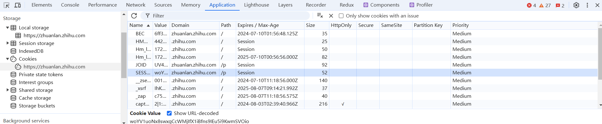

# 鉴权方案
## 什么是鉴权
鉴权方案，即**认证**和**授权**方案，是指用于验证用户身份并确定其访问权限的一套机制和流程。鉴权方案通常包括以下几个方面：

**身份验证（Authentication）**：

- 用户名和密码：最常见的身份验证方式，用户通过输入预设的用户名和密码来验证身份。
- 多因素认证（MFA）：通过组合多种验证方式（如密码、手机验证码、指纹识别等）来增加安全性。
- 生物识别技术：如指纹、面部识别、虹膜扫描等。
- OAuth/OpenID Connect：通过第三方服务（如微信登录, QQ登录等）进行身份验证。

**授权（Authorization）**：

 - 角色权限控制（RBAC）：基于用户角色来分配权限，每个角色具有不同的访问权限。
 - 基于属性的访问控制（ABAC）：根据用户属性和环境属性（如时间、地点）来决定访问权限。
 - 访问控制列表（ACL）：为每个资源定义允许访问的用户或用户组。
 - 策略语言（如XACML）：使用策略语言来定义复杂的访问控制规则。

## 1. session鉴权方案
因为我是前端出身, 曾经被这个概念混淆了很久, 要注意sessionStorage和session的区别, 前者是前端存储方案之一, 后者是鉴权方案的名称, 
并不是一个东西. 

session鉴权方案概括有三个步骤
1. 后端给前端**发**身份证
2. 前端把身份证**保存**好
3. 前端每次找后端的时候, 都要**带**上身份证验证身份

接下来详细解释一下这三个步骤中, 前后端都做了那些动作

**1. 后端给前端**发**身份证**

前端第一次提交登录请求后, 并且服务端成功验证了身份证和密码后, 服务端做了三件事: 
1. 生成身份证(sessionID)
2. 将身份证存入数据库中记录 
3. 发身份证给前端: 将sessionID存入Cookie中, 让前端携带回去

**2. 前端把身份证保存好**
由于Cookie的特性, 一但服务端将身份证塞入Cookie中, 前端就会自动保存好, 后续每次请求都会自动带上身份证.

所以这一步对前端是无感知的

**3. 前端每次找后端的时候, 都要带身份证验证身份**
还是由于Cookie的特性, 前端会携带身份

而后端在这个阶段会到数据库中查身份证(sessionID), 如果查到了并且没有错误, 就返回前端想要的数据.

### Cookie字段

**Domain:** 
   1. 域,表示这条Cookie可以存到哪个域名下
   2. 存在父域名的Cookie, 子域名也有一份. 反之不行. 如上例中存在.zhihu.com的Cookie, 也可以被zhuanlan.zhihu.
      com访问到 

**Path:**
   1. 表示这条Cookie可以存到域名的哪个路径下

**Expires:**
   1. 表示这条Cookie的过期时间
   2. session表示关闭浏览器(标签)此条cookie就消失, 具体的时间表示关闭浏览器后cookie的还能保存多久

**Secure / HttpOnly**
   1. Secure: 表示这条Cookie只能通过https协议传输
   2. HttpOnly: 表示这条Cookie不能通过js访问, 修改 

### session方案中的一些细节
1. session的数据格式是key-value: 即 sessionId-用户信息. 返回前端的是sessionId, 
   后端在数据库里保存的sessionId-用户信息键值对. 
2. 后端常用redis存储session, 或直接存在服务器内存中(所以访问量过大时, 服务器内存会不够用)
3. 登录界面中的, "记住我"按钮: 当不勾选"记住我"时候, Cookie中Expires字段被设置为关闭浏览器页面就消失. 当勾选"记住我"时候
, Expires字段被设置为30天(或者其他时间)后过期.
4. 当用户在浏览器中设置"禁用Cookie"时, session方案直接嗝屁.

## 2. token与JWT鉴权方案
token方案和session方案类似, session方案中要为session专门建一个数据库, token方案中服务端不再新建数据库, 只做身份的校验

**流程**
1. 前端访问登录接口, 后端接到"账号, 密码"
2. 后端验证账号密码, 验证成功后, 生成一个token
3. 后端将token返回给前端

**细节**
1. token的生成方式
    - JSON Web Token (JWT) 是一个开放标准(各语言均有实现), 是一种成熟的 token 字符串生成方案。
    - node 上同样有相关的库实现：express-jwt , koa-jwt等
    - JWT 由三部分组成：头部（Header）、载荷（Payload）和签名（Signature）。头部和载荷使用 Base64URL 编码，签名使用 HMAC SHA256 算法生成。
2. token可以以set-cookie的形式返回给前端,存储在Cookie中, 也可以让前端存在localstorage中, 然后
在每次请求时, 在请求头中带上token(Authorization: token)
3. session方案和token方案的概念很模糊, 一般"存在Cookie中 + 服务端存储状态"表示session方案, "存在web存储中 
   +服务端不存储状态, 只验证"表示token方案

## refresh token
暂时没总结
##  单点登录
暂时没总结

## 参考文章: 
1.[前后端鉴权方案，一文打尽！](https://mp.weixin.qq.com/s?__biz=MzU0OTE4MzYzMw==&mid=2247550739&idx=3&sn=79d9e71427954417c0c040bfb86db38e&chksm=fbb18eedccc607fb8854b707e3d3d36841810d08573d96ccdc19ae2761c6e8ca645771eb2a23&scene=27)

2.[一文读懂前端鉴权：cookie、session、token、jwt、单点登录](https://zhuanlan.zhihu.com/p/677982758)

3.[Cookie：属性设置：domain & path & expire](https://www.bilibili.com/video/BV19S4y1N74v/?spm_id_from=333.337.search-card.all.click&vd_source=f0597bff9d28f459976cfa5b23ec3128)

4.[cookie、session、token 发展史与请求响应鉴权](https://www.bilibili.com/video/BV1b14y1J7Yv/?spm_id_from=333.337.search-card.all.click&vd_source=f0597bff9d28f459976cfa5b23ec3128)
