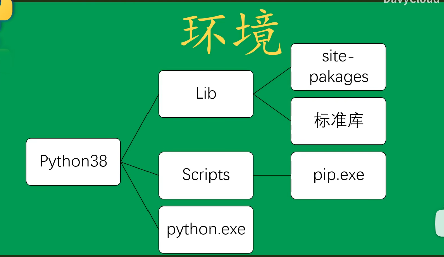
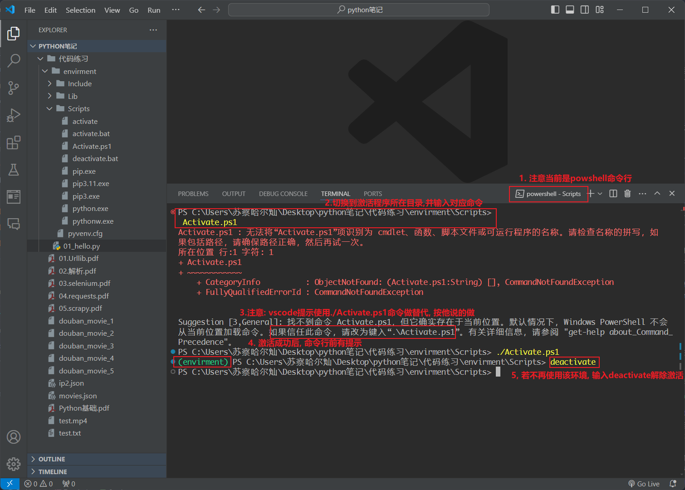
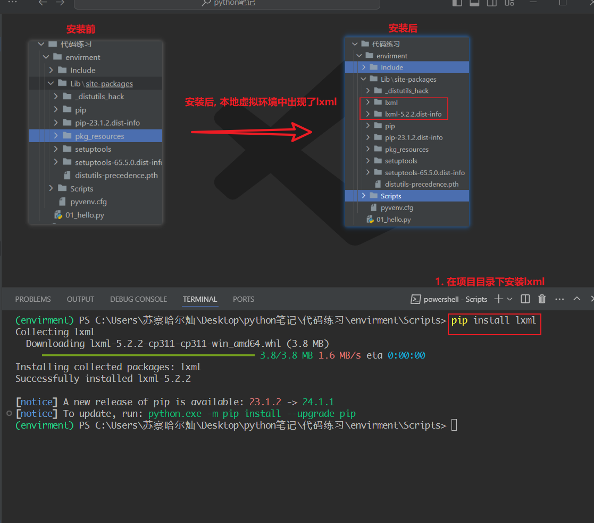
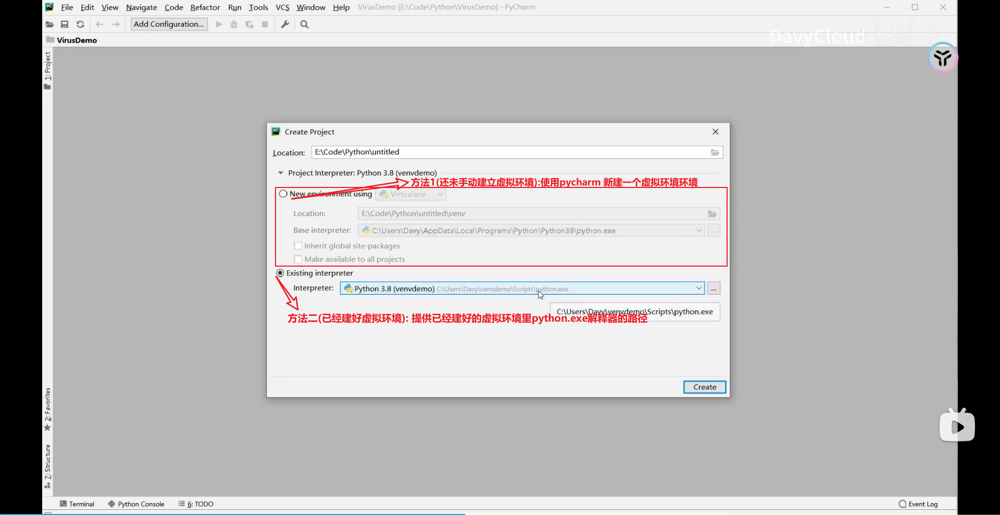

# python高级

## python虚拟环境
> 参考视频: [python虚拟环境](https://www.bilibili.com/video/BV1V7411n7CM?p=1&vd_source=f0597bff9d28f459976cfa5b23ec3128)

### python环境 
一个python环境大概由以下文件组成: 



1. 其中Lib目录为安装的依赖包, Lib下的site-packages目录中为手动安装的依赖包, 标准库中是python自带的依赖包如urllib

2. 虚拟环境即标准环境的副本, 其中如标准库这种不会复制一份新的到虚拟环境中, 而是以链接的方式在副本中存在.

### python的虚拟环境的作用
先回忆一下JavaScript中npm的包管理工具.

npm将包分为"全局包"和"局部包". 其中全局包被放置在npm的安装目录下, 局部包被放置在js项目根目录下.

当一个项目中引用某个包时, 会从最近目录下的node_modules开始遍历寻找该包, 如果找到就停止并使用, 找不到就一直向上查找, 一直到全局包
的目录中也没有才停止.

简单来说就是: "我的项目中有就用我的项目的包, 我的项目没有就用全局的包". 这保证了"每个js项目中引用的局部包都是独立的, 
包与包之间的依赖关系是清澈的, 独立的".

混乱的包依赖关系必然会导致版本冲突, 所以python中也需要有这样的包办理办法, 但是python中的做法稍有不同.

python中所有的包都是全局包, 每一个包都被安装在Lib目录. 这就导致了可能出现的包冲突. 

python允许用户创建一份虚拟环境, 每个虚拟环境是一个文件目录, 同时也是原python环境的副本.如果我们为每个python环境创建一个
虚拟环境, 那么就可以将该项目中的包安装到该虚拟环境中. 这样每一个项目都对应了一个虚拟环境, 每个项目的包之间相互独立, 不会发生
冲突.

### python虚拟环境历史
python2中没有生成虚拟环境的语法, 大家一般使用如virtualenv, virtualenvwrapper, 
virtualenvwrapper-env等第三方库来生成python虚拟环境

Python从3.3版本开始，自带了一个虚拟环境venv,在PEP-405中可以看到它的详细介绍。它的很多操作都和virtualenv类似。
因为是从3.3版本开始自带的，这个工具也仅仅支持python3.3和以后版本。所以，要在python2上使用虚拟环境，依然要利用virtualenv。


### python项的版本切换
无论是使用virtualenv等第三方库, 还是venv生成的虚拟环境. 其虚拟环境和标准环境中的python版本是一致的.(因为虚拟环境并不是完全的副本
对于标准库中如python解释器的部分, 使用的是同一份)

若电脑中有多个python项目, 且python版本跨度过大, 虚拟环境的这套方案就不适用了, 针对这个问题有以下库可以解决

**pyenv**
pynv可以安装、卸载、编译、管理多个python版本，并随时将其中一个设置为工作环境。
pyenv不支持Windows系统。

**pywin**
Windows上有一个pyenv的替代品，是pywin。它用来在多个安装的Python版本之间进行切换，也支持MSYS/MINGW32。

**Python Launcher for Windows**
Python从3.3版本开始，在Windows系统中自带了一个py.exe启动工具。如果你是使用Python.org官网下载的安装包安装的Python3.3(或更新版本)环境，那么可以
直接在命令提示符中使用这个工具。
py可以打开默认的python提示符：py-2.7和py-3打开对应的Python版本。

**虚拟环境可以解决不同项目的依赖冲突的问题, 上述工具可以解决不同项目中python版本切换问题.**

### venv语法
1. 切换到项目根目录下
2. 在项目根目录下创建虚拟环境.
```shell
 python -m venv <虚拟环境目录名, 官方推荐叫environment>
```
3. 项目根目录下激活/取消激活虚拟环境
激活根据电脑的系统(windows还是MOS), 使用的命令行软件(CMD还是powershell)激活方式不同

具体来说: MOS需要运行"虚拟环境目录/bin/activate"文件, windows+CMD需要运行"虚拟环境目录/Scripts/activate.
bat"文件
windows+powershell需要运行"虚拟环境目录/Scripts/Activate.ps1"


4. 安装包, 并观察安装后包的位置


### 使用pycharm建立虚拟环境


注: pycharm中的方法一种的Virtualenv其实就是venv

### 复制环境
回忆一下一个js项目是如何多人协作的: 
1. 首先自己通过git将项目push到gitlab中, 并且.gitignore会把node_modules忽略掉
2. 其他开发者通过git clone将项目克隆下来. 并执行npm install. npm会按照package.json的记录下载对应版本的依赖包

python中的pip也可以实现这个功能, 从而实现项目的多人协作

1. 在项目根目录下执行(需要保证当前虚拟环境已激活)``pip freeze > requirements.txt``,该命令会将虚拟环境中已经安装的包生成到requirements.txt中
2. 将项目git push到gitlab中
3. 其他开发者执行 ``pip install -r requirements.txt`` 该命令会根据requirements.
   txt中记录的包版本下载对应的依赖包
