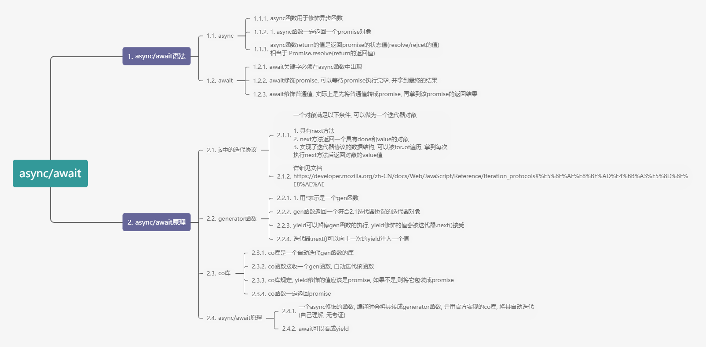

# async/await原理

`async/await进阶`
async/await原理
<!-- more -->




# Async , Await 解决异步

## await的作用

> 1. 等待一个promise resolve的结果
> 2. 如果await 修饰不是promise 则会把其包装成promise
> 3. 外层函数必须有async


**测试代码1**

```js
// 等待一个promise resolve的结果
async function asynFunc() {
  const res = await new Promise((resolve,reject) => {
    setTimeout(() => resolve('成功'), 3000)
     //setTimeout(() => reject('失败'), 3000)// reject不行
  })

  console.log({ res })
}
asynFunc()
```


**测试代码2**

```js
//如果await 修饰不是promise 则会把其包装成promise  
async function asynFunc() {
    const res = await '你好'
    // 等价于 
    // const res = await Promise.resolve('你好')
    console.log({ res })
  }
asynFunc()
```


## async 关键词

> 1. async 关键词用于修饰一个异步函数
> 2. async函数一定返回一个promise
> 3. async 函数的返回值, 作为promise resolve的结果


**测试代码1**

```js
// async函数一定返回一个promise
async function asynFunc() {

}
console.log(asynFunc())
```

**测试代码2**

```js
// async 函数的返回值, 作为promise resolve的结果
async function asynFunc() {
	return '成功'
}
console.log(asynFunc()) // promise为fulfilled状态, 且result为成功
```

## Async Await与generator函数

> async 和 await 实际上是generator函数的语法糖

```js
async function fn() {
  const res1 = await new Promise((resolve) => resolve('成功1'))
  console.log(res1)

  const res2 = await new Promise((resolve) => resolve('成功2'))
  console.log(res2)
}
fn()

// async 和 await 实际上等于 generator + co函数

function* fn() {
  const res1 = yield new Promise((resolve) => resolve('成功1'))
  console.log(res1)

  const res2 = yield new Promise((resolve) => resolve('成功2'))
  console.log(res2)
}
co(fn())
```

## 迭代协议

文档地址: https://developer.mozilla.org/zh-CN/docs/Web/JavaScript/Reference/Iteration_protocols

ECMAScript 2015 的一组补充规范，迭代协议并不是新的内置实现或语法，而是*协议*。这些协议可以被任何遵循某些约定的对象来实现。

简单的来说

迭代器对象 具有next方法, 并且next方法返回一个具有done和value属性的新对象

如 

```js
{
  next(){
    return { value:xxx,done:boolean }
  }
}
```

## generator函数

> 希望一个函数可以暂停执行, 并在暂停的时做一些事情

**generator函数的基本使用**

```js
// 遇到yield暂停代码, 等待next()方法的调用
function* gen() {
  console.log(1)
  yield 1
  console.log(2)
  yield 2

  return 3
}
const iterator = gen() //generator函数返回一个迭代器
const res1 = iterator.next()
console.log(res1) // value为本次yeild的返回值, done为函数是否调用完
const res2 = iterator.next()
console.log(res2)
const res3 = iterator.next()
console.log(res3) // done:true, value:3, 最后一次value为return的返回值
```

**向generator函数内部传递数据**

```js
 function* gen() {
      const res1 = yield 1
      console.log(res1)
      const res2 = yield 2
      console.log(res2)
      return 3
    }
    const iterator = gen()
    iterator.next()
    iterator.next('你好')
    iterator.next('hello')
```

## async await实现

```js
  function* fn() {
      const res1 = yield new Promise((resolve) => resolve('成功1'))
      console.log(res1)

      const res2 = yield new Promise((resolve) => resolve('成功2'))
      console.log(res2)

      return '你好'
    }
    co(fn()) // async fn()
	
// 简易版co库
    function co(it) {
      return new Promise((resolve, reject) => {

        function step(res) {
          const { value, done } = it.next(res)
          if (!done) {
            Promise.resolve(value).then( //如果不是promise 包装成promise
              (res) => step(res),
              (error) => reject(error)
            )
          } else {
            resolve(value)
          }
        }

        step()
      })
    }
```
