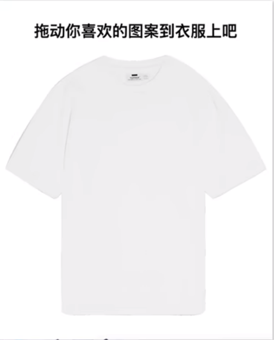
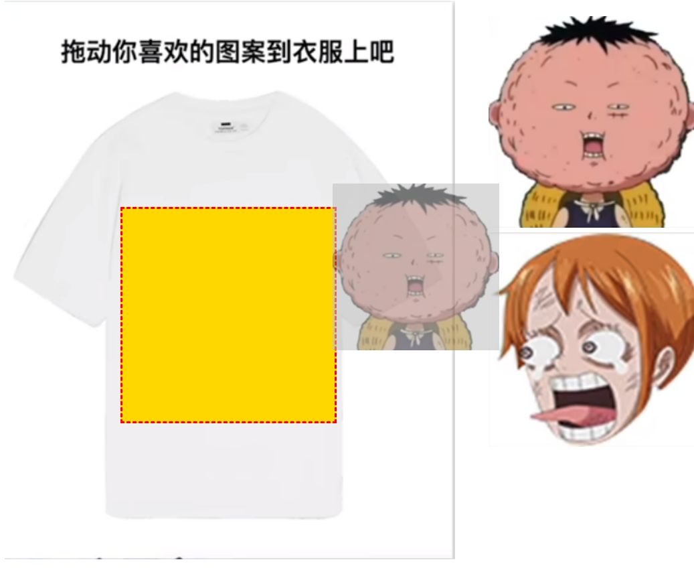

#js原生实现拖拽

## 1. Drag & Drop Apis

### 1.1 建立基本结构与样式


代码: 

```html
<!doctype html>
<html lang="en">
<head>
  <meta charset="UTF-8">
  <meta name="viewport"
        content="width=device-width, user-scalable=no, initial-scale=1.0, maximum-scale=1.0, minimum-scale=1.0">
  <meta http-equiv="X-UA-Compatible" content="ie=edge">
  <title>拖拽</title>
  <style>
    ul li {
      list-style: none;
    }

    .container {
      display: flex;
    }

    .container {
      position: relative;
    }

    .empty {
      position: absolute;
      top: 246px;
      left: 138px;
      width: 253px;
      height: 253px;
      background-color: gold;
      display: flex;
      justify-content: center;
      align-items: center;
    }
  </style>
</head>
<body>
<div class="container">
  
  <div class="empty"></div>

  <ul class="persons">
    <li>
      
    </li>
    <li>
      
    </li>
  </ul>
</div>

<script>
</script>
</body>
</html>

```

### 1.2 Drag & Drop Apis介绍


### 1.3 拖拽时为预留位置元素添加虚线边框

> 注意点: 需要为拖拽的元素指定 draggable = true 再绑定事件



```js
<!doctype html>
<html lang="en">
<head>
  <meta charset="UTF-8">
  <meta name="viewport"
        content="width=device-width, user-scalable=no, initial-scale=1.0, maximum-scale=1.0, minimum-scale=1.0">
  <meta http-equiv="X-UA-Compatible" content="ie=edge">
  <title>拖拽</title>
  <style>
    ul li {
      list-style: none;
    }

    .container {
      display: flex;
    }

    .container {
      position: relative;
    }

    .empty {
      position: absolute;
      top: 246px;
      left: 138px;
      width: 253px;
      height: 253px;
      background-color: gold;
      display: flex;
      justify-content: center;
      align-items: center;
      transition: border 300ms ease;
    }
  </style>
</head>
<body>
<div class="container">
  
  <div class="empty"></div>

  <ul class="persons">
    <li>
      
    </li>
    <li>
      
    </li>
  </ul>
</div>

<script>
  // 1. 为拖拽的元素设置draggable="true"
  // 2. 为拖拽的元素绑定拖拽事件
  const empty = document.querySelector('.empty')
  const imgs = document.querySelectorAll('.imgs')
  const dashedBoderStyled = '3px dashed red'

  for (const img of imgs) {
    img.addEventListener('drag',(e) => {
      empty.style.border = dashedBoderStyled
    })

    img.addEventListener('dragend',(e) => {
      empty.style.border = 'unset'
    })
  }
</script>
</body>
</html>

```

### 1.4 实现拖拽效果

> 注意: 
>
> 1. 浏览器默认不支持放置事件(drop), 需要提前在dropover事件中阻止浏览器的默认行为

完整代码

```js
<!doctype html>
<html lang="en">
<head>
  <meta charset="UTF-8">
  <meta name="viewport"
        content="width=device-width, user-scalable=no, initial-scale=1.0, maximum-scale=1.0, minimum-scale=1.0">
  <meta http-equiv="X-UA-Compatible" content="ie=edge">
  <title>拖拽</title>
  <style>
    ul li {
      list-style: none;
    }

    .container {
      display: flex;
    }

    .container {
      position: relative;
    }

    .empty {
      position: absolute;
      top: 246px;
      left: 138px;
      width: 253px;
      height: 253px;
      background-color: gold;
      display: flex;
      justify-content: center;
      align-items: center;
      transition: border 300ms ease;
    }
  </style>
</head>
<body>
<div class="container">
  
  <div class="empty"></div>

  <ul class="persons">
    <li>
      
    </li>
    <li>
      
    </li>
  </ul>
</div>

<script>
  // 1. 为拖拽的元素设置draggable="true"
  // 2. 为拖拽的元素绑定拖拽事件
  const empty = document.querySelector('.empty')
  const imgs = document.querySelectorAll('.imgs')
  const ul = document.querySelector('ul')
  const dashedBoderStyled = '3px dashed red'
  const isEmpty = () => empty.querySelectorAll('img').length === 0

  let dragingImg //新增

  for (const img of imgs) {
    img.addEventListener('drag',(e) => {
      dragingImg = e.target //新增
      empty.style.border = dashedBoderStyled
    })

    img.addEventListener('dragend',(e) => {
      dragingImg = undefined //新增
      empty.style.border = 'unset'
    })
  }

  // 3. 为空元素绑定放置事件, 移除图片, 并将图片添加到放置区域
  //  - 1. 利用dragingImg记录正在拖动的dom元素
  //  - 2. 为empty绑定放置事件

// 浏览器默认不支持放置事件(drop), 需要提前在dropover事件中阻止浏览器的默认行为
  empty.addEventListener('dragover',(e) => {
    e.preventDefault()
  })
  empty.addEventListener('drop',(e) => {
    e.preventDefault()
    e.stopPropagation()

    // 移除老图片
    const li = dragingImg.parentNode
    ul.removeChild(li)

    if(!isEmpty()){ // 如果不为空则先清空
      empty.removeChild(empty.childNodes[0])
    }
    // 向空白区域添加新图片
    empty.appendChild(dragingImg)

  })
</script>
</body>
</html>

```

### 1.5 拖拽与获取文件对象
> 如果想拖拽一个文件放置到某个DIV中, 并且获取到这个文件怎么做?

1. 在dragover和drop事件中阻止默认行为
2. 通过e.dataTransfer.files获取文件对象
```js

div.addEventListener('dragover', (e) => {
  e.preventDefault() // 想drop必须先在over中阻止默认行为
  e.dataTransfer.dropEffect = 'copy' // 指定拖拽的手势
})


div.addEventListener('drop', (e) => {
  e.preventDefault() // 阻止浏览器的自动打开行为
  console.log(e.dataTransfer.files) // 获取拖拽的文件对象
})
```

