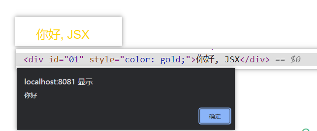
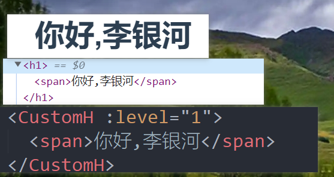

# 声明式渲染进阶

`template模板进阶`
render函数 , createElement() , JSX在Vue中的用法
<!-- more -->

## 一: createElement函数

1. 作用: 用于创建虚拟DOM的函数

2. 参数:  

 ` (  'html标签名/组件名/组件实例' , { 属性对象 } , [ 子节点的虚拟dom, 文本节点 ])`

3.<a href="https://cn.vuejs.org/v2/guide/render-function.html#%E6%B7%B1%E5%85%A5%E6%95%B0%E6%8D%AE%E5%AF%B9%E8%B1%A1">属性对象完整格式文档</a>

   ​

## 二:  render函数

1. render函数必须返回一个虚拟DOM

2. render函数用于替代template的. 

   template标签会被Vue底层的模板编译器编译成虚拟DOM参与构建页面. 
   render函数直接生成虚拟DOM参与构建页面. 不需要模板编译

3. render函数接受一个参数, 即函数 createElement, 该函数返回一个虚拟DOM, 在Vue中, 约定此函数又称为h函数

4.  示例 render(h)=>h(App) 

    

## 三: render 函数 + createElement替代 `<template>标签`

​	Hello.vue组件代码

```vue
<script>
	export default {
		name: 'Hello',
		render(h) {
			const div = h('div', {
				attrs: { // 原生属性
					id: '01'
				},
				on { // 绑定事件
					click: () => alert('你好')
				},
				style: { // 样式
					color: 'gold'
				}
			}, this.message) //可读取到组件实例的数据

			return div
		},
		data() {
			return {
				message: '你好, JSX'
			}
		},

	}
</script>

<style>
</style>

```

​	App.vue代码

```vue
<template>
	<div id="app">
		<Hello />
	</div>
</template>

<script>

	import Hello from './components/Hello'

	export default {
		name: 'App',
		components: {
			Hello
		}
	}
</script>

```

 	

​	最终效果




## 五: render 函数 + JSX语法 代替三  `<template>标签`

JSX规则:

1. 所有的变量都需要用 {} 读取
2. 标签体的属性需要遵循 **数据对象**的格式, 详细见
   属性对象完整格式文档:   https://cn.vuejs.org/v2/guide/render-function.html#%E6%B7%B1%E5%85%A5%E6%95%B0%E6%8D%AE%E5%AF%B9%E8%B1%A1

​	

只需要 将Hello.vue组件代码改成如下即可, 上面代码其他的不变	

```vue
<script>
	export default {
		name: 'Hello',
		render(h) {
			const {message} = this
		
			return (
			 <div 
				 style={{color:'pink'}} 
				 attrs={{id:'001'}} 
				 on={{click() {alert('你好')}}}
			 >
				{message}
			 </div>
			)
		},
		data() {
			return {
				message: '你好, JSX'
			}
		},

	}
</script>

<style>
</style>

```


## 六: 练习: 组件封装之自定义HX标题

CustomH.vue文件

```vue
<script>
	/* 自定义HX标题 */
	export default {
		props: {
			level: {
				type: String | Number,
				required: true
			}
		},
		render(h) {
			return h(
				`h${this.level}`,
		// 所有父元素的插槽都保存在$slots中
		// $slots.default 保存了默认插槽的虚拟DOM节点
				this.$slots.default
			)
		}
	}
</script>

<style>
</style>

```


App.vue代码

```vue
<template>
	<div id="app">
		<CustomH :level="1">
			<span>你好,李银河</span>
		</CustomH>
	</div>
</template>

<script>
	import CustomH from './components/CustomH'
	export default {
		name: 'App',
		components: {
			CustomH
		}
	}
</script>

```


效果



