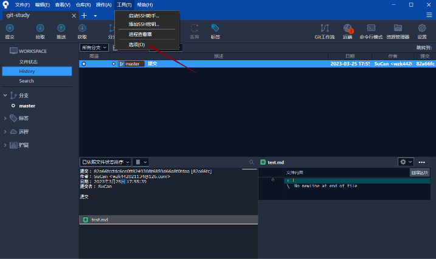

# Git操作与Sourcetree

## git workflow

> git 工作流不是一种新技术, 是一种git规范, 包括commit信息, 分支的创建和功能的规范

master/main主分支存放的代码和线上发布的代码一致.

- 来源: release分支(提测后修改bug), hotfix分支(线上bug)
- 去向: dev分支(第一次dev基于master创建的), hotfix分支(线上bug修复直接拉主分支的代码)

dev: 开发分支. 任何时候都是最新的开发代码

- 来源: 第一次基于master的. feature分支(团队开发功能分支的合并). hotfix分支(线上bug的修复). release分支(开发bug的修复). 总而言之: 保存的是最新的开发代码
- 去向: feature分支

feature: 功能分支. 一个需求对应一个功能分支

- 来源: dev分支
- 去向: dev分支

release: 提测分支

- 来源: dev分支(由测试人员基于dev新建测试分支)
- 去向: master分支(功能需求上线), dev分支(同步开发代码)

hotfix: 线上bug修复分支

- 来源: master分支
- 去向: master分支 dev分支

总结: **更新master分支, release分支,hotfix分支的时候,都更新一下dev分支** 

## Sourcetree

> Sourcetree是一个git 图形化软件, 不用使用CMD去操作git, 更加方便和对新手友好

### 操作本地仓库

1. 已有本地仓库, 使用sourcetree管理

   假如有现成的项目如下, 想交给 sourcetree管理

1. 未有本地仓库, 使用sourcetree创建并管理

   

   

### 修改提交作者信息和个性设置

### 文件暂存与提交

### 分支的创建

### 合并分支

#### merge

> merge合并分支特点: 比如说想将dev 合并到 master. 称master为目标分支, 称dev为被合并分支
>
> 则. 目标分支是向前进的, 被合并分支不动.

**sourcetree操作merge**

#### rebase

>  rebase合并分支特点: 比如说想将dev 合并到 master. 称master为目标分支, 称dev为被合并分支
>
>  则. 以目标分支为基准, 将被合并的分支的节点clone到目标分支
>
>  merge操作是站在目标分支使用命令, rebase是站在被合并分支使用命令

被合并前:

**交互式rebase**

### git远程仓库

### 回退版本

1. 查看历史版本
2. 回退历史版本

### git 冲突

