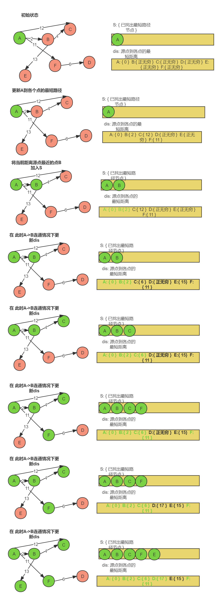

# 数据结构与算法

## 时间复杂度

> 以简化的方式描述程序语句的执行频度
>
> 规则： 保留高次项. 但高此项的系数、 低次项、 常数都省略

### 常数阶

```js
// func1执行时候， 语句频度 T（n） = 3
// 意味着无论输入多少数据量， 该函数语句都执行三次
// 那么时间复杂度 O（n） = 1
const func1 = (n) =>{
  console.log(1)
  console.log(2)
  console.log(3)
}
func1（100）
```


### 对数阶

```js
// 首先分析 i *= 2的执行次数
// 举例分析: 
// n = 4 时候 2次
// n = 8 时候 3次
// n = 16 时候 4次
// 故而可找出规律 2的"次数"次方 = n 根据对数定义 即次数 = log2n

// i 初始化1次 , i < n执行 log2n + 1次, i *= 2执行了log2n次, console.log()执行了log2n次
// 故而T(n) = 1 + log2n+1 + log2n + log2n次= 3log2n + 2次
// O(n) = log2n 对数级
const fun = (n) => {
  for (let i = 1; i < n; i*= 2){
    console.log(1)
  }
}
```


### 线性阶

```js
// fun执行时候
// let i = 0 执行一次
// i < n 执行 n + 1次(多出来的一次是初始化语句也要执行一次)
// i++ 执行n次
// console.log(1) 执行 n 次
// 所以 fun的语句执行频度 T（n） = 3n + 2
// 故 O（n） = n
const fun = (n) => {
  for(let i = 0; i < n; i++){
    console.log(1)
  }
}
fun(100)
```

### 平方阶

```js
// i初始化 1次
// i<n 执行n+1次(多了一次初始化的判断)
// i++ 执行n次
// j 初始化 n次
// j < n 执行 n(n + 1)次
// j++ n的平方次
// console.log(1) 执行 n的平方次
// 所以T(n) = 1 + n+1 + n + n + n²+n + n² + n² = 3n² + 4n + 2
// 所以O(n) = n²
const fn = (n) => {
  for(let i = 0; i < n ; i++){
    for (let j = 0; j < n; j++){
      console.log(1)
    }
  }
}
```


### 时间复杂度的快慢

O(1) > O(log) > O(n) > O(nlogn) > O(n²) > O (a的n次方) 

常数阶 > 对数阶 > 线性阶 > 线性对数阶 > 平方阶 > 指数阶 


### ∑ (sigama)求和公式

$\sum ^{n} _{ i=1 } {x_ i}$  的含义为: 对${x_i}$进行 从 i = 1 到 i = n的求和. 即等于${x_1} + {x_2} + {x_3} +  ... +  {x_n}$


举个例子: 比如有个数列${1 + 2 + 3 + 4 + 5 + .... + n}$表示什么意思?  


我们用变量${i}$代表每一项的值, 那么数列可以描述为 : "对 i 变量求和, 求和的范围是 i = 1 到 i = n" 

记作:${\sum ^{n} _{i = 1} {i}}$

--------


练习 :  分析${\sum _{i = 1} ^{3}} {(2 i - 1)}$

首先明确公式的含义: 对变量${2 i - 1}$在 i = 1 到 i = 3的范围上进行求和

故${\sum _{i = 1} ^{3}} {(2 i - 1)} = 2*1 -1 + 2*2 -1 + 2*3 -1 = 1 + 3 + 5 = 9$


-----

${\sum}$的性质:

${\sum ^{n} _{i = 1} {k b}}$=${k} {\sum ^{n} _{i = 1} {b}}$其中k为常数

${\sum ^{n} _{i = 1} {(a_i + b_i)}}$=${\sum ^{n} _{i = 1} {a_i }} + {\sum ^{n} _{i = 1} {b_i }}$

${\sum ^{n} _{i = 1} {i ^ 2}}   =  \frac{n(n+1)(2n+1)}{6}$约等于${n^3}$


---

### 公式法计算累加程序的时间复杂度

**例1**

```js
const fun = (n) => {
  for(let i = 0; i < n; i++){
    console.log(1)
  }
}
fun(100)
```

用公式法计算上述函数时间复杂度

由之前的经验可知, for循环中影响时间复杂度最关键的因素是循环体的语句, 为n * 循环体的内语句的条数


所以我们只计算它, 而忽略 ``let i = 0``,  ``i<n`` , ``i++`` 的影响


循环体内语句的执行条数为:

$\sum ^{n -1} _{0} {1}$ 即 1 在 [0, n-1]的范围上求和. 用上边界减下边界再加1即可算出有多少个1

即: n - 1 - 0 + 1 =  n 次

故上述算法的时间复杂度为 O(n)


**例2**

```js
const fn = (n) => {
  for(let i = 0; i < n ; i++){
    for (let j = 0; j < n; j++){
      console.log(1)
    }
  }
}
```

分析:  最里层循环体语句的执行次数为

${\sum ^{n - 1} _{i = 0}}$ ${\sum ^{n - 1} _{ j = 0}}$ 1


先算右边的

${\sum ^{n - 1} _{ j = 0}}$ 1 = n - 1 - 0 + 1 = n


所以公式等价于

${\sum ^{n - 1} _{i = 0}} { n }$


即结果为:  n²


### 公式计算对数级时间复杂度

> 对数级别算法常常出现在 i*= k 这种操作中.
>
> 思路为: 找出次数$T(n)$与$i$的关系


**例1**

```js
const fun = (n) => {
  for (let i = 1; i < n; i*= 2){
    console.log(1)
  }
}
```

首先分析, 这道题不能用之前$\sum ^{n} _{ i=1 } {x_ i}$公式计算

因为$\sum ^{n} _{ i=1 } {x_ i}$表示的是累加, 我们这个是$i *= 2$, 是跳着加的


我们可以假设 循环体语句的执行次数为 T(n), 而这个T(n) 也同样代表着最后的时间复杂度


然后我们列出 i 的变化: $1 , 2 , 4 , 8 , ...  , n - 1$(可能不完全命中 n -1) 

当T(n) = 0, 即循环次数为0次时候,$i = 1$

当T(n) =1, 即循环次数为1次时候,$i = 2$

当T(n) =2, 即循环次数为2次时候,$i = 4$

...

即可总结出如下公式$i = 2^{T( n )} < {n}$

$T(n) < log_2^n$

故该算法的时间复杂度为$O(log_2^n)$


**例2**

```js
const fn = (n) => {
  for(let i = 0; i < n ; i++){
    for (let j = 0; j < n; j++){
      let k = 1
      while(k <= n){
        n*=5
        console.log(1)
      }
    }
  }
}
```


此题是累加形和对数形的总和

答案为$n^2log_5 ^n$


### 递归程序的时间复杂度计算

**例1**

```js
const fn = (n) => {
  if(n === 1) return
  return n * fn(n - 1)
}
```

这样一个递归函数, 如何衡量事件复杂度

一种常见的办法是 迭代法


首先假设母问题的耗时为 T(n)

则 

 T(n) = O(1) , 当 n = 1时

 T(n) = O(1) + T(n - 1) 当n > 1时. 其中乘法运算的时间复杂度为o(1)


则  当n > 1 时

T(n) = O(1) + T(n - 1)

T(n - 1) = 0(1) + T(n - 2)

T(n - 2) = 0(1) + T(n - 3)

...


即 T(n) = n O(1) + T(1) = n O(1) + O(1)

即时间复杂度为 O(n)


### master公式计算递归

> master公式只能针对 "母问题可以拆成若干等量的子问题"的程序

master公式:

$T(n) = a * T(\frac{n}{b}) + O(n^ d)$

即 母问题的时间复杂度等于a个子问题的时间复杂度 加上常数级操作的时间复杂度


其中: 

n代表数据量

$T(n)$代表母问题的时间复杂度

$a$代表子问题的个数

$\frac{n}{b}​$代表子问题的数据量

$O(n^ d)$代表额外的常数级操作的时间复杂度


①当$d < log_b ^a$时，时间复杂度为$O(n ^ {log_b ^a} )$
②当$d =  log_b ^a$时，时间复杂度为$O(n ^ d * log_n )$
③当$d >  log_b ^a$时，时间复杂度为$O(n ^ d )$


**例子**

```java
    public static int process(int[] arr, int left, int right) {
        if (left == right) {
            return arr[left];
        }
        int mid = left + ((right - left) >> 1);
        int maxLeft = process(arr, left, mid);
        int maxRight = process(arr, mid+1, right);
        return Math.max(maxLeft,maxRight);
    }
}
```

首先判断这个函数可以是否可以用master公式? 

母问题被拆为了两个递归的小问题: 其中两个小问题的数据量各为一半, 故而可以用master公式


即$T(n) = 2 * T(\frac{n}{2}) + O(n^ 0)$

a = 2, b = 2, d = 0

$log_2 ^2 = 1$> d

故时间复杂度为$O(n ^ {log_b ^a} )$=$O(n ^ {log_2 ^2} )$=$O(n)$


## 十种排序算法

### 冒泡排序

> 记忆点: 两两交换， 移到右侧

```typescript
// 以升序数字排序为例, 冒泡排序就是两两比较, 将较大的数字移到后方
// 其中n个数字, 需要移动n-1次

const nums: number[] = [22, 1, 44, 1, 55, 11, 2, 1]

const swap = (arr: any[], num1Idx: number, num2Idx: number) => {
  if (num1Idx === num2Idx) return arr

  let temp = arr[num2Idx]
  arr[num2Idx] = arr[num1Idx]
  arr[num1Idx] = temp
}

const bubbleSort = (arr: number[]): number[] => {
  for (let i = 0; i < nums.length - 1; i++) { // 挑几个数字放在最后一个
    // // j规定哪两个元素交换, j 和 j+1做比较
    // j的范围最大可以到nums.length - 1, 但没必要
    // 第一次需要取到nums.length - 1, 每挑出一个数字, 最后一位就向前移动
    for (let j = 0; j < nums.length - i; j++) {
      if (arr[j] > arr[j + 1]) {
        swap(arr, j, j + 1)
      }
    }
  }

  return arr
}

console.log(bubbleSort(nums))

```


#### 利用变量优化冒泡排序

> 假如这样一个数组: [ 22,1,3,4,5 ]
>
> 第一次交换就会将22放在最后, 形成[1,3,4,5,22]. 但是接下来还会有第二次, 第三次, 第四交换, 显然是浪费的.
>
> 我们可以定义一个变量， 记录本轮是否未发生交换， 如果本轮未发生交换， 那么就不再进行之后的比较
>
> 优化过后的本例， 本来需要交换4轮， 优化后需要进行2轮。 第一轮正常交换 ，第二轮判断了一直未发生交换， 第三轮和第四轮不再交换


```typescript
const nums: number[] = [22, 1, 44, 1, 55, 11, 2, 1]

const swap = (arr: any[], num1Idx: number, num2Idx: number) => {
  if (num1Idx === num2Idx) return arr

  let temp = arr[num2Idx]
  arr[num2Idx] = arr[num1Idx]
  arr[num1Idx] = temp
}

let flag = false
const bubbleSort = (arr: number[]): number[] => {
  for (let i = 0; i < nums.length - 1; i++) { // 挑几个数字放在最后一个
    flag = true // 假设本轮是有序的
    for (let j = 0; j < nums.length - i; j++) {
      if (arr[j] > arr[j + 1]) {
        swap(arr, j, j + 1)
        flag = false // 交换了本轮就是无序的
      }
    }
    // 如果本轮真的有序， 就结束
    if(flag) return arr
  }
  return arr
}

console.log(bubbleSort(nums))

```


### 选择排序

> 记忆点： 选择与变量记录

> 以升序数字排序为例， 选择 n - 1 次数字放在最后或者最前方

```js
const nums: number[] = [22, 1, 44, 1, 55, 11, 2, 1]

const swap = (arr: any[], num1Idx: number, num2Idx: number) => {
  if (num1Idx === num2Idx) return arr

  let temp = arr[num2Idx]
  arr[num2Idx] = arr[num1Idx]
  arr[num1Idx] = temp
}

const selectSort = (arr: number[]) => {
  let maxIdx
  // 选择n - 1次
  for (let i = 0; i < arr.length - 1; i++) {
    // 规定每次选择范围[ 0, n - 1 - i ]
    maxIdx = 0

    for (let j = 1; j < arr.length - i; j++) {
      if (arr[j] > arr[maxIdx]) {
        maxIdx = j
      }
    }

    swap(arr, maxIdx, arr.length - 1 - i)

  }
  return arr
}

console.log(selectSort(nums))

```


### 插入排序

> 记忆点:  有序数组与无序数组, 位移与插入

> 1.  将数组看成“有序” 和 “无序”两部分。 其中第一个元素默认是有序的
> 2.  将无序的元素依次插入有序的元素中， 有序的依然有序
> 3.  插入的策略是先保存需要插入的数组， 然后右移有序数组

```js
const nums = [2, 1, 66, -1, 66]

const swap = (arr, num1Idx, num2Idx) => {
  if (num1Idx === num2Idx) return arr

  let temp = arr[num2Idx]
  arr[num2Idx] = arr[num1Idx]
  arr[num1Idx] = temp
}

const insertSort = (nums) => {
  let temp
  let j 
  // 遍历无序数组
  for (let i = 1; i < nums.length; i++) {
    temp = nums[i]
    // 倒着遍历有序数组
    for ( j = i - 1; j >= 0; j--) {
      // 如果有序
      if (nums[j] > temp) {
        nums[j + 1] = nums[j]
      } else {
        break
      }
    }
    nums[j + 1] = temp
      
  }
  return nums
}

console.log(insertSort(nums))
```

插入排序的事件复杂度计算: 

$\sum ^ {n - 1} _ {i = 1}$$\sum ^ {i - 1} _ {j = -1} 2$

$\sum ^ {n - 1} _ {i = 1}  2 ( i + 1 )$

2$( \sum ^ {n - 1} _ {i = 1}  1 +$$\sum ^ {n - 1} _ {i = 1}   i )$

所以 插入排序的时间复杂度为: O(n²)

### 希尔排序

> 记忆点: 插入排序的优化, 以步长分组, 减少步长至一

> 希尔排序是对插入排序的优化
>
> 插入排序是将"**无序数组的第一项不断插入有序数组中的过程**"
>
> 最好情况是O(n), 最坏情况是O(n²)
>
> 在保持"**局部基本有序**"的状态时插入排序比较高效, 在**逆序**时候, 插入排序低效


> 以升序为例
>
> 如 [1,3,2, 4,6,5, 9] 此时, [1,3,2],  [4,6 5], [9]是局部基本有序的, 此时插入排序比较高效的状态, 只需要2, 5 移动两次即可
>
> 但如 [6, 4, 5,2,3,1] 整体数据基本逆序, 此时比较低效, 时间复杂度无限接近于O(n²)


> 希尔排序是对插入排序, 也称为直接插入排序的优化. 
>
> 核心思路是将数据先变成 "局部基本有序的状态" , 再从头到尾进行直接插入排序


> 具体思路是: 
>
> 1. 设定步长, 按照步长分组, 进行直接插入排序
> 2. 递减步长, 直到为1, 进行直接插入排序


```js
const insertSort = (nums) => {
    let step = nums.length
    let temp
    let j 
 
    do{
         // 必须向上取整, 否则可能出现步长取不到1的情况
         step = Math.ceil(step / 3) 
         for(let i = step; i < nums.length; i++){
             // 每一组的无序的第一个元素
             temp = nums[i]
    
             // 从有序第一个元素开始遍历插入
             for(j = i - step ; j >= 0; j -= step){
                 if(temp < nums[j]){
                     nums[j + step] = nums[j]
                 }else{
                     break
                 }
             }
             nums[j + step] = temp
         }
     }while(step > 1)
    
    return nums
}

console.log(insertSort([2,1,4,22,33,522,1,-2,-100]))


```


### 快速排序

> 记忆点: 刨坑法与小于等于区法

> 快排的核心思路: 
>
> 1. 选取一个值, 作为基准值. 这个值可以是任意的
> 2. 遍历数组, 将小于基准值的数字丢到左边, 大于基准值的数字丢到右边
> 3. 对左, 右边的数字进行相同该操作

> 我的思考过程: 
>
>   以[ 44, 1, 2]为例
>
> 1. 假如选取 最后一个数字为基准值, 顺序遍历并交换, 则会出现"数组空洞", 即 [ undefined,1, 2 ,44]
> 2. 假如选取 第一个数字为基准值, 顺序交换并交换, 也可能会出现数组空洞 [1 ,44 , undefined, 2]


> 有没有一种办法, 不让undefined参与交换
>
> 来看下别人是怎么解决的


**快排一： 左右刨坑双指针直接插入法**

> 思路: 以选择最左值为pivot为例
>
> 1. 左右指针指向左右的坑位
> 2. 将pivot的位置挖出来， 从右边找一个比pivot小的数放进空位， 右边留一个坑
> 3. 从左边找一个比pivot大的数放进右边空位， 左边留一个坑
> 4. 重复以上过程， 留出一个坑位， 将pivot塞进去
>
>

```js
const nums = [2, 1, 66, -1, 66]

const swap = (arr, num1Idx, num2Idx) => {
  if (num1Idx === num2Idx) return arr

  let temp = arr[num2Idx]
  arr[num2Idx] = arr[num1Idx]
  arr[num1Idx] = temp
}

const partition = (nums, start, end) => {
  let pivot = nums[start]
	
  // 填完左边的坑再填右边的坑视为一轮操作， 持续N轮
  while(end > start){
    // 找萝卜， 填左边的坑
    while(end > start && nums[end] >= pivot){
      end--
    }
    swap(nums,start, end) 
    // 找萝卜， 填右边的坑
    while (end > start && nums[start] <= pivot) {
      start++
    }
    
    swap(nums, start, end)
  }
  nums[start] = pivot
  return start
}

const selectSort = (nums, start = 0, end = nums.length -1) => {
  if(start >= end) return
  const pivot = partition(nums, start,end)
  selectSort(nums, start , pivot - 1)
  selectSort(nums, pivot + 1, end)
}

selectSort(nums)
console.log(nums)
```

**快排二： 小于等于区法**

> 思路： 
>
> 1. 划一个小于等于pivot区，并规定小于等于区的前面的元素一定是大于pivot的
> 2. 遍历数组， 小于等于pivot的和小于等于区后一个位置做交换， 小于等于区扩大一位

```js
const nums = [2, 1, 66, -1, 66,88,1,22,-5,1123]

const swap = (arr, num1Idx, num2Idx) => {
  if (num1Idx === num2Idx) return arr

  let temp = arr[num2Idx]
  arr[num2Idx] = arr[num1Idx]
  arr[num1Idx] = temp
}

const partition = (nums, start, end) => {
  let idx = start - 1; // 小于等于区的指针, 默认没有任何元素
  let pivot = nums[end]
  for(let i = start; i <= end; i++){
    if(nums[i] <= pivot){
      swap(nums, idx + 1,i)
      idx++
    }
  }

  return idx
}

const selectSort = (nums, start = 0, end = nums.length -1) => {
  if(start >= end) return
  const pivot = partition(nums, start,end)
  selectSort(nums, start , pivot - 1)
  selectSort(nums, pivot + 1, end)
}

selectSort(nums)
console.log(nums)
```


### 归并排序

> 归并排序: 在合并有序表的基础, 采用分治法和二分法解决问题
>
> 已知我们掌握了合并两个有序表的方法(merge方法的实现)
>
> 但是输入的数组大概率是无序的, 为了解决这个问题, 我们将数组一份为二, 每个子数组单独处理成有序的,
>
> 但是发现一分为二的数组各自依然是无序的, 为了解决这个问题, 再一分为二
>
> 直到被分为两个单独的元素, 此时可以认为是有序的, 再做合并

> 记忆点: 递归与合并, 合并指的是合并两个有序的顺序表. 空间换时间

> 知识点: 
>
> 1. 归: 指的是递归的拆分数组到最后一个元素
> 2. 并: 指的是合并两个"有序"的顺序表

```js
const merge = (arr1, arr2) => {
  let idx1 = 0 // 遍历第一个顺序表的指针
  let idx2 = 0 // 遍历第二个顺序表的指针
  const result = [] 
 
  while(idx1 < arr1.length && idx2 < arr2.length){
    if(arr1[idx1] < arr2[idx2]){
      result.push(arr1[idx1])
      idx1++
    }else if(arr2[idx2] < arr1[idx1]){
      result.push(arr2[idx2])
      idx2++
    }else {
      result.push(arr2[idx2],arr1[idx1]) 
      idx1++
      idx2++
    }
  }
  // 出循环有三种情况:
  //  a , b都遍历完了, 或者a遍历完了 或者b遍历完了
  
  // 退出循环后, 可能存在有一个顺序表没有遍历完
  if(arr1.length === idx1){ // 如果arr1遍历完了就将剩下的arr2元素放进去
    result.push(...arr2.slice(idx2))
  }else { // 如果arr2遍历完了就将剩下的arr1元素放进去
    result.push(...arr1.slice(idx1))
  }
  return result
}

// 递归拆分数组, 再合并
// 拆分到最后一个元素时候, 将元素保留
// T(n) = nums[left]或者 nums[right], 当left = right
// T(n) = merge(T(left,mid), T(mid,right)), 当left < right
// 其中right逐渐逼近left
const mergeSort = (nums, left = 0, right = nums.length - 1) => {
  if(right === left) return [nums[left]]
  // 1. 取中点
  let midIdx = Math.floor((left + right) / 2)
  // 2. 将两个区域不断中分
  
  return merge(
  	mergeSort(nums, left, midIdx),
    mergeSort(nums, midIdx + 1, right)
  )
 
}

console.log(mergeSort([2,-1,20,15,-88,999,1,22222,-1.5]))
```


### 基数排序

> 记忆点: 按照位置, 从小到大位数, 桶排序

> 基数排序基本思想是准备十个桶 分别是0-9, 先按照个位将数字排序, 然后是10位 然后百位, 直到最大的位数
>
> 基数排序的特点: 
>
> 1. 只能排序数字
> 2. 不涉及到交换
> 3. 是一种桶排序
> 4. 是稳定排序算法

```js
const radixSort = (nums) => {
  // 1. 找出数组的最大数字的位数
  let maxValue = nums[0]
  for(let i = 1; i < nums.length; i++){
    if(nums[i] > maxValue){
      maxValue = nums[i]
    }
  }
  
  const maxPlace = String(maxValue).length
  
  // 2. 准备0~9十个桶
  const buckets= []
  for(let i = 0; i <= 9; i++){
    buckets[i] = []
  }
  
  let num,
      bucket
  // 3.循环, 每轮循环按照位数进行排序
  for(let i = 0; i < maxPlace; i++){
    let idx = 0
    for(let j = 0; j < nums.length; j++){
        // 获取对应位数
     	num = Math.floor(nums[j] / Math.pow(10,i)) %10
      // 将数字放进对应的桶中
        buckets[num].push(nums[j])
    }
    // 从左到右, 从上到下遍历桶中的数字, 并将其放回原数组中
    for(let k = 0; k < buckets.length; k++){
      bucket =  buckets[k]
      while(bucket.length > 0){
        nums[idx++] = bucket.shift()
      }
    }
  }

  return nums
}


console.log(radixSort([2,1,11,322,4222,145,778]))
```


### 堆排序

> 注意点 : 内存中的堆区和数据结构中的堆并不是一个概念

> 什么是堆排序?
>
> 1. 完全二叉树是指树在广度优先遍历时候, 节点的序号和其对应的满二叉树一致的树
> 2. 堆分为大顶堆和小顶堆. 大顶堆是父节点大于等于子节点的完全二叉树, 小顶堆是父节点小于等于子节点的完全二叉树
> 3. 线索化二叉树指的是将树按照节点的序号存入数组, 以数组的形式表示二叉树的方法. 其中某一节点的索引若为 i,  其左子节点的索引为 2i + 1, 其右节点的索引为2i + 2. 其父节点索引为 (i - 1 ) / 2并向下取整

```js
const swap = (arr,idx1,idx2) => {
  if(idx1 === idx2) return 
  arr[idx1] = arr[idx1] ^ arr[idx2]
  arr[idx2] = arr[idx1] ^ arr[idx2] // arr[idx1] ^ arr[idx2] ^ arr[idx2] = arr[idx1]
  arr[idx1] = arr[idx2] ^ arr[idx1] // arr[idx1] ^ arr[idx1] ^ arr[idx2] = arr[idx2]
}

// heapAdjust函数是指将一个除根节点外均满足最大堆性质的二叉树调整为堆的函数
// 思路是: 1. 从根节点触发, 三选一, 将最大的数字放在根节点上, 
//        2. 由于调换了子树的根节点(可能是左子树也可能是右子树), 那么需要一直调整子树直到没有子树为止. 
//        3. 其过程画图可以知道: 是从待调整节点开始到目标节点, 最大节点不断上移的过程
const heapAdjust = (arr,parent,endIdx) => {
    let temp = arr[parent] // 要做插入, 先保存即将被覆盖的父节点
    // i为左节点, i+1为右节点
    for(let i = 2 * parent + 1; i < endIdx; i = 2 * i + 1){
      // 无越界, 且左节点比右节点小
      if(i < endIdx && arr[i] < arr[i+1]){
        i++ //将i设置为右节点, 一会要沿着i遍历子树
      }
      
      // 父节点是最大的节点, 不用交换.
      // 这种情况下也不用检查其子树了. 因为子树默认满足大顶堆性质
      if(temp >= arr[i]){
        break
      }
      
      // 左右其中之一的节点是大节点, 需要移动
      arr[parent] = arr[i] 
      // 移动后, 被交换的子树未必是大顶堆了, 所以需要继续检查
      // 继续循环就是下一轮的检查
      
      // parent是记录的下一轮循环中的父节点
      parent = i
    }
  
 	// 退出循环时候,parent的指向为:
    // 要么是到达叶子节点了, 此时parent指向叶子结点
    // 要么是temp大于某棵子树的左右节点
  	// 所以应该插入到parent
  arr[parent] = temp
}

const heapSort = (arr) => {
  // 构建堆的过程是从最后一个父节点逆序的, 因为从头结点开始会产生超级多的回溯
  // 从最后一个节点开始可以倒叙开始, 可以保证每次构建一棵树的时候, 左右子树都是最大堆
  const lastNodeIdx = Math.floor(((arr.length - 1) - 1 )/ 2)
  for(let i = lastNodeIdx; i >= 0; i--){
    heapAdjust(arr,i, arr.length - 1)
  }
  
  // 堆排序的过程
  for(let i = arr.length - 1; i >0; i--){
    swap(arr,i,0) // 交互最后一个与根节点
    heapAdjust(arr, 0, i - 1) // 重新调整为大顶堆
  }
  return arr
}

console.log(heapSort([111,22,13,4333,5,62,7,8]))
```


### 计数排序

### 桶排序

## 四种查找算法

### 线性查找

### 二分查找

**递归法**

> 这种递归是仿照的归并排序的, 其不用要求有序数组. 但是复杂度较高

```js
const findX = (nums,target,left = 0,right = nums.length - 1) => {
  if(left > right) return null
  if(right === left) return nums[right] === target ? right : null
  
  const mid = Math.floor( (right + left) / 2)
  let res1 = findX(nums, target, left , mid)
  let res2 = findX(nums, target, mid + 1, right)
  
  return res1 || res2
}

console.log(findX([2,1,-111,231,12123,23],23))
```

> 总结: 上面这个递归的二分法查询时候, 我写成 mid = (right - left) / 2
>
> 导致程序异常.
>
> 这是由于没有理解中点的求解. 现在梳理下中点的求解方式
>
> 假如有一条线段在直角坐标系下的坐标如下: 其中 ?点代表 4--10的中点, 求?点的X左边
>
> |------------(4,0)--------------(?,0)---------------(10,0)|
>
> 
>
> 方式一:  4 + (10 - 4) / 2 = 7. (10 - 4) / 2求得是4 到 ?点 的长度, 再+4 即为?点的X坐标
>
> 方式二: (4 + 10) / 2 = 7. 上面线段可以改变下形式, 10长度的后面再加上4长度的线段, 由于左右都是4长度, 重点都是?, 所以?为 (左长度 + 右长度) / 2


**循环法**

> 循环法和递归法不同的是, 循环法只能在有序的数组中找某个元素, 而递归法可以无序的数组中找某个元素

```js
const binarySearch = (nums,target) => {
  let left = 0
  let right = nums.length - 1
  let mid
  while(right >= left){
    mid = Math.floor((left + right) / 2)
    if(nums[mid] === target){
      return mid
    }
    if(nums[mid] < target){
      left = mid + 1
    }
    if(nums[mid] > target){
      right = mid - 1
    }
  }
  
  return -1
}

console.log(binarySearch([1,2,3,4,5,6,7,8],84))
```


### 插值查找

### 斐波那契查找


## 八种数据结构

### 数组

#### 稀疏数组与三元组

假如有这样一个 8*8的棋盘, 用数组去存储某个棋局, 你会怎么储存?

1. 使用一个二维数组存储棋盘数据, 其中二维数组的长度代表棋局的宽. 二维数组中的每个数组代表棋局的行
2. 使用一些标记记录黑棋子和白棋的位置信息, 出于占用内存大小的考虑, 0 和 1是不错的原则, 可以用0表示白, 1表示黑


这样的想法很棒, 但是有着很大的改进空间: 由于下棋的规则所致, 导致棋子较少, 空位较多, 这种存储势必会浪费大量的内存记录空位, 这种方案形成的数组称为稀疏数组


为了解决浪费内存的问题, 可以用三元组去代替稀疏数组的存储的方式

三元组指有三个变量的数组, 是一个3列n行的数组. 在这个案例中, 可以只记录某个棋子的x,y坐标, 以及棋子的状态: 是黑子还是白子. 以及可以定义某一行单独定义整个棋盘的行数与列数和总棋子数, 以达到节省内存的效果


```js
const toTripleArr = (sparseArr) => {
  // 创建三元组
  const len = sparseArr.length
  const tripleArr = [
    [len, len ,null]
  ]
  let allCount = 0
  for(let i = 0; i < len; i++){
    for(let j = 0; j < len; j++){
      if(sparseArr[i][j] !== null){
        const point = []
        point[0] = i // 第一列为x坐标
        point[1] = j // 第二列为y坐标
        point[2] = sparseArr[i][j] // 第三列记录值
        tripleArr.push(point)
        allCount++
      }
    }
  }
  tripleArr[0][2] = allCount
  return tripleArr
}

const toSparseArr = (tripleArr) => {
  const sarseArr = []
  const [len] = tripleArr[0]
  
  for(let i = 0; i < len; i++){
    sarseArr.push(new Array(len).fill(null))
  }
  
  for(let i = 1; i < tripleArr.length; i++ ){
    for(let j = 0; j <= 2; j++){
      const x = tripleArr[i][0]
      const y = tripleArr[i][1]
      const value = tripleArr[i][2]
      sarseArr[x][y] = value
    }
  }
  return sarseArr
}

const sparseArr = [
    [null,null,1,null,null],
    [null,1,null,null,null],
    [null,null,null,0,null],
    [null,null,0,null,null],
    [null,0,null,null,null]
]

console.table(toSparseArr(toTripleArr(sparseArr)))
```


### 链表

#### 单链表

#### 双链表

#### 循环(环形)链表

```js
class Node {
    constructor(data, next) {
        this.next = next || null
        this.data = data
    }
}
class RingLinkedList {
    constructor() {
        this.head = this.tail = null
    }

    add(el) {
        if (!el)
            return
        const node = new Node(el)

        if (!this.head) {
            this.head = this.tail = node
          	this.tail.next = node
            return
        }

        this.tail.next = node
        node.next = this.head
        this.tail = node

    }

    del(data) {
        let cur = this.head
        let parent = this.tail
        let isFind = false    
        while (cur !== this.tail) {
             if (cur.data === data) {
                isFind = true
                break
            }
            parent = cur
            cur = cur.next
        }

        if(!isFind && cur.data === data){
            isFind = true
        }

        if(isFind){
            parent.next = cur.next
            if(cur === this.tail){
                this.tail = parent
            }
            if(cur === this.head){
                this.head = cur.next
            }
        }
        
        return null
    }

    get(data) {
        let cur = this.head

        while (cur !== this.tail) {
            if (cur.data === data) {
                return cur
            }
            cur = cur.next
        }

        if (cur.data === data) {
            return cur
        }

        return null
    }

    update(oldData, newData) {
        const node = this.get(oldData)
        if (node) {
            node.data = newData
            return true
        }
        return false
    }

    toString() {
        let str = `${this.head ? this.head.data : ''}`
        let cur = this.head
        while (cur !== this.tail) {
            cur = cur.next
            str += ` --->${cur.data}`
        }
        console.log(str)
    }
}
const n = new RingLinkedList()
n.add(100)
n.add(1)
n.add(221)
n.add(22221)
n.add(2211)
n.del(2211)
n.toString()

```


### 队列

#### 普通队列

> 特点: 先进先出.
>
> 实际应用: 需要排队和调度的场景广泛应用: 比如JS的各种宏/微任务队列, Vue底层的nexttick相关的调度队列, promise调用then方法的多个回调函数也需要调度队列..... 

> 特点: 这个数据结构的实现很巧妙, **出队列并不是物理删除, 而是通动指针, 在逻辑上删除. 相同的思路还有堆排序中删除尾巴节点也是通过逻辑上删除**

```js
class Queue {
  front = 0 // 用于指定队列的开端
  tail = 0 // 指向队列尾巴空格元素
  arr
  size
  constructor(size){
    this.size = size
    this.arr = new Array(size).fill(null)
  }
  
  isFull(){
    // tail是指针也是索引, 直接被用来添加元素,当等于size的时候即出界了 
    return this.tail >= this.size
  }

  isEmpty(){
    // 有两种情况
    // 1. 初始化
    // 2. 出队列的指针逼近到了尾指针
	return this.front === this.tail
  }
	
  enqueue(ele){
    if(!isFull()){
      return this.arr[this.tail++]	   
    }
  }
  dequeue(){
    if(!isEmpty()){
      // 只在逻辑上删除, 并非在物理上删除
      return this.arr[this.front++]
    }
  }
}
```


#### 优先级队列

> 优先队列可以使用堆实现

> 在以下三种情况需要调整堆
>
> 1. 除了根节点都满足堆的性质
>    - 此时为从上到下调整, 三选一最大的放在父节点上, 并且对被交换节点递归这个操作, 要注意越界问题
> 2. 除了末尾节点都满足对的性质
>    - 这是为从下到上调整, 三选一放在父节点, 并且对被交换节点递归这个操作,并且递归父节点
> 3. 数组是乱序, 需要生成堆
>    - 采用从最后一个父节点出发, 倒叙遍历所有根节点. 再结合方法2的从下向上调整堆的方式生成堆


```js
class PriorityQueue {
    // 使用数组存储优先级队列
    heap = []
    isEmpty() {
        return this.heap.length === 0
    }

    parent(i){
        return Math.floor((i - 1) / 2)
    }

    swap(i,j){
        [this.heap[j],this.heap[i]] = [this.heap[i],this.heap[j]]
    }

    print(){
        console.log(this.heap)
    }
	/**
	  @param { Array<{ele:any, priority:number}> } arr  必须要求arr中的元素形状 
	*/
    buildHeap(arr){
        if(!Array.isArray(arr)) return
        this.heap = arr.slice(0)
		const lastNode = this.parent(this.heap.length - 1)
        for(let i = lastNode; i >= 0; i--){
          this.heapDown(i)
        }
      console.log(this.heap)
    }
    
    heapUp(i){
        // 传入插入节点的索引值, 不断向上寻找父亲比较
        const parent = this.parent(i)
        if(parent >= 0 && this.heap[i].priority > this.heap[parent].priority){
            this.swap(parent,i)
            this.heapUp(parent)
        }
    }

    heapDown(i){
        // 从下到上调整为二叉树
        const left = 2 * i + 1
        const right = 2 * i + 2
        
        let max = i    
        if(left <= this.heap.length - 1 && this.heap[left].priority > this.heap[max].priority){
            max = left
        }

        if(right <= this.heap.length - 1 && this.heap[right].priority > this.heap[max].priority){
            max = right
        }

        if(max !== i){
            this.swap(i, max)
            this.heapDown(max)
        }
        
    }
    
    enqueue(ele,priority) {
        const node = {ele,priority}
        this.heap.push(node)
        // 插入是向上调整
        if(this.heap.length > 1){
         this.heapUp(this.heap.length - 1)   
        }
    }

    dequeue(){
        // 删除父节点
        this.swap(0,this.heap.length - 1)
        let res
        if(!this.isEmpty()){
            res = this.heap.pop()
            this.heapDown(0)
        }

        return res

            
    }
}

const queue = new PriorityQueue()
// queue.enqueue(1,10)
// queue.enqueue(1,15)
// queue.enqueue(1,20)
// queue.enqueue(1,5)
// queue.enqueue(1,3)
// queue.enqueue(1,66)
// queue.enqueue(1,100)
// console.log(queue.dequeue())
queue.buildHeap(
  [
    {ele:1,priority:10},
    {ele:1,priority:222},
    {ele:1,priority:11},
    {ele:1,priority:133},
    {ele:1,priority:1},
    {ele:1,priority:110},
    {ele:1,priority:210},
    {ele:1,priority:10111},
  ]
)


```


#### 循环(环形)队列

> 队列是使用数组实现, 是一种线性表, 不存在真正的环形结构. 环形队列是通过逻辑上, 营造出环形的感觉

**使用计数器实现环形队列**

```js
class RingQueue {
  maxSize
  arr
  rear = 0
  front = 0
  count = 0
  constuctor(maxSize){
    this.maxSize = maxSize
    this.arr = new Array(maxSize)
  }
  
  isFull(){
    return this.count === this.maxSize
  }
  isEmpty(){
    return this.count === 0
  }
  
  enqueue(ele){
    if(!this.isFull()){
      this.arr[this.rear] = ele
      this.rear = (this.rear + 1) % this.size 
      this.count++
    }
  }

  dequeue(){
    let res 
    if(!this.empty()){
      res = this.arr[this.front]
      this.front = (this.front + 1) % this.size
      this.count--
    }
    return res
  }
}
```


**不使用计数器实现环形队列**

> 难点:
>
> 1. isFull方法和isEmpty方法的逻辑
> 2. size方法的逻辑
>
> 不适用计数器的实现,理解起来很难, 有空研究下


```js
class CircleQueue {
  front = 0 // 头指针指向队列第一个元素
  rear = 0 // 尾指针指向最后一个元素的后一个元素
  arr // 用数组保存数组元素
  maxSize // 保存数组最大长度

  constructor(maxSize) {
    this.arr = new Array(maxSize)
    this.maxSize = maxSize
  }

  isFull() {
    return (this.rear + 1) % this.maxSize === this.front
  }

  isEmpty() {
    return this.rear === this.front
  }

  enqueue(num) {
    if (!this.isFull()) {
      // 如果队列没有满再添加
      this.arr[this.rear] = num
      this.rear = (this.rear + 1) % this.maxSize
    }
  }

  dequeue() {
    if (!this.isEmpty()) {
      const value = this.arr[this.front]
      this.front = (this.front + 1) % this.maxSize
      return value
    }
  }
  /**
    由于队列是环形的，因此需要考虑 front 和 rear 的位置关系。如果 rear 大于 front，则直接相减得到队列大小；如果 rear 小于等于 front，则需要加上数组长度 maxSize，再减去 front，最后对 maxSize 取模，得到队列大小。这里取模的原因是当 rear 等于 front 时，队列是空的，而 (this.rear - this.front + this.maxSize) 的结果为 this.maxSize，所以需要对 maxSize 取模，结果为 0。

      这样实现 size 方法的好处是不需要维护计数器，因为计算 front 和 rear 之间的距离本身就可以得到队列的大小。
  */
  size() {
    return (this.rear - this.front + this.maxSize) % this.maxSize
  }

  show() {
    // 计算队列元素的个数?
    // (rear - front + maxSize) % maxSize
    for (let i = this.front; i <= this.front + this.size(); i++) {
      const index = i % this.maxSize
      console.log(this.arr[index])
    }
  }
}

const cq = new CircleQueue(3)
cq.enqueue(1)
cq.enqueue(2)
cq.enqueue(3)
cq.dequeue()
cq.enqueue(5)
cq.show()

```


### 栈

> 迟到早退, 先进后出的数据结构

```js
class Stack {
  front = -1 // 索引0代表空, 第一个位置空出来
  constructor(size){
    this.size = size
    this.arr = new Array(size)
  }
  
  isFull(){
    return this.size === this.front - 1
  }

  isEmpty(){
    return this.front < 0
  }

  push(ele){
    if(!this.isFull()){
      this.arr[++this.front] = ele
    }	
  }

  pop(){
    if(!this.isEmpty()){
      return this.arr[this.front--]
    }
  }
  top(){
    return this.arr[this.front]
  }
}
const s = new Stack()
s.push(10)
s.push(102)
s.push(110)
s.push(12220)
```


#### 前中后缀表达式与逆波兰计算器

> 前中后缀表达式是用于表示算数的表达式
>
> 其 "前中后"指的是运算符的位置
>
> 前缀表达式指的是, 运算符出现在数字的前方, 中缀是中间, 后缀是后面
>
> 
>
> 所以我们最常用的算数表达式为中缀表达式
>
> 如: (a + b) * c 为中缀  , 对应的后缀为 ab+c* 前缀为 *+abc


**中缀转后缀表达式(逆波兰)**

> 中缀表达式转为前缀, 后缀表达式使用栈来实现, 记录下我的思考为什么使用栈
>
> 首先以一个表达式为例 a + b * c / (d + f)
>
> 
>
> 首先最朴素的想法是 从头遍历到尾, 拿到操作符, 然后根据左右的下标直接运算. 但这种方法很快就被否定了
>
> 因为假如先遍历到 + 此时并不能直接运算a + b, 因为明显后面的操作符有更先的优先级. 但等运算完(d + f)后, 字符串已经便利完毕, 此时还需要从头开始遍历找到第二优先级的操作符进行运算, 如此往复, 大量的性能被耗费了
>
> 所以就考虑把操作符缓存下来, 但是使用什么存那? 数据结构那么多, 选哪个数据结构合适呢?
>
> 
>
> 认真想其实可以总结一个规律, : 前一个操作符是否执行是由后一个操作符决定的, 后一个也是由它的后一个操作符的优先级决定的.
>
> 
>
> 如这个例子 + 的执行是看后面的*是否比他优先级更高, * 是否运算是由后面的/优先级是否比他更高决定的
>
> 所以利用栈存操作符是最好的, 遍历的顺序是正序, 那么操作符在栈的顺序为逆序, 当需要操作的时候正好弹出栈, 后一个操作完了, 再进行前一个操作.
>
> 
>
> 这个核心想出来, 再去考虑细节的问题和规则, 比如数字是否也需要存储, 需要什么数据结构存储? 什么时候尽心运算等等就并不困难了

```js
// (12+2)*9-8 --> 12 2+9*8-
const toPostfixExp = (exp) => {
	const numStk = []
    const opeStk = []
    let res = []
  	const opers = new Set(['+','-','*','/'])
    // 获取操作符的优先级
    const getPriority = (ope) => {
      if(!ope) return 0
      if(ope === '+' || ope === '-') return 1
      if(ope === '*' || ope === '/') return 2
    }
    // 从数栈弹出两个数字, 从操作符栈弹出一个保存到结果数组里
    const saveRes = () => { 
         const num2 = numStk.pop()
         const num1 = numStk.pop()
         num1 && res.push(num1)
         num2 && res.push(num2)
         res.push(opeStk.pop())
    }
    for(let i = 0, token = ''; token = exp[i++];){
      if(opers.has(token)){
        // 如果操作符栈顶的的优先级大于等于当前操作符优先级, 立即操作
        // 如果操作符栈顶元素小于当前操作符有限级, 将其加入操作符栈
        if(getPriority(opeStk.at(-1)) >= getPriority(token)){
          saveRes()
        }
        opeStk.push(token)
        continue
      } 
      
      if(token === ')'){
        // 当为)时候, 应该去找对应的(
        // 在找到
        let top = numStk.at(-1)
        while(top !== '('){
        	saveRes()
          	top = numStk.at(-1)
        }
        numStk.pop()
        continue
      }
      // 当token为数字或者(的情况
      if(token === '('){
        numStk.push(token)
      }else {
        numStk.push(+token)
      }
      
    }
  
    while(opeStk.length > 0){
		saveRes()
    }
    
    return res
}
// (12+2)*9-8 --> 12 2+9*8-
console.log(toPostfixExp(['(','12','+','2',')','*','9','-','8']))
```

**后缀表达式(逆波兰)直接计算**

```js
const evalRPN = function(tokens) {
    const numStk = []
    const opers = new Set(['+','-','*','/'])
    const calcMethods = {
        "+":(num1,num2) => num1 + num2,
        "-":(num1,num2) => num1 - num2,
        "*":(num1,num2) => num1 * num2,
        "/":(num1, num2) => parseInt(num1 / num2)
    }
    const calc = (oper,num1,num2) => calcMethods[oper](num1,num2)

    for(let i = 0,token = ''; i < tokens.length; i++){
        token = tokens[i]
        if(!opers.has(token)){
            numStk.push(+token)
        }else {
            const num2 = numStk.pop()
            const num1 = numStk.pop()
            numStk.push(calc(token,num1,num2))
        }
    }

    return numStk.pop()
};
```


### 哈希表


### 树

### 二叉树的遍历

#### 二叉树dfs与先中后序遍历--递归版

```js
const BTtraversal = (node) => {
  if(!node) return
  // 在此操作节点为先序遍历
  BTtraversal(node.left)
  // 在此操作节点为中序遍历
  BTtraversal(node.right)
  // 在此操作节点为后序遍历
}
```

#### 二叉树dfs与先中后序遍历--非递归版

**先序非递归**

> 其中难理解的是  while(stack.length > 0 || node) 为什么循环的条件中有个或者node
>
> 这是对边界情况的处理, 当弹出根节点的时候, 此时栈为空, node指针指向根节点的右节点, 如果只写 while(stack.length > 0) 循环就会停止, 不会处理到右子树
>
> 
>
> 所以栈空定义不了遍历结束, 当遍历结束的时候, 一定是栈空了, 并且node指针为null

```js
const inorderTraversal = (node) => {
  if(!node) return null
  
  const stack = [node]
  while(stack.length > 0 || node){
    while(node){ //如果有左节点, 先处理左节点
      console.log(node)
      stack.push(node)
      node = node.left
    }
    // 处理上个节点的右节点
    node = stack.pop().right
  }
}
```


**中序非递归**

```js
const infixTraversal = (node) => (node) => {
  if(!node) return null
  
  const stack = [node]
  let curNode
  while(stack.length > 0 || node){
    while(node){ //如果有左节点, 先处理左节点
      stack.push(node)
      node = node.left
    }
    // 处理上个节点的右节点
    curNode = stack.pop()
    console.log(curNode)
    node = node.right
  }
}
```


**后序非递归**

> 思路一: 记录法, 用一个指针记录上一次输出的值, 比较烧脑, 老实记不住
>
> 思路二: 如果你会先序序遍历即中左右, 那么就会求中右左,  那么颠倒下左中顺序即为左右中后序

```js
const postoderTraversal = (node) => (node) => {
  if(!node) return null
  
  const stack = [node]
  let temp = []
  while(stack.length > 0 || node){
    while(node){
      temp.push(node)
      stack.push(node)
      node = node.right
    }
    node = stack.pop().left
  }
  return temp.reverse()
}
```


#### 二叉树bfs与层序遍历

> bfs和层序遍历的区别和联系
>
> 1. 二叉树的bfs和层序遍历都是使用队列实现
> 2. bfs是每个节点都进行一次输出, 层序遍历是每一层进行一次输出


**二叉树的bfs**

```js
const bfs = function(node) {
    if(!node) return null

    let queue = [node]
    let curNode
    while(queue.length > 0){
        curNode = queue.shift()
        console.log(curNode)
        if(curNode.left){
            queue.push(curNode.left)
        }
        if(curNode.right){
            queue.push(curNode.right)
        }

    }
}
```

**二叉树的层序遍历**

```js
const levelOrder = function(node) {
    let res = []
    if(!node) return res

    let queue = [node]
    let curNode
    while(queue.length > 0){
        let len = queue.length // 记录当前层有几个节点
        let temp = [] // 每一层用一个数组保存
        for(let i = 0; i < len; i++){
            curNode = queue.shift()
            temp.push(curNode.val)
            if(curNode.left){
                queue.push(curNode.left)
            }
            if(curNode.right){
                queue.push(curNode.right)
            }
        }
      	// 每一层搞完后记录一下
        res.push(temp)
    }
    return res
}
```


#### 二叉搜索树


#### 线索二叉树

#### AVL(自平衡二叉)树

> 

#### 赫夫曼树

#### 

### 堆

> 堆的基本概念不再记录

> 堆的实现和应用见优先级队列和堆排序

### 图


## 高级算法

### 动态规划


#### 斐波那契数列

> 斐波那契数列由 0 和 1 开始，之后的斐波那契数就是由之前的两数相加而得出。

**暴力递归**

> 暴力递归存在的问题 : 存在着大量重叠子问题. 划出递归树可以很清晰看到这点

```js
var fib = function(n) {
    if(n === 0 ) return 0
    if(n === 1) return 1
    return fib(n - 1) + fib(n - 2)
};
```

**优化1: 记忆化递归优化暴力递归**

> 利用记忆化剪枝. 
>
> 发现重复的节点被计算, 可以用一个数组/哈希表来记录计算的节点值, 如果存储了该节点运算的结果则返回, 不再进行递归
>
> 递归的时间复杂度为一个函数的复杂度 * 函数递归调用的次数. 经过这样的剪枝, 时间复杂度优化为O(n)

```js
var fib = function(n) {
   const memoery = new Map()
   let value

   const helper = (memoery, n) => {
       if(n === 0) return 0
       if(n === 1) return 1
       if(memoery.has(n)){
           return memoery.get(n)
       }
       value = helper(memoery,n -1) + helper(memoery, n - 2) 
       memoery.set(n, value)
       return value
   }

   return helper(memoery,n)
};
```

**从下到上的递推: 动态规划**

> 动态规划是从下到上的递推, 而递归是从顶向下递归, 从下到上回溯.

```js
var fib = function(n) {
  const dp = [0, 1] 
   
   for(let i = 2; i <=n ;i++){
       dp[i] = dp[i - 1] + dp[i - 2] // 状态转移方程
   } 
   return dp[n]
};
```

**优化二: 将斐波那契求解空间复杂度优化到0(1)**

> 上例中, 用dp数组存放了从1 - n所有的解集, 最后返回dp[n]. 耗费的空间复杂度为O(n).
>
> 其实只需要两个变量, 保存上一次的解和上上一次的解即可. 时间复杂度被优化到O(1)

```js
var fib = function(n) {
   if(n === 1) return 1
   if(n === 0) return 0
   let prePre = 0
   let pre = 1
   let curr = 1
   for(let i = 2; i <=n ;i++){
       curr = prePre + pre
       prePre = pre //为下一次做准备
       pre = curr // 为下一次做准备
   } 
   return curr
};
```


#### n01背包问题

> 指n个物品, 每个物品只有一个, 将其装入重量固定的背包中, 求最大价值

| 物品   | 重量   | 价格   |
| ---- | ---- | ---- |
| 吉他   | 1    | 15   |
| 书    | 3    | 25   |
| 篮球   | 4    | 30   |

背包的总重量为5

> 分析:
>
> 1.  01背包问题, 0代表选则, 1代表不选, 即背包问题中对一件物品选和不选的情况求最大假值的问题
> 2.  列出状态转移方程$f(n) = Max( f(weight(总) - weight(i) )+ V(i)) , f( n - 1) )$. 即对于求重量为i的背包的最大价值. 其等价于如果选该物品和不选该商品

```js
// 明确状态: 在选择的任意时刻都需要明确 1. 选择后背包的剩余容量 2. 选择后可选择的物品还有哪些
// 明确选择 : 选择这件物品 or 不选择这件物品
// 明确dp数组定义: dp[i][w] 为前i个物品, 背包容量为w时候, 可选择的最大价值

// weight是背包的重量, v是价格数组, w是重量数组
const bag01 = (weight,v,w) => {
  // 初始化边缘case
  const dp = []
  for(let i = 0; i<= n; i++){
    dp[i] = []
    for(let i = j; j<=n; i++){
      dp[i][j] = 0
    }
  }
  
  for(let v = 1; i <= n; i++){
    for(let w = 1; j <= weight; j++){
      dp[i][j] = Math.max(
      	
      )
    }
  }
}
```


#### 完全背包问题

> 指n个物品, 每个物品个数不确定, 将其装入容量固定的背包中, 最大的价值为多少

### KMP算法


### 贪心算法


### 汉诺塔问题与分治算法

> 分治算法的思想很简单, 将大问题分解成若干个子问题求解. 一般用递归实现

> 递归的特点, 是极容易理解, 但不容易思考调用栈的情况, 以及入参有哪些, 入参的含义是什么
>
> 针对汉诺塔问题, 可以画出执行的递归树, 一个三叉树. 以n = 2或者n=3, 样本量小的画出图, 有利于理解执行顺序
>
> 还有就是递归, 要有一股子玄学. 先在脑中构思好函数的功能, 还没有写就假设他一定能实现这个功能, 然后需要补什么参数, 再加上什么参数. 这样才能写好递归 

```js
const hannuota = (n,A,B,C)=>{
    if (n === 1) {
        console.log(`从${A} ->${C}`)
    }else {
        hannuota(n - 1, A, C, B)
        console.log(`从${A} ->${C}`)
        hannuota(n - 1, B, A, C)
    } 
}

hannuota(2, 'A', 'B', 'C')
```


### 八皇后问题与回溯算法

> n皇后问题, 在一个N * N棋盘上放置棋子, 要求每一行只能有一个棋子, 且他的同一行, 同一列, 同一左右斜线上不能再有皇后
>
> n =4 就是4皇后问题, 8就是8皇后问题


> 思路: 典中典回溯算法, leetcode困难题中的中等题
>
> 其中值得记住的是 不用考虑八个方向是否有棋子, 每放置一个棋子就会递归进到下一层, 但凡回到这一层就会撤销本层放置的棋子, 所以不存在左右有棋子的情况. 另外在本层放置的时候只需要考虑上面的情况, 下面的不用考虑

```js
/**
 * @param {number} n
 * @return {string[][]}
 */
var solveNQueens = function(n) {
    const chessboard = new Array(n).fill(0).map(item => new Array(n).fill('.'))
    const ret = []
    const backtrack = (row) => {
        if(row === n){
            ret.push(chessboard.map(item => item.join('')))
            return 
        }

        for(let col = 0; col < n; col++){
            if(!isValid(row,col)){
                continue
            }
            chessboard[row][col] = 'Q'
            backtrack(row + 1)
            chessboard[row][col] = '.'
        }

    }

    // 每一行在放皇后的时候, 只用跟上一行的左上, 上, 右上比较
    const isValid = (row,col) => {
        // 判断上方是否有皇后
        for(let i = row - 1; i >= 0; i--){
            if(chessboard[i][col] === 'Q'){
                return false
            }
        }

        // 判断左上是否有皇后
        for(let i = row - 1, j = col - 1; i >= 0 && j >=0; i--, j-- ){
            if(chessboard[i][j] === 'Q'){
                return false
            }
        }

        // 判断右上是否有皇后
        for(let i = row - 1,j = col + 1; i >= 0 && j < n; i--,j++){
            if(chessboard[i][j]=== 'Q'){
                return false
            }
        }

        return true
    }
    
    backtrack(0)
    return ret
};
```


### Prim(普利姆) 算法


### Kruscal(克鲁斯卡尔)算法


### Dijkstra(迪杰斯特拉)算法



### Floyd(弗洛伊德)算法


### 骑士周游算法


### 赫夫曼编/解码实现


## 了解

### 2-3树

### B树和B+树

### B*树和多路查找树


## 特别记录

### 对数器

> 随机生成用例测试算法的框架

```js
const genRandomArr = (maxLen,maxVal) => {
  // 生成随机长度的数组
  const randomLen = Math.round((Math.random() * maxLen))
  let arr = Array(randomLen)
  // 长度随机的数组内, 值为随机
  for (let index = 0; index < randomLen; index++) {
    arr[i] = Math.random() * maxVal
  }
  return arr
}

const isValid = (arr) = {
  // 自己实现对结果的验证逻辑
}

const valideAlgorithm = (algorithm) => {
  let count = 100 // 测试的数量
  let maxVal = 10000
  let maxLen = 100
  let validCount = 0
  let fails = []
  for (let index = 0; index < count; index++) {
    let randomArr = genRandomArr(maxLen,maxVal)
    let copy = randomArr.slice(0)// 必须拷贝一份原数组, 因为原有的算法可能对数组做了原地修改, 修改后的数组无法作为失败用例输出
    
    algorithm(randomArr)
    
    if(isValid(randomArr)){
      validCount++
    }else {
      fails.push(copy)
    }
  }
  console.log(`---- 测试用例共${count}个, 成功${validCount}个, 失败${count - validCount}个----`)
  console.log(`失败用例为: `)
  console.table(fails)
}
```


###怎么看一个数组

**希尔排序**

将数组以步长为界限看成若干组

****

**快速排序**

将数组划分为小于等于区(小于等于基准值pivot)和大于区


### 二叉树的遍历问题套路

**套路**


#### 例子一

#### 例子二:

> 给定一个二叉树, 求两个节点的最远距离!

套路分析:

1. 为了解决问题分情况讨论
   - 若不经过X的节点, 要左右子树最大的距离求max
   - 若经过X节点, 要左子树的高度+1+右子树的高度
2. 统一左右子树的信息
   - 左右子树要 最大距离, 高度


## 数据的基本概念


| 概念   | 定义                                 | 其他                                  |
| ---- | ---------------------------------- | ----------------------------------- |
| 数据   | 输入到计算机数字和字符, 数字和字符是对现实事务的表示        |                                     |
|      | 数据元素的名字可以理解成表格的主键, 每一个表头称为数据元素的数据项 |                                     |
| 数据对象 | 数据对象是具有相同性质的数据元素的集合.               | 可理解为一张表, 表中每个行称为数据元素, 整张表, 称为一个数据对象 |
|      | 数据元素之间存在着一种或多种特定结构的集合              |                                     |

数据结构强调**数据之间有关系**, 数据对象强调数据元素**有相同的属性**


