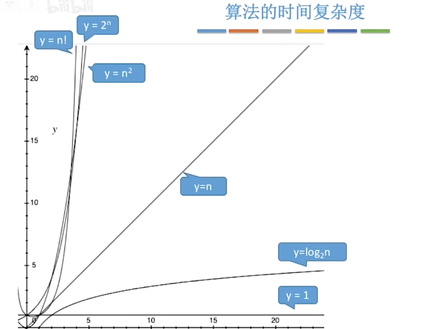
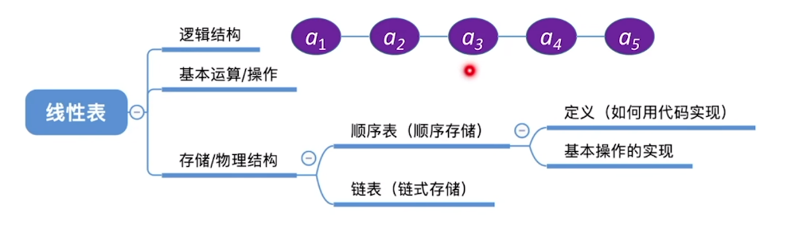
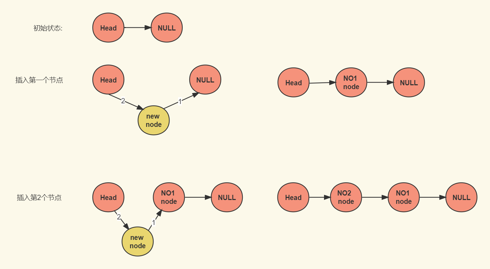
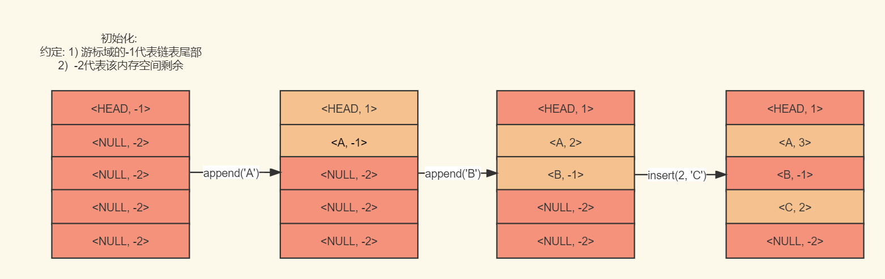
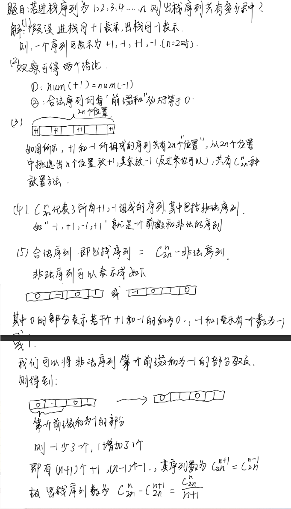

# 数据结构与算法第二版笔记

## 章一: 基本概念

### 1.1 数据的概念

| 概念   | 定义                                 | 其他                                  |
| ---- | ---------------------------------- | ----------------------------------- |
| 数据   | 输入到计算机的字符.                         | 字符是对现实事务的表示                         |
| 数据元素 | 数据元素的名字可以理解成表格的元组, 每一个表头称为数据元素的数据项 |                                     |
| 数据对象 | 数据对象是具有相同性质的数据元素的集合.               | 可理解为一张表, 表中每个行称为数据元素, 整张表, 称为一个数据对象 |
| 数据结构 | 数据元素之间存在着一种或多种特定关系的集合              |                                     |

数据结构强调**数据元素之间的关系**, 数据对象强调**数据元素有相同的属性**


### 1.2  数据结构三要素

> 数据结构 = 数据元素的集合, 表示了数据元素之间的关系
>
> 数据结构 = 逻辑结构 + 存储结构 + 运算

**数据结构的逻辑结构**

| 逻辑结构      | 特点                           |
| --------- | ---------------------------- |
| **线性结构**  | 一对一关系. 除首尾节点外, 每个节点都有前驱和后继节点 |
| **非线性结构** |                              |
| - 集合      | 如数学上的集合. 无序性 + 确认性 + 互异性     |
| - 树       | 一对多                          |
| - 图       | 多对多                          |

**数据结构存储结构**

| 存储结构 | 特点                                       |
| ---- | ---------------------------------------- |
| 顺序存储 | 1) 在内存中相邻存储, 占用连续的内存空间<br /> 2) 插入操作代价大. 占用连续的内存空间大 |
| 链式存储 | 1) 在内存中离散存储. 不占用连续内存空间<br /> 2) 额外的指针保存地址信息. 只能顺序遍历 |
| 索引存储 | 1) 存储时, 额外建立一张关键字和地址的索引表<br /> 2) 占用额外的内存空间<br /> 3) 对数据元素增删时候, 需要对存储表同步 |
| 散列存储 | 1) 通过Hash算法算出关键词的内存地址<br /> 2) 散列冲突      |

**数据结构的运算**

指对数据结构中存储的数据元素进行**创建销毁, 增删改查**的操作

### 1.3 数据类型

> 任何编程语言都有自己的数据类型, 大致分为三类.
> 数据类型定义了数据值的含义和对应的操作

| 数据类型 | 定义                                       | 实例                                       |
| ---- | ---------------------------------------- | ---------------------------------------- |
| 原子类型 | 不可再分的类型. 在编程语言中, 一般称为基本数据类型              | bool, int, float                         |
| 结构类型 | 关注类型之间的组织方式,从属关系. 如JavaScript的Plain Object | {  name: "张三", age: 18, father: { name:"张四", age: 35 }  } |
| 抽象类型 | 对于使用者而言, 只需知道逻辑特性和操作方法.底层实现对使用者透明的       | 封装的数据类, 如String, 不知道底层实现, 但知道它的逻辑特性和操作方法 |


### 1.4 算法的特性

> 算法是求解问题**过程的描述**

| 算法特性  | 概念                                       |
| ----- | ---------------------------------------- |
| 有穷性   | 不能死循环                                    |
| 确定性   | 相同的输入得到相同的输出                             |
| 可行性   | 算法在实际应用中是否能够有效地解决问题，以及在给定资源限制下是否能够在合理的时间内完成计算 |
| 输入/输出 | 至少0个输入, 至少一个输出                           |


### 1.5 时间复杂度

#### 定义

定义: 语句频度"保留高次项, 舍去低次项, 舍去系数, 常数项视为1, 则为算法为时间复杂度. 记作$T(n) = O( f( n ) )$, n为问题规模, f(n)是该算法的核心运算(深层循环语句)的时间复杂度

性质: 

- 加法: 若 $T(n) = T_1(n) +T_2(n) 则  T(n) = Max( T_1(n), T_2(n) )$. 

  - 中文描述: 在相同规模下, 若一个母问题可以拆成若干子问题, 那么母问题的时间复杂度与更大时间复杂度的子问题相同

    - $eg: T(n) = n^3 + n^2 = Max(n^3,n^2) = n^3$

- 乘法: $若T(n) = T_1(n) · T_2(n) = O( f_1( n ) ) · O( f_2( n ) ), 则 T(n) = O( f_1( n ) ) · O( f_2( n ) )  $

  - 不太好用中文描述

    - $eg: T(n) = n * n^2 = O( n^3  )$

####  最好, 最坏, 平均时间复杂度

 题目若无特别声明, 时间复杂度指最坏时间复杂度

**平均时间复杂度**

> 假设每个元素出现的概率为$\frac{1}{n}, 则平均时间复杂度是在求循环次数的数学期望$

Example:  

```cpp
void fun(int n) {
  for(int i = 0; i < n, i++) {
    print("hello,world")
  }
}
```

可得出上述分布列

| 循环第${ i} $次 | 概率            |
| ----------- | ------------- |
| 1           | $\frac{1}{n}$ |
| 2           | $\frac{1}{n}$ |
| 3           | $\frac{1}{n}$ |
| ...         | $\frac{1}{n}$ |

求解上述期望, 即平均时间复杂度: 

 $T(n) = \sum_{i=1}^{n} (i * \frac{1}{n}) = \frac{n(1+n)}{2} * \frac{1}{n} = \frac{n+1}{2} = O(n)$ 

#### 常见时间复杂度

**常见时间复杂度图像**



**常见时间复杂度求解**

**1. 对数级时间复杂度**

```cpp
void fun(int n)
{
  for(int i = 1; i<=n; i*=2 )
  {
    print("hello,world")
  }
}
```

求解过程: 

$观察可知: i = 2^k  , k是循环的轮次 ,   i是索引$

$当i > n时,即2^k > n, 即 k > log_2n 时,  跳出循环, 此时k最大.$

$我们可以将 k = log_2n+1视作在n规模下的语句频度T(n)$

即$T(n) = log_2n+1 = O(log_2n )$

**2. 平方级**

```cpp
void fun(int n)
{
  for(int i = 1; i<=n; i++ )
  {
    for(int j = 1; j<=n; j++ )
  	{
    	print("hello,world1")
        print("hello,world2")
  	}
  }
}
```

求解过程: 

$T(n) = \sum_{i=1}^{n}\sum_{j=1}^{n} 2 = \sum_{i=1}^{n} 2n =2n^2 = O(n^2)$


####  递归函数的时间复杂度

**1. Master定理**

若: 母问题可以分成若干**同等份量**的子问题

其时间复杂度可表示为: $T(n) = a * T(\frac{n}{b}) + O(n^ d) 且 a,b>1$

$其中: a是子问题的个数, T(\frac{n}{b})是每个子问题的时间复杂度  ,\frac{1}{b}为每个子问题的规模占母问题规模的比,  O(n^ d)是除子问题外, 额外的时间复杂度$

则有以下推论

①当$log_b ^a > d $时，时间复杂度为$O(n ^ {log_b ^a} )$
②当$log_b ^a = d $时，时间复杂度为$O(n ^ d * log_n )$
③当$log_b ^a<d $时，时间复杂度为$O(n ^ d )$


Example:

```java
int process(int arr[], int left, int right) {
    if (left == right) {
        return arr[left];
    }
    int mid = left + ((right - left) >> 1);
    int maxLeft = process(arr, left, mid);
    int maxRight = process(arr, mid + 1, right);
    return max(maxLeft, maxRight);
}
```
因为该母问题可分成两个 **同等份量** 的子问题

故可用Master公式表示为: $T(n) = 2 * T(\frac{n}{2}) + O(n^0), 其中a = 2, b=2, d=0 $

又因为$log_ba = 1 > d, 故T(n) = O(n^1) = O(n)$


**2. 递推法**

Example: 

```cpp
int fact(int x){
  if(x <= 1) return 1
  return n * fact(x - 1)
}
```

解: 

首先写出该递归方程时间复杂度的递推式

$T(x) = \left\{\begin{matrix}    O(1), x =1 \\   T(x - 1) + O(1), x> 1     \end{matrix}\right.$

当$x > 1$时, 有: 

$T(x) = T(x - 1) + O(1) = T(x-2) + 2O(1) = T(x-3) + 3O(1) ...$

观察规律可知, $T(x) = T(x - (x-1)) + (n-1)*O(1) = T(1) + (n-1 )*O(1) = n*O(1) = O(n)$


### 1.6 空间复杂度

> 空间复杂度指的是内存空间与问题规模的比, 记作S(n)

Example1: 

```cpp
void func(int a) {
	int b, c, d = 10;
  	if (a == 1) return;
	func(a - 1); 
}
```

解: 

$设递归次数为k, 时间复杂度为S(n)$

$因为int占4字节, 有a,b,c,d四个int变量, 故 则:  S(n) = 16k $

$又因为 k = n , 故 S(n) = 16n = O(n)$


Example2: 

```cpp
void func(int n) {
	int **arr = new int*[n];

	for (int i = 0; i < n; i++) {
		arr[i] = new int[n];
	}
}
```

解:  

$S(n) = 1 * 4 + 4*n * 4*n = 4+16n^2 = O(n^2)$

## 章二: 线性表

### 2.1 线性表的概念



1) 线性表指 有 n 个**相同数据类型**的元素的有限序列. 序列指: 逻辑相邻排列的元素

2) 位序: 线性表中第$i$个元素, 等于索引 + 1

3) 线性表与 "table"的关系, table的每一行可看做一个节点, 行与行之间逻辑上按顺序排列( 逻辑结构是one by one的, 但存储结构未必 )


### 2.2 线性表的存储结构一 -- 顺序表

> 线性表指数据元素在逻辑相邻, 顺序表指 **逻辑相邻且存储相邻**

#### 顺序表操作

定义结构体和基本操作

```cpp
#define DEFAULT_SIZE  10

typedef struct {
	int* arr = new int[DEFAULT_SIZE];
	int length = 0;
	int size = DEFAULT_SIZE;
} SQList;


bool isValidIndex(SQList& L, int index) {
	return index >= 0 && index < L.length;
}

bool isEmpty(SQList& L) {
	return L.length <= 0;
}

bool isFull(SQList& L) {
	return L.length >= L.size;
}
```

时间复杂度分析:`` isValidIndex, isEmpty,isFull ``三个函数的时间复杂度均为$O(1)$


插入

```cpp
bool insertElement(SQList& L, int index, int ele) {
	if (index < 0 || index > L.length || isFull(L)) return false;

	for (int i = L.length - 1; i >= index; i--) 
		L.arr[i + 1] = L.arr[i];

	L.arr[index] = ele;
	L.length++;
	return true;
}
```

时间复杂度分析:

$T(n) = \sum_{i = index}^{length - 1} 1, 其中 length为问题规模n, 即  T(n) = \sum_{i = index}^{n- 1} 1$

$1) 最好时间复杂度: 即index = n - 1时, T(n) = \sum_{i = n - 1}^{n- 1} 1 = O (1)$

$2) 最坏时间复杂度: 即index =0时, T(n) = \sum_{i = 0}^{n- 1} 1 = n =  O (n)$ 

$3) 平均时间复杂度: $ 

| 插入索引为$i$的位置 | 循环次数$k$     | 概率             |
| ----------- | ----------- | -------------- |
| 0           | n           | $\frac{1}{n }$ |
| 1           | n - 1       | $\frac{1}{n}$  |
| 2           | n - 2       | $\frac{1}{n}$  |
| ...         | ...         | $\frac{1}{n}$  |
| n - 1       | n - ( n-1 ) | $\frac{1}{n}$  |
| n           | 0           | $\frac{1}{n}$  |

即 $平均时间复杂度 = \sum_{k = 0}^{n} k * \frac{1}{n} = \frac{(n + 1)(0 + n)}{2} * \frac{1}{n} = O(n) $


删除( 要求用变量记录删除的值) 

```cpp
bool deleteElement(SQList& L, int index, int& result) {
	if (!isValidIndex(L,index) || isEmpty(L)) return false;

	result = L.arr[index];

	for (; index < L.length; index++)
		L.arr[index] = L.arr[index + 1];

	L.length--;
	return true;
};
```

时间复杂度分析: 与插入操作的分析完全一致


查找

```cpp
// 按值查找, 返回下标(找不到返回-1)
int getByValue(SQList& L, int value) {
	for (int i = 0; i < L.length - 1; i++)
		if (L.arr[i] == value) return i;
	return -1;
}

// 按索引查找, 返回指针(找不到返回空指针)
int* getByIndex(SQList& L, int index) {
    if (!isValidIndex(L, index)) {
        return nullptr; // 返回空指针表示查找不到
    }
    return &L.arr[index]; // 返回指向元素的指针
}
```

时间复杂度分析: 与查找类似, 不再记录


结论: 顺序表的**插入, 删除, 值查找效率较低为O(n)**, **索引查找效率较高为0(1)**

#### 稀疏数组与三元组

> 稀疏数组指一个二维数组中存储大量无效元素. 三元组是其精简表示

```cpp
int sparse_arr[4][4] = {
  {1,0,0,0},
  {0,0,0,1},
  {1,0,0,0},
  {0,1,0,0},
};

int triple_arr[5][3] = {
  // [行号, 列号]
  {4,4}, //约定第一行为记录总行数和总列数(元信息)
  {1,1},
  {2,4},
  {3,1},
  {4,2}
};
```

### 2.2 线性表的存储结构二 --链表

> 线性表指数据元素在逻辑相邻, 链表指**逻辑相邻且存储不相邻**

#### 单链表

**不带头结点的单链表**

```cpp
#include <iostream>
using namespace std;

struct Node {
	string data;
	Node* next;

	Node(string _data, Node* _next) :data(_data), next(_next) {}
};
typedef Node* LinkList; // 并非用所有节点表示一个链表, 用第一个节点表示一个链表 

bool isEmpty(LinkList& L) {
	return L == nullptr; // 不带头结点的判空条件
}

int main() {
	LinkList L = nullptr; // 用空指针代表链表为空
	cout << isEmpty(L);

	return 0;
}
```


**带头结点的单链表**

```cpp
#include <iostream>
using namespace std;

struct Node {
	string data;
	Node* next;

	Node(string _data, Node* _next) :data(_data), next(_next) {}
};

struct LinkList {
	Node* head;

	LinkList() : head(new Node("", nullptr)) {} //头节点即一个没有data域, 但有指针域的Node节点
};

bool isEmpty(LinkList& L) {
	return L.head->next == nullptr; // 带头结点的判空条件
}

int main() {
	LinkList L; 
	cout << isEmpty(L);

	return 0;
}
```


**头插法**




```cpp
LinkList head_insert(LinkList& L, string data) {
	Node* node = new Node(data, nullptr); // 创建新节点

	node->next = L->next; // 新节点指向头结点的下个节点
	L->next = node; // 头结点指向新节点

	return L;
}

int main() {
	LinkList L = new Node("", nullptr); // 创建链表( 头结点 )

	head_insert(L, "1");
	head_insert(L, "2");
	head_insert(L, "3");

	print_link_list(L); // 输出3,2,1. 头插法插入的顺序和数据的顺序是相反的

	return 0;
}
```


**尾插法**

> 尾插法要求链表中有一个指向最后节点的尾指针

```cpp
#include <iostream>
using namespace std;

struct Node {
	string data;
	Node* next;

	Node(string _data, Node* _next) :data(_data), next(_next) {}
};

struct LinkList {
	Node* tail;
	Node* head; // 带头指针, 也可以不带, 让head指向第一个节点即可

	LinkList() :tail(nullptr), head(new Node("", nullptr)) {}
};

LinkList tail_insert(LinkList& L, string data) {
	Node* node = new Node(data, nullptr);

	if (L.tail) {
		L.tail->next = node;
		L.tail = node; // 移动尾指针
	}
	else {
		L.head->next = L.tail = node;
	}

	return L;
}

void print_link_list(LinkList& L) {
	Node* p = L.head->next;

	while (p) {
		cout << p->data << endl;
		p = p->next;
	}
}

int main() {
	LinkList L; // 用空指针代表链表为空

	tail_insert(L, "A");
	tail_insert(L, "B");
	tail_insert(L, "C");
	tail_insert(L, "D");

	print_link_list(L);

	return 0;
}
```


**按序号查找**

> 这里写的是按位序查找, 也可以根据索引查找.

```cpp
Node* get_element(LinkList& L, int i) {
	if (i < 1) return nullptr;

	int count = 1;
	Node* p = L.head->next; // 默认指向第一个节点

	while (p && count < i) {
		count++;
		p = p->next;
	}

	return p;
};
```


**按值查找**

```cpp
Node* get_element(LinkList& L, string data) {
	Node* p = L.head->next;

	while (p && p->data != data) // 未到最后节点, 并且当前节点值不相等
		p = p->next;

	return p;
};
```


**前插法**（Front Insertion）

>  前插法是指将新节点插入到指定位置的前面


实现一: **前插转后插** 对$i$位置的前插等于对 $i -1$ 位置(前驱节点)的后插法

```cpp
LinkList front_insert(LinkList& L, string data, int i) {
	if (i < 1) return L;
  
	Node* node = new Node(data, nullptr);
	Node* precursor = get_element(L, i - 1); // 按位序查找i的前驱节点

	node->next = precursor->next; // 新节点指向前驱的下一个节点
	precursor->next = node; // 前驱节点指向新节点
};
```


实现二: **后插转前插** , 对$i$位置后插, 然后交换老$i$节点和$i + 1$节点的数据域. 实际上是后插法, 但逻辑上是前插法

```cpp
LinkList front_insert(LinkList& L, string data, int i) {
	if (i < 1) return L;

	Node* p = get_element(L, i); // 寻找第i个节点
	Node* node = new Node(data, nullptr);

	node->next = p->next; 
	p->next = node; // 第i个节点 --> 新节点

	string temp = p->data; // 交换第i个节点和新节点的数据.
	p->data = node->data;
	node->data = temp;
};
```


**删除节点**

方法一: 用前驱节点删除

```cpp
Node* delete_node(LinkList& L, int i) {
	if (i <= 0) return nullptr;

	Node* precursor = get_element(L, i - 1); // 寻找前驱节点
	Node* temp_node = precursor->next; // 保存删除节点

	precursor->next = precursor->next->next; // 用前驱节点删除

	return temp_node;
}
```

方法二: 用后继节点删除

```cpp
Node* delete_node(LinkList& L, int i) {
	if (i <= 0) return nullptr;

	Node* node = get_element(L, i); // 寻找删除节点
	Node* successor = node->next; // 后继节点

	string temp = node->data;// 交换后继节点与待删除节点的值
	node->data = successor->data;
	successor->data = temp;

	node->next = successor->next; // 执行删除操作

	return successor;
}
```


#### 双链表

**双链表结构**

```cpp
typedef struct Node {
	Node* prior, * next; // 节点的前驱和后继节点
	string data; // 数据域
	Node(Node* _prior, Node* _next, string _data) :prior(_prior), next(_next), data(_data) {}
} *LinkList;
```


**前插法**

tips: 为了专注核心逻辑, 没有处理空指针异常的情况, 所以跑不通所有的case.

1) 前插转后插

```cpp
LinkList front_insert(LinkList& L, int i, string data) {
	if (i < 1) return L;         // 位序的合法性判断

	Node* node = new Node(nullptr, nullptr, data);

	if (i == 1) {              // 边缘case: 插入最前方
		node->next = L;
		L->prior = node;
		return node;
	}

	Node* prior = get_element(L, i - 1); // 寻找前驱节点

	node->next = prior->next; //  [new]   -->  [i]
	prior->next->prior = node;//  [new]   <--  [i]
	prior->next = node;       //  [prior] --> [new]
	node->prior = prior;      //  [prior] <-- [new]

	return L;
}
```


2) 后插转前插

```cpp
LinkList front_insert(LinkList& L, int i, string data) {
	if (i < 1) return L;         // 位序的合法性判断

	Node* node = new Node(nullptr, nullptr, data);

	//if (i == 1) {              // 边缘case: 插入最前方
	//	node->next = L;
	//	L->prior = node;
	//	return node;
	//}

	Node* s = get_element(L, i); // 寻找i节点
	
	node->next = s->next;  //[new] --> [successor]
	s->next->prior = node; //[new] <-- [successor]
	s->next = node;        // [i]  -->  [new]
	node->prior = s;       // [i]  <--  [new]
	
	string temp = s->data; //交换数据
	s->data = node->data;
	node->data = temp;
	return L;
}

int main() {
	// 测试代码
	LinkList L = new Node(nullptr,nullptr,"A");

	L = front_insert(L,1,"1"); // 1A
	L = front_insert(L, 1, "B"); // B1A
	L = front_insert(L, 2, "2"); // B21A

	print_link_list(L);
	return 0;
}
```

**删除**

```cpp
Node* delete_node(LinkList& L, int i) {
	if (i < 1)return nullptr;

	Node* s = get_element(L, i);

	s->prior->next = s->next; // [前驱] --> [后继]
	s->next->prior = s->prior;// [前驱] <-- [后继]
	
	return s;
};
```


#### 循环链表

**结构体**

**结构体**

```cpp
struct Node {
  Node* next;
  string data;

  Node(string _data, Node* _next) :data(_data), next(_next) {}
};

// 仅用一根尾指针: 循环链表可以仅用一根尾指针, 头指针用"尾指针.next"表示, 这里为了清晰, 同时显示的声明了头指针 
struct RingLinkList {
  Node* tail;
  Node* head; // 第一个节点: 这里的头结点指的是顺序添加的第一个节点, 而非无data域的头结点

  RingLinkList() :tail(nullptr), head(nullptr) {}
};
```


**判断循环链表是否为空**

头结点的两种定义 

1. **第一个节点** : 按顺序插入的第一个链表元素, 
2. **无数据域**:  没有数据域, 只有指针域的结点

判断空循环链表的条件

1. **对于定义一**:  判空的条件是首尾指针都为空
2. **对于定义二**:  尾指针下一个节点为head头结点


**添加节点: 尾插法**

```cpp
void front_insert(RingLinkList& L, string data) {
  Node* node = new Node(data, nullptr);

  if (!L.head && !L.tail) { // 边缘case: 空链表
    L.head = L.tail = node;
    L.tail->next = node;
    return;
  }

  node->next = L.head; // 1. 指向头结点: 新节点变成尾结点, 指向头结点
  L.tail->next = node; // 2. 指向新节点: 原本的尾节点指向新节点
  L.tail = node;       // 3. 移动尾指针
}
```


**删除**

```cpp
/*
	查找节点: 循环链表很难说这是第几个节点, 这里按照位序查找不太合适, 所以使用按值查找的方法
	后继删除法: 由于按值查找获取不到单链表的前驱节点, 不能用前驱删除法, 故而使用后继删除法
*/
void delete_node(RingLinkList& L, string data) {
  if (!L.head || !L.tail) { // 边缘case1: 删除的空表
    return;
  }

  Node* node = get_element(data);

  if (L.head == node) { // 边缘case2: 删除的是头结点
    L.tail->next = L.head->next;
    L.head = L.head->next;
    return;
  }

  string temp = node->next->data;
  node->data = node->next->data;
  node->next->data = temp;

  node->next = node->next->next;

  // 最后一个判断有点问题, 暂时不想改了先放这里, 这样删除的话, 虽然可以继续成环, 但删除的是尾指针结点, 头指针却动了不合适
  if (L.tail == node) { // 边缘case3: 删除的是尾节点. 
    L.head = L.head->next;
  }
}
```


#### 静态链表

**静态链表的特点**

1) **数组存储:** 用数组存储链表节点

2) **游标:** 用于指向下一个节点, 保存的是下一个节点的下标. 约定: -1为链表尾部, -2代表当前空间无节点 



静态链表代码( 注: 没有实现删除操作, 可以自己实现 )

```cpp
#include <iostream>
using namespace std;

#define MAX_SIZE 10

struct Node {
  int next; //游标, 用数组下标代替next指针
  string data;

  Node() :data(""), next(-2) {} // 默认构造, ""代表无数据, -2代表这块内存还未被占用
  Node(string data, int next) :data(data), next(next) {}
};

struct StaticLinkList {
  Node* nodes;
  int size;

  StaticLinkList() {
    nodes = new Node[MAX_SIZE];
    size = 0;
    nodes[0].next = -1; // 第一个位置存头结点, 默认指向-1, -1代表到链表尾部了

  }

  bool isFull() {
    return size == MAX_SIZE - 1; // 需要额外一个节点存储头结点
  }

  bool isEmpty() {
    return size == 0;
  }

  int find_rest_space() {
    if (isFull()) return -1; // 返回-1代表数组内没有剩余空间

    for (int i = 1; i < MAX_SIZE; i++) {
      if (nodes[i].next == -2) return i;
    }

    return -1;
  }

  int find_node(int i) {
    if (isEmpty()) return -1; //空链表
    if (i < 1 || i > size) return -1; // 位序越界

    // 遍历链表, 在遍历的过程中计数, 如果计数到i - 1, 即i的前一个节点, 返回i节点存储的next, 即i的数组下标
    int curor = 0;
    int count = 0;
    while (nodes[curor].next != -1 && count < i) {
      curor = nodes[curor].next;
      count++;

      if (count == i - 1) {
        return nodes[curor].next;
      }
    }
    return -1;
  }

  void append_node(string data) {
    if (isFull()) return;

    // 查找数组剩余空间, 返回剩余空间的下标
    int i = find_rest_space();
    // 添加新节点, 并且将新节点的next置为-1, 表示该节点是静态链表的尾部
    nodes[i].data = data;
    nodes[i].next = -1;

    // 顺着游标记录的方向, 寻找原链表尾部
    int cursor = 0;
    while (nodes[cursor].next != -1) {
      cursor = nodes[cursor].next;
    }
    // 修改原尾部链表的游标, 指向最新的尾部节点
    nodes[cursor].next = i;
    size++;
  }

  void insert_node(int i, string data) {
    if (isFull()) return; // 满链表不允许插入
    if (i < 1 || i > size + 1) return; // 合法位序应该在[1, size+1]

    int index = find_rest_space();
    nodes[index].data = data;

    // 插入第一个节点, 更改头结点, 并让新节点指向第二个节点
    if (i == 1) {
      nodes[index].next = nodes[0].next;
      nodes[0].next = index;
      size++;
      return;
    }

    // 插入非首节点
    int prior = find_node(i - 1);
    nodes[index].next = nodes[prior].next;
    nodes[prior].next = index;
    size++;
  }

  void print() {
    int cursor = 0;
    while (nodes[cursor].next != -1) {
      cursor = nodes[cursor].next;
      cout << nodes[cursor].data << endl;
    }
  }

  ~StaticLinkList() {
    if (nodes) {
      delete[] nodes;
    }
  }
};

int main() {
  StaticLinkList L;
  L.append_node("A");
  L.append_node("B");
  L.append_node("C");
  L.append_node("D");
  L.insert_node(1, "E");
  L.insert_node(3, "F");
  L.insert_node(7, "G");

  L.print();
}

```


### 2.3 线性表例题

#### 两数之和( 顺序表 )

**题干:** 

给定一个整数数组 `nums` 和一个整数目标值 `target`，请你在该数组中找出 **和为目标值 ***target* 的那 **两个** 整数，并返回它们的数组下标。

你可以假设每种输入只会对应一个答案。但是，数组中同一个元素在答案里不能重复出现。

你可以按任意顺序返回答案。

**示例**

```cpp
输入：nums = [2,7,11,15], target = 9
输出：[0,1]
解释：因为 nums[0] + nums[1] == 9 ，返回 [0, 1] 。
```

**解答: **

```cpp
class Solution {
  public:
  vector<int> twoSum(vector<int>& nums, int target) {
    map<int, int> m; // 使用hash表存放{ 差值: 下标 }
    vector<int> res;
    int dis;
    
    for(int i = 0; i < nums.size(); i++){
      dis = target - nums[i]; // 求出差值

      if(m.find(nums[i]) != m.end()){ // 如果差值表中有该元素, 则证明当前元素是另一个数的差值
        res.push_back(i);
        res.push_back(m[nums[i]]);
        return res;
      }

      m[dis] = i; // 存当前元素的差值
    }

    return res;
  }
};
```


#### 合并有序链表( 单向链表 )

> 本题考察尾插法, 尾插法需要一个原指针

题干: 

将两个升序链表合并为一个新的 **升序** 链表并返回。新链表是通过拼接给定的两个链表的所有节点组成的。 

示例: 

```cpp
输入：l1 = [1,2,4], l2 = [1,3,4]
输出：[1,1,2,3,4,4]
```

解答:

```cpp
    /**
    * Definition for singly-linked list.
    * struct ListNode {
    *     int val;
    *     ListNode *next;
    *     ListNode() : val(0), next(nullptr) {}
    *     ListNode(int x) : val(x), next(nullptr) {}
    *     ListNode(int x, ListNode *next) : val(x), next(next) {}
    * };
    */
    class Solution {
    public:
        ListNode* mergeTwoLists(ListNode* list1, ListNode* list2) {
            ListNode* head = new ListNode(); // 申请新链表
            ListNode* tail = head; // 新链表的尾结点, 采用尾插法插入新节点

            while(list1 != nullptr && list2 != nullptr){
                if(list1->val <= list2->val){
                    tail->next = new ListNode(list1->val,nullptr);
                    list1 = list1->next;   
                }else {
                    tail->next = new ListNode(list2->val,nullptr);
                    list2 = list2->next;
                }
                tail = tail->next;
            }
            // 找出剩余的链表
            tail->next = list1? list1: list2;

            ListNode* result = head->next;
            delete head;  // 释放虚拟头节点的内存
            return result;
        }
    };
```


#### 反转链表( 单向链表 )

> 本题考察头插法, 头插法与原顺序是相反的

题干: 
给你单链表的头节点 head ，请你反转链表，并返回反转后的链表。

例子: 

```cpp
输入：head = [1,2,3,4,5]

输出：[5,4,3,2,1]
```
解答: 
```cpp
/**
 * Definition for singly-linked list.
 * struct ListNode {
 *     int val;
 *     ListNode *next;
 *     ListNode() : val(0), next(nullptr) {}
 *     ListNode(int x) : val(x), next(nullptr) {}
 *     ListNode(int x, ListNode *next) : val(x), next(next) {}
 * };
 */
class Solution {
public:
    ListNode* reverseList(ListNode* head) {
        ListNode* new_head = new ListNode();
        ListNode* new_node = nullptr;
        
        while(head){
            new_node = new ListNode(head->val); // 创建新节点
            new_node->next = new_head->next;  // 新节点指向head的下一个节点
            new_head->next = new_node;  // head节点指向新节点. 即头插法
            
            head = head->next;
        }

        ListNode* result = new_head->next; // 保存链表
        delete new_head; // 释放head空间
        return result;
    }
};
```

#### 回文链表( 快慢指针, 递归 )
题干: 
给你一个单链表的头节点 head ，请你判断该链表是否为回文链表。如果是，返回 true ；否则，返回 false 。

示例: 
```cpp
输入：head = [1,2,2,1]
输出：true
```

解题:

快慢指针法: 

```cpp
/**
 * Definition for singly-linked list.
 * struct ListNode {
 *     int val;
 *     ListNode *next;
 *     ListNode() : val(0), next(nullptr) {}
 *     ListNode(int x) : val(x), next(nullptr) {}
 *     ListNode(int x, ListNode *next) : val(x), next(next) {}
 * };
 */
class Solution {
public:
    bool isPalindrome(ListNode* head) {
        if(!head) return false;

        ListNode* fast = head;
        ListNode* low = head;

        // 快慢指针: 快指针一次移动两步, 慢指针一次移动一步
        // 当运行完循环的时候: 
        //      1. 若原链表是偶数个: 如图: [0, 0, low, 0], low后所有的节点为后半个链表
        //      2. 若原链表是奇数个: 如图: [0, 0, low ,0, 0], low刚还运行到链表中点
        while(fast && fast->next){
            low = low->next;
            fast = fast->next->next;
        }

        ListNode* new_head = reverseList(low); // 得到后半截链表
        // 翻转后半截链表后和原链表逐个对比
        while(new_head){
            if(new_head->val != head->val){
                return false;
            }
            head = head->next;
            new_head = new_head->next;
        }

        return true;

    }
    // 翻转链表
    ListNode* reverseList(ListNode* head) {
        ListNode* new_head = new ListNode();
        ListNode* new_node = nullptr;
        
        while(head){
            new_node = new ListNode(head->val); // 创建新节点
            new_node->next = new_head->next;  // 新节点指向head的下一个节点
            new_head->next = new_node;  // head节点指向新节点. 即头插法
            
            head = head->next;
        }

        ListNode* result = new_head->next; // 保存链表
        delete new_head; // 释放head空间
        return result;
    }
};
```


**递归法( 较难 ) : **

```cpp
/**
 * Definition for singly-linked list.
 * struct ListNode {
 *     int val;
 *     ListNode *next;
 *     ListNode() : val(0), next(nullptr) {}
 *     ListNode(int x) : val(x), next(nullptr) {}
 *     ListNode(int x, ListNode *next) : val(x), next(next) {}
 * };
 */
class Solution {
public:
    bool isPalindrome(ListNode* head) {
       return dfs(head, head);
    };

    bool dfs(ListNode* current,ListNode*& head){
        // 一直递归到最后一个节点
        if(current == nullptr){ 
            return true;
        }

       // 拿到上一次对比的结果
        bool prev_result = dfs(current->next, head);
       
        // 若上一次对比的是相等的, 且本次对比也是相等的, 则返回本次的结果;
        if(prev_result && current->val == head->val){
            head = head->next;
            return true;
        }
        return false;
    }
};
```


#### 环形链表( 循环链表, 快慢指针 ) 

题干: 
给你一个链表的头节点 head ，判断链表中是否有环。

如果链表中有某个节点，可以通过连续跟踪 next 指针再次到达，则链表中存在环。 为了表示给定链表中的环，评测系统内部使用整数 pos 来表示链表尾连接到链表中的位置（索引从 0 开始）。注意：pos 不作为参数进行传递 。仅仅是为了标识链表的实际情况。

如果链表中存在环 ，则返回 true 。 否则，返回 false 。

解题: 
```cpp
/**
 * Definition for singly-linked list.
 * struct ListNode {
 *     int val;
 *     ListNode *next;
 *     ListNode(int x) : val(x), next(NULL) {}
 * };
 */
class Solution {
public:
    bool hasCycle(ListNode *head) {
        ListNode* fast = head;
        ListNode* low = head;

        while(fast && fast->next){
            fast = fast->next->next;
            low = low->next;

            // 若快指针追上了慢指针则证明有环, 退出程序, 返回true
            if(fast == low){
                return true;
            }
        }
        // 能退出循环则证明不是环形链表
        return false;
    }
};
```

#### 相交链表( 链表的遍历, 数学证明, 额外的空间记录 )
题干: 
给你两个单链表的头节点 headA 和 headB ，请你找出并返回两个单链表相交的起始节点。如果两个链表不存在相交节点，返回 null 。


解题:

**数学证明法**

解题思路: 

	    设有x个节点相交. A链表有A个节点, B链表有B个节点.
	    则: A链表有 `A - x个`不相交节点, B链表有`B - x`不相交节点, 其中`x >= 0`, 当`x = 0时, 两链表不相交`
	
	    此时两个链表的节点总数S(相交的部分只记一份)为 A链表的个数 + B链表减去相交部分的节点数 或者 B链表的个数 + A链表减去相交部分的节点数. 故有
		S = A + (B - x) = B + (A - x). 当 x = 0时两链表不相交
		
	 	A + (B - x)可以描述成: "遍历完A链表, 再遍历B中不相交的部分"
	 	B + (A - x)可以描述成: "遍历完B链表, 再遍历A中不相交的部分"
	 	由于两者都等于S, 
	 	所以当有相交节点时,指针走的步数是相同的,遍历完后的指针的指向是相同的.


```cpp
/**
 * Definition for singly-linked list.
 * struct ListNode {
 *     int val;
 *     ListNode *next;
 *     ListNode(int x) : val(x), next(NULL) {}
 * };
 */
class Solution {
public:
    ListNode *getIntersectionNode(ListNode *headA, ListNode *headB) {
        // 两根遍历指针.
        // A指针遍历完B链表后, 还要遍历B中不相交的的部分
        // B指针遍历完A链表后, 还要遍历A中不相交的的部分
        ListNode* A = headA;
        ListNode* B = headB;

        // A == B 只有两种情况
        //  1: 遍历了S后, 不相交, A = B = null
        //  2: 遍历了S后, 相交, A = B = 初始相交节点 
        while(A != B){
            A = A? A->next : headB;
            B = B? B->next : headA;
        }

        return B;
    }
};
```

**记录法**: 

解题思路: 思路: 先跑一遍任一链表, 只做存储, 再跑另一个链表, 只做查询. 查询的到返回节点, 查询不到返回null

```cpp
ListNode* getIntersectionNode(ListNode* headA, ListNode* headB) {
    if (!headA || !headB) return NULL; // 如果有链表不存在, 没有相交点
    if (headA == headB) return headA; // 如果为同一条链表, 则第一个点是相交点

    std::unordered_set<ListNode*> node_set;
    ListNode* temp = headA;
    while (temp) {
        node_set.insert(temp);
        temp = temp->next;
    }

    temp = headB;
    while (temp) {
        if (node_set.count(temp)) {
            return temp;
        }
        temp = temp->next;
    }

    return NULL;
}
```


## 章三: 栈, 队列和数组

### 3.1 栈

#### 卡特兰数

**1. 组合数学基础：**

- **排列（Permutation）**：排列是指从一组元素中取出若干个元素，形成**一个有序的**序列。例如，从1、2、3中取出两个元素的排列有(1, 2)、(2, 1)、(1, 3)、(3, 1)、(2, 3)、(3, 2)等6种排列方式。
- **组合（Combination）**：组合是指从一组元素中选择若干个元素，形成一个**无序的**组合。例如，从1、2、3中选择两个元素的组合有{1, 2}、{1, 3}、{2, 3}等3种组合方式。
- **组合数（Combination Number）**：组合数表示从n个元素中选择k个元素, 有多少组合可能性，通常表示为C(n, k)，也叫做**二项系数**。它的计算公式为：$ C(n, k) = \frac{n!}{k!(n-k)!}$ ，其中n! 表示n的阶乘。如从10个元素中, 挑出2个元素共有$C(10, 2) = \frac{10!}{2!(10-2)!} $种组合 

2. 卡特兰数与出栈序列

   


