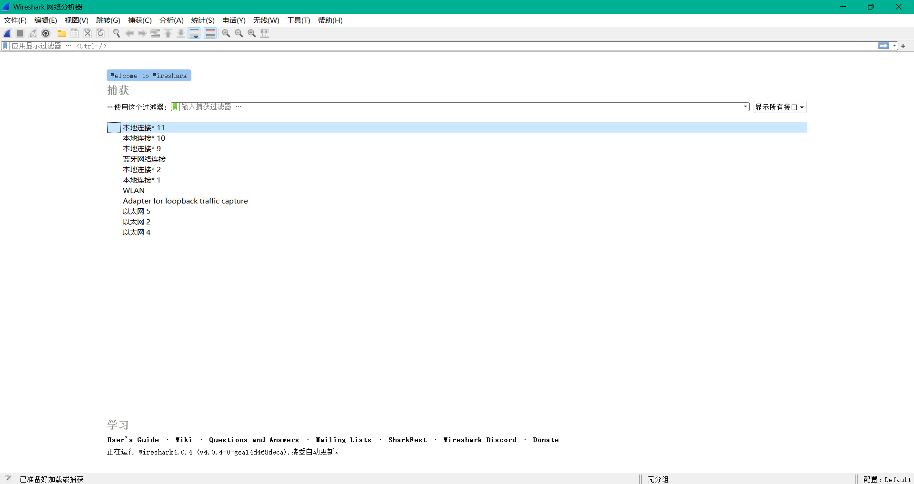
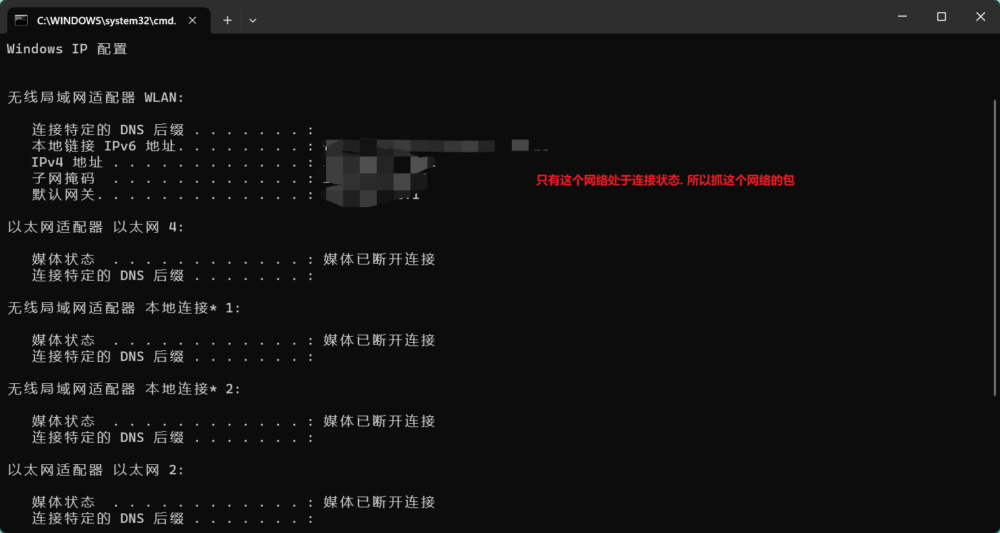
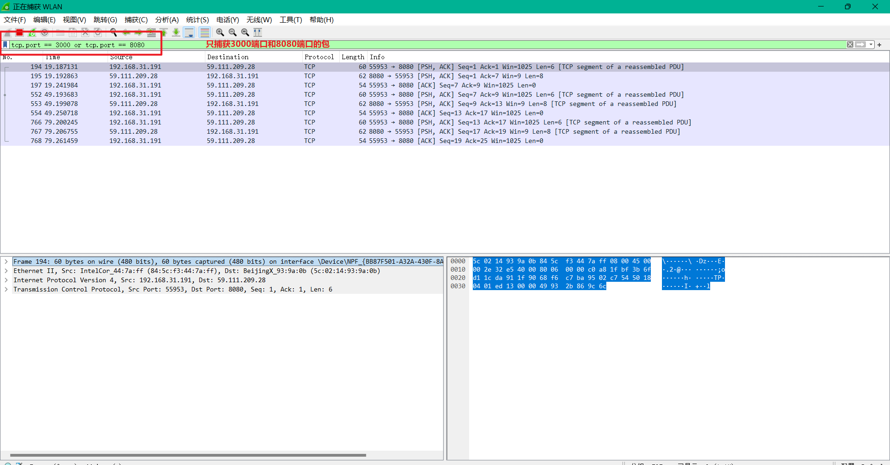
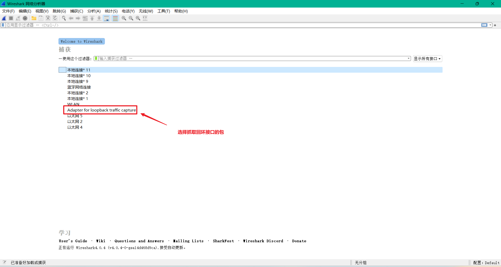
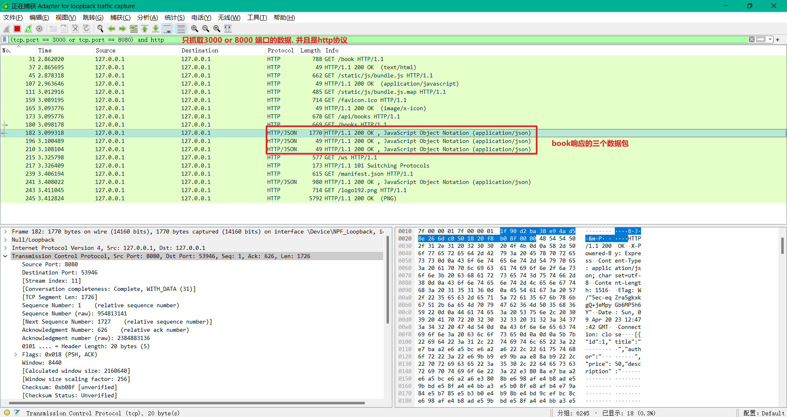
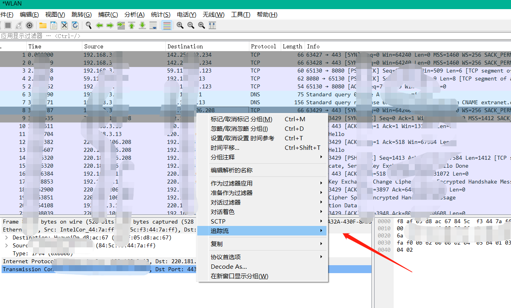
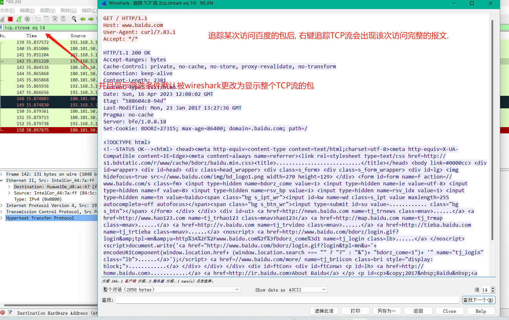

# WireShark

## Wireshark欢迎页

## 确定抓包的网络

> 运行 --> cmd --> 输入ipconfig 查看正在活动的网络

## 开启混杂抓包模式

> 混杂抓包模式更强大, 建议开启

> 捕获选项卡 --> 选项 --> 开启混杂模式

## 捕获过滤

通过ip过滤包

> ip.addr == xxx 代表抓取请求发送方或者请求接受方为xxx的包
>
> ip.src_host == 192.0.0.1 代表只抓取请求发送方为192.0.0.1的包
>
> ip.dst_host == 118.2.1.2 代表只抓取接受方为118.2.1.2的包

通过tcp过滤包

> tcp.flags.syn == 1 过滤SYN的包
>
> tcp.flags.reset == 1 过滤RST包
>
> tcp.analysis.retransmission 过滤重传包
>
> tcp.analysis.zero_window 零窗口
>
> tcp.port == 3000 代表值抓取tcp链接, 端口为3000的包

通过http过滤包

> http.host == www.baidu.com 通过域名过滤http
>
> http.request.method == "GET" 过滤http get请求
>
> http.response.code == 200 通过状态码过滤http包
>
> http.request.uri.contains "/api" 过滤url中有api路径的http包

通过时间过滤包

> http.time > 0.5 过滤http请求大于0.5ms的包
>
> tcp.time_delta > 0.3 tcp某链接中两次包的数据间隔, 可以用这个分析TCP时间延迟
>
> dns.time > 0.5 dns的查询耗时

## 抓取回环数据

> 比如本地8080接口前端页面请求3000服务器数据. 想抓取这个数据怎么办

## TCP追踪流

> 可以对一个包追踪, 查询所属的会话流.
>
> 比如在检测网络时候, 访问了一次百度, 我们想抓取这个这次百度连接的所有包. 那么我们可以在列表中找到百度链接中的某一个包, 右键追踪TCP流, 可以显示这次http请求完整的报文信息, 包括请求报文和响应报文

右键点击要追踪的数据包

