# 计算机网络

## 章一: 计算机概述

### OSI参考模型

> ISO标准化组织将计算机网络分为以下7层, 即OSI模型, 但实际研究中只研究四层或者五层的模型. 其因应用层/表示层/会话层合并成一层应用层做研究

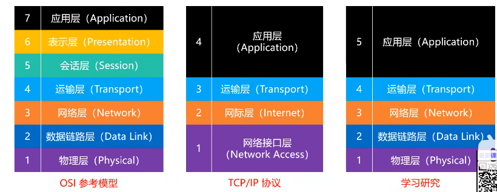

1. **PDU( Protocol Data Unit ): **
   - **定义: **
     - 网络的对等实体传送的讯息单元
     - 层实体之间传送的比特组
   - **不同层之间PDU的名称: **
     - 物理层: 比特( 流 )
     - 数据链路层: 帧
     - 网络层: 数据包 / 分组 / 数据报
     - 传输层: 段( TCP ) / 用户数据报( UDP )
     - 应用层: 消息 / 报文 
2. 服务是功能的子集
   - **本层通过层间接口访问下层的服务, 再通过层间接口向上层提供更好的服务**
3. 原语( primitive )
   - 上层使用下层服务的形式, 高层使用低层提供的服务, 以及底层向高层提供服务都是通过服务访问源语进行交互
   - **个人理解: ** 原语即层间接口


### 各层的核心功能

| **层次** | **核心任务**                                 |
| ------ | ---------------------------------------- |
| 物理层    | 在物理媒介上传输比特流<br />确保数据能够以比特的形式在设备之间传输。    |
| 数据链路层  | 确保相邻节点间可靠地传输数据帧。<br />将比特流组装成帧，提供物理地址（MAC地址）的寻址和数据的传输， |
| 网络层    | 确保数据包从源主机传输到目的主机。<br />实现不同网络之间的数据路由和转发，使用IP地址进行寻址 |
| 传输层    | 建立、维护和终止端到端的连接，确保数据的可靠传输，提供流量控制、差错检测和纠正、顺序控制等功能。 |
| 应用层    | 提供网络服务和应用程序之间的通信，包括各种网络应用，例如Web浏览器、电子邮件、文件传输等。 |

### 计算机网络的功能

计算机网络的功能是在**不同终端之间实现信息交换从而实现资源共享**, 资源共享包括以下三点。

1.硬件资源共享

- **云服务器** 用户可以租用虚拟服务器，这些服务器具有自己的操作系统和计算资源，可用于运行应用程序、托管网站、执行计算任务等。
- **云存储**：云存储服务允许用户存储和管理数据，包括对象存储、文件存储和块存储。用户可以随时访问和操作存储的数据。
- **云计算:**  如调用Chat GPT的接口, 接口允许开发人员将 Chat GPT 集成到他们的应用程序、网站或服务中，从云端访问和利用 GPT-模型的能力。

2.软件资源共享

- **SaaS (Software as a Service, SaaS)**: 是一种云计算服务模型，将软件应用程序以服务形式通过互联网提供给用户。如某后台管理系统编写后部署到公司服务器中, 公司向其他有使用意愿的公司出售租用权. 这些公司不必了解该系统的技术细节, 不需要部署服务器, 便可使用这一软件服务. 

3.信息资源共享

- 如微信公众号, 新浪微博, 知乎等


### 数据交换技术

#### 数据交换概述

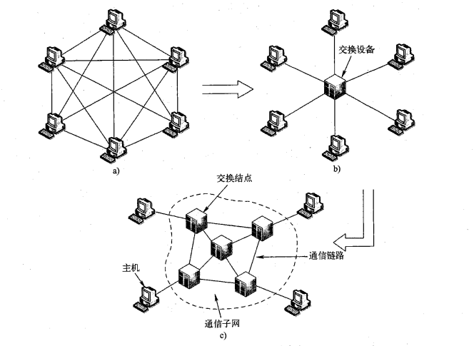

计算机网络的根本目的是在**网络边缘的主机之间**实现**相互的数据传输、信息交换**。

**完全网状网络**:

- **同时通信**: 一个主机为了**同时**与其他主机通信，可以选择**直接连接所有主机**，构成**完全网状网络**，如图a所示。
- **链路数量: **在完全网状网络中，如果主机数为N, 则每个主机需要同时建立(N-1)条链路，整个网络共需要$  \frac{N(N-1)}{2}$条链路。
- **完全网状网络的问题: ** 每增加一个主机, 就要增加(N - 1)条链路, 当网络规模较大（即N较大）时，完全网状网络是不可行的。

**有交换设备的网络**

- **多通信端口:** 交换设备具有多通信端口，可以同时连接多个通信结点（即主机或交换设备)
- **并行通信:** 实现通信端口间物理或逻辑上的动态、并行通信。
- **只需一个链路:** 通过交换设备，每个主机只需一个通信链路与交换设备相连，即可实现与其他主机的通信，如图b所示。
- **有交换设备的网络的问题:** 一个交换设备的**端口数量是有限**的，并且也无法通过一条通信链路直接连接距离遥远的主机或通信设备，因此，只有在特殊情况下，如小规模局域网，才有可能如图b所示利用一个交换设备直接连接所有主机。

**数据交换网络: **

- **数据交换网络:**  将许多**交换设备互连**，构成一个数据中继与转发的“中间网络”，然后再将主机连接到距离较近的交换设备上，主机之间的数据传输通过“中间网络”实现中继与转发。这个"中间网络"称为数据交换网络.
- **数据交换网络的功能: ** 数据交换网络**不关心传输数据的内容**，而只是为数据提供**端到端的数据中继和转发功能**
- **交换节点与网络核心:** 组成交换网络的结点（即交换设备）称为交换结点，交换结点和传输介质的集合称为通信子网，即网络核心. 如图c所示。
- **数据交换技术:** 常见的数据交换技术包括电路交换(circuit switching)、报文交换(message·switching)和分组交换(packet switching)。基于不同交换技术构建的网络分别称之为电路交换网络、报文交换网络和分组交换网络。

#### 电路交换

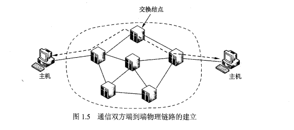

- **电话网络:**  电路交换是最早出现的一种交换方式，距今己有100多年的历史，而**电话网络则是最早、最大的电路交换网络**
- **电路:** 在电路交换网络中, 通过中间交换结点为两台主机之间建立一条专用的通信线路，称为电路. 电路是一种**面向连接**
- **电路交换三个阶段:**
  1.  **建立电路: ** 电路交换网络建立电路分为主机节点到交换节点和交换节点之间链路的建立两部分: 
     1. **主机节点到交换节点的电路的建立:** 即主机节点到最近交换节点的电路的建立,  在电话网络中即通话的两部电话到离自己最近电话交换机的电路.
     2. **交换节点间电路的建立: ** 交换节点之间通过选择和接续, 将端到端的电话机链接起来.
     3. **电路建立时间:** 电路交换的“接续”过程所需时间（电路建立时间)的长短与接续的中间交换结点的个数有关。
  2.  **传输数据: **
     - **独享链路:** 主机节点为了充分利用物理链路的带宽，通常会采用相关的信道复用技术，如频分多路复用、时分多路复用等，将交换结点之间的线路进行信道共享，也就是说在交换结点之间通常包含有“n”条电路，这些电路彼此之间是独立的，每条电路专门为某一对特定主机间的通信服务，而主机到交换结点之间的链路则常为独占的。独享链路的优点是**速率稳定**
     - **透明传输: **中间结点也不对数据进行其他缓冲和处理，不需要添加额外控制信息，即为“透明”传输，因此交换效率高。
  3.  **拆除电路:**
     1. **何时拆除:** 该释放动作可由两个通信主机之间任何一方发起并完成。如电话通信中, 可由任一方挂断电话.
     2. **通知节点:** 释放信号必须传送到电路所经过的各个结点(即所有交换节点和主机节点)，以便重新分配资源。
- **电路交换的优缺点:**
  1. **优点: ** 透明传输 --> 传输速率高, 时延小
  2. **缺点: ** 独享链路 ---> 信道利用率低, 传输速率单一

#### 报文交换

**报文交换的流程**

1. **附加信息生成报文:** 发送方把要发送的信息**附加上发送/接收主机的地址及其他控制信息**，构成一个完整的报文(Message)。发送方组装好报文之后即可向相邻的交换结点发出
2. **检查与存储: **交换结点收到整个报文并且检查无误后，暂时存储报文
3. **转发报文: **交换节点利用路由选择找出需要转发的下一个结点的地址，再把整个报文转发给下一个结点。

**报文交换的特点:** 

1. 报文交换也称为消息交换。
2. **报文交换的节点间时延: ** 一个报文在每个结点的延迟时间，等于在该节点的**处理时延**和**排队时延**。
3. **存储-转发: **然后以报文为单位在交换网络的各结点之间以**存储-转发**的方式传送，直至送达目的主机
4. **无连接: **报文交换不同于电路交换, 它是一个无连接的数据交换技术.  
5. **信道利用率高: **只有当报文被转发时才占用相应的信道，不存在电路交换中通信双方空闲时信道也要被占用的情况。因此，相对电路交换信道而言，报文交换线路利用率高。

**报文交换网络的缺点:** 

1. **时延大:** 交换结点需要缓冲存储, 报文需要排队. 即增加了排队时延和处理时延.
2. **丢弃报文: ** 当交换节点队列满时候, 不得不丢弃报文 

#### 分组交换

**分组交换基本原理**

1. **分组交换的流程:** 

   1.  **分割报文:** 分组交换需要将待传输数据（即报文）分割成较小的数据块
   2.  **附加信息: **每个数据块附加上地址、序号等控制信息构成数据分组(packet),每个分组独立传输到目的地，目的地将收到的分组重新组装，还原为报文。
   3. **存储-转发: **分组传输过程通常也采用存储转发交换方式。
   4. **重组报文: **当所有的分组到达对端后, 主机会根据分组的序号将分组重组成报文, 并交付给上层应用进程.

2. **分组交换的特点: **

   1. **最广泛: ** 分组交换是计算机网络使用最广泛的一种数据交换技术，现代计算机网络几乎都是分组交换网络。
   2. **有限的分组长度:** 它将一个完整报文拆分成若干个分组，每个分组的长度有一个上限，**有限长度的分组使得每个结点所需的存储能力降低**，分组可以存储到内存中，提高了交换速度。

3. **分组交换的优点**

   1. **交换设备存储容量要求低**

      - 作为存储一转发交换方式，报文交换需要缓存整个报文，当报文很大时，要求报文交换设备具有很大的存储容量；分组交换将大报文拆分为较短的分组进行传输。理论上讲，分组交换设备只要能缓存一个小分组，网络就可以工作。

   2. **交换速度快**

      - 由于报文被分割成更小的分组, 所以在交换节点中的交换速度更快

   3. **传输效率高**

      - 对于传输过程出错的数据，纠正错误的最常见措施是请求发送方**重新发送出错的数据**，直到接收端接收到正确的数据为止。


      - 对于报文交换, 出错时需要重传整个报文, 而分组交换只用重传出错的分组. 故而效率高

   4. **更加公平**

      - 交换节点中若链路出现拥塞, 数据的传输需要排队.  
      - 报文交换可能会出现, 大报文持续占用链路, 从而小报文需要更长的时间才能到达目的地的情况. 分组交换由于将报文分割成更小的分组, 在单位分组的角度上, 每个报文的传输更加公平

#### 数据报网络和虚电路网络

> 数据报网络和虚电路网络是两种不同"分组交换网络"

**数据报网络: **

 	1. **概念:** 分组交换网络中按照**目的主机地址进行路由选择(转发)**的网络称为数据报网络。

2. **因特网:** 因特网的IP都是按照目的地址进行路由选择的，因此**因特网是一个数据报网络**。
3. **无连接的:** 数据报网络提供"无连接的"服务, 无连接的发送方和接收方之间不存在固定的连接（或路径），所以发送的分组和接收的分组次序不一定相同，每个分组被传送的路径也可能不一致。

**虚电路网络: **

- **虚电路的构成: **
  1. **路径:** 从源主机到目的主机之间的一条路径（即一系列的链路和分组交换机)
  2. **VCID:**通讯路径中的**每段链路对应的虚电路都有虚电路号**，称为虚电路标识(VCID),  沿某条虚电路传输的分组中包含所属虚电路的VCID
  3. **转发表:** 该路径上每台分组交换机的转发表中记录虚电路标识的接续关系。


- **虚电路的特性: **
  1. **有序传输:** 由于虚电路确定了一条从源到目的的路径，因此沿同一条虚电路顺序传输的系列分组，一定可以按同样的顺序到达目的（丢失除外），也就是说，虚电路网络**可以保证分组传输顺序**，接收端**无须对分组重新排序**。
  2. **可靠传输:** 虚电路网络通常**由网络本身完成可靠传输的功能**，即虚电路网络分组交换机需要实现可靠传输, 分组交换机更加的复杂. 而数据报网络中的可靠传输由通信的端系统的传输层实现, 分组交换机相对简单
  3. **全部带宽: **分组在通过某链路（经过该链路可能存在多条虚电路）传输时，**通常使用该链路的全部带宽**，这是完全有别于电路交换的。
  4. **逻辑电路: ** 虚电路网络是一种分组交换网络，虚电路只是标识了从源到目的的一条网络层逻辑连接，并不需要为每条虚电路分配独享资源。
  5. **面向连接:** 虚电路网络**在网络层提供面向连接**的分组交换服务。通信之前，双方需要先建立虚电路，通信结束后再拆除虚电路。为区别于电路交换中的电路，称之为虚电路。
- **虚电路网络中的转发:** 虚电路网络设备根据分组所携带的VCID判断其所属的虚电路，从而决策如何转发分组，并确保分组沿对应的虚电路送达目的地方。

**虚电路网络示意图:** 

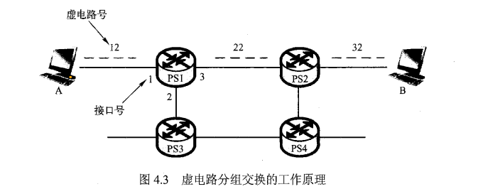

**虚电路网络转发表 :** 

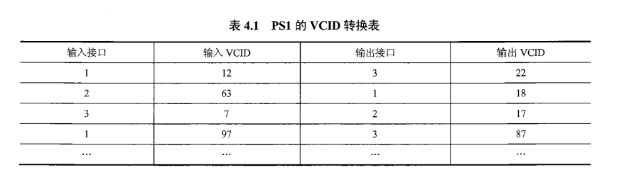

**虚电路与数据报电路对比**

| 对比点    | 虚电路分组交换网络             | 数据报分组交换网络             |
| ------ | --------------------- | --------------------- |
| 连接     | 面向连接的                 | 无连接的                  |
| 分组到达顺序 | 总是有序的                 | 未必有序的                 |
| 分组首部   | 每个分组必须有VCID           | 每个分组必须有源地址和目的地址       |
| 单点故障   | 虚电路中有交换节点故障, 整个虚电路不通  | 受单点故障影响较小.            |
| 可靠传输   | 可靠传输由虚电路网络, 即数据交换节点实现 | 可靠传输由端系统, 即通信主机的传输层实现 |
| 典型应用   | X.25, 帧中继,ATM         | 因特网                   |


### 接入网

接入网是将端系统接入网络核心的网络服务. 它提供了端系统与网络核心之间的**物理连接(物理线路)**和**接入服务(如DNS服务等)**

1.电话拨号接入

- **用户线路: **电话连接电话端局(电话交换机)的线路称为用户线路(Subscriber .Line), 拨号接入和下面的ADSL都是使用用户线路接入网. [端局与拨号上网示意图](https://www.20nn.cn/tongxin/ne-ju.html)


- **调制解调:** 电话拨号接入是利用电话网络,通过调制解调器(modem)将数字信号调制成模拟信号, 在电话线路传输. 传送到远端后,再利用调制解调器将模拟信号解调成数字信号。


- **链路带宽有限:** 拨号上网方式的接入链路带宽有限,**最大带宽通常为56 kbps**,对于现代 Internet W络用户来说,显然带宽太低,所以这种接入方式现在已经很少使用。

2.非对称数字用户线路ADSL (Asymmetrical Digital Subscriber line)

- **用户线路: **ADSL也是利用现有的电话网络的用户线路实现的接入网络。
- **同时进行语音通信与网络通信:** ADSL 使用**频分多路复用技术**实现电话语音通信与数字通信(即网络数据传输)共享一条用户线路,**同时进行电话语音通信与网络通信**,这与传统的拨号接入存在很大差异。
- **"非对称": **之所以称为“非对称”数字用户线路,是因为在ADSL接入网络中,在用户线路上实现的**上行(上传数据)带宽比下行(下载数据)带宽小**。
- **上行与下行速度: ** 可以实现的上行和下行带宽与用户线路的长度有关系,当用户线路长度在3~5km范围时,典型的上行带宽为512 kb/s~1 Mb/s,下行带宽为1~8 Mb/s.当用户线路长度在13km内时,可以实现更高速率的ADSL,其典型的下行带宽可以达到55 Mb/s,上行带宽可以达到19.2Mb/s。(注: 在不超过上限情况下用户线路越长, 上下行速度越快)

3.混合光纤同轴电缆HFC接入网络

- **有线电视网络: ** HFC (Hybrid Fiber-Coaxial)接入网络也称为**电缆调制解调器(cable modem)**接入, 是利用**有线电视网络**实现网络接入的技术。
- **用户端的连接过程为: **HFC接入网络的用户端的连接过程为: 终端--> 电缆调制解调器 --> 有线电视网的入户同轴电缆 ---> 光纤结点(光电转换器) ---> 光纤传输 ---> 有线电视网络公司 --> 接入网络
- **频分多路复用技术**: HFC基于频分多路复用技术,利用有线电视网络同轴电缆剩余的传输能力实现**电视信号传输与网络数据传输**的共享。
- **"非对称": **HFC也是“非对称”的,即上行带宽小于下行带宽,典型上行带宽为30.7 Mb/s,下行带宽为42.8 Mb/s.
- **共享式接入: ** HFC是共享式接入, 即连接到同一段同轴电缆上(比如同一栋住宅楼内)的用户共享上行和下行带宽。假设同一段同轴电缆的接入用户数为10个,上行带宽为30Mb/s,下行带宽为40 Mb/s, 如果所有用户都进行通信,则每个用户平均占有的上下行带宽分别是3Mb/s 4Mb/s.可见,当 HFC 享用户数量较大时,每个用户获得的实际带宽可能并不高。因此,虽然HFC接入的上下行带宽表面看要比ADSL带宽高,但是当用户数量较大时, HFC 入没有ADSL 入速率快,因为,**ADSL是独享式接入**。

4.局域网

- **边缘路由器连接: ** 企业、学校等机构会在组织范围内建设局域网, 连接所有需要接入外部网络(如Internet)的主机, 然后通过企业网络或校园网的**边缘路由器连接**网络核心。
- **局域网技术: **典型的局域网技术是以太网、Wi-Fi等。事实上,除了企业、校园等机构网络在用局域网接入网络核心, 现在随着光纤到户(Fiber to the Home,FTTH)的推广与普及,越来越多住宅小区的家庭用户也采用局域网技术实现网络接入。

5.移动接入网络

- 移动接入已成为Internet 入的重要途径;尤其对于个人移动设备的接入,移动接入网络是不可替代的,而且将成为个人设备接入网络的首选途径。


###  分组时延及计算方式

1. 处理延时
   - **出错: **检查分组是否出错的时间
   - **检查:** 检查分组首部的时间
   - **查询: **查询分组路由表的时间
2. 排队延时
   - 输出链路拥塞情况下, 在队列排队等待输出的时间, 不固定
   - ${I(流量强度)} = { \frac{ {L(1个分组的bit数, 长度 )}   *   {a (每秒到达的分组数量 )} }{ R(链路的带宽 ) } }$ **, 当流量强度 >= 1时候, 排队延时趋向无穷大**. 举个例子, 如果链路的带宽为1mbps, 在1s中经过该链路的数据大于等于1mb, 则该链路排队延时无限大, 会导致瘫痪
   - $ {t(排队延时)} = {\frac{ I }{ 1 - I }} * {\frac{ L }{ R }}  $ , 其中I是流量强度, L是分组的平均长度, R是链路的带宽
3. 传输延时(transmission)
   - $ R = 带宽({bps}) $ ,$ L = 数据量({ bits }) $  
   - 则:  $ {一个bit的传输时间} = { \frac{1/bit}{R/bps} }  $ , $  t (传输延时) = \frac{L}{R} $
4. 传播延时(propagation)
   - 传播延时在距离近的时候可以忽略不计, 在超长链路时候必须计算
   - $ {d}={物理链路的长度} $, $ {s} = {在媒体上的传输速度} $
   - $ {传播延时} = {\frac{d}{s}} { (s/秒 )}$


**例题1 :**  假设分组长度L = 1000B, 链路带宽R = 10Mbit/s, 则传输延迟为? 

解: $因为: 1B = 10^{-3}KB = 10^{-6}MB, 故L = (1000 * 10^{-6})MB = 10^{-3}MB = 8*10^{-3}Mb $

​     $故 T_{传输} = \frac{L}{R} = \frac{8*10^{-3}Mb}{10Mb/s} = 8* 10^{-4}s$


## 章二: 应用层

### DNS

#### 层次化域名空间

**层次结构:** DNS服务器按层次结构进行组织, 并且该**服务器层次与域名的层次相对应**。

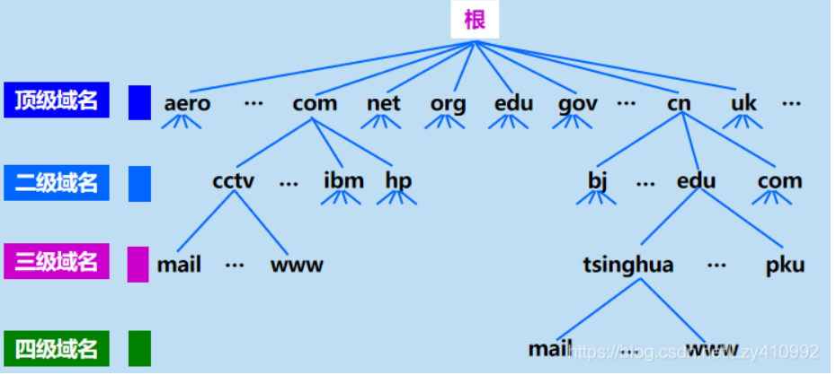 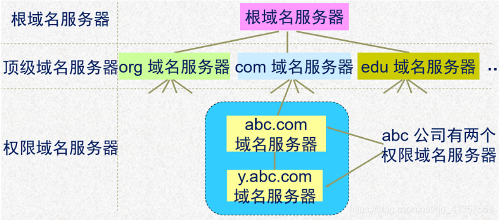

**域名**
域名的结构各符号之间用点隔开, 级别高的域名排列在后方. 例如,“….三级域名.二级城名.顶级城名”

**顶级域名: **
1) 国家顶级域名: 如`cn` 中国,us 美国,`uk` 英国等。
2) 通用顶级域名: 如com (公司和企业)、net (网络服务机构)、org (非盈利性组织)、edu (教育机构)、 gov (政府部门)、mil (军事部门)、int(国际组织)。
3) 基础结构域名: 这种顶级域名只有一个,即 arpa,用于反向域名解析,因此又称为反向域名。


#### 域名服务器

**域名服务器的分类:** 域名服务器分为根域名服务器、顶级域名服务器、权威域名服务器、中间域名服务器4类。

**根域名服务器: **

- **13个根域名服务器:** 在因特网上共有13个根域名服务器, 它们的名字是用一个英文字母命名,从a-直到m(前13个字母),如arootservers.net. b.rootservers.net,…"、m.rootservers.net. 
- **保存管理: **每个根域名服务器都知道所有的顶级域名服务器的域名和IP地址。
- **查询服务:** 根域名服务器通常只提供迭代查询服务, 当根域名服务器收到本地域名服务器的迭代查询请求报文时, 通常在响应报文中告诉本地域名服务器下一步应当查询哪一个域名服务器, 本地域名服务器则继续查询下一个域名服务器, 直到查询到被查询域名主机的权威域名服务器。

**顶级域名服务器: **

- **保存管理:** 顶级域名服务器负责管理在该顶级域名服务器注册的所有二级域名。
- **顶级域名服务器的名称:** 顶级域名服务器的名称对应一个域名的最后一个名字, 是对一个行业的命名,如com, org ,或对一个国家的命名,如cn, us 。

**权威域名服务器:** 

- **保存管理:**  一个服务器所负责管辖的范围叫作区。每一个区设置相应的权威域名服务器, 用来保存该区中的所有**主机的域名到IP地址的映射**。
- **域名解析:** 在进行域名解析时,只要查询到被查询域名主机注册的权威域名服务器, 就可以获得该域名对应的地址信息。

**中间域名服务器:**

- **三不是: **既不是根域名服务器, 又不是顶级域名服务器,也不是权威域名服务器的域名服务器,这些域名服务器称为中间域名服务器。
- 例如,某主机域名为www.abc.xyz.com,则可能存在的域名服务器包括顶级域名服务器.com,中间域名服务器xyz.com,权威域名服务器 abc.xyz.com.

**默认域名服务器: ** 

- **本地域名服务器:** 任何一台主机在网络地址配置时, 都会配置一个域名服务器作为默认域名服务器. 通常称为本地域名服务器,是主机进行域名查询过程中**首先被查询**的域名服务器。
- **域名解析过程:** 主机任何时候进行域名解析, 都会将査询请求发送给默认域名服务器;  该服务器如果缓存了被查询域名的信息, 则直接做出响应, **如果没有, 则首先求助于根域名服务器**, 直到查询到结果,最后将查询结果发送给查询主机。
- **查询服务: **通常本地域名服务器都提供递归查询服务。


#### 域名解析过程

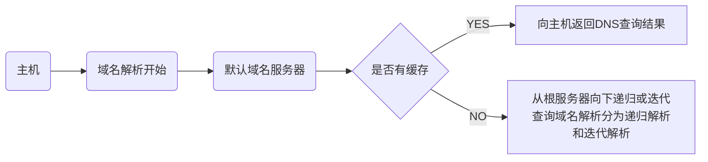

- **提供递归查询服务的域名服务器**: 
  - **可以代替:** 可以代替查询主机或其他域名服务器, 进行进一步的域名查询, 并将最终解析结果发送给查询主机或服务器


- **提供迭代查询的服务器: **
  - **不会代替:** 不会代替查询主机或其他域名服务器, 进行进一步的查询, 只是将下一步要查询的服务器告知查询主机或服务器


### 电子邮件 

>  电子邮件系统主要包括邮件服务器、简单文件传输协议( SMTP )、用户代理和邮件读取协议等.

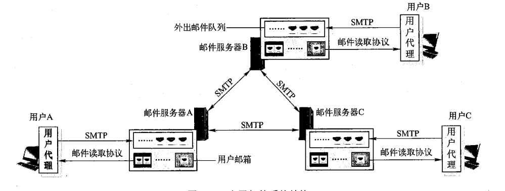

#### **邮件服务器** 

- **功能:**  邮件服务器的功能是收发邮件, 同时还要向发信人报告邮件传送的状态( 已交付、被拒绝、丢失等 )
- **注册:** 用户需要向某个邮件服务器申请注册一个邮箱, 邮件服务器为每个邮箱分配一定的存储空间,  用于存储发送给该用户的邮件。
- **地址:** 每个用户的邮箱都有一个唯一的电子邮件地址,格式为: 收件人邮箱名@邮箱所在主机的域名(或IP地址)
- **队列:** 邮件服务器维护管理一个外出邮件队列, 队列中暂存注册用户等待向外发送的邮件。
- **工作方式: **邮件服务器之间发送和接收邮件时按照C/S方式工作。一个邮件服务器既可以作为Client,又可以作为Server。
- **进程:** 一个邮件服务器通常至少包含两个进程: 邮件发送进程((mail sender)和邮件接收进程(mail receiver)。
- **端口:** 邮件接收进程通常绑定25号端口, 用于接受邮件并放入发送队列. 邮件发送进程实时监测外出邮件队列,只要队列不空, 就依次从队列中取出一个邮件, 向接收方的邮件服务器的25号端口发送。

#### **用户代理**(User Agent) 

- **软件: **用户代理是电子邮件应用的客户端软件,为用户提供使用电子邮件的接口。
- **功能:** 用户代理的主要功能是支持用户撰写、显示、处理和收发邮件, 为用户阅读、回复、转发、保存和撰写邮件等提供编辑与操作环境。

#### **SMTP( 简单文件传输协议 )**

- **功能:** SMTP是实现邮件**邮件服务器间**发送邮件的应用层协议 另外, **用户代理向注册邮件服务器**发送邮件时,通常也是基于SMTP。

- **可靠数据传输:** SMTP 使用用传输层**TCP** 现可靠数据传输, 在发送邮件时, SMTP客户端首先请求与服务器端的25号端囗建立TCP接

- **基本交互方式:** SMTP 基本交互方式是客户端发送可能携带参数的命令, 服务端对命令进行应答。

- **命令与应答:** SMTP定义了14条命令和21种应答信息, **每条命令用4个字母组成**, 而每一种一般 由一个**3位数字的代码**开始, 后面附上(也可不附上)**简单的文字说明**。

  - 命令示例: HEL0 163.com
  - 回答示例: 250 Hello 163.com, pleased to meet you.

- **特点: **

  > SMTP是一个基于ASCII码的, 持久的推送协议 

  1. **基于ASCII:** SMTP 只能传送7位ASCII 文本内容, 包括SMTP 命令、应答消息以及邮件内容。因此, SMTP**不能直接传送可执行文件或其他的二进制对象**(例如,图像、声音、视频等), 包括许多其他非英语国家的文字(例如,中文、俄文等)都无法通过SMTP 直接接传送。在通过SMTP 传送送这类内容时,必须将这些内容转换为7位ASCⅡ码文本形式,接收邮件一方再将这些内容还原。
  2. **“推送”协议:** SMTP是“推动”协议。当客户端有邮件发送给服务器时,客户主动与服务器(25号端口)请求建立TCP 接,然后将邮件“推送”给服务器。这与HTTP “拉动”协议有很大区别。
  3. **持久的:** SMTP 的TCP连接接是持久的。在SMTP 邮件传输阶段, 在客户完成一封邮件传输后,**并不要求必须进入关闭阶段**。如果客户还有邮件需要继续向同一个服务器发送, 则可以利用已建立的TCP连接继续发送后续的邮件,直到没有邮件需要发送为止。

#### **电子邮件报文格式**

- **基本格式:** 电邮的基本格式分为 1. 首部 2. 空行 3.主体( body )

- **首部字段: **

  > 以下字段, 除To必填外, 都为选填. 且大部分由用户代理软件自动填写.

  1. To: 收件人的邮箱
  2. Subject: 邮件主题( 标题 )
  3. Cc: 抄送人的邮箱地址
  4. From: 发信人的邮箱
  5. Date: 发信日期
  6. Reply-to: 对方回信所用地址. 用于当前发信地址与届时回信地址不相同时填写.

#### **MIME**

- **转化成ASCII码:** MIME是在SMTP上的扩展. 解决了**如何将非ASCII码信息如何转化成ASCII码信息的问题**.  转换后的非ASCII码信息继续使用SMTP传输邮件. 
- MIME在电子邮件报文的基础上, 扩展了以下首部字段: 
  1. MIME-Version: 版本号. 
  2. Content-description: 内容描述. 对邮件的概括
  3. Content-Id: 邮件的唯一标识符
  4. **Content-Transfer-Encoding: **采用的编码规范. 如通过邮件任意二进制文件, 则将此项设置为base64.
  5. **Content-type: ** 邮件的内容. 如: image/jpg, text/html.  http协议也沿用了此首部 

#### **文件读取协议**

>  由于SMTP是“推动”协议，所以不能用于用户从自己邮箱中读取邮件的操作。
>  当用户需要访问自己的邮箱，读取其中的邮件时，所使用的应用层协议是邮件读取协议。
>  显然，邮件读取协议需要以“拉动”方式运行

##### **POP3**

- **TCP:** 为了保证读取邮件过程的可靠性，POP3协议使用传输层TCP**。**
- **端口:** POP3客户端运行在用户代理中. POP3服务器运行在邮件服务器上, 通常守候在110端口号。
- **读取邮件流程:** 
  1. **"推送: "**发送方用户代理先通过SMTP协议与服务器的25号端口建立TCP链接, 将邮件推送至服务器. 服务器将邮件存储在其队列中
  2. **"拉取: "**接收方用户代理使用POP3协议与邮件服务器的110端口建立TCP链接, 并拉取对应邮件.
- **POP3协议交互过程: **
  1. **授权阶段: ** 接收方用户代理需要向服务器发送用户名和口令（以明文形式，即非加密），服务器鉴别用户身份，授权用户访问邮箱。由于用户名和口令是明文传输的，所以其安全性并不高。授权阶段主要有两个命令：user<username>和pass<password>,分别向服务器发送用户名和口令。
  2. **事务处理: ** 用户代理向服务器发送POP3命令，实现邮件读取(下载)、为邮件做删除标记、取消邮件删除标记以及获取邮件的统计信息等操作。
  3. **更新阶段**: 客户发出了quit命令，结束POP3会话，服务器删除那些被标记为删除的邮件。

##### **IMAP**

- **解决的问题: ** POP3允许用户下载邮件到本地尽心管理和存储. 不允许用户对远程服务器中的邮件进行管理, 比如为不同邮件创建不同的目录. IMAP解决了这个问题, 支持用户**创建远程文件夹并为邮件指派文件夹**, 并可以对邮件进行移动、查询、阅读、删除等操作.
- **IMAP的额外特性: **
  1. **维护了用户状态信息:** 与POP3不同，IMAP服务器维护了用户状态信息，例如，文件夹的名字以及哪些邮件与哪些文件夹相关联等。
  2. **允许读取邮件的部分内容:**  IMAP的一个重要特性是允许用户代理只读取邮件的部分内容，例如，一个用户代理可以只读取一个邮件的首部等。当用户代理访问IMAP服务器的网络带宽比较低，或者想先看一下邮件主题然后再决定是否要下载整个邮件时，这个特性就非常有用。

##### **HTTP**

- **现状:** 20世纪90年代中期，Hotmail率先采用了基于Web的电子邮件，时至今日，谷歌、网易以及几乎所有大学或者大型企业等也都提供了基于Web的电子邮件服务。
- **优点:** Web邮件的优点之一是用户代理就是普通的Web浏览器，用户无须为了使用邮件而安装专用的电子邮件用户代理软件，并且基于用户熟悉的Web操作方式收发邮件，用户体验更好。
- **Web邮件系统特点: **传统的邮件系统, 发送邮件以及邮件在邮件服务器中传递使用的是SMTP协议, 接收(下载)邮件使用的是POP3或者IMAP协议.  而在Web邮件系统中, **发送邮件和接收(下载)的协议使用的都是HTTP, 邮件在邮件服务器中传递时, 使用的是SMTP协议.**  


### 应用层协议应用使用的端口号与传输层协议

| 应用层协议 | 守候的端口号 | 基于的传输层协议 |
| ----- | ------ | -------- |
| HTTP  | 40     | TCP      |
| HTTPS | 443    | TCP      |
| POP3  | 110    | TCP      |
| SMTP  | 25     | TCP      |
| DNS   | 53     | UDP      |
| FTP   | 21     |          |

## 章三: 传输层

### 套接字( Socket API )

**套接字的定义:**

- **操作系统提供给进程的一组API:** Socket API是操作系统提供给进程的一组API。不同的编程语言可以基于操作系统提供的Socket API封装自己的网络请求函数/方法，从而实现对Socket API的使用。
- **套接字是用于标识对等层实体的网络会话的标识**: 当两个应用进程之间建立网络会话时, 操作系统会为会话建立唯一的socket标识. 操作系统会为该socket标识分配一个编号, 称为端口号


**TCP与UDP的Socket标识**

| 协议   | 组成                                       | 备注                                       |
| ---- | ---------------------------------------- | ---------------------------------------- |
| TCP  | 四元组: [ `src_ip, des_ip, src_port, des_port` ] | 1) TCP用四元组标识唯一Socket<br />2) TCP是面向连接的. 对同一个进程, 只用目的端口和目的IP是不能唯一标识Socket, 缺少了源端信息.  只用目的端口, 源端口, 目的IP也不能唯一标识Socket, 因为不同主机的源端口号可能相同, 源端口--> 目的端口不能标识唯一的连接. 只能用四元组标识两个主机之间的对等进程的会话关系 |
| UDP  | 二元组: [ `des_ip`, `des_port` ]            | 1) UDP使用二元组标识Socket<br />2) 在传输数据时, 传输层协议自动添加上[` src_ip, src_port`], 作用是让对等进程可以回传数据<br />3)为UDP套接字分配目的端口号有两种方法：<br />     - **自动分配:** 一种方法是创建一个UDP套接字时，传输层自动地为该套接字分配一个端口号<br />     - **bind()函数:** 在创建一个UDP套接字后，通过调用bind()函数为该套接字绑定一个特定的端口号。 |

**套接字API：**

| 套接字API                                   | 作用                                       |
| ---------------------------------------- | ---------------------------------------- |
| `SOCK_STREAM`                            | 常量: 表示创建的是面向TCP的会话                       |
| `SOCK_DGRAW`                             | 常量: 表示创建的是面向UDP的会话                       |
| `SOCK_RAW`                               | 常量: 表示创建的是绕过传输层, 直接与网络层通信的会话.<br />如应用直接收发ICMP协议报文 |
| `int socket( int family, int type, int protocal  )` | 创建Socket<br />family: 协议簇名, 是IPv4还是IPv6<br />type: 套接字类型, 是面向TCP, UDP, 还是直接面向网络层<br />protocol: 进一步指明TCP使用的协议, 是TCP还是UDP |
| `int close(int socket)`                  | 关闭socket连接                               |
| `int bind(int socket, socketaddr* myaddr)` | `socketaddr是一个具有IP和端口号的结构体.`<br />该API的作用是将套接字绑定与本地IP的端口号绑定<br />服务端一般会为TCP创建一个Welcome Socket( 监听套接字 ), 并绑定在一个端口上, 等待客户端的请求. 当客户端请求时候, Welcome Socket会再为每个会话创建Connect Socket <br />客户端一般不需要绑定端口号, 客户端会在发送请求时, 为会话分配临时端口号. |
| `int listen( int socket )`               | 将Welcome Socket 置与监听状态.<br />只用于服务端, 且是面向TCP连接的套接字 |
| `int connect( int socket, socketaddr* desaddr )` | 客户端调用该函数, 与服务端建立链接                       |
| `int accept()`                           | 接受TCP连接.<br />服务端会为TCP维护一个队列, 客户端所有尝试建立TCP链接的Socket被存储在此. 当调用这个API后, 会从队列中取出最靠前的Socket, 并创建一个新的Socket( Connect Socket ) |
| 其他.. 如 接受/ 发送数据, 查看/ 设置socket选项          |                                          |

### 传输层的功能

传输层的核心任务是**为应用进程提供端到端的**逻辑通信服务.

具体来说传输层需要实现以下功能

1. 传输层寻址( 端口号 )
2. 对应用层报文分段和重组
3. 差错控制检测
4. 可靠数据传输
5. 面向应用层实现多路复用/解复用
6. 流量控制
7. 拥塞控制

### 可靠数据传输

#### 不可靠传输

不可靠传输即数据在网络中传输中出现的 1. 乱序 2. 错误 3. 重复 4. 丢失等错误

1. 乱序

   **发送顺序和接收顺序不同:** 报文被划分为若干个分组在网络中分组传输,  每个数据包的传输路径都可能不相同, 每个传输路径的传输能力也可能不相同.  在这种情况下, **数据包的发送顺序和接收顺序可能不同, 即出现乱序**. 停等协议没有乱序问题. 

2. 错误

   **位翻转:** 数据以二进制表示,  在信道中传输数据时会先由调制/解调设备将二进制数字信号调制为模拟信号(比如电磁波信号, 光信号)在信道中传输.  若信号在信道传输的过程中受到了噪声的影响,  在信号到达目的, 经过解调变成二进制数据的时候, 会出现错误. 其表现就是原本的01发生翻转.  这种错误被称为**位翻转**

3. 重复

   重复的原因主要来源有两点. 

   1. **超时重传机制**, 如TCP协议, 发送方会在接收端长时间未收到包时, 即超时定时器到时时会再发一遍包, 此时接收方可能会出现收到多次包的情况.
   2. **重传机制: ** 发送方接收到上一个分组ACK会立刻重发分组. (接收方会因为缓冲区满, 分组错误等原因丢弃该包, 并向发送方回复上一个分组的ACK, 等同于NAK)

4. 丢失

   分组丢失主要有以下情况

   1. 终点不可达( 路由器没有转发的表项 )
   2. 参数错误( 差错控制编码没有通过校验 )
   3. 拥塞( 路由器缓冲或者主机缓冲区满 )
   4. 超时( TTL减为0 )

#### 停等协议中的可靠传输

停等协议可靠传输的特点: 

1. **窗口大小:** 发送窗口和接收窗口都为1 
2. **序号大小**  用1个比特表示包的序号大小.  即0或者1两位.
3. **超时定时器: ** 为**每一个**发送的分组开启超时定时器. 若超时则立刻重发分组
4. **检错与重发机制**: 可通过差错控制编码, 检查出错误的ACK(由传输过程中的位翻转导致的)或者非法的ACK(即NAK), 立即重发分组, 同时重启超时定时器.  
5. **非累积确认:**  接收方接收到**冗余分组**或者**对分组校验失败**会回复上一次分组的ACK.

**发送方FSM:**

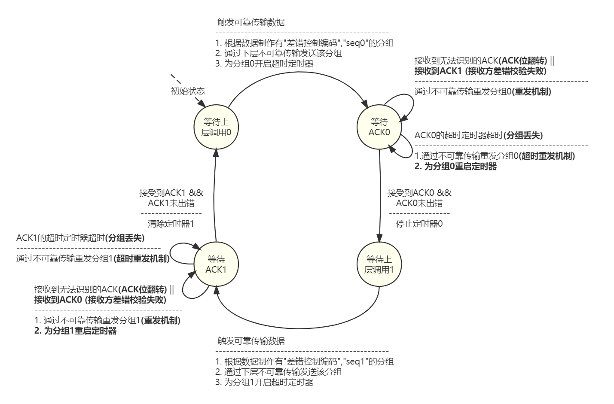

**接收方FSM**

> 冗余分组的产生原因:
>
> 1. 若分组在网络滞留, 会触发超时重传
> 2. 若分组的ACK发生位翻转, 会触发重传
>
> 上层: 如果可靠数据传输是在传输层实现的,上层指应用层.如果是在链路层实现的, 上层指网络层.每一层都可以实现自己的可靠数据传输


#### 流水线协议中的可靠传输

| 滑动窗口基本概念 | 概念解释                                     |
| -------- | ---------------------------------------- |
| 发送缓冲区    | 1) 发送方的一块内存区域<br />2) 发送缓冲区由两部分构成, 一部分是**已发送但未确认接收**的分组, 另一部分是剩余空间, 用于存放**一部分待发送**的分组. |
| 发送缓冲区的大小 | 发送缓冲区**可容纳的分组的数量**,  停止等待协议的发送缓冲区的大小等于1,  Pipeline协议发送窗口大小大于1 |
| 发送窗口     | 1) 发送缓冲区中**已发送但未确认接收**的分组的区域. <br />2) 发送窗口的后沿与前沿, 划分出了发送缓冲区中发送窗口的大小<br />3) 发送缓冲区的大小 - 发送窗口的大小 = 待发送分组的大小 |
| 接收窗口     | 1) 接收窗口 = 接收缓冲区<br />2) 接收窗口是接收方的一块内存区域<br />3) 接收窗口表示**已经接收但还未向上层提交**的分组, 未向上层提交的愿意为, 接收窗口内的分组未按序到达 |
| 接收缓冲区    | 同上                                       |

文字叙述: 

1. 上层应用调用接口发送数据报文
2. 数据报文被分段, 依次添加序号.
3. 一部分数据段被加载进发送缓冲区内, 这里的一部分是指, 若数据报的大小小于发送缓冲区的大小, 则所有数据段会被加载进缓冲区内. 若数据报的大小大于发送缓冲区的大小, 只会加载一部分数据段进入缓冲区
4. 发送数据, 发送窗口的右沿向右滑动. 
5. 数据到达接收方后, 会被放入接收窗口, 即接收缓冲区中.  

##### Select-Repeat 协议

假设发送/接受窗口的大小为4

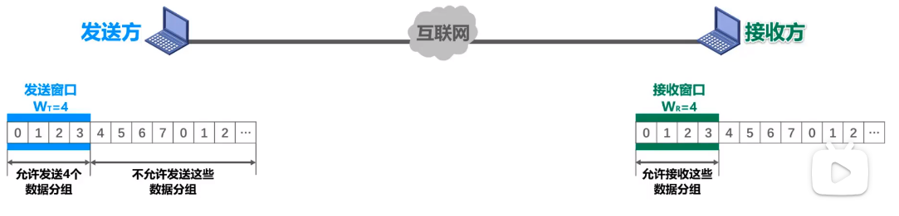


发送方: 为发送的每个分组开启定时器.
接收方: 1. 对按顺序到来的分组滑动窗口 2.记录每个分组的到来情况. 3. 对每个分组回复非累计确认ACK

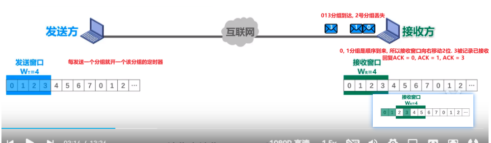

发送缓冲区将ACK确定的0, 1删除, 4,5添加进缓冲区.  滑动窗口左沿从0 移到2 **(图中未体现)**

将4,5的分组发送, 滑动窗口右沿从3移动到5(**图中未体现**)

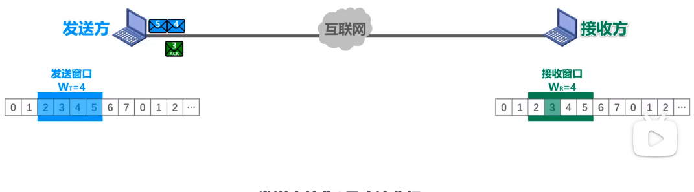

接收方接受新到的4, 5分组. 并记录, 并回复ACK = 4, ACK = 5

发送接受ACK = 4, ACK = 5.并记录.

双方滑动窗口都不滑动


丢失的2号分组的超时定时器触发

发送方重发2号分组

接收方 接收2号分组, 滑动窗口右移四位. 并回复ACK = 2

发送方接受ACK = 2, 滑动窗口右移四位


##### Go-Back-N 协议

初始状态

假设发送缓冲区的大小为4, 第一次发送数据为1,2,3,4. 到达接收端的顺序为3,1,2,4

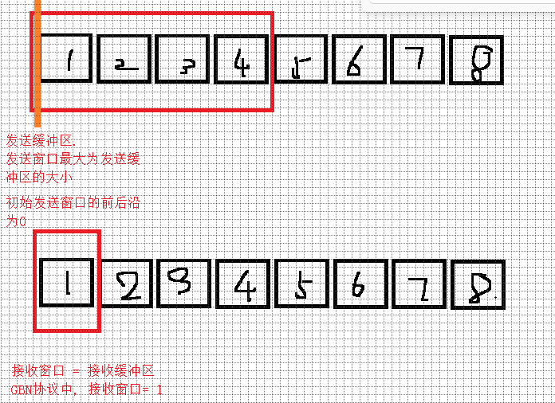

发送1-4数据包


3号包最先到达, 被丢弃. 回复ACK = 0. GBN总是回复顺序到达包的前一个序列号, 代表该序列号以及之前的序列号的包被确认. 

发送窗口和接收窗口都不动


第二个包1到来, 回复ACK = 1. 接收窗口前移. 发送窗口后沿(左边界)前移, 发送缓冲区前移. 

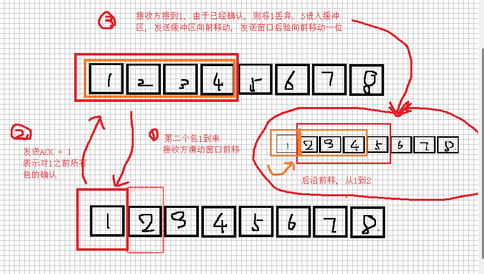

​	第3个包4到来, 回复ACK = 1. 发送窗口和接收窗口都不动 


第四个包过程略, 类似于第二个包1的


超时定时器启动. 由于3,4不是顺序到达, 被接收端丢弃. 发送方长时间没接收到3,4的ACK, 则开启充实定时器将3,4重发 


#### 停等协议与流水线协议对比

**Go-Back-N协议与Select Repeat协议**

|             | Go-Back-N协议                              | Select Repeat协议                          | ARP 协议                                   |      |
| ----------- | ---------------------------------------- | ---------------------------------------- | ---------------------------------------- | ---- |
| **发送窗口大小**  | \> 1 且 ≤$2^{n} - 1 $  , 其中n为表示序号的二进制位数<br />一次可以发送多个包 | \> 1 且 ≤ $2^{n -1}$<br /> 一次可以发送多个包      | = 1 <br />一次只发送一个包                       |      |
| **接收窗口大小**  | = 1 <br />不能接收乱序到来的包                     | 大小 \> 1 <br />可以接收乱序到来的包                 | = 1 <br />不能接收乱序到来的包                     |      |
| **序号大小**    |                                          |                                          | 1 bit                                    |      |
| **发送机制**    | 每次发送缓冲区内所有剩余分组, 即发送缓冲区 - 发送窗口内的分组        | 每次发送缓冲区内所有剩余分组, 即发送缓冲区 - 发送窗口内的分组        |                                          |      |
| **超时重传**    | 1) 发送若干分组后, 会开启**一个**定时器.<br />2) 当超时后, 会**将发送窗口内的所有分组重发**. | 1) 为每个分组开启一个定时器<br />2) 超时时只重发对应的分组.     | 1) 为**每一个**发送的分组开启超时定时器. <br />2) 超时时则重发对应分组 |      |
| **ACK确认机制** | 累计确认机制<br />1) 接收方接收分组后, 总是**回复接收窗口内第一个分组序号的前一个分组序号**, 代表对过往分组的确认.<br />2) **顺序到来:** 对顺序到来的分组, 先移动接收串口的右沿, 再回复接收窗口内第一个分组序号的前一个分组序号, 即刚刚顺序到来分组的序号.<br />3) **乱序到来:** 对乱序到来的分组, 丢弃该分组, 再回复接收窗口内第一个分组序号的前一个分组序号, 代表未收到分组. | 非累计确认机制<br />1) 接收方接收分组后, 总是**回复接受分组的序号**, 代表对过往分组的确认.<br />2) **顺序到来:** 对顺序到来的分组, 先移动接收串口的右沿, 再回复接收窗口内第一个分组序号的前一个分组序号, 即刚刚顺序到来分组的序号.<br />3) **乱序到来: ** 对乱序到来的分组, 丢弃该分组, 再回复接收窗口内第一个分组序号的前一个分组序号, 代表未收到分组. |                                          |      |

### 多路复用/ 解复用

多路复用/解复用由两方面含义

1. **多路复用:** 支持**多个应用进程共用同一个协议**, 即该协议被多个应用进程复用.
2. **解复用:**  能够**将接收到的数据准确交付给不同的应用进程**. 协议接收到的报文段中，可能封装了不同应用进程的数据，将数据交付给正确的应用进程，即实现解复用, 传输层协议通过端口号实现解复用。


在源主机，传输层协议从不同套接字收集应用进程（可能是不同的网络应用）发送的数据块，并为每个数据块封装上首部信息（包括用于分解的信息）构成报文段，然后将报文段传递给网络层，这一过程就是多路复用。

在接收端，传输层协议读取报文段中的目标端口号，标识出接收套接字，进而通过该套接字，将传输层报文段中的数据交付给正确的套接字，这一过程就是多路分解。


### UDP

#### UDP的服务

UDP提供无连接、不可靠、尽力而为传输服务。

- **无连接: **UDP是无连接的，因此在两个进程间通信时，没有握手过程。
- **不可靠: ** 
  - UDP并不保证将该报文送达到目的接收进程。即对数据包在传输过程中的乱序, 位翻转, 重复, 丢失等情况做的处理很少( 只实现了checksum ).
- **尽力而为:** 除了多路复用/解复用功能以及简单的差错检测外，几乎没有对网络层的增加任何功能。

#### UDP报文段格式

UDP报文段由共**8字节64位的首部, 每个首部占2字节, 16位**,   若干字节的载荷部分

| 首部字段        | 作用                          |
| ----------- | --------------------------- |
| 源端口号        |                             |
|             |                             |
| (首部 + 载荷)长度 | 记录数据段的总大小, 单位为字节            |
|             | 提供报文段的差错检测. 当校验失败后, 会直接丢弃该包 |


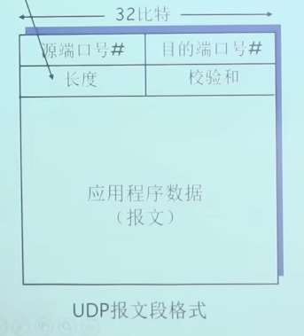

#### UDP的校验和

参加校验和的字段

1. UDP伪首部
   - UDP伪首部由[ 4字节源IP, 4字节目标IP, 1字节0, 1字节协议号, 2字节UDP长度 ]**共计12字节**组成.
   - 1字节0的作用的用于16位对齐
   - 协议号为标识是UDP的伪首部, 值为17
   - **UDP伪首部仅用于checksum的计算**, 即不向上提交, 也不向下传递
2. UDP首部
   - UDP首部由 [ 2字节源端口, 2自己目标端口, 2字节UDP长度, 2字节校验和 ]**共计8字节**组成
   - 计算校验和时, **校验和首部字段为2字节全0**
   - UDP长度**参与计算两次**, 分别出现在伪首部一次, 首部一次. 
3. UDP载荷
   - UDP载荷即应用层的数据报文
   - UDP数据段载荷部分, **若不是16位的倍数, 需要在后方补足0**

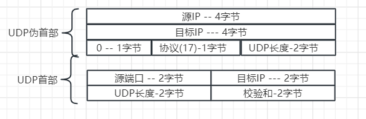

**校验和的计算**

1. **16位对齐:** 将校验和字段全为0.  UDP数据段载荷部分, **若不是16位的倍数, 需要在后方补足0**
2. **按位相加**: 将UDP伪首部12字节, 首部8字节共计20字节按照2字节16位对齐, 按位相加
3. **进位回卷:** 即16位相加时, 若出现超出16位的数, 加到最低位上.
4. **按位取反:** 将相加的结果, 且回卷后的二进制按位取反后即得到校验和
5. **验证: ** 重新计算Checksum, 并且不用按位取反.  将两次计算的checksum相加若为1则验证通过.

```js
// 报文数据
const message = 'Hello, World';

// 目标IP和端口
const sourceIP = 'xxxx.xxxx.xxxx.xxxx';
const targetPort = 3000;

// 源IP和端口
const sourceIP = 'xxxx.xxxx.xxxx.xxxx';
const sourcePort = 44;

// 将报文转换为ArrayBuffer
const messageBuffer = new TextEncoder().encode(message).buffer;

// 创建UDP数据报的ArrayBuffer
const udpPacketSize = 8 + messageBuffer.byteLength; // 头部长度为8字节
const udpPacketBuffer = new ArrayBuffer(udpPacketSize);

// 创建DataView来操作ArrayBuffer
const udpPacketView = new DataView(udpPacketBuffer);

// 设置源端口（2字节）
udpPacketView.setUint16(0, sourcePort);

// 设置目标端口（2字节）
udpPacketView.setUint16(2, targetPort);

// 设置UDP长度（2字节，头部长度+数据长度）
udpPacketView.setUint16(4, udpPacketSize);

// 设置校验和（2字节，初始化为0，稍后计算）
udpPacketView.setUint16(6, 0);

// 复制报文数据
const dataView = new DataView(messageBuffer);
for (let i = 0; i < messageBuffer.byteLength; i++) {
  udpPacketView.setUint8(8 + i, dataView.getUint8(i));
}

// 计算校验和
const checksum = calculateChecksum(udpPacketBuffer);

// 更新校验和字段
udpPacketView.setUint16(6, checksum);

console.log('封装的UDP数据报:', new Uint8Array(udpPacketBuffer));

// 模拟接收端校验过程
const receivedChecksum = udpPacketView.getUint16(6);
const calculatedChecksum = calculateChecksum(udpPacketBuffer);

console.log('接收到的校验和:', receivedChecksum);
console.log('计算得到的校验和:', calculatedChecksum);
console.log('校验和是否匹配:', receivedChecksum === calculatedChecksum);

// 计算校验和的函数
function calculateChecksum(buffer) {
  const dataView = new DataView(buffer);
  let checksum = 0;
  
  // 求校验和, 因为校验和是2字节, 所以以16位读二进制数据, 相加
  for (let i = 0; i < buffer.byteLength; i += 2) {
    checksum += dataView.getUint16(i);
  }
	
  // 防止校验和进位导致信息丢失, 所以进行进位回卷, 将高位贴到低位上
  while (checksum >> 16) { // 右移16位, 看是否有超出16位的高位
    // 0xffff 是 65535, 即2个字节的1. 
    // (checksum & 0xffff) 保留除了最高位的数字
    // (checksum >> 16) 保留高位
    // 相加即回卷进位
    checksum = (checksum & 0xffff) + (checksum >> 16);
  }

  checksum = (~checksum) & 0xffff;
  return checksum;
}
```


#### UDP相较于TCP的优势

1) 应用进程更容易控制**何时发送**。

- 采用UDP时，只要应用进程将数据传递给UDP, UDP就会将此数据打包进UDP报文段并立即将其传递给网络层。
- 采用TCP时, 由于拥塞控制和流量控制, 数据的真实发送情况收到链路拥塞程度和对方应用缓冲区情况限制. 

2)无需建立连接。

- 与TCP需要三次握手建立连接过程不同（后面将要讨论)，UDP不需要任何准备即可进行数据传输。因此，UDP不会引入建立连接的时延。

3)使用UDP端系统的资源开销小。

- TCP需要在端系统中维护连接状态，包括接收和发送缓存、拥塞控制参数以及序号与确认号的参数等；而UDP是无连接的，因此也无需维护连接状态。
- 因此，TCP系统资源开销大，UDP系统开销小。

  通常情况下，某些服务器当运行在UDP之上而不是TCP上时，一般都能支持更多的活跃客户。

4) 首部开销小。

- 每个TCP报文段都至少有20字节的首部开销，而**UDP仅有8字节**的开销。
- 需要说明的一点是，虽然UDP提供不可靠传输服务，但使用UDP的应用仍然可以实现可靠数据传输。
- 这可以通过在应用程序自身中建立可靠传输机制来完成，如前面介绍的停-等协议或滑动窗口协议等。也就是说，应用进程可以使用UDP的同时进行可靠通信，只是需要在应用层设计可靠传输即可


## 章四: 网络层


