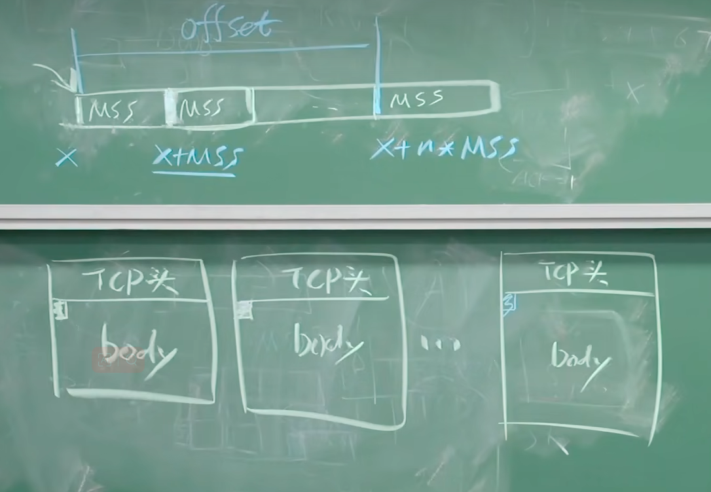
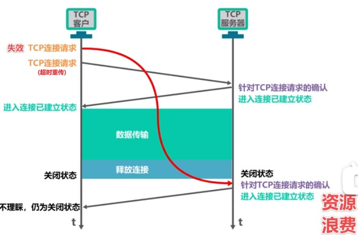
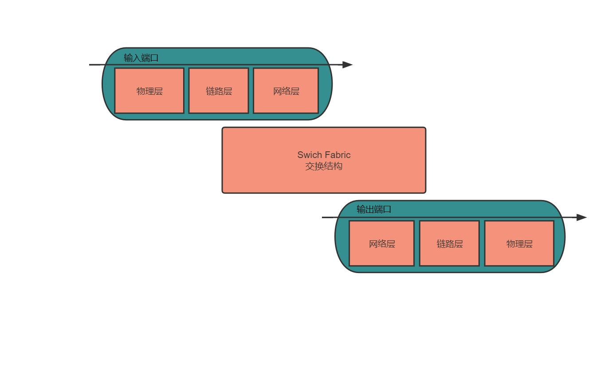
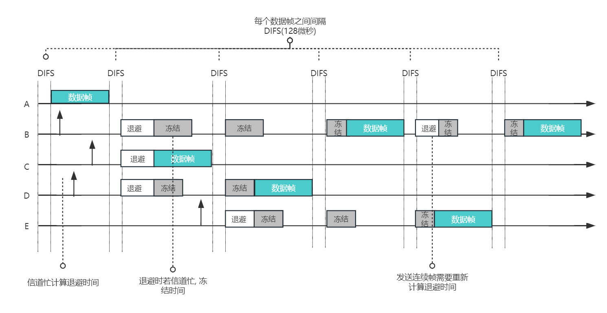
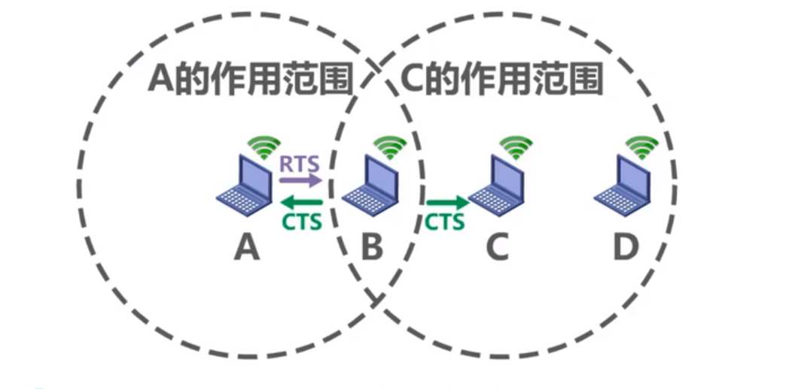
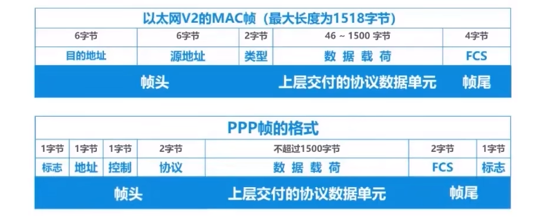

# 计算机网络


## 章一:  计算机概述

### 1.1 计算机网络分层

> ISO标准化组织将计算机网络分为以下7层, 即OSI模型, 但实际研究中只研究四层或者五层的模型. 其因应用层/表示层/会话层合并成一层应用层做研究


- 服务是功能的子集
- **本层通过层间接口访问下层的服务, 再通过层间接口向上层提供更好的服务**

### 1.2 计算机网络定义

#### 引子, 什么是网络

蜘蛛网, 神经网络, 人际网络都是网络, 网络由==节点==和==边==构成


#### 从物理层面定义计算机网络

> 计算机网络 = 节点 + 边(链路)  + 协议

**节点**

计算机网络中的节点分为: 

1. 主机节点(PC, Phone, Pad, Server等) 
2. 数据交换节点(路由器, 交换器)


**边(链路)**

概念: 边 = 链路. 将节点连接(主机节点和交换节点的连接和交换节点与交换节点的连接)起来的边称为链路

1. 主机节点与交换节点连接的链路称为接入网链路(access)
2. 交换节点与交换节点连接的链路称为主干网链路(backbone)


**协议**

[见1.3协议定义](#1.3 协议定义)


**如何区分节点是主机节点还是数据交换节点?**

数据在网络中由源(Source)传输到目标(Destination), 即E2E传输(end to end, 端到端传输), 位于两端的即主机节点. 	

传输过程中, 数据会经过一个个既非源, 也非目标的设备(路由器, 交换机), 在这些设备上传输即为P2P传输(point to point, 点到点传输), 该点即为数据交换节点


#### 从应用程序层面定义计算机网络

> 计算机网络 = 分布式应用 + 为分布式应用提供服务的网络基础设施

分布式的应用程序是指在多个计算机或服务器上运行的应用程序，这些计算机或服务器可以相互通信和协调工作. 

比如微信, 在各个用户的pc, 手机, pad上分布, 并且其可以相互通讯协调工作. 

为其提供的网络基础设施, 包括各种网络协议、通信协议和通信软件, 网络设备和服务器


#### 从抽象的网络结构定义计算机网络

> 计算机网络 = 网络边缘 + 接入网 + 网络核心


- **网络核心**：网络核心位于计算机网络的中央部分，由大型网络设备、路由器、交换机和主干链路等组成。网络核心提供了高速数据传输和路由功能，它负责将数据包从源节点转发到目标节点，实现不同地点之间的连接和通信。网络核心的功能主要集中在数据的转发、路由选择和网络拓扑控制等方面。
- **网络边缘**：网络边缘是连接到网络核心的边缘设备和终端用户设备。它包括个人计算机、笔记本电脑、智能手机、网络摄像头、服务器等设备。网络边缘设备通过通信链路连接到网络核心，它们作为数据的起点和终点，承载着用户与网络之间的交互和数据传输。网络边缘的功能主要体现在数据的生成、接收、处理和响应等方面。
- **接入网**：接入网是连接终端用户设备和网络边缘的网络部分。它提供了端系统与网络核心之间的物理连接和接入服务。接入网通常包括局域网（LAN）或广域网（WAN），用户可以通过有线或无线方式连接到接入网。接入网的功能是提供用户接入网络的入口和网络资源的共享。


### 1.3 协议定义

> 1. 网络协议指的是计算机网络中互相通信的**对等层实体**之间交换信息时所必须遵守的规则的集合
> 2. 协议定义了在两个或多个**通信实体之间**交换的**报文格式**和**次序**, 以及在报文传输和/或接受或其他事件方面所采取的**动作**

实体指在网络中收发和处理数据的具体设备/进程/主机. 分为软件实体和硬件实体, 软件实体比如浏览器, 服务器的进程(Nginx), 硬件实体比如路由器, 交换机


对等层的实体, 指的是双端的实体处于同一网络分层中


报文格式即报文的语法和语义

次序指的是数据收发的顺序, 比如http规定, 服务端必须在接受到请求以后才能发送数据. tcp规定必须在建立连接后才能收发数据

动作即报文传输和/或接受或其他事件方面所采取的**动作行为**	


### 1.4 应用进程的网络通讯模型

#### C/S模式

C即client, S即Server, C/S模式即客户端/服务端模式, 他的特点是拥有固定的服务器(或Server Farm). 

该模式下两方的应用进程采用一应一答的模式进行通讯.

如: Web应用, 浏览器请求服务器的html, 客户端先问: "服务端你有html吗? "服务端应答: "我有, 给你html", 另外常见的使用C/S通讯模式的应用还有邮件等

#### C/S模式的缺点

C/S模式的缺点是服务端的压力非常的大, 当客户端足够的多的时候, 服务端可能会宕机. 比如双十一活动中, 会有数以亿计的浏览器同时请求阿里的服务器, 造成服务器的极大压力.


#### P2P模式

P2P模式(Peer to Peer), 对等模式.

在P2P模式中, 不存在固定的服务器, 每个端系统既是数据的接受方, 也是数据的发送方. 


比如迅雷就应用了P2P的网络通讯模式

在迅雷上下载文件时候, 并不是请求迅雷的服务器, 而是会和多个用户建立链接, 请求其已下载文件的片段, 此时我们是数据的接受方, 当下载了该文件的某些片段时候或完成下载时候, 也可能会有用户与我们建立链接, 请求下载这些片段, 此时我们是数据的发送方, 充当服务器 


#### 迅雷的P2P模式的工作原理(扩展)

下面是迅雷的P2P模式的工作原理：

1. 种子文件创建：用户在迅雷中创建一个下载任务时，会生成一个种子文件，其中包含了下载任务的元数据信息，如文件名、大小和哈希值等。
2. 种子文件分享：用户可以将生成的种子文件分享给其他迅雷用户或使用迅雷的下载资源库进行共享。其他用户可以通过获取种子文件来获取下载任务的元数据信息。
3. P2P连接建立：当一个新用户开始下载特定的文件时，迅雷客户端会尝试与其他正在下载或已经拥有该文件的用户建立P2P连接。这些连接可以通过局域网或广域网进行建立。
4. 分块下载：一旦P2P连接建立，迅雷客户端将文件划分为多个块（一般为几MB大小的块）。每个用户从其他已经拥有相应块的用户那里请求获取所需的块，并且也会将自己所拥有的块分享给其他用户。
5. 块交换和并行下载：迅雷客户端通过不断交换和下载块来完成整个文件的下载。这种块交换和并行下载的方式可以加速下载过程，因为用户可以从多个来源同时获取不同的块。
6. 动态资源调度：迅雷客户端会根据网络状况和其他用户的可用资源动态地选择合适的来源进行块的下载。这样可以提高下载速度和资源的利用效率。

通过P2P模式，迅雷允许用户之间相互分享和下载文件，利用多个用户的资源和带宽来加速下载过程。这种模式的优势在于可以充分利用用户之间的协作和共享，提高下载速度和资源的可用性。同时，迅雷也提供了一些管理和优化机制，以确保下载过程的稳定性和高效性。


### 1.5 数据在网络传输的方式

#### 电路交换(Circuit Switch)


电路交换的代表是传统电话链接,  电路交换的特点是: 

1. **通过信令建立独享的链路** 
2. **此链路为独享资源**

链路独享的好处是保证了资源的效率


计算机不能使用电路交换的原因: 

​	浪费带宽. 比如如果计算机使用电路交换传输数据, 那么两端的计算机挂着QQ, 即使没有在聊天, 也会一直占用一条物理线路, 造成资源的浪费.


#### 分组交换

> 分组交换的特点: 1. 占用链路的全部带宽 2. 将数据分成若干个分组(packet)再存储转发	

**分组丢失**

分组丢失的原因

- 根本原因是链路被占用并且队列已满. 数据到达路由器, 经过查路由表确定出路由器的链路, 如果该链路有数据在传输, 则会进入该链路的队列排队, 如果队列达到了阈值, 则分组会丢弃

**分组延时**

1. 处理延时

   - 检查分组是否出错的时间
   - 检查分组首部的时间
   - 查询分组路由表的时间
2. 排队延时

   - 输出链路拥塞情况下, 在队列排队等待输出的时间, 不固定
   - ${I(流量强度)} = { \frac{ {L(1个分组的bit数, 长度 )}   *   {a (每秒到达的分组数量 )} }{ R(链路的带宽 ) } }$ **, 当流量强度 >= 1时候, 排队延时趋向无穷大**. 举个例子, 如果链路的带宽为1mbps, 在1s中经过该链路的数据大于等于1mb, 则该链路排队延时无限大, 会导致瘫痪
   - $ {t(排队延时)} = {\frac{ I }{ 1 - I }} {\frac{ L }{ R }}  $ , 其中I是流量强度, L是分组的平均长度, R是链路的带宽
3. 传输延时(transmission)

   - $ R = 带宽({bps}) $ ,$ L = 数据量({ bits }) $  
   - 则:  $ {一个bit的传输时间} = { \frac{1/bit}{R/bps} }  $ , $  {传输延时} = \frac{L}{R} {(s /秒)}$, 
4. 传播延时(propagation)

   - 传播延时在距离近的时候可以忽略不计, 在超长链路时候必须计算
   - $ {d}={物理链路的长度} $, $ {s} = {在媒体上的传输速度} $, 
   - $ {传播延时} = {\frac{d}{s}} { (s/秒 )}​$


#### 数据链路之间多路复用的方式

> 数据链路之间多路复用的方式主要有1. 时分 2. 频分 3. 波分等

**频分多路复用(FDM Frequency-division multiplexing)**

当我们在进行通信时，会使用不同的信号来传输信息。而频分多路复用就是一种将多个信号同时传输在同一条线路上的技术。

你可以将频分多路复用类比为一条多车道的高速公路。每个车道上行驶着不同的车辆，而这些车辆就代表着不同的信号。每个车道都有自己的位置，不会与其他车辆相撞。这样，多个车辆可以同时行驶在同一条道路上，互不干扰。

在频分多路复用中，我们使用不同的频率来区分不同的信号，就像车道上的每个车辆有自己的位置一样。每个信号占用不同的频率范围，确保它们不会相互干扰。发送端将不同信号调制到不同的频率上，然后通过同一条线路发送出去。接收端则根据预先设定的频率范围，将信号从接收到的混合信号中分离出来，并解调还原为原始信号。

这样，频分多路复用技术允许我们在同一条线路上同时传输多个信号，就像在一条多车道的高速公路上同时行驶多辆车一样。它提高了线路的利用效率，使我们可以更有效地进行通信。


**时分多路复用(TDM Time-division multiplexing)**

想象一下，你和几个朋友要使用同一个电话线进行通话，但是只有一根线路。

为了实现同时通话，你们可以约定每个人只能在特定的时间段内使用电话线进行通话。

比如，A在第1秒通话，B在第2秒通话，C在第3秒通话，然后轮回循环。这样，每个人在不同的时间段内占用线路，但由于时间分开，我们可以实现同时通话。这就是时分多路复用，通过按照时间顺序划分，让多个信号在同一条线路上交替传输。


**波分多路复用(WDM Wave-division multiplexing)**

想象一下，你需要在同一条光纤上传输多个信号，但是光纤只有一个通道。

为了实现同时传输，我们可以使用不同的光波长来代表不同的信号。

就像是不同的颜色代表不同的光线一样。我们将每个信号使用不同的光波长进行传输，它们在光纤中并行传输，但由于波长不同，它们互相不干扰。在接收端，我们使用特殊的设备将不同波长的光信号分离开来，恢复出原始的信号。


### 1.6 传输媒体

> 传输媒体指的是两个设备实体之间的连接方式
>
> 主要分为 1. 导引型媒体(传输介质是有形的) 2. 非导引型媒体(传输介质无形)

#### 导引型媒体

双绞线: 俗称的网线

- 5类双绞线和6类双绞线的区别主要是传输的带宽不同, 5类在100Mbps, 6类能10Gbps

同轴电缆

- 最内层是铜芯, 外面有绝缘屏蔽层和橡胶层

光纤

- 使用光纤传输可达到10Gbps - 100Gbps
- 光纤不受电磁波干扰, 误码率低

#### 非导引型媒体

>  非导引型媒体为无线电磁波


## 章二: 应用层

> 传输层已经可以提供端(主机)到端(主机)的稳定传输, 应用层关注的是数据的传输


> 应用层向传输层传输 
>
> 1. SDU(数据报文)
> 2. 发送端应用进程的标识(源端口号)
> 3. 接收端应用进程的标识(目标端口号)


### 2.1HTTP

- HTTP是跑在TCP之上的
- HTTP是无状态的协议
  - 服务端不记录是谁和自己链接, 对于服务端来说可以节省更多的资源, 跟更多的客户端建立链接


#### 2.1.1HTTP1.0和HTTP1.1的差别

| HTTP1.0 特性 | HTTP1.1 特性                         | HTTP1.0特性详细说明                            | HTTP1.1特性详细说明                            |
| ---------- | ---------------------------------- | ---------------------------------------- | ---------------------------------------- |
| 非持久化链接     | 持久化链接<br />(默认Connect: keep-alive) | http1.1服务端响应时间 = 2个RTT + 文件传输时间<br />(1个RTT用于TCP建立链接, 1个RTT用于请求报文的发送/解析/响应和响应报文发送). <br/>注意: **其中文件的传输时间不是指文件的传播时延, 而是传输时延, 服务端将响应报文打出来的时间**<br /><br />**n个通过HTTP1.0响应的对象的响应时间 = 2n个RTT的时间 + n个文件的传输时间** | **n个通过HTTP1.1响应的对象的响应时间= n + 1个RTT的时间 + n个文件的传输时间** |
| 非Pipeline  | pipeline                           | 每一个请求必须等到上一个请求响应后才能发起                    | 不必等到上一个请求响应了就可以发送本次请求. <br />但是与其相对的, 需要对请求和响应进行标记序号 |
|            |                                    |                                          |                                          |

#### 2.1.2弥补http无状态cookie

> localStorage, sessionStorage, cookie的区别和联系, 以及应用场景

[cookie和web存储的区别 ](https://www.bilibili.com/video/BV1SL4y1i7ZL/?spm_id_from=333.337.search-card.all.click&vd_source=20bf77d62633a13b190b5fb3785b2e34)

客户端设置cookie

```js
<!DOCTYPE html>
<html lang="en">

<head>
  <meta charset="UTF-8">
  <meta http-equiv="X-UA-Compatible" content="IE=edge">
  <meta name="viewport" content="width=device-width, initial-scale=1.0">
  <title>Document</title>
</head>

<body>
  <form action="/" id="form">
    <label for="username">
      <span>用户名</span>
      <input type="text" id="username">
    </label>

    <label for="password">
      <span>密码</span>
      <input type="text" id="password">
    </label>

    <label for="remember">
      <span>记住我</span>
      <input type="checkbox" id="remember">
    </label>

    <input type="submit" id="login">
  </form>
  <script>
    // 需求, 当点击记住我时候, 记住账号和密码

    const form = document.querySelector('#form')
    const remember = document.querySelector('#remember')
    const password = document.querySelector('#password')
    const username = document.querySelector('#username')

    // 尝试加载cookie
    const cookie = document.cookie
    if (cookie) {
      const arr = cookie.split('; ').map(str => str.split('='))
      console.log(arr)
      for (const [key, value] of arr) {
        if (key === 'username') {
          username.value = decodeURIComponent(value)
        }
        if (key === 'password') {
          password.value = decodeURIComponent(value)
        }
      }
    }
    form.addEventListener('submit', (e) => {
      e.preventDefault()
      if (remember.checked) {
        // 将用户名和密码存到cookie中

        // 通过document.cookie设置cookie.以;分割键值对.
        // 如果不设置留存时间, 默认cookie在关闭页面后自动消失
        // 可以通过max-age设置cookie的有效期, 单位是秒
        // 一般对value进行url编码
        const psd = encodeURIComponent(password.value)
        const uname = encodeURIComponent(username.value)
        const time = 2 * 24 * 60 * 60 // 2天

        document.cookie = `username=${uname};max-age=${time};`
        document.cookie = `password=${psd};max-age=${time};`
      }
    })
  </script>
</body>

</html>
```

服务端在响应头中 set-cookie响应头中设置cookie


区别: 

大小: web存储: 5mb-10mb左右, cookie:4kb

能否设置过期: localStorage不能设置, sessionStorage关闭页签即消失, cookie可以手动设置过期时间

存储位置: cookie存在于服务端和客户端, web存储存在客户端


使用场景: 

localStorage: 主要存放一些大数据, 不需要通知服务端知道的数据. 比如用户搜索历史记录, 还有vuex,redux这种第三方库需要持久化的数据

sessionStorage: 做敏感信息处理的时候, 比如敏感账号的一次登录

cookie: 账号密码等存储, 不希望一直记住, 希望有时间限制存储的, 容量比较小的数据

**cookie怎么防止被篡改**

> https://www.kancloud.cn/kancloud/http-cookies-explained/48323

1. 服务端设置http-only, 服务端设置的http-only 前端不能通过js脚本的document.cookie获取cookie
2. 加密, 比如3DES对称加密算法,  服务端设置cookie之前先加密, 获取的时候解密先验证 


#### 2.1.3RFC文档

RFC文档是互联网标准的集合, 包括TCP/IP标准, HTTP标准等


HTTP协议最初由由[蒂姆·伯纳斯-李](https://link.zhihu.com/?target=https%3A//zh.wikipedia.org/wiki/%25E6%258F%2590%25E5%25A7%2586%25C2%25B7%25E6%259F%258F%25E5%2585%25A7%25E8%258C%25B2-%25E6%259D%258E)于1989年在[欧洲核子研究组织](https://link.zhihu.com/?target=https%3A//zh.wikipedia.org/wiki/%25E6%25AD%2590%25E6%25B4%25B2%25E6%25A0%25B8%25E5%25AD%2590%25E7%25A0%2594%25E7%25A9%25B6%25E7%25B5%2584%25E7%25B9%2594)（CERN）发起

其中HTTP 0.9的草案被废弃

HTTP 1.0的文档为RFC1945

HTTP 1.1文档为[RFC2617](https://www.ietf.org/rfc/rfc2617.txt) 和[RFC2617](https://www.ietf.org/rfc/rfc2616.txt).


#### 2.1.4 Web缓存服务器

> 在客户端和服务端中间架设一台服务器, 用于提供更好的通讯服务. 这台服务器称为代理服务器

> 代理服务器根据目的不同分为正向代理服务器和反向代理服务器
>
> - 正向代理: 方便客户端, 代理客户端, 客户端知道目标主机是谁, 使用代理服务器获得更好的服务. 如chatGPT
> - 反向代理: 方便服务端, 代理服务端, 如缓存服务器负载均衡, 降低服务端的压力


### 2.2 FTP(File Transfer Protocol)

> FTP 协议的作用是远程上传和下载文件, 通常会建立两条TCP链接, 一条在21端口的控制链接和一条在20端口的数据链接


#### FTP协议简述

1. 在FTP协议中，有两种数据传输模式：主动模式（Active Mode）和被动模式（Passive Mode）。这两种模式用于在FTP客户端和服务器之间建立数据连接和传输文件。

   1. 主动模式（Active Mode）：在主动模式下，FTP客户端主动发起控制连接和数据连接的建立。具体流程如下：
      - 建立**控制链路 **, 客户端连接到FTP服务器的控制端口（默认为端口21）并发送请求。
      - 服务器接受控制连接请求，并在指定的数据端口（默认为端口20）上等待客户端建立**数据连接**。
      - 客户端通过**控制链路**告诉服务端, 数据连接的IP地址和端口(**PORT命令**)
      - 服务器向客户端发送数据连接请求，客户端接受数据连接请求。
      - 数据连接建立后，文件传输和其他操作在数据连接上进行。

   在主动模式中，服务器主动发起数据连接，因此服务器需要允许外部网络连接到其数据端口。这可能涉及到网络配置和防火墙设置。

   1. 被动模式（Passive Mode）：在被动模式下，FTP服务器在一个指定的端口上等待客户端建立数据连接。具体流程如下：
      - 建立**控制链路 **, 客户端连接到FTP服务器的控制端口（默认为端口21）并发送请求。
      - 服务器接受控制连接请求，并进入被动模式。服务器动态选择一个端口（称为被动模式端口）作为数据端口，并将该信息发通过控制链路送给客户端。
      - 客户端接受服务器的被动模式端口信息，并根据该信息建立数据连接。
      - 客户端通过被动模式端口与服务器建立数据连接。
      - 数据连接建立后，文件传输和其他操作在数据连接上进行。

   在被动模式中，客户端主动发起数据连接，服务器在被动模式端口上等待客户端的连接请求。这种模式更容易通过防火墙和网络地址转换（NAT）等网络配置。

   需要注意的是，被动模式和主动模式在数据连接的建立方式上有所不同，但在控制连接的建立和交互上是一致的。根据网络环境和安全要求，选择合适的模式来进行FTP数据传输。


#### **使用node开启FTP服务器**

```js
const fs = require('fs');
const path = require('path');
const FtpSrv = require('ftp-srv');


// 创建FTP服务器
const ftpServer = new FtpSrv({
  url: 'ftp://localhost:21', // 控制链路的url和端口
  pasv_url: 'ftp://localhost:20', // 被动模式下数据链路的url和端口
  greeting: 'Welcome to the FTP server!',
});

ftpServer.on('login', (data, resolve, reject) => {
  resolve({ root: path.join(__dirname, 'ftp-root') });
});


ftpServer.listen().then(() => {
  console.log('FTP server started');
});
```


**FTP命令**

| 命令                | 含义                              | 备注                 |
|-------------------| ------------------------------- | ------------------ |
| USER \<username\> | 用户名                             |                    |
| PASS \<password\> | 密码                              |                    |
| RETR \<filename\> | 从服务器检索文件, 即下载文件                 | RETR: retrieve .检索 |
| STOR \<filename\> | 从服务器存储文件, 即上传文件                 | STOR: store 存储     |
| PORT \<number\>   | 客户端/服务端通过控制链路传输数据链路应该在哪个端口建立李连杰 |                    |

**状态码(同HTTP状态码)**

| 状态码  | 状态短语                           | 备注                                       |
| ---- | ------------------------------ | ---------------------------------------- |
| 331  | Username OK, password required | 客户端发送用户名后，显示该状态代码。无论所提供的用户名是否为系统中的有效帐户，都将显示该状态代码。 |
| 125  | data connection already open   | 数据链接建立                                   |
| 425  | Can not open data connection   |                                          |
| 452  | Error Writing file             |                                          |


### 2.3 DNS (Domain Name System)

> 主要提供了域名 <---->IP地址的转换

#### **域名的分层命名规则**

域名由两部分组成:  主机域名 + 域的域名.

比如www.tieba.baidu.com, 其主机域名为: www.tieba.baidu , 其域的域名为.com


顶级域名

1. 通用顶级域名
   - .com (公司), .edu(教育), .gov(政府), .int, .mil, .net, .org, .firm, .hsop, .web, .arts, .rec
2. 国家顶级域名
   - .cn, .us, .nl, .jp


子域名

自己命名, 需要保证不重复, 挂载在顶级域下


#### **域名解析规则**

DNS解析是将域名转换为对应IP地址的过程。以下是DNS解析的基本流程：

1. 发起DNS查询：当用户在Web浏览器中输入一个域名（如www.example.com）时，操作系统会发起DNS查询请求。
2. 本地DNS缓存查找：操作系统首先会检查本地DNS缓存，看是否有之前查询过的域名的记录。如果在缓存中找到了对应的IP地址，则跳过后续步骤直接使用缓存中的记录。
3. 递归查询开始：如果在本地DNS缓存中没有找到记录，操作系统会向配置的本地DNS服务器发送递归查询请求。
4. 根域名服务器查询：本地DNS服务器收到请求后，会向根域名服务器发起查询请求，询问该域名所对应的顶级域名服务器的地址。
5. 顶级域名服务器查询：根域名服务器返回顶级域名服务器的地址后，本地DNS服务器会向顶级域名服务器发送查询请求，询问该域名的权威域名服务器的地址。
6. 权威域名服务器查询：顶级域名服务器返回权威域名服务器的地址后，本地DNS服务器会向权威域名服务器发送查询请求，请求获取该域名的IP地址。
7. 解析结果返回：权威域名服务器将该域名对应的IP地址返回给本地DNS服务器。
8. 本地DNS缓存更新：本地DNS服务器将获取到的IP地址存储在本地DNS缓存中，以便将来的查询使用，并将IP地址返回给操作系统。
9. IP地址返回给应用程序：操作系统将获取到的IP地址返回给发起查询的应用程序，例如Web浏览器。
10. 应用程序访问目标服务器：应用程序使用获取到的IP地址与目标服务器建立连接，进行后续的网络通信，如发送HTTP请求获取网页内容。

需要注意的是，上述流程中的DNS服务器包括本地DNS缓存、根域名服务器、顶级域名服务器和权威域名服务器，它们协同工作以完成域名解析过程。整个过程中可能存在缓存和DNS缓存的更新机制，以提高查询效率和减少网络流量。


#### 百度贴吧的DNS解析过程(简单)

当用户访问.tieba.baidu.com时，以下是一种可能的查询流程：

1. 用户设备发送域名查询请求给本地域名服务器（例如中国电信的DNS服务器）。
2. 本地域名服务器首先查看是否有缓存的.tieba.baidu.com的解析结果。如果有缓存，它可以直接返回缓存的IP地址给用户设备。
3. 如果本地域名服务器没有缓存，它会向根域名服务器查询.com域的权威域名服务器的IP地址。
4. 根域名服务器返回.com顶级域名服务器的IP地址给本地域名服务器。
5. 本地域名服务器再向.com顶级域名服务器发送查询请求，获取到.baidu.com的权威域名服务器的IP地址。
6. 接下来，本地域名服务器向.baidu.com的权威域名服务器发送查询请求，获取到.tieba.baidu.com的IP地址。
7. 本地域名服务器将.tieba.baidu.com的IP地址返回给用户设备。
8. 用户设备使用返回的IP地址与.tieba.baidu.com建立连接，访问该网站。

这个过程中，本地域名服务器会逐级向上查询，直到找到相关的权威域名服务器并获取到域名的IP地址。查询结果会被缓存，以便在后续的请求中能够更快地响应。

### 2.4 P2P

**问题1: C/S架构下, 若服务器的上载能力Us, 有N台客户端, 每台客户端的下载能力为di, 服务器分发F大小的文件给每台客户端, 求服务器的最小分发时间D**


分情况讨论

1. 当服务器带宽足够支撑N台服务器的时候, 此时决定最小分发时间的为下载速度最慢的服务器
   - 即  $D = \frac{ F/bit }{ d(min)/bps }, d(min)为下载能力最小带宽的客户端$
2. 当服务器带宽不足以支撑N台服务器的时候, 此时决定最小分发时间的为服务器的上载能力
   -  即 $D = \frac{ N*F/bit }{ Us/bps }  (N*F代表共要分发分组的总大小 )$

故 $ D >= Max(  \frac{ F/bit }{ d(min)/bps } ,  \frac{ N*F/bit }{ Us/bps } ) $


**问题1: p2p架构下, 若服务器的上载能力Us, 有N台客户端, 每台客户端的下载能力为di, 服务器分发F大小的文件给每台客户端, 求服务器的最小分发时间D**
$D = \max \left( \frac{F/\text{bit}}{d_{\text{min}}/\text{bps}}, \frac{NF/\text{bit}}{U_s/\text{bps}} \right)$


#### p2p的种类

P2P是一种建立在互联网之上的覆盖网(Overlay), 是一种虚拟的逻辑上互联的网络, 根据这个Overlay的结构特性, 可以分成结构化(节点和边组成结构, 如环状, 树状)的p2p, 和非结构化的p2p

1. 结构化的p2p
2. 非结构化的p2p
   - 集中式目录式的, 如Napster
   - 完全分布式的. 如Gnutella
   - 混合式: 如BitTorrent


#### Napster原理

> Napster是美国本科生开发的一款基于p2p的技术的音乐共享平台，它在1999年到2001年之间迅速崛起，并引领了当时的音乐共享革命。Napster允许用户共享和下载音乐文件，从而打破了传统音乐分发模式。

原理: 

1. 用户可以通过Napster客户端向中央服务器共享音乐文件. **此时中央服务器就知道了谁有什么音乐文件**
2. 用户通过Napster客户端进行上下线操作. **此时中央服务器就知道了谁在线可以提供下载服务**
3. 用户通过Napster客户端搜索音乐文件, 中央服务器根据 "上线peer", "peer拥有的文件"等信息返回目标peer的信息
4. 用户通过Napster客户端与peer建立TCP链接, 下载对应音乐文件

集中目录式的p2p的缺点

1. 单点故障(中央服务器受损, 系统宕机)
2. 性能瓶颈(中央服务器需要维护peer的上下线的状态, peer拥有的文件等信息. 随着peer的增加, 服务器的压力倍增)
3. 版权问题(Napster易于被版权持有者监测和控制，因为所有文件的索引和位置信息都集中在中央服务器上。这也是Napster在面临版权问题和法律诉讼时被迫关闭的原因之一. 简单的来说就是太多信息留在自己的服务器上了, 这些都成为法律上的呈堂证供 )


#### Gnutella原理

> Gnutella是一个去中心化的P2P文件共享协议，于2000年由Justin Frankel和Tom Pepper创立。它是在Napster关闭后出现的一种对等网络协议，旨在允许用户直接连接并共享文件，而无需依赖中央服务器。

工作原理

1. 泛洪的概念(Flooding), 在Gnutella网络中, 泛洪指: 源客户端向某些节点发出ping, 节点借到客户端的ping时候一方面向客户端回复pang, 另一方面向所有邻居节点发出ping, 收到ping的邻居节点向客户端回复pang. 通过这种操作, 源客户端能收获到整个Gnutella网络所有节点的pang
2. Gnutella覆盖网的建立: 用户下载Gnutella客户端, 通过泛洪拿到全网的节点IP, 随机挑选一些作为邻居节点建立链接
3. Gnutella的查询和下载, 当用户通过Gnutella客户端查询文件的时候, 通过泛洪的方式询问网络当中所有节点是否有某个文件. 如果有则建立链接, 下载文件


#### BitTorrent协议

> **BitTorrent协议**（简称**BT**，俗称**比特洪流**、**BT下载**）是用在[对等网络](https://zh.wikipedia.org/wiki/%E5%AF%B9%E7%AD%89%E7%BD%91%E7%BB%9C)中[文件分享](https://zh.wikipedia.org/wiki/%E6%96%87%E4%BB%B6%E5%88%86%E4%BA%AB)的[网络协议](https://zh.wikipedia.org/wiki/%E7%BD%91%E7%BB%9C%E5%8D%8F%E8%AE%AE)[程序](https://zh.wikipedia.org/wiki/%E8%AE%A1%E7%AE%97%E6%9C%BA%E7%A8%8B%E5%BA%8F), 该技术由美国的程序员[布莱姆·科亨](https://zh.wikipedia.org/wiki/%E5%B8%83%E8%8E%B1%E5%A7%86%C2%B7%E7%A7%91%E4%BA%A8)于2001年4月时发布，并于2001年7月2日时首次正式应用。

扩展阅读

[Bit Torrent协议 ](https://zhuanlan.zhihu.com/p/364041702) 

[BT协议的未来](http://www.ruanyifeng.com/blog/2009/11/future_of_bittorrent.html)


**BT 下载流程概述**

1. 种子发布者制作种子，且向 Tracker 服务器表明，大家要下载这个种子就来找我。（Tracker 的地址就是种子文件中 `announce` 字段中的 url）
2. 种子发布者把做好的种子分享到互联网。
3. 下载者在互联网上获取到种子文件
4. 下载者本地的 BT 客户端解析种子文件，拿到 Tarcker 地址，向 Tarcker 发起请求（HTTP或UDP），获取其他 Peer 的地址
5. Tracker接收到请求后，去自己的存储里找拥有这个种子中的文件的 peers 的 IP:port，返回给下载者，并且把当前下载者的 IP:Port 加入服务器的存储。
6. 下载者与其他 Peer 建立连接，由于一个文件被分成了若干个文件块，所以下载者可以和多个 Peer 下载不同的块，下载完成后，校验块的哈希值，保存在本地。(这也是下载种子的人越多，下载速度越快的原因)
7. 整个文件下载完成时，校验整个文件哈希值，不出意外，下载成功
8. BT客户端不要关闭，自己作为 Peer 服务 BT 网络中的其他人


**Tracker的作用**

Tracker的作用是帮助Peer之间建立链接, Tracker存储下载文件的Hash ---> IPs的对应关系, 即某个文件都有哪些人下载了.

当客户端尝试下载文件的时候, 通过TCP链接传输过来要下载文件的Hash, Tracker根据映射关系返回同样下载过文件的IP集合

客户端分别与各个IP建立链接(UDP或者Http), 交换Bitmap, 沟通所拥有的块和缺失的块, 开启下载


**种子文件**

```json
{
    "announce": "https://torrent.ubuntu.com/announce",
    "announce-list": [
        [
            "https://torrent.ubuntu.com/announce"
        ],
        [
            "https://ipv6.torrent.ubuntu.com/announce"
        ]
    ],
    "comment": "Ubuntu CD releases.ubuntu.com",
    "created by": "mktorrent 1.1",
    "creation date": "2021-02-12 03:02:32",
    "info_hash": "4ba4fbf7231a3a660e86892707d25c135533a16a",
    "info": {
        "length": 2877227008,
        "name": "ubuntu-20.04.2.0-desktop-amd64.iso",
        "piece length": 262144,
        "pieces": [
            "d89b853053ac28e09d6d322658636d9663aa80fe",
            "287528aae8bda9ef962918ba8db2ceb0638454e4",
            "149987b3a98147d9b5cc1e249b2fea7dc3401eb1",
            "539f5c519a5fcb058d5978b415188340f57039df",
            "c5ac6a46748abef691e96f7913c60c22990d5123",
            "e87e684ca1c31cc029560514058c75c306a6b41c",
            "c19e41f1c980b91ff735af99a2c4ab4d90946344",
            "4707444be592ae107ddd614a3ef79fbc21e090a3",
            "3acce815ec86a6d5bc0677874ab98dba424ddf35",
            "d4e0d04c15514509c14fa97b1eb09f3bdbaff144",
            "f03a8f9c698568221b4582995716b1123b7e7390",
            "3efe825e140ab8137525f2ecaa0b32d46ec62851",
            "数量太多，这里截断，一共10976行 ......."
        ]
    }
}
```


#### Bitmap在开发中的应用

> 位图是用0,1表示状态的一种数据结构, 以下是在JS当中的应用

```js
// 用每一位代表权限的状态, 0代表未拥有该权限, 1代表拥有该权限
// 约定: 第一位代表"增加"权限, 第二位代表"删除"权限, 第三位: "查询"权限, 第四位: "改"权限
const Permissions = {
  Write: 0b0001, 
  Delete: 0b0010,
  Query: 0b0100,
  Update: 0b1000,
}

// 默认用户无权限
let UserPermission: 0

// 按位或, 遇1取1, 则添加了权限
const addPermission = (permission) => {
  UserPermission |= permission
}

// 对权限取反, 则权限位为0, 其他位为1, 再按位与, 则保留其他位, 取反权限位
const delPermission = (permission) => {
  UserPermission &= (~permission)
}

const queryPermission = (permission) => {
  return (UserPermission & permission) !== 0
}
```


### 2.5 DASH

DASH是指动态自适应流媒体（Dynamic Adaptive Streaming over HTTP）的缩写。它是一种流媒体传输协议，用于在互联网上以适应网络条件的方式传输音视频内容。

DASH采用HTTP作为传输协议，通过将音视频内容分割成多个小的媒体片段（segments），并使用可通过HTTP下载的文件格式（如MP4），将这些片段以分块的方式传送给客户端。这种分段的方式使得DASH能够根据客户端的网络条件和设备性能，动态地选择最合适的媒体片段进行传输。

DASH的主要特点和优势包括：

1. 自适应性：DASH能够根据客户端的网络带宽、设备性能和显示能力，动态地选择最适合的媒体质量和码率进行传输。这使得DASH能够在不同的网络环境下提供更好的用户体验，并适应网络条件的变化。
2. 多码率支持：DASH支持同时提供多个不同码率的媒体片段，从低到高不同质量的版本。客户端根据当前网络条件选择最合适的码率，以确保平稳的播放和较高的观看质量。
3. 网络缓存和预加载：DASH支持客户端对媒体片段进行缓存和预加载，以减少播放中的延迟和卡顿，并提供更流畅的观看体验。
4. 兼容性和易扩展性：DASH基于HTTP协议，因此可以在现有的HTTP基础设施上进行部署和传输。同时，DASH还支持广泛的音视频编解码器和容器格式，使其能够适应各种媒体内容和播放设备。

DASH已经成为流媒体传输的广泛采用的标准，并得到了许多流媒体服务提供商和设备制造商的支持。它为用户提供了更好的观看体验，并为内容提供商和服务提供商提供了更高的灵活性和可扩展性。

### 2.6 CDN

> **內容分发网络**（英语：**C**ontent **D**elivery **N**etwork或**C**ontent **D**istribution **N**etwork，缩写：**CDN**）是指一种透过[互联网](https://zh.wikipedia.org/wiki/%E4%BA%92%E8%81%AF%E7%B6%B2)互相连接的电脑网络系统，利用最靠近每位用户的服务器，更快、更可靠地将音乐、图片、视频、应用程序及其他文件发送给用户，来提供高性能、可扩展性及低成本的网络内容传递给用户。  ---维基百科

#### CDN大致工作流程(以流媒体为例)

1. 源主机请求目标服务器
2. 目标服务器返回流媒体的Manifest文件
3. 源主机解析Manifest文件, 向记录的URL发起查询
4. 目标服务器厂家的DNS服务器解析URL, 经过DNS查询后被重定向到CDN权威域名服务器
5. CDN权威域名服务器, 根据网络拥塞, 资源拥有等情况返回最优CDN服务器的IP
6. 源主机向CDN服务器请求缓存文件

#### CDN的功能

CDN（Content Delivery Network，内容分发网络）具有以下主要功能：

1. 高效内容传输：CDN通过在全球范围内部署分布式的边缘节点，将内容缓存到离用户最近的节点上。这样一来，当用户请求访问特定内容时，它可以从就近的节点获取内容，减少了数据传输的延迟和网络拥塞，提高了内容的传输效率和速度。
2. 负载均衡：CDN能够根据用户的位置和网络状况，智能地将流量分发到不同的边缘节点。这样可以平衡服务器的负载，避免单个服务器过载，提高整体系统的性能和稳定性。
3. 缓存和内容分发：CDN在边缘节点上缓存静态内容，如图片、CSS文件、JavaScript文件等。当用户请求访问这些内容时，它们可以直接从就近的边缘节点获取，而不必每次都从原始服务器获取。这减少了对原始服务器的请求，减轻了服务器的负载，并提供更快的响应时间。
4. 抗DDoS攻击：CDN具备抗DDoS（分布式拒绝服务）攻击的能力。由于CDN分布在多个地理位置的节点上，它可以帮助分散和缓解DDoS攻击对服务器的压力，保持正常的内容传输和访问。
5. 视频流媒体加速：对于流媒体平台如Netflix、YouTube等，CDN可以提供针对视频内容的优化和加速。通过将视频内容缓存在边缘节点上，并根据用户的需求提供适当的视频流，CDN可以减少视频加载时间、缓冲和卡顿现象，提供更流畅的观看体验。

### 2.7传输层的套接字(socket)

> Socket 本质是一个数字, 标识端到端进程之间的会话关系. Socket API 是操作系统提供给上层的用于网络编程的API

#### 2.2.0 Socket API

Socket API是操作系统提供给进程的一组API。这意味着在操作系统级别，存在一组函数和数据结构，允许进程（包括应用程序）与网络进行通信。不同的编程语言可以基于操作系统提供的Socket API封装自己的网络请求函数/方法，从而实现对Socket API的使用。

这种封装通常是为了简化网络通信的编程过程，并提供更高级别的抽象。开发人员可以使用这些高级函数/方法来创建、连接、发送和接收数据，而无需直接与操作系统的Socket API进行交互。

因此，各个编程语言通常都提供了对Socket API的封装，以便开发人员可以在不同的操作系统上实现网络通信。这些封装可能有不同的名称和语法，但它们的目标都是提供一种便捷的方式来使用操作系统提供的Socket API。


下面是套接字网络编程的一般步骤：

1.  服务器创建监听套接字(Welcome Socket), 监听套接字的作用是监听指定IP和端口上会话, 并为每个会话创建**Connect Socket**
2.  客户端套接字：客户端通信时候需要创建Connect Socket。套接字可以是基于TCP协议的流套接字（Socket）或基于UDP协议的数据报套接字（Datagram Socket）。
3.  绑定套接字（可选）：服务器端通常需要绑定一个特定的IP地址和端口号，以便客户端可以连接到它。客户端一般不需要进行绑定操作，因为它会在连接时自动分配一个临时端口。
4.  连接（可选）：客户端可以尝试与服务器建立连接。对于TCP套接字，客户端通过指定服务器的IP地址和端口号来发起连接请求。对于UDP套接字，连接的概念不适用，因为UDP是无连接的。
5.  服务器创建的监听套接字(Welcome Socket)接受到客户端的连接请求后, 为每个连接创建Connect Socket
6.  发送和接收数据：通过套接字的发送和接收方法，客户端和服务器可以进行数据交换。数据可以以字节流的形式发送，也可以封装为消息进行传输。
7.  关闭连接：在通信完成后，客户端和服务器可以关闭连接以释放资源。对于TCP套接字，可以通过发送关闭信号来正常关闭连接。对于UDP套接字，可以简单地关闭套接字而不进行任何关闭协议。


#### 2.2.1TCP的socket

对于使用面向连接(TCP)的应用而言, 套接字是4元组的一个具有本地意义的标识. 

- 四元组(源IP, 源port, 目标IP, 目标Port)组成的整数
- ==唯一的指定了一个会话(2个进程之间的会话关系)==
- 应用使用这个标识, 与远程的应用进程通讯
- 不必再每一个报文的发送都要指定这个进程通讯

**相当于有个数据库的表(socket, 源ip, 源端口, 目的ip, 目的端口)，其中socket是主键，唯一标识一个四元组**


#### 2.2.UDP的socket

- 二元组(本地Ip, 本地端口. 但是传输的时候需要上传对方的IP,port)


- UDP服务, 两个进程之间的通讯需要之前无需建立连接, 因此只能用一个整数标识本应用实体的标识


### 2.8 Telnet与SSH

Telnet是一种网络协议，用于远程登录到计算机或设备并进行命令行操作。它允许用户通过网络连接到远程主机，就像直接在本地终端上操作一样。

通过Telnet，用户可以使用命令行界面与远程主机进行交互。它可以用于管理和配置网络设备、远程访问服务器、调试网络问题等。Telnet在早期互联网的发展中扮演了重要角色，但由于其安全性较差，现在通常被更安全的协议（如SSH）所取代。

使用Telnet，用户可以通过指定主机名或IP地址连接到远程计算机或设备，并提供相应的用户名和密码进行身份验证。一旦建立连接，用户可以在远程系统上执行命令、查看和编辑文件，甚至可以运行远程应用程序。

需要注意的是，由于Telnet是明文传输数据的协议，它的安全性较差，容易受到中间人攻击或密码被窃听的风险。因此，在实际应用中，更推荐使用安全性更高的协议，如SSH（Secure Shell）。


当比较Telnet和SSH时，可以使用Markdown表格来突出它们的不同之处。下面是一个示例表格：

| 特征   | Telnet                 | SSH                      |
| ---- | ---------------------- | ------------------------ |
| 安全性  | 传输数据明文，易受中间人攻击和窃听      | 使用加密协议，确保数据的机密性和完整性      |
| 身份验证 | 只使用基本的用户名和密码进行身份验证     | 支持多种身份验证方法，如密码、公钥和证书等    |
| 数据加密 | 不提供数据加密                | 使用加密算法对数据进行加密传输          |
| 端口   | 默认使用23号端口              | 默认使用22号端口                |
| 功能   | 提供基本的远程命令行访问和控制        | 提供远程访问、文件传输、端口转发和隧道等多种功能 |
| 适用性  | 在受信任的内部网络或需要简单访问的情况下使用 | 在要求高安全性的环境中或远程管理任务中使用    |
| 平台支持 | 多种操作系统和设备支持            | 多种操作系统和设备支持              |

请注意，这只是一个简单的示例表格，用于对比Telnet和SSH的一些关键特征。根据具体需求和使用情况，可能还有其他因素需要考虑。


#### 2.8.1 回显

在网络通信中，回显（Echo）是一种技术，用于将发送的数据在目标主机上进行回显或返回。当一台主机（称为发送方）向另一台主机（称为接收方）发送数据时，接收方可以选择回显该数据，即将接收到的数据再次发送回发送方。

回显技术常常用于测试和诊断网络连接的可靠性和延迟。它可以验证数据在传输过程中的完整性和准确性，确保发送的数据与接收到的数据一致。

在Telnet和SSH中，回显技术起到了重要的作用。当用户在本地终端上键入命令或文本时，Telnet或SSH客户端会将这些数据发送到远程主机（例如主机B）。如果启用了回显功能，远程主机会将接收到的数据回显到客户端，以便用户能够在本地终端上看到他们输入的内容。这样可以提供一种交互式的体验，让用户能够及时看到他们输入的命令或文本。

回显技术在远程登录和命令行操作中非常常见，它使用户能够在远程系统上像在本地操作一样进行交互。


要通过实践的方式看到回显，你可以使用Telnet或SSH客户端连接到远程主机，并在客户端上输入一些命令或文本。以下是一些基本步骤：

1. 确保你的计算机上安装了Telnet或SSH客户端软件。对于Telnet，大多数操作系统都提供内置的Telnet客户端。对于SSH，你可以使用常见的SSH客户端软件，如OpenSSH（在大多数Linux和Mac系统上默认安装）或PuTTY（在Windows上常用）。
2. 打开终端或命令提示符，运行Telnet或SSH客户端程序。
3. 使用客户端连接到目标主机。输入目标主机的IP地址或主机名，并指定正确的端口号（通常是23对于Telnet，22对于SSH）。
4. 根据需要进行身份验证。根据远程主机的设置，可能需要输入用户名和密码、私钥文件等进行身份验证。跟随客户端的提示进行操作。
5. 成功连接到远程主机后，在客户端的命令行界面上输入一些文本或命令，例如 `echo "Hello, World!"`。
6. 如果回显功能启用，你应该能够在客户端上看到你输入的内容，远程主机将返回相同的文本或命令输出。

请注意，回显功能的可用性取决于远程主机的配置。有些主机可能禁用回显功能，这样你输入的内容在客户端上不会被显示。此外，SSH通常是更安全和推荐的选项，因为它提供了加密和其他安全性功能。

## 章三: 传输层

### 3.1 传输层提供的服务

**TCP提供了可靠的, 有序的的传输: TCP**

- 多路复用/解复用
- 拥塞控制
- 流量控制
- 建立链接


**不可靠的, 无序的传输: UDP**

- 多路复用/解复用
- 没有为Best effort 的IP服务添加更多其他的服务


TCP和UDP在IP层的基础(主机到主机的服务)提供进程到进程的服务, 其都未提供的服务有

1. 延时保证
2. 带宽保证


### 3.2 UDP (User Datagram Protocol)

> [Internet ](https://baike.baidu.com/item/Internet%20/272794?fromModule=lemma_inlink)协议集支持一个无连接的[传输协议](https://baike.baidu.com/item/%E4%BC%A0%E8%BE%93%E5%8D%8F%E8%AE%AE/8048821?fromModule=lemma_inlink)，该协议称为用户数据报协议（UDP，User Datagram Protocol）。UDP 为[应用程序](https://baike.baidu.com/item/%E5%BA%94%E7%94%A8%E7%A8%8B%E5%BA%8F/5985445?fromModule=lemma_inlink)提供了一种无需建立连接就可以发送封装的 IP 数据包的方法。RFC 768 [1][ ]() 描述了 UDP。


**使用UDP的协议和应用**

- [域名系统](https://zh.wikipedia.org/wiki/%E5%9F%9F%E5%90%8D%E7%B3%BB%E7%BB%9F)（DNS），其中查询阶段必须快速，并且只包含单个请求，后跟单个回复数据包；
- [动态主机配置协议](https://zh.wikipedia.org/wiki/%E5%8A%A8%E6%80%81%E4%B8%BB%E6%9C%BA%E9%85%8D%E7%BD%AE%E5%8D%8F%E8%AE%AE)（DHCP），用于动态分配[IP地址](https://zh.wikipedia.org/wiki/IP%E5%9C%B0%E5%9D%80)；
- [简单网络管理协议](https://zh.wikipedia.org/wiki/%E7%AE%80%E5%8D%95%E7%BD%91%E7%BB%9C%E7%AE%A1%E7%90%86%E5%8D%8F%E8%AE%AE)（SNMP）；
- [路由信息协议](https://zh.wikipedia.org/wiki/%E8%B7%AF%E7%94%B1%E4%BF%A1%E6%81%AF%E5%8D%8F%E8%AE%AE)（RIP）；
- [网络时间协议](https://zh.wikipedia.org/wiki/%E7%B6%B2%E8%B7%AF%E6%99%82%E9%96%93%E5%8D%94%E5%AE%9A)（NTP）。
- 实时流媒体
- 多人实时在线游戏


### 3.3 用JavaScript实现模拟 UDP的校验和

UDP的校验和的过程

1. 将UDP的数据包按照以数字的形式相加( 其中校验和部分看成0 )
2. 判断是否进位, 如果有进位则进行进位回卷, 把进位加到低位上
3. 对端接受到UDP包后, 也对包进行校验和计算, 并将计算的值取反
4. 对计算的取反的校验和和包里的原校验和相加, 等于一则通过校验, 未通过则丢弃该包

```js
// 报文数据
const message = 'Hello, World';

// 目标IP和端口
const sourceIP = 'xxxx.xxxx.xxxx.xxxx';
const targetPort = 3000;

// 源IP和端口
const sourceIP = 'xxxx.xxxx.xxxx.xxxx';
const sourcePort = 44;

// 将报文转换为ArrayBuffer
const messageBuffer = new TextEncoder().encode(message).buffer;

// 创建UDP数据报的ArrayBuffer
const udpPacketSize = 8 + messageBuffer.byteLength; // 头部长度为8字节
const udpPacketBuffer = new ArrayBuffer(udpPacketSize);

// 创建DataView来操作ArrayBuffer
const udpPacketView = new DataView(udpPacketBuffer);

// 设置源端口（2字节）
udpPacketView.setUint16(0, sourcePort);

// 设置目标端口（2字节）
udpPacketView.setUint16(2, targetPort);

// 设置UDP长度（2字节，头部长度+数据长度）
udpPacketView.setUint16(4, udpPacketSize);

// 设置校验和（2字节，初始化为0，稍后计算）
udpPacketView.setUint16(6, 0);

// 复制报文数据
const dataView = new DataView(messageBuffer);
for (let i = 0; i < messageBuffer.byteLength; i++) {
  udpPacketView.setUint8(8 + i, dataView.getUint8(i));
}

// 计算校验和
const checksum = calculateChecksum(udpPacketBuffer);

// 更新校验和字段
udpPacketView.setUint16(6, checksum);

console.log('封装的UDP数据报:', new Uint8Array(udpPacketBuffer));

// 模拟接收端校验过程
const receivedChecksum = udpPacketView.getUint16(6);
const calculatedChecksum = calculateChecksum(udpPacketBuffer);

console.log('接收到的校验和:', receivedChecksum);
console.log('计算得到的校验和:', calculatedChecksum);
console.log('校验和是否匹配:', receivedChecksum === calculatedChecksum);

// 计算校验和的函数
function calculateChecksum(buffer) {
  const dataView = new DataView(buffer);
  let checksum = 0;
  
  // 求校验和, 因为校验和是2字节, 所以以16位读二进制数据, 相加
  for (let i = 0; i < buffer.byteLength; i += 2) {
    checksum += dataView.getUint16(i);
  }
	
  // 防止校验和进位导致信息丢失, 所以进行进位回卷, 将高位贴到低位上
  while (checksum >> 16) { // 右移16位, 看是否有超出16位的高位
    // 0xffff 是 65535, 即2个字节的1. 
    // (checksum & 0xffff) 保留除了最高位的数字
    // (checksum >> 16) 保留高位
    // 相加即回卷进位
    checksum = (checksum & 0xffff) + (checksum >> 16);
  }

  checksum = (~checksum) & 0xffff;
  return checksum;
}
```


### 3.4 可靠数据传输


#### 3.4.1 有限状态机


有限状态机（Finite State Machine，FSM）是一种计算模型，用于描述系统或算法的行为。它由一组状态和在这些状态之间转换的规则组成。

有限状态机由以下几个要素构成：

1. 状态（State）：系统可能处于的各种状态。每个状态代表了系统的一个特定条件或情况。
2. 转换（Transition）：描述状态之间的转换条件。当系统满足某个条件时，可以从一个状态转移到另一个状态。
3. 事件（Event）：触发状态转换的外部或内部事件。事件的发生会导致状态机执行相应的转换。
4. 动作（Action）：与状态转换相关联的操作或行为。在状态转换发生时，可以执行一些动作来改变系统的状态或执行其他任务。

有限状态机可以用图形表示，其中状态表示为节点，转换表示为连接节点的边。常见的有限状态机类型包括确定性有限状态机（Deterministic Finite State Machine，DFSM）和非确定性有限状态机（Nondeterministic Finite State Machine，NFSM）。

有限状态机在计算机科学和工程领域广泛应用，用于建模和设计各种系统，包括软件应用、硬件电路、网络协议等。它们提供了一种直观、可视化的方式来描述和分析系统的行为，有助于理解和设计复杂的逻辑和控制流程。


#### 3.4.2 导致不可靠传输的原因

数据在网络中传输的方式为分组传输, 在传输过程当中不同的分组, 通过不同的链路到达目标节点, 在此过程中可能会导致数据包的 1. 乱序 2. 错误 3. 重复 4. 丢失

1. 乱序的情况

   停等协议没有乱序问题. 在网络上中数据被划分为若干个packet, 在网络中采用分组传输, 不同数据包的传输路径都可能不相同, 在这种情况下, 包到达目的节点的顺序可能和发送的顺序不同

2. 数据包错误

   数据以二进制表示, 在信道中传输数据时会先由调制/解调设备将二进制数据信号转换为传输信号(比如电磁波信号, 光信号)在信道中传输. 若信号在信道传输的过程中受到了噪声的影响, 在信号到达目的, 经过解调变成二进制数据的时候, 会出现错误. 其表现就是原本的01发生翻转. 这种错误被称为**位翻转**

3. 数据包重复

   重复的原因主要来源有两点. 

   ​一是超时重传机制, 如TCP协议, 在接收端长时间未收到包下会再发一遍包, 此时可能会出现收到多次包的情况.

   ​二是重传机制, 接收方接收到上一个分组ACK会重发分组

4. 数据包丢失

   分组丢失主要有以下情况

   1. 终点不可达(路由器没有转发的表项)
   2. 参数错误(差错控制编码没有通过校验)
   3. 拥塞(路由器缓冲或者主机缓冲区满)
   4. 超时(TTL减为0)


#### 3.4.3 停止等待协议中的可靠数据传输

> 什么是可靠数据传输? 
>
> 1. 任何一层都可以在实现可靠数据传输, 将下层不可靠的传输变成可靠的
> 2. 可靠数据传输指通过各种手段对抗分组的"丢失","位翻转","重复","乱序(在停等协议中没有乱序问题)"
> 3. 各种手段详细指 
>    - 重传 --- 对抗位翻转. 接收方校验失败,发送上一个分组的ACK,接收方重传分组
>    - 超时重传 --- 对抗分组丢失. 接收方为每一个分组开启定时器, 若超时则证明在网络传输过程中丢失, 则重传分组
>    - 序列号 --- 对于接收方来说, 可以对抗冗余分组, 对于发送方来说当等待的分组确认序号和接收到的ACK不一致时候可以重传
>    - 差错校验编码 --- 对抗位翻转. 接收方校验失败会丢失分组, 并发送上一个分组的ACK

**发送方FSM:**


**接收方FSM**

> 冗余分组的产生原因:
>
> 1. 若分组在网络滞留, 会触发超时重传
> 2. 若分组的ACK发生位翻转, 会触发重传
>
> 上层: 如果可靠数据传输是在传输层实现的,上层指应用层.如果是在链路层实现的, 上层指网络层.每一层都可以实现自己的可靠数据传输


#### 3.4.5 滑动窗口协议

> 滑动窗口协议不是一个具体的协议, 而是一种用于解决"接收方和发送方收发数据不匹配而导致一系列问题"的解决方案. 被用于各种层的协议当中. 它基于传输层将数据报文分组的特点, 实现流量控制. 
>
> 如果想在应用层手动实现滑动窗口, 首先要解决的第一个问题就是如何将数据分组/分片的问题.


**发送缓冲区**

一个内存区域, 用于存放**已发送但未ACK**的分组, 可用于重发分组. 发送缓冲区由两部分构成, 一部分是**已发送但未ACK**的分组, 另一部分是剩余空间, 用于存放 即将变成**已发送但未ACK**的分组的空间. 


**发送缓冲区的大小**

发送缓冲区可容纳的分组的数量, 停止等待协议的发送缓冲区的大小等于1, Pipeline协议发送窗口大小大于1


**发送窗口**

发送缓冲区**已发送但未ACK**的分组的区域, 可以看做双指针, 左右指针划分出了**已发送但未ACK**的分组的区域和剩余空间


**接收窗口与接收缓冲区**

接收窗口 = 接收缓冲区, 接收窗口用于控制哪些分组可以接收, 存储的时候允许接收分组的序号


**Go-Back-N协议与Select Repeat协议**

|        | Go-Back-N协议                     | Select Repeat协议         | ARP 协议         |      |
| ------ | ------------------------------- | ----------------------- | -------------- | ---- |
| 接收窗口大小 | = 1 (一次只确认一个包)                  | \> 1 (一次可以确认多个包)        | = 1 (一次只确认一个包) |      |
| 发送窗口大小 | \> 1 (一次可以发送多个包)                | \> 1 (一次可以发送多个包)        | = 1 (一次只发送一个包) |      |
| ACK机制  | 累计确认机制(期望机制): 这个包和这个包之前的包都确认接受了 | 非累计确认机制: 只对当前包的接受情况进行确认 | 非累计确认机制        |      |
| 超时定时器  | 一个定时器,  只重发窗口内的分组               | 每个分组都有一个定时器             | 每个分组都有一个定时器    |      |

 

**GBN协议图解**

> 假设发送缓冲区的大小为4, 第一次发送数据为1,2,3,4. 到达接收端的顺序为3,1,2,4

初始状态


发送1-4数据包


3号包最先到达, 被丢弃. 回复ACK = 0. GBN总是回复顺序到达包的前一个序列号, 代表该序列号以及之前的序列号的包被确认. 

发送窗口和接收窗口都不动


第二个包1到来, 回复ACK = 1. 接收窗口前移. 发送窗口后沿(左边界)前移, 发送缓冲区前移. 


​	第3个包4到来, 回复ACK = 1. 发送窗口和接收窗口都不动 


第四个包过程略, 类似于第二个包1的


超时定时器启动. 由于3,4不是顺序到达, 被接收端丢弃. 发送方长时间没接收到3,4的ACK, 则开启充实定时器将3,4重发 


**SR协议图解**

假设发送/接受窗口的大小为4


发送方: 为发送的每个分组开启定时器.
接收方: 1. 对按顺序到来的分组滑动窗口 2.记录每个分组的到来情况. 3. 对每个分组回复非累计确认ACK


发送缓冲区将ACK确定的0, 1删除, 4,5添加进缓冲区.  滑动窗口左沿从0 移到2 **(图中未体现)**

将4,5的分组发送, 滑动窗口右沿从3移动到5(**图中未体现**)


接收方接受新到的4, 5分组. 并记录, 并回复ACK = 4, ACK = 5

发送接受ACK = 4, ACK = 5.并记录.

双方滑动窗口都不滑动


丢失的2号分组的超时定时器触发

发送方重发2号分组

接收方 接收2号分组, 滑动窗口右移四位. 并回复ACK = 2

发送方接受ACK = 2, 滑动窗口右移四位


#### 3.4.6 可靠数据传输原理

| 数据传输层可能的错误(What) | 出现错误的原因(Why) | 如何解决该错误(How)                             | 其他                                       |
| ---------------- | ------------ | ---------------------------------------- | ---------------------------------------- |
| 数据包错误            | 信道噪声等        | **Checksum + ACK + NAK**<br />由发送端对数据包进行Checksum, 接收端收到包后验证checksum<br />若包的传输没有错则反传ACK(Acknowledge), 发送端接着传下一个包<br />若包的传输出错了, 反传NAK(Negative Acknowledge), 发送端则重发失败的包. | 该过程的时空图与有限状态机: <br /><br /> |
| ACK错误/数据包重复      | 信道噪声等        | 接收方维护正在等待序号的ACK, 接收方维护正在等待序号的分组<br />当需要不匹配的时候将ACK/分组重发. |  |
| ACK丢失/数据包丢失      | 路由器队列满, 信道噪声 | 接收方启动超时定时器, 当长时间没有ACK回复后, 重发packet       | <br /> |


#### 3.4.7 停止等待协议的性能

假设使用停止等待协议, 一个分组1KB的数据, 链路的带宽是1GBbps, 端到端的传播时延为15ms, 求端到端的实际吞吐量和信道利用率

因为**在停止等待协议中**: 

$ {信道利用率} = \frac{传输时延}{传输时延 + RTT} $

$ {吞吐量} = 带宽 * 信道利用率 $
$ { 传输时延 } = \frac{L}{R} = \frac{1KB = (8 * 1000)/bits }{1Gbps} = 8μs $

故:

$ {信道利用率} = \frac{8μs}{8us + 30ms}  = 0.027\% $

 $ {吞吐量} = 1Gbps * 0.027\% = 270Kbps  $


**时空示意图**


### 3.5 TCP

> TCP的概念
>
> TCP是一个
>
> 1. 点到点(单播协议)的.  UDP可以1对多, 采用广播的方式发送数据, 但TCP建立在链接之上, 只提供一对一的服务
> 2. 可靠的. 采用滑动窗口技术对传输过程中的"出错", "乱序", "丢失", "重复"问题做了解决
> 3. 管道化的. 一次可以发送多个数据报文段
> 4. 全双工协议. 同一链接中数据的流转可以是双向的. 
> 5. 面向连接的. 通过三次握手/四次挥手建立逻辑链接
> 6. 流量控制和拥塞控制.  


#### 3.5.0 TCP的分段过程

TCP在接收到应用层的报文后, 会根据MSS的值对报文段进行切分. 

切分后缝合上TCP的首部, 便组成TCP的报文段


#### **3.5.1 TCP报文段结构详解**

TCP报文段的大小在 20B - 60B之间. 导致差异的是报文中包含可选头部信息, 最大可到40B. 固定的头部信息是占20B


**序号与确认号(Seq&ack)**

TCP中的序号,

- 不是代表第几个分组的序号, 是基于字节流的序号, 一个TCP报文段的序号= 序号 + 该报文段载荷部分第一个字节相对于原字节流的偏移量

TCP的确认号

- 确认号是采用累计确认号, 并且是期望值. 以ack = 555举例, 即期望接受555, 并且554及之前的序号的分组已被接受


 


**标志位的用途**

以下是TCP标志位的总结，使用Markdown表格的格式：

| 标志位（Flag）           | 含义       | 说明   |
| ------------------- | -------- | ---- |
| URG                 | 紧急指针字段有效 |      |
| ACK ( acknowledge ) | 确认号字段有效  |      |
| PSH (push)          | 数据推送     |      |
| RST                 | 复位连接     |      |
| SYN                 | 建立连接请求   |      |
| FIN                 | 结束连接     |      |

请注意，表格中的标志位含义是基于TCP协议的通用定义，具体实现可能有一些细微的差异。


#### 3.5.2 如何设置合理的超时重传时间(RTO)

过长或者过短的超时时间的影响. 

假如设置分组的超时定时器时间过长, 则会导致信道利用率低

假如设置分组的超时定时器的时间过短, 则会导致分组的重复


计算过程

1. 初始化：在建立TCP连接时，初始化EstimatedRTT(预估RTT)和DevRTT的初始值，例如将它们都设置为一个较小的默认值，如1秒。
2. 往返时间估计（RTT）：对于每个发送的数据包，记录发送时间戳（T1）并等待接收对应的ACK。当接收到ACK时，记录接收时间戳（T2）。
3. SampleRTT计算：计算单个数据包的往返时间（SampleRTT），即T2 - T1。
4. 平滑RTT估计和RTT偏差：使用指数加权移动平均（EWMA）来计算平滑的RTT估计（EstimatedRTT）和RTT偏差（DevRTT）。以下是更新后的计算公式：
   - EstimatedRTT = (1 - α) • EstimatedRTT + α • SampleRTT
   - DevRTT = (1 - β) • DevRTT + β • |SampleRTT - EstimatedRTT|
   - 其中，α和β是用于平滑估计和计算偏差的权重系数。α建议为0.125, β建议为0.25
5. RTO计算：使用EstimatedRTT和DevRTT来计算重传超时时间（RTO）。通常采用以下公式：
   - RTO = EstimatedRTT + 4 • DevRTT


我们将通过一个示例来进行计算：

```json
假设初始的EstimatedRTT为100 ms，初始的DevRTT为50 ms。

1. 假设我们发送了一个数据包，并记录发送时间戳为T1 = 500 ms。
2. 接收到对应的ACK后，记录接收时间戳为T2 = 800 ms。
3. 计算SampleRTT：SampleRTT = T2 - T1 = 800 ms - 500 ms = 300 ms。
4. 根据指数加权移动平均公式，计算平滑的RTT估计（EstimatedRTT）：
   - EstimatedRTT = (1 - α) • EstimatedRTT + α • SampleRTT
   - EstimatedRTT = (1 - 0.125) • 100 ms + 0.125 • 300 ms
   - EstimatedRTT = 0.875 • 100 ms + 0.125 • 300 ms
   - EstimatedRTT = 87.5 ms + 37.5 ms
   - EstimatedRTT = 125 ms
5. 计算RTT偏差（DevRTT）：
   - DevRTT = (1 - β) • DevRTT + β • |SampleRTT - EstimatedRTT|
   - DevRTT = (1 - 0.25) • 50 ms + 0.25 • |300 ms - 125 ms|
   - DevRTT = 0.75 • 50 ms + 0.25 • 175 ms
   - DevRTT = 37.5 ms + 43.75 ms
   - DevRTT = 81.25 ms
6. 根据RTO的计算公式，计算重传超时时间（RTO）：
   - RTO = EstimatedRTT + 4 • DevRTT
   - RTO = 125 ms + 4 • 81.25 ms
   - RTO = 125 ms + 325 ms
   - RTO = 450 ms

```


#### 3.5.3 TCP发送方的FSM


#### 3.5.4 TCP超时重传的两个例子

报文段丢失导致的超时重传

假设: 发送方发送序号为92, 长度为8的报文段. 其报文段的ACK丢失. 下面是对应的时空图


假设: 发送方发送序号为92, 长度为8的报文段以及序号为100, 长度为20的报文段. 但其超时定时器设置时间过短, 下面是对应的时空图


#### 3.5.5 RFC对TCP接收方发送ACK的建议

| 事件         | 行为                     | 详细说明                                     |
| ---------- | ---------------------- | ---------------------------------------- |
| 报文段顺序到达接受方 | 500ms批处理               | 假如A, B, C按照顺序依次到达接收方<br />接收方不应该在A到达接收方时候立即回复ACK<br />而是在A到达接收方时候开启一个500ms的定时器, 在定时器结束前, 如果B, C到达则回复C的ACK |
| 报文段乱序到达接收方 | 立即回复ACK                | 如果A,B,C到达接收方的顺序为C,B,A.<br /> 则在C到达后立即发送A的ACK, <br /> B到达后立即发送立即发送A的ACK <br /> A到达以后接受窗口后沿前移, 发送C的ACK |
| 报文段的片段到达   | 如果**片段是间隔的低端**则立即发送ACK | 这个做法的目的是为了**促进发送窗口移动和防止不必要的超时重传**。当接收方连续收到多个报文段时，如果这些报文段能够填充到接收缓冲区的间隔中，说明这些数据是连续的，接收方可以立即发送ACK通知发送方，而不需要等待整个间隔都被填充满。<br /> 通过立即发送ACK，发送方可以得到快速的反馈，确认已发送的数据已经到达接收方并被成功接收。这样发送方就可以及时知道数据已经传输成功，可以继续发送下一批数据，从而提高传输的效率。同时，接收方发送ACK也能够防止发送方因为长时间没有收到ACK而误以为数据丢失或者网络故障，从而触发不必要的重传机制，增加了不必要的开销。 |


#### 3.5.6 快重传

> 快重传可以对抗超时重传时间设置的过大的情况, 提高传输效率

如果接收方冗余三次相同ACK(>3), 则会将发送窗口第一个(最老的)报文段重传. 


#### 3.5.7 流量控制

>  TCP的流量控制即通过协商的方式沟通滑动窗口的大小, 从而不至于发送的数据淹没接收方的缓冲区

流量控制的过程

1. 接收方计算出接受窗口的大小, 发送给发送方
   - rwnd = ReceiveBuffer -  ( LastRcvBytes - LastReadBytes )
   - rwnd: 发送窗口的大小.
   - LastRcvBytes : 最后一个接收报文段的最后一个字节的序号 , LastReadBytes上层APP最后一个读取的报文段的最后一个字节的序号.  (LastRcvBytes - LastReadBytes) : 缓冲区内已接收但未交付给上层应用的字节大小
   - ReceiveBuffer: 接收缓冲区的大小, 由操作系统指定, 大小默认值一般为4096KB
2. 可能采用捎带技术(piggy backing)携带rwnd
   - 由于TCP是全双工通信, 接收方在同一时刻也可以是发送方, 接收方可以不必专门为rwnd封装, 而可以在发送报文段的时候捎带rwnd
3. 发送方接到rwnd, 调整窗口大小
   - 发送窗口的大小要小于等于rwnd
4. 当rwnd = 0时候开启探测定时器,定时器到时后,发送一个字节的报文索要新的rwnd


#### 3.5.8 三次握手与四次挥手


####3.5.9 为什么两次握手不行? 	

首先看看发送方的FSM:  发送方会在发送请求报文后进入等待状态, 在收到回复报文后进入连接状态, 并在四次挥手后重新回到关闭状态

再看看接收方的FSM: 接收方会进入监听状态, 只要接受到连接请求, 就会分配资源进入半连接状态


**虚假的半连接**

当连接建立请求超时重发, 并且在连接关闭后才传到, 会导致服务端维护虚假的半连接, 浪费接收方资源




**不必要的数据接收**

在半连接的状态下, 服务端可以接收数据, 假如老连接的数据也在网络滞留了, 一直到虚假的半连接建立后才到, 则会导致老数据被接收, 浪费接收方资源


**三次握手如何对抗虚假半连接和不必要的数据接收**

三次握手: 第一次是客户端的请求, 第二次是服务端的确认, 第三次是客户端的确认.

设置成三次后, 接收方没有拿到发送方的确认前, 不会建立建立. 而发送方是知道是否应该建立连接的(它发出的连接建立请求, 它不知道谁知道, 它关闭了连接, 他绝对知道2333)


#### 3.5.10 初始序列号为什么是是随机的

其主要原因是为了防止 "老数据当成新数据接收"

下图演示了, 接收方将老数据当成新数据接收的过程, 其需要满足三点

1. 新老连接是逻辑上的"同一条连接", 即两次连接的四元组( 源/目标IP, 源/目标端口 )相同
2. 老数据在网络中滞留, 在新连接建立后到达接收端
3. 老数据落入接收窗口的范围内.( 否则可能将其丢弃 )

随机序列号能使每次连接的接收窗口相差更大, 滞留的报文更不容易落入接收窗口(但还是有概率落入接收窗口).


更深入的知识: [随机的初始序列号（ISN)](https://www.zhihu.com/question/53658729/answer/255221757)


#### 3.5.11 拥塞控制原理

> 太多的数据通过网络处理, 超过了网络的处理能力

拥塞的表现

1. 路由器丢弃分组( 队列已满后, 将持续到来的分组丢弃 )
2. 分组在路由器中的排队时延( 在队列中的排队时延大 )  

拥塞控制的手段

1. 端到端的控制( TCP提供的控制 )
2. 网络核心提供的辅助信息( 如ATM网络中在信元中提供 "轻微阻塞", "阻塞"的标志位, 还有链路中最小带宽的信息 )


**输入与吞吐量的关系**


上图Y轴代表网络的输出量, 即吞吐量

X轴代表输入量

可见理想状态下, 输入多少便输出多少, 整条线是45°的直线, 当输入量增加到网络带宽时候, 受限与网络带宽的物理能力, 成一条直线不再增长

实际状态中, 输入总是小于输出的. 原因在于

**TCP拥塞控制**

TCP拥塞控制面临的问题

1. 如何检测网络拥塞
   - 轻微拥塞
     - 接收方接收到三个冗余ACK后, 进行快重传的同时会判断网络进入轻微拥塞 
   - 拥塞
     - 接收方触发超时重传时候, 会判断网络进入拥塞
     - 超时重传由于分组丢失导致, 分组丢失主要由三个原因导致: 1. 在信道传输过程当中比特反转, 被网卡校验失败丢弃 2. 网络拥塞时, 溢出路由器缓冲区被丢弃 3. 网络拥塞时, 在路由器中排队延时较长. 其中1的概率较小, 2,3概率较大. 故忽略1, 使用超时作为拥塞的代表
2. 如何控制网络拥塞
   - 如何在拥塞时候降低发送速率
     - 轻微拥塞时, 将cwnd /= 2 ( 快恢复 ) 
     - 阻塞的时候将cwnd = 1 ( 后跟慢启动 )
   - 如何在非拥塞的时候加快发送速率
     - 采用拥塞避免( 线性增加cwnd )


以下例, 叙述拥塞控制算法

1. cwnd设置为1, **一般cwnd的初始值设置为1MSS的大小**. 假定ssthresh慢启动阈值初始值为16
2. **慢开始**, cwnd随传输轮次指数增长
3. 到达阈慢启动值, 进入**拥塞避免**, cwnd随轮次线性增长
4. 假设在24时, 发生超时重传, 即进入拥塞状态. **拥塞状态将cwnd恢复初始值, 慢启动阈值设置成cwnd的一半** 并重新进入慢启动阶段
5. 重复1 - 3过程
6. 假如在16时发生快重传( 即轻微拥塞状态 ), **轻微拥塞, 将cwnd和慢启动阈值设置为当前cwnd的一半** 并跳过慢启动, 直接开始拥塞避免

需要注意的是: **快恢复时, cwnd有的实现设置为 cwnd / 2, 有的实现设置为 cwnd / 2 + 3**


#### 3.5.12 TCP的公平性


## 章四: 网络层 - 数据平面

### 4.1 路由器

> 路由器只考虑把数据报投递到目的网络，不关心具体的主机地址



路由器由输入接口, 交换结构, 输出端口组成

- 输入接口
  - 物理层实体 - 将接收到的物理信号转为数字信号, 并交给链路层
  - 链路层实体 - 执行协议规定的动作( 详细见链路层知识 )
  - 网络层 
    - 执行网络层协议的动作( 详细见网络协议的知识 )
    - 维护一个优先级队列缓冲区, 对到来的分组进行排队, 溢出缓冲区的分组被丢弃. 
    - 队列是为了对抗队头阻塞( Head-of-line blocking )的情况, 指的是多个输入接口将数据输出到同一输出接口时候, 输出接口如果占用, 则会导致某一输入接口的数据发送不出去, 为此需要缓冲区存储暂时无法发送的分组
- 交换结构
  - 第一代内存交换结构, 交换速度**受限于内存的读写速度和系统总线的带宽**
  - 第二代总线接口, 交换速度**受限于总线的带宽**
  - 第三代"互联网络"结构 , 纵横网络和榕树网结构
- 输出接口
  - 和输入接口类似


#### 4.1.1 输入/出接口调度规则

> 无论是输入接口还是输出接口, 都需要都对到来的分组进行调度, 下面是调度的一些可能采用的策略

1. 普通队列: 先入先出( FIFO )  **太死板, 没有定制服务**
   - 先到达的分组线输出, 后到达的分组后输出
2. 优先级队列 **有定制化服务但不公平**
   1. 通过某种办法( 高级计网的知识 )在到达的分组上做标记( 优先级 ), 以此可以将到来的分组区分为若干类
   2. 为每个优先级再建立先进先出的队列, 该队列满足FIFO的特性
   3. 优先将高优先级队列的分组输出, 再输出低优先级队列的分组
3. 循环输出队列 **公平但没有定制服务**
   1. 通过某种办法( 高级计网的知识 )在到达的分组上做标记, 以此可以将到来的分组区分为若干类
   2. 为每个类再建立先进先出的队列, 该队列满足FIFO的特性
   3. 每次输出一个不同类队列里的分组, 循环这个过程
4. **加权平均队列( WFQ ) + 时间片轮转**
   - 通过某种办法( 高级计网的知识 )在到达的分组上做标记, 以此可以将到来的分组区分为若干类
   - 为每以类分配权重, 循环每一个类输出
   - 若第$ i $ 类的权重标记为$ Wi $, 则每个类享受的带宽比例为 $    \frac{Wi}{ {\sum} {Wi} } $
   - **划分带宽能力采用时间片轮转的方式, 假如时间片的时间为T, 则每一类在单位时间片中使用的时间为$     \frac{Wi}{ {\sum} {Wi} }  * T $**

WFQ可以确保高优先级的数据流获得更多的带宽，同时低优先级的数据流也能得到适当的服务，以实现整体上的公平带宽分配。


### 4.2 IPV4


- Version IP: ip的版本
- Header length: IP头部的长度
- Type of Service: 不怎么用的字段
- Total IP Packet Length: IP数据报头部的大小. 
  - 非Option Header的大小 = Header length -  32( Options header的大小 )
  - 载荷的大小 = Total IP Packet Length - Header length
- TTL : IP数据报的生命周期, 每过一个路由器减1, 到0会被抛弃
- protocol: 上层传输协议的标识( UDP/TCP )
- IP Header Checksum: 类似于UDP的checksum, 只对IP头部进行校验
- FLAGS.DF( DON'T FRAGMENT ) : 
  - 如果为`0`（允许分片），就会分片并把分片后的数据传到下一个路由器
  - 如果为`1`，就会把数据丢弃，同时返回一个ICMP包给发送端，并告诉它 "达咩!" 数据不可达，需要分片，同时带上当前机器的MTU
- IDENTIFIER IP of PACKET : 分组的id, 相同分组的不同片的ID相同


#### 4.2.1 IPv4数据报分片

1. 什么是数据报分片? 

   - 数据报（Datagram）分片是在网络层（通常是IP层）将较大的数据报拆分成更小的片段（Fragment）进行传输的过程

2. 为什么要将数据报分片?

   - MTU是数据链路中帧的载荷部分的最大大小, 即IP数据报最大大小.  


   -  不同链路层的协议对MTU的要求不一样, 所以需要将数据报分片, 再根据要求的MTU组装

3. 怎么将数据报分片?

   -  以8字节分片数据报, 组装成下层要求的MTU
   -  通常MTU为1500字节. 其过程为将1500字节以8字节分片, 然后组装上TCP的首部, 其总和不能超过MTU

4. 其他细节

   - IP实体在接受到一个分片后, 会开启定时器, 若在定时器结束前其他的片没有到, 则将所有片抛弃. 


#### 4.2.2 TCP分段和IP分片的关系

TCP的分段是依据MSS计算得来,MSS又是根据MTU计算过来所以**数据在TCP分段，就是为了在IP层不需要分片，同时发生重传的时候只重传分段后的小份数据**。

上面提到了，在发送端，TCP分段后，IP层就不会再分片了。

但是整个传输链路中，可能还会有其他网络层设备，而这些设备的MTU可能小于发送端的MTU。此时虽然数据包在发送端已经**分段**过了，但是在IP层就还会再分片一次。

如果链路上还有设备有**更小的MTU**，那么还会再分片，最后所有的分片都会在**接收端**处进行组装。


#### 4.2.3 IP地址

> IP地址是用来标识设备( 包括主机, 路由器等 )和网络接口的点的标识符


#### 4.2.4 子网

> 子网应该满足两个特点 1. 子网的IP的高位前缀( 即网络号部分 )是一致的, 2. 子网的主机之间在IP的层面上一跳可达( 无须经过路由器 )

子网（Subnet）是指将一个大的IP网络划分成更小的、逻辑上独立的网络的过程。这样的划分可以更有效地管理IP地址，提高网络的性能和安全性。

让我用一个简单的例子来解释子网：

假设你有一个大的办公室楼层，里面有许多员工，每个员工都有一个独立的办公室。如果你不划分子网，所有员工都将处于同一个大办公室网络中，这意味着所有员工可以直接相互通信，但这也可能导致混乱和不安全。为了更好地管理和控制网络，你可以将办公室楼层划分为多个小的子网，每个子网包含一组员工。

现在，每个子网就像是一个小的独立网络，子网内的员工可以直接通信，但如果他们要与其他子网内的员工通信，就需要经过一些特定的网络设备，比如路由器。这样做的好处是：

1. 管理和安全性：子网划分可以更好地管理和组织网络资源。每个子网可以有自己的网络规则和安全设置，从而增加了网络的安全性和隔离性。
2. 减少广播域：子网的划分可以减少广播域的大小，降低广播风暴的风险，提高网络性能。
3. 节省IP地址：通过合理划分子网，可以更有效地利用IP地址空间，避免浪费。

每个子网在逻辑上是独立的，但它们可以通过路由器连接在一起，形成一个更大的网络。这样的网络划分可以根据不同的需求和网络拓扑灵活设计，以满足实际的网络要求。


**子网网络号的计算**

> **子网掩码是32位bit组成的数字, 其1标识网络号部分, 其0部分标识主机部分. ip地址与子网掩码进行按位&, 则可得到该子网的网络号( 网段 )**

若一台主机ip为192.168.1.129, 子网掩码为 255.255.255.128. 演示计算他所处子网网络号的计算方式

```ruby
# 将IP地址和子网掩码进行按位与即可得到子网网络号
IP地址：     11000000.10101000.00000001.10000001
子网掩码：   11111111.11111111.11111111.10000000
---------------------------------------------
网络地址：   11000000.10101000.00000001.10000000
```

将二进制的网络地址转换回十进制形式，得到该主机所处的子网网络号为 192.168.1.128。


#### 4.2.5 IPv4的分类编址方式

> ipv4地址采用点分十进制的表示方法, ip地址在IP数据报中占4个字节, 每个字节采用十进制表示, 用点分割
>
> 例: 192.168.0.10 


**分类编址**

> 根据高位bit的数字, 将网络分为A,B,C,D,E类
>
> ( ps: 有时间可以算算这张表 ) 

| 类别   | 高位比特 | 网络号所占字节 | 主机所占字节 | 网络数              | 每个网络所占IP数            | 范围        | 用途              | 示例地址            |
| ---- | ---- | ------- | ------ | ---------------- | -------------------- | --------- | --------------- | --------------- |
| A类地址 | 0    | 1       | 3      | $ 2^7 - 2 = 126$ | $2^{24} - 2$         | 1 - 126   | 大型网络            | 10.0.0.1        |
| B类地址 | 10   | 2       | 3      | $ 2^{(6 + 8)} $  | $2^{16} - 2 = 65534$ | 128 - 191 | 中等规模网络          | 172.16.0.1      |
| C类地址 | 110  | 3       | 1      | $2^{(5 + 8+8)}$  | $2^{8} - 2 = 254$    | 192 - 223 | 小型网络            | 192.168.0.1     |
| D类地址 | 1110 |         |        |                  |                      | 224 - 239 | 组播（Multicast）通信 | 239.255.255.250 |
| E类地址 | 1111 |         |        |                  |                      | 240 -255  | 保留地址，特殊用途       | 保留              |

**注意:** 

1. 只有A,B,C类可分配给网络中的主机或路由器的各接口
2. **主机号全0的地址是网段地址, 不能用**
3. **主机号全1的地址是广播地址, 不能用**
4. **A类地址的网络号全0和全1不能用. 全0为保留号, 全1为127的回环网络号**


**分类编址中A,B,C类网的网络号数量, 网络地址, ip地址数量的计算**

A类地址的计算 **( A类地址中网络号0位保留号, 1位环回测试地址号 )** 


B类地址的计算


C类地址的计算


#### 4.2.6 CIDR( 无类别域间路由 )与子网掩码

**CIDR介绍**

CIDR是一种对IPv4地址编址的方式. 它取消了A, B, C, D, E的类别, 按需的分配ip地址, 一定程度缓解了地址的浪费和紧缺的问题.

举一个例子理解CIDR: 作为一个企业, 想要申请一个网络, 他的选择有 

1. 申请一个C类网络, 一个C类网络可以分配给$2^{8} - 2 = 254$个主机/路由器接 
2. 申请一个B类网络, 一个B类网络可以分配给 $ 2 ^{16} - 2 $ 大约6万个主机/路由器接口. 

可见前者很容易导致不够分, 后者太多.  CIDR解决了这个问题, 可以按需的去申请网络, 其可分配的主机不至于太多也不至于太少.


**子网掩码的作用**

1. 对IPV4地址划分子网 (详细划分过程在下方)
   - 对分类ip地址划分子网
   - 对CIDR ip地址划分子网
2. 对CIDR的IPV4地址按需分配子网
   - 如果$220.55.10.0$这个C类网络分配给一个企业, 最多给$ 2^{8} - 2 = 254 $个网络接口分配IP
   - 如果$220.55.10.0/23$这个CIDR地址分配给一个企业, 最多可以给$2^{9} - 2 = 510$  个地址 


**子网划分**

**对分类ip地址的子网划分**

例1


例2


**对CIDR地址的子网划分**

假如一个企业分派到一个网段, IP为 $200.23.16.0/20$ 演示其划分为**四个**子网的划分过程

```ruby
200.23.16.0/20  ==等价于==> IP为: 200.23.0001 0000.0000 0000 子网掩码为: 255.255.1111 0000.0000 0000

# 原本用20位标识网络号, 12位标识主机号. 现在划分为4个子网, 即借用2个主机号划分子网
子网1 (00子网): 
ip: 200.23.0001 0000.0000 0000   子网掩码: 255.255.1111 1100.0000 0000   CIDR表示法:200.23.16.0/22
子网2 (01子网)
ip: 200.23.0001 0100.0000 0000   子网掩码: 255.255.1111 1100.0000 0000   CIDR表示法:200.23.20.0/22
子网3 (10子网)
ip: 200.23.0001 1000.0000 0000   子网掩码: 255.255.1111 1100.0000 0000   CIDR表示法:200.23.24.0/22
子网3 (11子网)
ip: 200.23.0001 1100.0000 0000   子网掩码: 255.255.1111 1100.0000 0000   CIDR表示法:200.23.28.0/22
```

#### 4.2.7 内网地址与NAT技术

> A, B, C类地址中各有一部分地址称为内网地址, 永远不会当做公用的地址来分配, 路由器也不会对内网地址进行转发. 只在局域网内部进行分配
>
> NAT可以将出去的内网地址转为公网IP, 在进来的时候将公网IP转为内网IP

Internet 上的路由器中只有到达公网的路由表, 没有到达私网的路由表. 公网IP可以向ICANN申请 


私网IP主要运用于局域网, 下面是保留的私网网段

| A类地址                      | B类地址的内网地址                   | C类地址的内网地址                     |
| ------------------------- | --------------------------- | ----------------------------- |
| 10.0.0.0 - 10.255.255.255 | 172.16.0.0 - 172.31.255.255 | 192.168.0.0 - 192.168.255.255 |

私网IP在不同的区域中可以重复, 	  私网IP在访问Internet时需要经过NAT转换为为公网IP才能访问公网


NAT（Network Address Translation），是指网络地址转换，1994年提出的。

当在[专用网](https://baike.baidu.com/item/%E4%B8%93%E7%94%A8%E7%BD%91/1006818?fromModule=lemma_inlink)内部的一些主机本来已经分配到了本地IP地址（即仅在本专用网内使用的专用地址），但又想和因特网上的主机通信（并不需要加密）时，可使用NAT方法。

这种方法需要在专用网（私网IP）连接到因特网（公网IP）的路由器上安装NAT软件。装有NAT软件的路由器叫做NAT路由器，它至少有一个有效的外部全球IP地址（公网IP地址）。这样，所有使用本地地址（私网IP地址）的主机在和外界通信时，都要在NAT路由器上将其本地地址转换成全球IP地址，才能和因特网连接。


#### 4.2.8 如何获得IP地址

> 有两种方式可以获得IP地址: 1.静态配置IP的方式 2.通过DHCP的方式动态获取

**静态配置**

从网络管理员那里要来IP地址, 配置在主机/路由器的配置表中


**DHCP( Dynamic Host Configuration Protocol  ) 动态主机配置协议**

>  DHCP是运行在UDP之上的用于自动获取IP的协议. 动态获取四个信息 1. IP 2.默认网关 3.子网掩码 4.DNS服务器地址

DHCP协议流程

1. 需要在网络上中存在一个DHCP服务器, 负责动态分配IP地址
2. 主机上线发送DHCP discover报文, 寻找DHCP服务器
3. DHCP服务器接到DHCP discover 回复 DHCP offer报文
4. 主机接到offer报文以后, 继续发送DHCP request报文
5. DHCP服务器接到request报文后, 回复DHCP ack报文

**DHCP协议在分配IP的时候, 使用租赁期的, 即分配的IP不是永久的, 到期了以后要回收IP, 如果主机想继续使用, 需要重新租用IP**


DHCP的优势

1. 易操作( 不需要用户手动配置IP等主机信息 )
2. 增加IP的利用率( 如20个IP地址可以供超过20个主机使用. )


**DISCOVER**

client在物理子网上发送广播来寻找可用的服务器。。该client实现生成一个目的地址为255.255.255.255或者一个子网广播地址的[UDP](https://zh.wikipedia.org/wiki/%E7%94%A8%E6%88%B7%E6%95%B0%E6%8D%AE%E6%8A%A5%E5%8D%8F%E8%AE%AE)包。

客户也可以申请它使用的最后一个IP地址。如果该客户所在的网络中此IP仍然可用，服务器就可以准许该申请。否则，就要看该服务器是[授权的](https://web.archive.org/web/20130307213644/http://www.isc.org/index.pl?%2Fsw%2Fdhcp%2Fauthoritative.php)还是非授权的。授权服务器会拒绝请求，使得客户立刻申请一个新的IP。非授权服务器仅仅忽略掉请求，导致一个客户端请求的超时，于是客户端就会放弃此请求而去申请一个新的IP地址。


**OFFER**

当DHCP服务器收到一个来自客户的IP租约请求时，它会提供一个IP租约。DHCP为客户保留一个IP地址，然后通过**网络单播**一个DHCPOFFER消息给客户。该消息包含客户的MAC地址、服务器提供的IP地址、子网掩码、租期以及提供IP的DHCP服务器的IP。

服务器基于在CHADDR字段指定的客户硬件地址来检查配置.将IP地址指定于YIADDR字段


**REQUEST**

当客户PC收到一个IP租约提供时，它必须告诉所有其他的DHCP服务器它已经接受了一个租约提供。因此，该客户会发送一个DHCPREQUEST消息，其中包含提供租约的服务器的IP。当其他DHCP服务器收到了该消息后，它们会收回所有可能已提供给该客户的租约。然后它们把曾经给该客户保留的那个地址重新放回到可用地址池中，这样，它们就可以为其他计算机分配这个地址。任意数量的DHCP服务器都可以响应同一个IP租约请求，但是每一个客户网卡只能接受一个租约提供。


**ACK**

当DHCP服务器收到来自客户的REQUEST消息后，它就开始了配置过程的最后阶段。这个响应阶段包括发送一个DHCPACK包给客户。这个包包含租期和客户可能请求的其他所有配置信息。这时候，TCP/IP配置过程就完成了。

该服务器响应请求并发送响应给客户。整个系统期望客户来根据选项来配置其网卡。

#### 4.2.9子网聚集与最长前缀匹配

> 路由器学习到一些子网的信息后，可以将其聚集成一个更大的子网信息向外通告。 子网通告有利于减少路由器所存的表项


**最长前缀匹配**

假如上图的网络拓扑更改成下图

在R2新增了链路与192.168.1.0/24网络直连， 则R2的路由表则会多出一条表项\<192.168.1.0/24,FA0/1,0\>

此时若一个目标ip为192.168.1.3的分组达到R2，R2则会按照最长前缀匹配算法将分组从FA0/1接口转发出去

因为表项\<192.168.1.0/24,FA0/1,0\>能匹配上的前缀为24位 \<192.168.0.0/22,FA0/0,1\>能匹配上的前缀为22，前者匹配的最多


### 4.3 IPv6

> 为什么要有ipv6, 首当其冲的原因是因为IPv4的地址分配完了, 没有新的地址供给
>
> 还有一些其他的原因, 如路由器的负担重: 
>
> 1.  路由器需要对ip分组进行切片和重组
> 2.  核对校验和以及重新计算校验和( 由于每次经过路由器TTL - 1, 所以还需要重新计算检验ip头部的校验和 )
>
> 这一定程度上加重了网络核心的负担, 网络要求将复杂性放在网络边缘, 而非核心


| 字段             | 含义          | 说明                                       |
| -------------- | ----------- | ---------------------------------------- |
| Version        | Ip 版本       |                                          |
| Traffic Class  | 交通等级( 优先级 ) | 试图让网络对不同优先级的ip分组进行快速/慢速的服务               |
| Flow Label     | 流标签         | 标识不同的ip分组在同一流, 也是想让网络区分不同的优先级的字段         |
| payload length | 载荷长度        |                                          |
| Next Header    | 下一报头        | 用于指示数据包中紧随IPv6头部后的下一个扩展头部或有效载荷的类型。 例如，当Next Header字段的值为58时，表示下一个头部是ICMPv6.  当值为6时，表示下一个头部是TCP的头部；当值为17时，表示下一个头部是UDP的头部<br /><br />典型的TLV结构, 本次的T解释下一次的类型 |
| Hop limit      | 跳数          | 同v4的TTL                                  |
| source Ip      | 源IP         | 16B                                      |
| destination Ip | 目标IP        | 16B                                      |


#### 4.3.1 IPv6的变化

| 变化项      | v4表现                | v6表现           | 详细说明                                     |
| -------- | ------------------- | -------------- | ---------------------------------------- |
| Ip所占字节   | 4Byte               | 16Byte         | v6可供整个地球每平方米提供1000万个Ip, 非常够用...          |
| 头部大小     | 20Byte              | 40Byte         |                                          |
| checksum | 2Byte, 对头部的Checksum | 被去除            | 去除checksum降低网络核心对分组处理的负担                 |
| 扩展头部     | 允许                  | 被next header替代 | TLV结构的next header替代了options的扩展字段         |
| ICMP     | ICMPv4              | ICMPv6         | 当Ip分组在路由器被丢弃后, 路由器要返回一个ICMP协议报, 汇报丢弃分组.<br /> ICMPv6新增了一些功能, 如: v6不允许分片, 如果某个链路MTU太小, **由于不允许切片, 分组会被路由器直接抛弃**并向主机发送ICMPv6: Packet too big |
|          |                     |                |                                          |

### 4.4 SDN ( software defined network )

#### 4.4.1 **传统的路由器控制平面**

传统的路由器控制平面采用**分布式垂直集成**在路由器当中. 由实现了路由算法的元件实现计算路由表


#### 4.4.2 **SDN中的控制平面**

SDN中控制平面被**集中式, 水平集成**在服务器中, 路由器只负责数据平面, 即查表转发. 实现了将**数据平面和控制平面的分离**, 减轻了路由器的负担


#### 4.4.3 OpenFlow协议与分组交换机

> OpenFlow协议是一种常见的SDN体系结构中控制平面和数据平面的通信接口, 即集中式服务器与各个路由器之间的通信接口.
>
> OpenFlow协议使得控制平面可以直接控制数据平面中的网络设备


**传统路由器和分组交换机的对比**

| 改变处  | 传统路由器                | 分组交换机                       | 详细说明 |
| ---- | -------------------- | --------------------------- | ---- |
| 查表   | 将分组的目标IP与转发表中的表项对比转发 | 将分组的头部与**流表**中的头部进行对比转发     |      |
| 动作   | 将分组传给下一条             | 可以传给下一跳 / 丢弃 /  修改分组头部等多个动作 |      |


**流表字段**

| 首部字段                  | 计数器                                      | 动作                                       |
| --------------------- | ---------------------------------------- | ---------------------------------------- |
| 由链路层, IP层, 传输层三层组成的首部 | 1. 记录了匹配当前表项分组的次数  <br /> 2. 记录匹配分组更新的间隔时间 | 1. 转发分组<br />2. 丢弃分组<br />3. 重写分组<br />4.存储+转发分组 |


#### 4.4.4 SDN综述


**SDN控制器**

> 控制器由三层组成 1. 应用程序接口层 2. 网络状态管理层 3.通信层（和分组交换机的通信）


#### 4.4.6 SDN流程


以上图为例， 假设S1到S2的链路断开，阐述SDN的流程

1. 初始化：路由网络软件在根据北向接口在SDN控制器上注册事件，监听链路状态
2. S1通过南向接口(Open flow协议)向SDN控制器汇报s1到S2链路状态断开
3. SDN控制器通信层向网络状态层汇报该信息
4. 触发路由软件的事件监听，将链路转台传送至路由网络软件
5. 网络软件根据Dijkstra算法计算流表，并通过北向接口传送至SDN控制器网络状态管理层
6. SDN控制器通过南向接口给分组交换机下发流表

#### 4.4.5 SDN优势

传统路由器为垂直集成, 网络软件,网络操作系统,路由器硬件封闭的集成,比如思科的路由器,华为的路由器其软件, 网路操作系统和硬件均是思科或华为生产

SDN采用水平集成, 允许不同的操作系统, 软件厂商, 硬件厂商分别开发. 提高了竞争, 促进创新


#### 4.5 移动IP

移动IP的定义: 一般IP是不具有移动性的, 指的是IP必须和所在子网的网络号绑定. 移动IP实现了移动站在多个网络漫游时, IP地址不发生改变

| 移动IP概念 | 释义                         |
| ------ | -------------------------- |
| 归属网络   | 移动站初始接入网                   |
| 归属地址   | 又称永久地址, 移动站接入归属网络时被分配的IP地址 |
| 归属代理   | 归属网络中某路由器, 为移动站提供代理服务      |
| 外地网络   | 移动站漫游时, 所处的网络, 又称被访网络      |
| 外地代理   | 漫游网络中的某路由器, 为移动站提供代理服务     |
| 转交地址   | 外地代理提供给移动站的临时地址            |

**移动IP的流程**

1) 发现网络与注册阶段

1. 移动站接入归属网络, 被分配归属地址( 永久地址 )
2. 移动站接入外地网络, 运行代理发现协议, 被分配转交地址
3. 向归属代理注册转交地址, 向外地网络注册永久地址 

2) 移动站接受数据报

1. 数据报被路由到归属网络
2. 归属代理将数据报封装后, 通过IP隧道发给外地代理. **此时目的IP为转交地址**
3. 外地代理将IP数据报解封装, 得到原IP数据报. 并将数据报发给移动站

3) 移动站发送数据报

1. 移动站将数据报发送给外地代理. **此时用的源IP地址为归属地址**
2. 外地代理将数据报路由到目标主机

4) 更换与注销外部网络

1. 移动站在漫游时, 更换了外部网络, 需要向归属代理重新注册转交地址
2. 移动站结束漫游, 回到归属网络时, 需要向归属代理注销转交地址

5) ARP与归属代理

- 链路层确定MAC地址时, 归属代理会声称自己是移动站. 即会回应IP为归属地址的ARP广播帧, 也会发送源IP为归属地址的广播帧

6) 移动站与外地代理合并的情况

- 允许外地代理不为一路由器, 而是以软件的形式存在于移动站上
- 这种情况下, 转交地址称为**同址转交地址**

7) 三角路由问题

- 三角路由问题指: 当移动站和主机A身处在同一外部网络时, 主机A发送数据报需要经过归属代理, 归属代理转交给外部代理, 外部代理再转交给移动站. 形成了浪费
- 解决路由问题的方案: 通讯代理. 指给每主机配置一个通讯代理, 通讯代理从归属代理处获取转交地址, 并直接与外部代理建立IP隧道. 此后所有主机发送给移动站的数据报, 都仅由通讯代理通过自己的IP隧道发送

## 章五: 网络层 - 控制平面

### 5.1 路由选择算法

#### 5.1.1 Dijkstra算法


#### 5.1.2 Link State 链路状态算法

> 链路状态算法需要每个路由器知晓整个网络的状态

链路状态算法有以下几个步骤

1. 路由器通过"链路状态协议"获得整个网络拓扑和LS分组( 即节点之间的权值, 可以是拥塞权值, 延时权值, 带宽权值等, 也可以是综合的权值 ), 其过程是将自己的链路状态分组在网络中泛洪
2. Dijkstra算法可以算出一个**单源有向加权图**的源端到各节点的最短路径, 利用该算法算出源路由节点到网络拓扑各路由节点的最短路径
3. 根据结果生成路由表


#### 5.1.3 Distance Vector Routing 距离矢量算法

距离矢量算法（Distance Vector Routing）是计算机网络中一种常见的路由算法，用于在网络中找到最佳的路径以进行数据包传输。它是一种分布式算法，每个路由器根据自己所知道的网络拓扑和距离信息来确定到达其他路由器的最短路径。

在距离矢量算法中，每个路由器维护一个**距离矢量表(不同的实现不同, 可以是一个矩阵)**，其中包含了它与其他所有路由器之间的距离信息。距离信息可以是直接测量的物理距离，也可以是其他指标，如链路的延迟、带宽等。每个路由器周期性地将自己的距离矢量表发送给相邻路由器，并接收其他路由器发送来的距离矢量表。

当一个路由器收到相邻路由器发送的距离矢量表时，它会更新自己的距离矢量表。具体地，它会根据接收到的信息更新到达其他路由器的距离，选择最短路径，并**记录下一跳路由器(贝克曼福特方程的实践意义)**，即在最短路径上的下一个路由器。

距离矢量算法的特点包括：

1. **分布式计算**：每个路由器仅根据邻居路由器的信息来计算最短路径，无需全局的网络信息。
2. **自适应性**：当网络拓扑发生变化时（如链路故障），路由器会相应地更新距离矢量表，以适应新的网络状态。
3. **收敛性**：在网络稳定时，距离矢量算法会逐渐收敛到最优的路由选择。
4. **异步**: 每个路由可以在不同时刻发送自己的向矢量表

然而，距离矢量算法也有一些缺点，例如：

1. 由于每个路由器只知道它的邻居路由器的信息，而不知道整个网络的拓扑，可能会导致出现"计数到无穷"问题。当链路故障导致某个路由器无法到达目的地时，距离矢量算法中的某些路由器可能会选择将距离设置为无穷大，从而导致数据包陷入无限循环。
2. 距离矢量算法的收敛速度较慢，在网络拓扑变化频繁的情况下，可能会导致路由不稳定和数据包的延迟。


**Bellman- Ford算法**

贝尔曼福特算法是动态规划算法, 是DV算法的一种实现, 下面是它的转移方程:

$ d_x(y) = min_v\{ c(x,v) + d_v(y) \} $

其中  

- $d_x(y) $ 代表x到y的距离矢量
- $min_v$代表x的邻接点中, 权值最低的那个顶点
- $c(x,v)$代表x点到v点的花费(权值)
- $d_v(y) $ 代表v点到y点的距离矢量

**BF转移方程的实践意义在于他提供了下一跳的选择**


**BF算法伪代码**

> 1. 初始化向量表, 不是邻居标记为无穷大. 
> 2. 向邻接路由器发送向量表 
> 3. 等待接受邻接路由器的向量变换, 如果变化则重新计算,  重新向量表发生变换重新向自己的邻居发送更新向量表

```ruby
Initialization:
for all destinations y in N: /* 循环所有目标节点 */
 　　Dx(y)= c(x,y)/* 距离向量等于ｘ到ｙ的权值．if y is not a neighbor then c(x, y)= ∞ */
for each neighbor w
	Dw(y) = ? for all destinations y in N /* Dw初始化为未知, 等待邻接点的通知 */
for each neighbor w
　 　send distance vector Dx = [Dx (y) : y in N] to w　/* 发送自己到y的距离向量给每个邻居 */ 

if Dx(y) changed for any destination y /* 如果到y的距离向量发生变化 */
  send distance vector Dv = [Dv (y) : y in N] to all neighbors /* 重新发送距离向量给每个邻接点 */
forever
```


**BF算法图示**


; 


**DV算法的无穷计数与毒性逆转**

**无穷计数**

> 无穷计数实际上打了一个时间差: 即自己的故障坏的消息还没传出去, 邻居的更新报文已经传过来, 从而形成环路. DV算法的触发式更新可以在一定程度上从源头上缓解该问题, 规定16代表INF也可以在形成环路时候缓解该问题, 但无法根绝此问题 

 

流程介绍如下( 以RIP为例, 16等价于INF, 不可达 ): 

1. 假设初始状态R1的路由表为 \<N1, 1, --\>, R2的路由表为 \<N1, 2 ,R1\>
2. 在时刻t0, R1到N1故障, 从而R1更新路由表为\< N1, 16, --\> 
3. 在周期性30s内, R1会向R2发送通告. 我们假设还没有到时间向R2通告, 但R2已经发送自己的通告\<N1, 2 ,R1\>给R1
4. R1将自己的路由表根据贝尔曼福特方程调整为 \<N1, 3 ,R2\>, 并周期性向R2发送这个通告
5. R2将自己的路由表调整为\<N1, 4 ,R1\>
6. ...
7. 经过多次收敛后, N1,和N2收敛到16, 两个路由器才能都知道R1不可达.
8. 在这个期间, 如果有数据包目标地址是N1, 经过R1或者R2, 数据会在R1和R2之间来回穿梭, 称为无穷计数


**毒性逆转与水平分裂**

> 是一种限制无穷计数问题的方法, 当一个路由器检测到一个链路不可达时，它会向邻居节点发送一条带有无穷大距离的路由更新，告诉邻居该路径不可用。 另外的方法还有触发式更新以及如RIP中16代表无限的跳数限制

假设有如下网络拓扑，下方是他们还未交换距离矢量表之前的初始状态。 其中直连用0跳表示. 


假如从R1向其邻接点R2发送DV通告， 其过程如下，先由R1通告R2, R2更新完DV表后通告R3( 这里省略了R2向R1扩散的过程 )


R3更新DV表后向它的邻居R2通告， R2的表项因为依然是代价最小所以不予更新。此时并没有什么大问题, 仅可以说R3到R2的传输带宽有些浪费, 占用了路由器的端口, 并无伤大雅.


假设该拓扑已收敛进入静态状态, DV表如下图所示


假设此时R3到20.20.20/24网段链路故障,  **此时R3会将20.20.20/24的表项删除**


在RIP中, 每个路由器在30s的周期内会主动向邻接路由器发送通告, 假设在此后, R2向R3发送了通告, **R3会将删除20.20.20/24的表项重新更新为2**


R3更新表项以后, 会继续向邻接点R2发送通告, (if changed send advertisement) **R2会据此在此更新20,20.20.0/24为3**, 此时路由环路形成


假如此时有一个包发往20.20.20.1, 则此包会在R2和R2中形成路由环路, 又称为无穷计数。 解决的办法包括不限于**1. IP设置TTL， 2.设置最大的Metric，比如RIP中设置为16代表不可达**， 但这两个办法**不能防止环路产生， 只能减少在环路已形成后的不良影响**


下面来看看水平分裂是如何预防形成环路的：

水平分裂规定**不向获知的同一接口通告前缀**

拿R2举例，R2向R3的通告中不包含第4行表项， R2向R1的通告中不包含第三行表项。 因为R2对于这些表项的更新的获知是来自R1或R3的。 

对于R2来说， 关于20.20.20.0/24的表项，R3是权威的， 所以不向R3做此表项的通告， 但是R2却需要向R1传达 20.20.20.0/24表项的更新。R2对左边的R1和右边的R3对于20.20.20.0/24的表项的更新有着不同的行为， 看起来就像在水平方向分裂了。


经过水平分裂后， 若有一个包从如下发送， 则会在R3被丢弃， 不会进入环路


如上图所示， 数据包在R3被抛弃，极大缓解了路由环路带来的浪费. 但是假设上层的协议是TCP, 必定会触发超时重传, 届时数据包又要因为网络故障被抛弃.
有没有一种方法可以让超时重传时候, 正确的路由到正确的网络, 而不是一直走故障的路由？ 答案就是与水平分裂配套的毒性逆转： **当网络故障后， 立即删除该网络对应的表项， 并向邻接点立即传播一个该网络为INF的更新**

总结来说就是 1. 删除 2.立即发送INF

如下图所示， R1, R2, R3都更新了。 下次去20.20.20/24的数据包就不会走这个线路了 


#### 5.1.4 链路状态算法与距离矢量算法对比

| 算法     | 鲁棒性                                      | 传输报文大小                                   | 收敛时间                                     |
| ------ | ---------------------------------------- | ---------------------------------------- | ---------------------------------------- |
| 链路状态算法 | 较强<br /> 每路由器单独计算路由表, 一个节点的故障仅仅影响网络中的局部  | 较大<br /> LS算法通过泛洪的形式向网络中散播自己的链路状态分组, 从而凑足网络拓扑 | 较小<br /> 每路由器得到全局拓扑后计算出路由表趋向静态           |
| 距离矢量算法 | 较弱<br /> 若一个路由器故障, 将矢量表中所有节点更新为0, 会引起整个网络的泛洪, 网络中所有节点都会将分组发给该路由器, 导致网络瘫痪 | 较小<br /> 路由器只用向邻接路由器发送矢量表, 而邻接路由器也仅在矢量表发生变化的时候向他的邻接路由器发送矢量表 | 较长<br /> DV算法路由器传播距离路由矢量表是异步的, 有一个逐步收敛的过程 |

#### 5.1.5 RIP( Routing Information Protocol )

> RIP是距离矢量算法的一种实现

1. RIP会在**30s**的时间周期向其邻居发送DV通告
2. 每次通告最多包含**25个子网**, 意味着RIP只适用于中小型网络
3. RIP中的DV代价为到**路由器的跳数**
4. 跳数设置为**16**表示**不可达**
5. **180s**后若**接收不到**某个邻居的通告, 则认为该路由失效, 更新路由表并**主动给邻居发送通告**
6. 使用**毒性逆转 + 水平分裂 **抗衡无穷计算
7. 通告报文使用**UDP报文**
8. 如果到达一个网络有多条路径, 每条路径的距离矢量相同( 跳数相同 ), RIP可以做**负载均衡**


#### 5.1.6 OSPF( Open Shortest Path First )算法

> 开放最短路径优先算法是一种链路状态算法的实现. IS-IS路由算法与OSPF类似

1. OSPF 将链路状态分组封装在**IP协议报载荷中**, 在AS内部泛洪传播(**实际上泛洪的是描述分组**)
   - 其在IPv4报文中的**protocol字段设置为89**, 代表这是一个OSPF链路状态分组
   - 链路状态分组分为5种: 
     1. **问候分组**: 用于建立邻居关系, 每个路由器**10s**向邻居路由器发送一次, **40s**内未收到回应, 则认为其"死亡"
     2. **数据库描述分组**: 用于发送该路由器邻居关系的概览, 当邻居路由器收到概览分组, 并确定是自己缺少的信息的时候, 会请求详细信息
     3. **链路状态请求分组**: 请求真正的链路状态
     4. **链路状态更新分组**: 携带着邻居缺少的分组信息
     5. **链路状态确认分组**: 对更新分组的确认
     6. 
2. 路由器获得每个路由分组后, 拼接出网络拓扑结构, 利用Dijkstra算法计算出路由表
   - 
3. 在多点连接网络中通过选举产生DR( designed router )和BDR (backup designed router), 减少了泛洪时候通信的复杂度
   - 
4. OSPF将一个自治系统划分成若干个**Area和Backbone**
   1. Area内部的路由器称为Internal router即IR, 泛洪只在每Area内部进行, 每个区域有自己的区域号(类似ipv4地址)  
   2. 连接Area的路由器称为Area border Router即ABR, ABR将不同Area的LS分组发送另外的Area
   3. 骨干网的路由器称为Backbone Router即BR, 骨干网的区域号为"0.0.0.0"
   4. 骨干网的路由器中有链接外部自洽系统的路由器, 称为AS Border Router, 即ASBR
   5. 


#### 5.17 BGP(Border Gateway Protocol)

**在因特网上路由的管理问题和规模问题**

BGP产生的原因主要是DV算法和LS算法无法解决在网络上路由时的规模问题和管理问题.

规模问题: 

  如果是在因特网中进行路由， 有几百万个路由节点，无论是使用RIP还是OSPF,都存在着巨大的问题.

- RIP要求距离矢量在几百万个节点中收敛, 其收敛时间接近无限大
- OSPF则要求链路状态分组在几百万个节点中泛洪, 并且每个路由器要计算出路由表,显然也是巨大的工作量.

管理问题:

  子网处于安全性可能不想暴露自己的网络拓扑结构等


**解决管理问题和规模问题: 层次化路由**

- 将互联网按照路由器的聚集划分为一个个自治区域( AS )
- 每个自治区域内运行唯一的路由选择协议( 如RIP, OSPF,IS-IS. 甚至是私有路由选择协议 )
- 自治区域之间通过inter-AS routing protocol路由, 即外部网关协议.
- 自治区域之间依靠ASBR( AS border router ), 也称为网关路由器,AS边缘路由器.
- 一个ISP可能包含多个AS, 每个AS有唯一标识称为ASN


**BGP( Border Gateway Protocol )中的路由器**


其中每自治区域中的路由器称为**内部路由器 **, 如1a,1b,1d

其中连接自治区域的路由器被称为ASBR，AS边缘路由器或者网关路由器， 如1C,2A,2C,3A


**BGP中的连接**

> BGP中， 每路由器需要在**179**端口上与其他路由器建立**TCP链接**， 用来传输BGP报文


如图，每路由器都建立了连接

其中自治区域内路由器建立的链接称为iBGP（inner-BGP），自治区域间建立的链接称为eBGP（external-BGP）

需要主要的是iBGP可能是逻辑上的链接而非物理上的


**BGP的报文传输过程**

> BGP是基于DV算法的, 其路由表项to为到达子网的CIDR


以x子网的可达性传递给1d路由器为例

1. 在AS3通过自洽区域内部路由协议计算(无论是OSPF还是RIP)过后,AS3中每个路由器均知道本自洽区域内部的路由信息
2. 3d向邻居1d传递x的可达性信息，记作\<AS3, x\>
3. 网关路由器3a向对等的2c传递x可达，记作\<AS3,X\>
4. 2c向AS2中的每个路由器传达\<AS3,X\>
5. 2a向1c传达\<AS2,AS3,X\>
6. 1c向每个路由器传达\<AS2,AS3,X\>， 即发到x子网的信息，经过AS2，AS3两个自治区域
7. 当数据从1d发向x时候，会根据BGP路由选择算法从\<AS3,X\>和\<AS2,AS3,X\>挑出一条“最优路线”发送


**热土豆路由选择算法**


热土豆算法依赖于AS-PATH和NEXT-HOP两条BGP属性

1. AS-PATH： 自治区域的路径， 如上例中存在1d路由器中的 \<AS2,AS3,X\> ，\<AS3,X\>代表着两条AS路径
2. NEXT-HOP：是AS PATH起始的路由器接口的IP地址。 如  \<AS2,AS3,X\>这条路径从AS2的网关路由器开始，2a对接着AS1的左侧接口的IP地址即对应这条路由表项的NEXT-HOP。 相同的\<AS3,X\>的NEXT-HOP为3d路由器的左侧，对接AS1的接口的IP地址


一个**1d**路由器粗略的BGP路由表如下图所示

| to                        | AS-PATH       | NEXT-HOP  |
| ------------------------- | ------------- | --------- |
| x的IP的CIDR，如200.100.111/22 | \<AS2,AS3,X\> | 2a左侧接口的IP |
| x的IP的CIDR，如200.100.111/22 | \<AS3,X\>     | 3d左侧接口的IP |

热土豆算法即要从这两条路径当中选择出"最好的"

热土豆算法会选择到NEXT-HOP **最低开销**的表项， 这里的开销由网管定义，假如是跳数，则上表中row1到NEXT-HOP跳数是2，row2到NEXT-HOP的跳数为1，所以会选择row2作为1d向x的路由转发表项

热土豆路由选择协议只是BGP路由的一部分

注： **如果收到AS-PATH包含当前AS的序列号， 则证明出现环路，BGP会将其抛弃**


**BGP路由选择协议**

> BGP会严格按照下叙述流程进行路由

1. 每条路由表项包含一个 local preference本地偏好，具有最高本地偏好值的路由将被优先选择
2. 从余下的路由中,选择AS-PATH最短的路径
3. 从余下的路由中,执行热土豆路由算法
4. 如果仍留下多条路由，该路由器使用BGP标识符来选择路由 (了解)


**BGP的报文**

| 报文类型          | 名称                    | 作用                     |
| ------------- | --------------------- | ---------------------- |
| OPEN          | Open Message          | 在BGP会话建立时，协商协议参数、版本和能力 |
| UPDATE        | Update Message        | 传递路由更新信息，包括前缀、AS路径、属性等 |
| NOTIFICATION  | Notification Message  | 通知错误或异常情况，关闭会话或报告问题    |
| KEEPALIVE     | Keepalive Message     | 保持BGP会话活跃状态，防止连接超时或失效  |
| ROUTE-REFRESH | Route Refresh Message | 允许请求路由表刷新，更新信息不断开会话    |

这些报文类型在BGP协议中扮演着重要角色，用于在自治系统（AS）之间交换路由信息，支持互联网中的路由选择和路径传播。

### 5.2 ICMP(Internet Control Message Protocol)协议

主机或者路由器通过ICMP协议发送差错控制报文和控制报文，其重要点：**ICMP报文被封装在IP报文载荷中**


#### 5.2.1 差错控制报文

> 控制因各种情况导致的分组丢失，差错控制报文分为1. 终点不可达 2.原点抑制 3. 时间超过 4.参数问题 5.改变路由 五种报文

**终点不可达**

> 指路由器**没有对应的转发表项**而将分组丢弃的情况


**源点抑制**

> 由于**路由器或主机拥塞**导致丢弃分组


**时间超过**

> TTL减为0或者源主机因IP数据报的某个片的丢失导致源主机将整个数据报丢弃


**参数问题**

> checksum校验失败导致的丢弃


**改变路由(重定向)**

> 用于在某些情况下通知路由器或者主机换一条更优的路径传输

> 

在上述例子中

1. 主机H1通过DHCP学习到默认网关，假设默认网关为R1
2. 当数据包发送到R1的时候，R1通过对比手中的路由表发现不是最优路由，R4才是最优路径上的下一跳，便将数据包丢掉，并回复ICMP-REDIRECT
3. 当H1收到ICMP-REQUEST 会更改路径，将数据发给R4


#### 5.2.3 不发送ICMP的情况

1. 不对ICMP数据包发送ICMP差错控制报文
2. 对第一片之后所有的数据报片不发送ICMP差错控制报文
3. 对多播（广播+组播）的数据报片不发送ICMP差错控制报文
4. 对特殊地址的IP不发送ICMP差错控制报文。 如环回地址（127.0.0.0）如表示未知，任意的IP（0.0.0.0）


#### 5.2.2 询问报文

> 询问报文分为1.回答请求-回答 2.时间戳请求-回答 两种报文

回答请求-回答报文：

- 功能为测试两个节点的连通性， ping的原理

时间戳请求-回答报文：

- 请求某节点内的代表当前时间的时间戳


#### 5.2.3 Ping

根据回答请求-回答报文实现


#### 5.2.4 Traceroute

> 用于追踪路由中的路径


其原理是：

1. 从源主机向路由路径上的每个节点发送ICMP回答请求报文
2. 每个节点的UP数据报TTL=跳数。举个例子，发送给第一跳的报文，TTL为1，到达第一条后TTL减少为0，于是路由器把该数据包丢弃，同理发送给第二跳的报文TTL为2，在到达第二跳后TTL为0，数据报被丢弃55
3. 数据报丢弃后向源主机回复ICMP-超时报文
4. 源主机测量测量出RTT往返延迟
5. 每个节点测3次， 上图分别是三次的RTT和每一跳的路由器接口IP


## 章六：数据链路层

### 6.1 网络连接的方式

**网线直连**

两台计算机之间可以用 ==交叉线== 连接, 线的两端根据橙白,橙, 绿白,蓝, 蓝白,绿的线序与水晶头压合, 两端分别接入两台计算机

**同轴电缆**

网线直连只适合与少量计算机之间的互联, 多台计算机可以采用同轴电缆互联. 

同轴电缆的两端接两个终结电阻, 用于屏蔽信号. **通信方式为半双工通信，即同一时刻只能有一端发送信息**	


**集线器(hub)**

集线器可以连接多台计算机. 它的作用可以将计算机传输的数据整形并放大信号. 

集线器传输信息采用广播的形式, 即一台计算机如果发送一个数据包, 在经过集线器时, 集线器并不会直接将该数据包发送给目的计算机, 而是向连接集线器的所有计算机广播该数据包, 由计算机判断是否属于自己的包. 

**网桥**

扩展局域网最常见的方法是使用网桥。最简单的网桥有两个端口，复杂些的网桥可以有更多的端口。网桥的每个端口与一个网段相连。

网桥内部维护一个MAC地址表, 可以判断当前数据包的目标MAC地址是否在对端的网段中, 来决定是否将数据包发送到对端的网段中. 


**交换机**

[网络交换机](https://baike.baidu.com/item/%E7%BD%91%E7%BB%9C%E4%BA%A4%E6%8D%A2%E6%9C%BA/2105356?fromModule=lemma_inlink)，是一个扩大网络的器材，能为[子网络](https://baike.baidu.com/item/%E5%AD%90%E7%BD%91%E7%BB%9C/12720714?fromModule=lemma_inlink)中提供更多的连接端口，以便连接更多的计算机.

交换机内部维护了MAC地址表, 可以在广播中精确的将数据包发送给对端机器


### 6.2 差错控制编码

> 这里介绍的是差错控制编码中的检错玛, 而非纠错码.
>
> 另外checksum也属于检错玛, 在传输层记录过, 不再介绍

#### 5.2.1 奇偶校验

 **奇偶校验的流程**

1. 发送方和接收方约定使用奇校验或者偶校验
2. 以奇校验为例: 发送方在数据后添加1或者0, 使**1的总数**为奇数
3. 接收方查看1的位数是否为奇数


 **奇偶校验的性质**

若奇数位发生变化, 奇偶校验检测不出误码

若偶数位发生变化, 奇偶校验的出误码


#### 5.2.1 CRC 循环冗余校验

**循环冗余校验流程**

1. 双方约定一个生成多项式(一般用现成的)
2. 通过生成多项式和分组计算出冗余码, 将其添加到**数据后方**传输
3. 接收方通过生成多项式计算, 若余数为0则无误码,否则误码


**发送/接受方计算过程**

> 发送方
>
> 1. 根据比特串的二进制数据还原出原比特串
> 2. 明确多项式的最高次数
> 3. 将待发送数据+最高次数个0拼接, 模二运算(异或)原比特串
> 4. 得到余数与最高次数的个数比较, 向前补足0即CRC
>
> 接收方:
>
> 1. 根据比特串的二进制数据还原出原比特串
> 2. 将接受数据模二运算(异或)原比特串
> 3. 余数为0则无误码, 反之误码


**例题讲解**


### 6.3 多点访问协议

> 多点访问协议MAP( Multiple Access Protocol, 也称MAC, Media Access Control媒体访问控制协议 ), 是使多个节点在在一条共享信道上通信而不冲突的协议技术
>
> 主要分为三类: 1.信道划分(即多路复用技术) 2.随机访问 3. 依次轮流

#### 6.3.1多路复用

**频分多路复用FDM**

> 1. 以频带(HZ)区分多路信号
> 2. 将多路信号通过复用器调制到共享信道中
> 3. 通过分用器将共享信号解调成夺路信号
> 4. 在共享信道中, 子信道之间有隔离信道


**波分多路复用FDM**

> 1. 以波长区分多路信号
> 2. 通过合波器将信号调制到共享信道中(光纤)
> 3. 通过分波器将信号解调成多路信号


**时分多路复用(TDM)**

> 1. 划分单位TDM帧(时间片)的长度
> 2. 在单位TDM帧中等分成若干时隙
> 3. 每路信号**按顺序依次**在单位时隙内使**用全部带宽**


**码分多路复用(CDM)**

**前置概念**

- 码片: 二进制片段. 码片的位数就是二进制片段的位数. 如如1000 0110为一个八位的码片
- 码片序列: 用码片标识一个站点(信号源),称为码片序列. 例如用1010 1010标识一个手机, 1010 1010则为这个手机的码片序列
- 码片序列向量: 对终端的码片序列中的1用1标识, 0用-1标识则可得到一个终端的码片序列向量. 如1010 1010码片序列的终端的码片序列向量为(1,-1,1,-1,1,-1,1,-1)
- 规格化内积: 向量的内积 / 向量维数. 假如一个码片序列向量为(1,-1), 另一个为(1,1)其规格化内积为 1* 1 + (-1) * 1 / 2 = 0
- **CDM规定任意两个终端的码片序列不同, 并且其码片序列向量的规格化内积为0**


用A代表一个终端的码片序列向量, B代表除A以外的任意码片序列向量,  则有以下公式(无需证明, 记住就好)

**口诀: 不同为0, 相同为1, 互补为-1** 


**CDM流程**

> 1. 给每个终端分配**互异且规格化内积为0**的码片序列
> 2. 基站通过广播发送信号
>    - 若想给A终端发送比特1, 则用A的码片序列代替
>    - 若想给A终端发送比特0, 用A的码片序列的反码代替
>    - 将所有码片序列叠加成二进制码**(码片向量相加)**后, 广播给每一个终端
> 3. 每一条终端接到广播后, 用自身码片向量与接收的码片向量做规格化内积运算
>    - 结果为1, 则收到1
>    - 结果为-1. 则收到0
>    - 结果为0, 则不是本终端的信息

==例子1==


==例子二==

发送端


接收端


==例3==


#### 6.3.2 随机访问协议

##### CSMA/CD(Carrier Sense Multiple Access) 载波侦听多点访问

**CSMA/CD 协议概念**

> CSMA/CD即载波侦听, 多路访问, 冲突检测协议. 对应的IEEE标准为802.3

| 载波侦听 (Carrier Sense CS)                  | 多路访问 (Multiple Access MA) | 冲突检测 (Conflict Detection CD)             | 强化信号(Jam Single)                         |
| ---------------------------------------- | ------------------------- | ---------------------------------------- | ---------------------------------------- |
| 1) **发送数据前监听局部**链路是否占用<br />2) 空闲后的**96位时**才发送数据帧 | 多路信号在一条共享信道传输             | 1) 边发送边监听链路<br />2) 发送时如果冲突, 立刻停下. **并通过指数退避算法算出一个时间后, 在该时间后重新发送** | 当冲突后, 发送一个Jam信号通知各站点链路已经发生拥塞. (其原因是**信号的衰减**) |


**多路访问时的冲突**

CSMA的问题是**无法准确监听信道**的占用情况.

- 例子1: 在某一个时刻信道没有被占用, A和B站点同时发送数据帧, 则会造成冲突
- 例子2: 在某一个时刻, A站点通过信道发送数据帧, 但由于传播延迟, 此数据还未传递到A站点附近, A认为信道没有占用, 于是发送数据帧, 造成冲突


**多点访问冲突示意图和争用期**

在不考虑传输, 排队与处理时延的情况下. 假设主机A和B通过共享信道传输, 其**传播延迟为$τ $**

主机A在时刻**t0 = 0** 发送数据, 则**B主机感知到冲突的时间为$τ$ **

假设主机B是在 $t= τ - ∂$ 发送的数据, 则冲突发生时为 $t= τ - \frac{∂}{2}$, 主机A收到冲突信号的时间为 $t=τ-∂ + τ = 2τ + ∂ $


可以看出当**∂趋向0**时候, 主机和主机B都**接收到冲突信号的时间为2τ**

我们将从∂趋向0时, 主机和主机B都接收到冲突信号的时间$2τ$ 称为**争用期(也称碰撞窗口)**, 也就是说**争用期是每个主机发出数据后搭到知道冲突的最大时间**


**截断二进制指数退避算法**

1. 确定基本重传时间为争用期$2τ$, 一般等于512位时
2. 若重传时间为T, 已经争用轮数为K, 则有$\begin{array}{c}\left\{\begin{matrix}   T =  random\{0, 2^{min(10,K)-1}\} * 2τ, K<16  \\    抛弃数据帧,不再重传,K≥16 \end{matrix}\right. \end{array}$


**最小与最大帧长**


1. 以太网规定帧**最小为64B, 即512bit,** 如果帧的数据不为不够要填充至64B
2. 凡是在以太网中检测到**小于64B的数据帧**, 都是因为冲突截断的**无效帧**
3. 以太网的帧最大为**1518B (1500B的载荷, 4B的差错控制编码,14字节的帧头)**


**CSDM/CD发送与接受流程**

发送方


接收方


**多点访问的极限信道利用率**

多点访问的极限信道利用率即在理想情况下信道的利用率

- 理想情况: 1) 不发生冲突  2)立即发送

在理想情况下, 主机A到B的传输时延为T0, 传播时延为τ, 总传输时间为 T0+τ, 则利用率为$\frac{T0}{T0+τ} = \frac{1}{1+{\frac{τ}{T0}{}}}  $

- 则可以看出, τ越小, T0越大则利用率越高.
- 由于τ是传播延时, 则要求传播的信道足够的短, T0是传输延时则要求帧足够的大


##### CSMA/CA (Carrier Sense Multiple Access Coordination Avoid)载波侦听多点访问冲突避免

> WLAN和LAN的主要区别有两个
>
> 1. 衰减: LAN通过有型介质传播信号, 信号衰减慢. WLAN在空气中传播电磁波, 衰减速度极快
> 2. 冲突: 由于WLAN在开放的空间传播信号, 更容易收到噪声的影响
>
> CSMA/CA是在WLAN中实行的介质控制协议(MAC), 对应的IEEE标准为802.11

**802.11的协议簇与WLAN组网特点**

==协议簇==

| 协议      | 占用频段       | 理论最高速率 | 其他特点                                     |
| ------- | ---------- | ------ | ---------------------------------------- |
| 802.11b | 2.4-2.5GHz | 11Mbps | 物理层采用类似用CDMA码分多路复用的方式, 但有所不同的是每个站点所占码片序列向量的不是正交的, 所有主机使用相同的码片序列 |
| 802.11a | 5-6GHz     | 54Mbps |                                          |
| 802.11g | 2.4-2.5GHz | 54Mbps |                                          |
| 802.11n | 2.4-2.5GHz | 600MHz | 多天线(MIMO)                                |


==WLAN组网特点==

1. 802.11所有协议都是用CSMA/CA协议作为多路访问控制协议
2. 802.11所有协议都有两种组网方式
   1. 基础设施网络模式(有AP)
   2. 自组网模式(无AP, 少用)


**无限局域网站点接入过程**

> 一台终端接入WLAN有两种接入方式1. 主动扫描 2. 被动扫描

1. 信道划分.
   - 以802.11b举例, 将可用频段划分为11个信道, **每个AP占用一个信道**(由网管配置)
   - 每个AP定时广播**信标帧**(包含AP的SSID和MAC地址)
2. 被动扫描
   - 终端接收到各个AP的信标帧, 形成WIFI列表
   - 挑选一个WIFI, 向对应API发送 **关联请求帧**
   - 该AP向主机回应 **关联响应帧**
3. 主动扫描
   - 终端广播**探测请求帧**
   - 各AP回复**探测响应帧**, 形成WIFI列表
   - 挑选一个WIFI, 向对应API发送 **关联请求帧**
   - 该AP向主机回应 **关联响应帧**


**802.11中的多点访问**

> IEEE802.11协议族的多点访问控制使用的协议有两个, 分别为
>
> 1. DCF(Distribute Coordination Function)- 在每站点**分布式**的控制访问共享信道 (**默认协议**, 常用)
> 2. PCF(Point Coordination Function) - 要求组WLAN网时必须有AP, 并且由AP**集中式**的控制访问共享信道(工程实践中基本没有用过)
>
> 而CSMA/CA协议是DCF的基础, CSMA/CA协议即集"载波监听", "多点访问", "冲突避免"的协议


CSMA/CA协议**不使用冲突检测**主要出于两点考虑

1. 信号衰减.
   - 在CSMA/CD中如果站点接受到混合后的信号, 判断即为冲突. 但是在无线局域网中, 自己的信号非常的强, 被混合的信号非常的弱(衰减), 想在硬件级别上识别这种冲突, 非常困难
2. 隐藏站问题
   - 


CSMD/CA协议采用**冲突避免**解决多点访问的的冲突问题. 另外由于无线传输的误码率较高, 故而使用了**停-等协议的确认机制**(发送一个数据, 必须接收到该数据的ACK才发下一个数据)


**CSMD/CA协议**

1. 将帧划分优先级

   - 802.11的帧分为很多 1) 信标帧   2)关联请求/响应帧  3)探测请求/响应帧  4)数据帧 5)ACK帧等
   - 优先级高的帧先发送(在SIFS后发送), 优先级低的帧后发送(在DIFS后发送).
   - DIFS(128微秒). 使用此IFS的有数据帧和管理帧
   - SIFS(28微秒): 短帧时间间隔. 使用此IFS的有ACK帧,CTS帧,由过长的MAC帧分片后的数据帧, 探测响应帧等
   - SIFS的作用: **分割每一次会话, 让站点能从发送状态恢复到接收状态**
   - DIFS的作用: 不跟高优先级的帧抢占共享信道

2. 发送帧前监听载波

   - 若信道空闲后的DIFS后立即发送帧
   - 在**下列情况下, 在DIFS+随机退避时间后发送数据**
     - 信道忙
     - 超时重传
     - 连续发送数据帧(避免一个站点长时间占用信道)
   - 随机退避时, 若信道忙, 冻结剩余时间

   ​


==CSMD/CA协议流程图示==


==CSMD/CA协议流程图示二==

假如有A,B,C,D,E五个站点使用802.11共享信道. 

1. A先发送数据, 并且在A发送数据还未完成时, B, D, C依次试图发送数据. 
2. E在C发送数据时候试图发送数据. 
   1. 假如第一次随机退避时间 B > D > C
3. A,C,D,E皆发送一帧的数据, B发送两帧的数据. 划出示意图





==信道预约==

> RTS(Request To Send), 请求发送帧. 发送数据前发送该帧. **携带源/目标IP地址, 通讯的预约耗时**
>
> CTS(Clear To Send), 请求确认帧. **携带通讯的预约耗时**, 由RTS复制过来的


==虚拟载波监听==

1. 虚拟载波监听指站**只需要监听到"数据帧","CTS","RTS"任何一个, 就知道信道是否处于忙的状态**
2. 原理: 允许"数据帧","CTS","RTS"携带信道使用预约时间
3. 虚拟载波监听可以解决隐蔽站的问题
4. 流程
   - 源站发送RTS给目标站
   - 目标站在SIFS后广播CTS
   - B信号覆盖的所有站点都知道信道忙



#### 6.3.3 轮流MAC协议(Taking Turn)

**主节点轮询的轮流协议**

组网方式须是网络基础设施组网(有集中控制器Master)

流程: 

1. 信道空闲时Master轮询子节点, 是否需要发送数据
2. 若有数据发送, 若无数据轮询下一个节点
3. 数据发送完毕后, 轮询下一个节点


缺点: 受限于单点故障, 集中控制器节点受损,对网络影响较大


**令牌轮询的轮流协议**

1. 组网必须**逻辑上**(而不必是物理上的)的环形结构(环形链表)
2. 网内生成一个令牌帧, 其上有标志位, 标志位为1是令牌帧, 为0是数据帧
3. 令牌在环形拓扑结构中轮转
4. 发数据的节点须先拿到令牌
   - 将令牌帧标志位置为0, 包装成数据帧, 附上源/目标MAC地址
   - 数据帧在环形网络中传递, 最后**由发送发自己接收**
   - 目标MAC地址命中的主机, 复制数据帧到自己的主机


令牌轮询协议的缺点

​	1) 单点故障, 令牌丢失,网络影响极大. 并且恢复令牌的成本极大 

​	2)发送数据前须等待令牌到来, 时延比信道划分大 

​	3) 令牌本身的传输, 需要耗费带宽 

#### 6.3.4 三种MAC协议信道利用率对比

| MAC协议类型 | 高负载情况下的信道利用率表现                          | 低负载情况下的信道利用率表现           |
| ------- | --------------------------------------- | ------------------------ |
| 信道划分协议  | 高负载时，由于划分的资源不受干扰，并且几乎所有的信道被利用, 利用率相对较高。 | 低负载时，划分的信道被闲置，利用率下降。     |
| 随机访问协议  | 高负载时，碰撞增多，退避机制导致利用率下降。                  | 低负载时，碰撞较少，随机接入能更有效地利用信道。 |
| 轮流协议    | 高负载时，虽然可能存在等待，但资源有序分配，利用率较高。            | 低负载时，资源分配仍有序，利用率保持较高。    |

轮流协议虽然在高负载和低负载都有良好的表现, 但由于其复杂度, 应用较少

#### 6.4 LANs

##### 6.4.0 网卡

| 网卡电子元件    | 作用                                       |
| --------- | ---------------------------------------- |
| EEPROM    | 1) ROM即Read-Only Memory 只读存储.存储在制造过程中被写入的永久性数据和指令.一般不能操作.<br />2) EEOROM是ROM的一种, 允许了重新写入, 使用电子方式擦除原有永久性数据, 允许重新编程. |
| 芯片        | 实现网卡物理层和链路层的功能                           |
| BootROM插槽 | 用于网络无盘工作站的启动<br />"无盘工作站" 是指计算机或终端设备在启动过程中不使用本地硬盘来加载操作系统，而是从网络上的服务器获取操作系统镜像或其他必要的启动信息。 |
|           | 使核心芯片与外部隔离, 提高干扰能力, 对核心芯片进行保护.           |


##### 6.4.1 MAC地址与IP地址

**MAC地址**

1. MAC地址存储在网卡的EEPROM中

2. **MAC地址是对网络基础设置各个接口的唯一标识**, 主机上一般有无线网卡和有线网卡两种, 所以最少有2个物理地址. 路由器交换机有许多接口, 其MAC地址较多

3. MAC地址 = EUI-48 = OUI(3字节) + 接口标识符(3字节)

   - OUI由IEEE发布给公司实体
   - 接口标识符由公司自定义

4. MAC地址的表示方法有多种

   - 标准形式(在Windows中), "-"分16进制表示法
   - 在Linux,IOS,Android中:  ":"分16进制表示法
   - 还有其他: 采用电分16进制表示法

5. 可以通过ipconfig/all查各网卡的MAC地址

6. MAC地址的分类

   - | MAC地址的分类  | 分类依据                                     | 地址数量占比 | EUI-48总地址数量 |
     | --------- | ---------------------------------------- | ------ | ----------- |
     | 全球管理 + 单播 | OUI第1字节第2bit为1<br />OUI第1字节第1bit为0       | 1 / 4  | 2^48        |
     | 全球管理 + 多播 | OUI第1字节第2bit为1<br />OUI第1字节第1bit为1<br />其中48位全1为ARP协议广播地址 | 1 / 4  |             |
     | 本地管理 + 单播 | OUI第1字节第2bit为0<br />OUI第1字节第1bit为0       | 1 / 4  |             |
     | 本地管理 + 多播 | OUI第1字节第2bit为0<br />OUI第1字节第1bit为1       | 1 / 4  |             |

==MAC地址的表示方法和组成==


==MAC地址工作流程==

单播MAC: 所有主机皆可接受, 与目的MAC相同的主机接收后交付上层, 不同的丢弃该帧


广播MAC: 所有主机接收. des_mac为:FF-FF-FF-FF-FF-FF


组播MAC

1) 每个主机维护所属组播MAC地址 2) 主机发送des_mac:组播MAC的帧 3)组播列表有该帧的接收, 否则丢弃 4) 判断是否为组播方法: 第一字节的16进制为奇数


**MAC地址与IP地址的比较**

MAC地址和IP地址的移动性, 指的是地址是否与网络捆绑, 地址可以在不同网络中使用, 则具备移动性.反之没有移动性

| \      | 大小    | 获取方式                                     | 唯一性                   | 移动性                  | 作用                                       |
| ------ | ----- | ---------------------------------------- | --------------------- | -------------------- | ---------------------------------------- |
| MAC地址  | 48bit | 静态配置: <br />设备厂商申请唯一的MAC区域号(厂商号)前3字节, 唯一的设备号(最后一字节) | 全球唯一                  | 具备移动性: MAC地址与网络无捆绑关系 | 在一个物理网路的内部标识每一台主机,在同一个物理网络中. 用于使帧从一个网卡传递与其物理相连的另一个网卡 |
| IPv4地址 | 32bit | 静态配置 + 动态配置(DHCP)                        | 一个公网IP可以供给多个主机使用(NAT) | 没有预备移动性: IP地址与网络捆绑   | 用于使数据报达到目的IP子网:前n-1跳                     |

##### 6.4.2 ARP(Address Resolution Protocol)协议

ARP协议由于能看见IP层, 所以是网络层的协议. 作用是将IP地址转成设备的MAC地址

==物理子网内部的ARP流程==


==穿过路由器的ARP流程==


##### 6.4.3 中继器,集线器与交换机

**中继器**

1) 功能: 信号的再生,整形,放大. ( 信号在传输过程可能有一定程度的失真和衰减 )

2) 端口. 

- 中继器一般只有两个端口
- 两个端口需要同处于一个子网内部
- 两个端口可以连接不同的传输媒体( 如一端连接双绞线, 另一端链接同轴电缆 )
- 两个端口的的网络不能使用不同的数据链路层协议

3) 543规则: 一个局域网内最多4个中继器, 5段传输导体, 最多3段传输导体连接计算机


**集线器与集线器以太网**
> 集线器是工作在以太网上的物理设备

1) 集线器以太网, 使用RJ-45接口的接线器, 传输媒体选用双绞线.

2) 物理上是星形以太网, 逻辑上是总线型以太网(**HUB相当于总线**)
3) 集线器以太网使用的为CSMA/CD协议.
4) 集线器不检测碰撞, 由各站的网卡负责碰撞检测
5) 集线器有部分**纠错能力**和**网络管理能力**, 如站点故障, 逻辑上自动断开与该站点上的连接
6) 集线器是**!物理层设备!**, 因为它看不到其他层的PDU
7) 集线器扩展以太网会导致成冲突域和广播域的扩展
8) 集线器以太网为**半双工**
==集线器的特点==

==集线器扩展网络==
扩展前

扩展后


**集线器与交换机**
| 设备   | 单播特点                              | 多播特点                       |
| ---- | --------------------------------- | -------------------------- |
| 集线器  | 以太网中所有主机都收到该帧, MAC与IP地址匹配的保留该帧    | 以太网中所有主机都收到该帧, IP地址匹配的保留该帧 |
| 交换机  | 交换机自学习转发表, 只转发给目标主机, 只有目标主机能接收到该帧 | 以太网中所有主机都收到该帧, IP地址匹配的保留该帧 |

**二层交换机**
> 二层交换机工作在数据链路层和物理层(因为能看到MAC帧)

1) 交换机的每个接口都是**全双工的**
2) 交换机常见的以太网接口: Fast Ethernet(支持10/100Mbps, 百兆网口) Gigabit(支持1000Mbps,千兆网口)
3) 交换机以太网**没有冲突**(因为存储转发),故而**不采用CSDM/CD协议** 
4) 交换机转发帧的方式
 - **存储转发**: 先存储再转发, 并对帧进行差错控制检验(校验和/循环冗余码/奇偶码等),处理时延较小
 - **直通交换**: 采用基于硬件的交叉矩阵直接转发数据, 不对帧做差错控制检验, 但处理时延较大 

5) 交换机转发帧的流程

 - 通过自学习算法, 算出MAC转发表, 其基本形式为 \< MAC地址 ,Interface \> 
 - 从下层接收到帧, 去除目标MAC地址, 匹配表项, 从对应的接口转发出去

6) 交换机扩展以太网, 只扩展广播域,隔离冲突域


##### 6.4.4 交换机自学习算法

1) 交换机接口接到帧后更新MAC表\<源MAC,进入接口
2) 使用帧的目标MAC地址匹配帧交换表
 - 若匹配上, 则根据接口转发该帧
 - 若匹配不上, 则泛洪, 向每个接口转发该帧


3) 帧转发表每条表项不是永久的, 有自己的最大生命周期, 是因为MAC地址与接口不是永远一一对应的
4) 接口有**类似水平逆转**的特性, 即不会**向同一接收帧的接口转发该帧**,而是丢弃该帧.例如下图从G->A


假设以上述网络拓扑为例,由A->B, B->A,E->A依次发送包,你能 阐述自学习算法的过程吗?,(忽略ARP的过程)


##### 6.4.4 交换机的生成树协议(STP)
> 生成树协议是为了解决交换机以太网组网中的环路问题
> 生成树协议属于超纲内容, 了解即可


下图为以太网环路拓扑, 其会导致
1) 广播风暴导致的环路, 广播帧在网络帧内顺时针和逆时针两个方向旋转
2) 广播风暴导致的帧交换表震荡, 对于每交换机, 同一广播帧不断从除了发出原帧的接口接收, 导致不断修改帧交换表
3) 主机收到冗余的数据帧


下图为一个物理环形拓扑结构, STP通过算法算出一个逻辑上的生成树作为其逻辑拓扑结构


#### 6.5 VLAN(Virtua Local Area Network虚拟本地区域网)

**常见的使用广播的协议, 与广播的缺点**
常见的使用广播的协议有
1) RIP(每路由器周期性向邻接点发送通告)
2) DHCP(主机向局域网内广播DHCP DISCOVER广播寻找DHCP服务器)
3) ARP(通过广播帧,发送广播求的目标主机的MAC地址)

其中链路层的广播协议常见MAC地址为FF-FF-FF-FF-FF-FF, 网络层的广播协议的目标IP为:2 55.255.255

广播会导致广播风暴, PDU在网络中不断传播，**导致网络过载和性能下降**, **广播域越大, 广播风暴带来的网络过载和性能下降的影响越大**


**VlAN的功能**
VLAN是将物理上的局域网, **逻辑上分组的技术, 与物理位置无关**, 通过减少广播域以减轻广播风暴的影响, 如下图(**另外,除了VLAN以外,通过使用路由器连接两个不同的网络也可以隔离广播域**)


**VLAN的实现**
以太网的MAC帧(注:类型指的是网络层协议的类型,如0x0800表示上层协议是IPV4, 0x86DD表示上层协议是IPV6,0x0806表示上层是ARP协议):


VLAN的实现需要将以太网标准MAC帧封装成**802.1Q帧**. 即在标准帧中插入4字节的VLAN标识符


其VLAN标记组成格式如下
**两字节:{ VLAN标签类型1000 0001 0000 000} + 两字节: { 4位保留位, 12位VID }**

其中
1) VID是标识主机(或是说交换机的接口)是属于哪个逻辑局域网
2) VLAN标签类型是固定的, 用于标识这是一个802.1Q 帧
3) 可分配的逻辑局域网的个数为 $2^{12}-2$个, 其中VID=0和VID=$2^{12}-1$是保留位, 故需要减两个

**VLAN的接口**
1) Access接口(**只与主机连接**)
 - 主机A发送标准MAC帧
 - Acesss接口为标准MAC帧添加VID(打标签变成802.Q帧)
 - 交换机寻找相同VID的接口, 并去除VLAN标签类型(去标签, 变成标准MAC帧)

2) Trunk接口(**可用于交换机的互联,也可用于路由器之间的互联**,也就是说多个交换机互联的网络才用到Chunk接口)

 - 主机A发送标准MAC帧
 - Acess接口为标准MAC帧添加VID(打标签变成802.Q帧)
 - 打过标签的802.Q帧来到Trunk接口
  - 情况1:  若与Trunk接口的VID相同,则去标签发送给对方的Trunk接口, 对方打上自己Trunk接口的VID标签
  - 情况2:若与Trunk接口的VID不同, 则直接原封不动转发该802.1Q帧

3) Hybrid接口(**既可连接主机, 也可以交换机之间互联**)

 - 每个接口维护一个用于打标签的VID值, 和一个去标签的列表(一个VID的集合)
 - 主机A发送标准MAC帧
 - Acess接口为标准MAC帧添加VID(打标签变成802.Q帧)
 - 打过标签的802.Q帧来到与主机相连的Hybrid接口
  - 情况1: 若该802.Q帧属于接口的列表, 则去标签, 交付给主机
  - 情况2: 若该802.Q帧属于不接口的列表, 则不去标签, 直接交付给主机, 由主机丢弃

Hybrid接口的应用场景: 在一个公司中, HR属于人力资源组的逻辑局域网, 但HR需要跟所有部门对接, 也可以通过配置接口的去标签列表, 接收到其他逻辑局域网的帧

自测练习题


#### 6.8封装成帧与透明传输
**封装成帧**
指数据链路层会对上层的PDU, 添加**帧头和帧尾**, 使之成帧. 


以太网MAC帧和PPP帧格式


**如何划分帧: 帧的定界符**
链路层使用物理层的比特流服务, 有一个问题就是如何在连续的比特流上划分一个一个的帧. 帧的定界符就是解决该问题的方法之一

==以太网划分帧的办法==
1) 帧间间隔(96位时)
2) 前导码
- MAC帧在交付给物理层时候, 会被物理层在后方加入8字节的前导码, 
- 前导码格式为\<[一字节的帧开始定界符], [7字节的前同步码(同步时间)]\>


==广域网划分帧的办法==
帧头 + 帧尾各一字节的标志(帧定界符)
- 内容为: 0111 1110


==帧定界符的问题与透明传输==
  帧定界符的问题指: 以PPP帧为例, 在其前后各添加了定界符, 假如载荷部分也出现了和定界符相同的字符, 则会导致分不清界限.
  也就是说, 上层的网络层需要知道链路层的定界符是什么, 并要时刻小心自己的数据报不能出现这些字符. 我们称这是不透明的
  我们要求数据链路层向上层提供的服务是透明的, 网络层只需要知道链路层提供的服务是什么, 而不用知道链路层的具体细节.

下面是两种方法, 解决帧分界失效的问题, 实现链路层的数据传输
面向字节的 **字节(填充)法**
1) 扫描网络层交付的PDU, **即帧的载荷部分**
2) 遇到**帧定界符和转移字符**, 将其前面添加转义字符
3) 接收方接收到帧, **若是转义字符, 则去除转移字符并将转义字符后的的指定长度内容当做原本报文处理**

面向比特的**0比特填充法**
1) 接收方扫描网络层交付的PDU,**即帧的载荷部分**
2) 帧定界符常为'0111 1110', 故给每5个连续1后添加一个0, 将其改变的与定界符完全不同
3) ) 接收方接收到帧, **若是5个连续1,下一个为0,则将0去除**


#### 6.7 PPP(Point To Point Protocol)协议
PPP协议**广域网中相邻两点的数据链层协议**
主要有以下两种应用情景
1) 主机和ISP路由器之间(用户通过接入ISP上网)
2) 广域网中的骨干路由器之间

==PPP协议的组成==
1) 封装成帧的约定( 首尾的定界符 

2) NCPs(Network Control Protocol )
 - 每一个NCP对应一个网络层协议实体

3) LCP(Link Control Protocol
 - 用于建立, 配置, 测试链路

==PPP帧==


==PPP帧的透明传输==
面对字节的异步传输链路

面对bit的同步传输链路


==PPP传输的差错检错==
采用循环冗余码CRC控制差错检错, 其生成多项式为$X^16+X^12+X^5+1$
接收方每接收到一个PPP帧, 就进行检验, 校验失败则丢弃. 换言说, 使用PPP协议的广域网向上层提供的是不可靠的传输服务

==PPP协议流程==
1) 链路处于关闭状态( 尚未建立链接 )
2) 触发建立链接的事件
- 如在用户-ISP的场景中, 用户发送拨号上网的请求
- 在路由器-路由器的场景中,  路由器设置的一些特殊事件会导致建立链接, 如路由器的启动, 路由器配置发生改变都可能触发重新建立连接

3) 运行LCP协议

 - LCP被封装在PPP帧的Payload中, 并在PPP帧的帧头的Protocol字段置为0XC021
 - **建立**链路
 - **配置**链路: 协商MTU, 对等双方设备的传输速率(带宽), FCS( Frame Control Sequence )方案等 
 - **维护**链路: 周期性的发送LCP帧, 用于测试链接可达性(类似PING)
 - **终止**链路: 比如用上网时主动断开拨号上网等

4) 认证

- PAP协议: 采用明文验证用户名/密码. 较少采用
- CHAP协议:客户端和服务器同时存储密码. 首先服务器发给客户端一个随机字符串, 客户端返回随机字符串+密码的加密(通常为MD5), 服务端进行同样的加密方式得出字符串进行比较

5) 运行NCP协议

- NCP被封装在PPP帧的Payload中, 并在PPP帧的帧头的Protocol字段置为0X8021
- 为上层的网络层提供配置信息, 如IP地址,默认网关, 子网掩码等. 一定程度上类似与DHCP

6) PPP链路建立成功

以下为PPP协议的FSM

### 章七: 物理层

> 物理层的任务是在连接到计算机的传输媒体上传输数据比特流. 为上层数据链路层提供透明的比特流传输服务

#### 7.1 传输介质

##### 7.1.1导引型传输介质

**同轴电缆**

> 同轴电缆 = 铜芯(内导体) + 绝缘层 + 屏蔽层 + 绝缘保护套层

基带: 基带是指信号在未经调制的情况下，直接在低频范围内传输的信号。换句话说，基带信号是原始信号，没有经过调制（调制是将信号转换到较高频率范围的过程，比如调幅、调频、调相等）。


**双绞线**

1. **UTP**：Unshielded Twisted Pair（非屏蔽双绞线）
2. **STP**：Shielded Twisted Pair（屏蔽双绞线）


**光纤**

| 光纤种类 | 发光源   | 特点                                       |
| ---- | ----- | ---------------------------------------- |
| 多模光纤 | 发光二极管 | 近距离传输<br /> 利用从物理中的全反射, 从高折射率射向地低射率介质时, 当满足一定角度, 则会出现全反射(没有折射) |
| 单模光纤 | 半导体激光 | 远距离传输                                    |


==光纤原理==


##### 7.1.2非导引型传输介质	

1) 越低频传输距离越远. 

2)  波长与频率成反比, 波长增加, 频率减小

3) 微波和红外线沿直线传输, 需要有**视线通路**

4) 卫星通讯利用最少相隔120°的微信作为中继站, 将地面的微波信号发到卫星上, 再由卫星发回地面, 客服了微波不会拐弯的缺点, 实现了全球通信. 缺点是传播时延常, 保密性差

| 电磁波种类 | 波长          | 频率                | 用途                 |
| ----- | ----------- | ----------------- | ------------------ |
| 无线电波  | 1m - 10km   | 30KHz - 300MHz    | AM调幅广播<br />FM调频广播 |
| 微波    | 1mm - 1m    | 300MHz - 300GHz   | 无线网络, 微波炉, 安检人体扫描仪 |
| 红外线   | 0.7μm - 1mm | 300GHz -  430 THz | 电视遥控器              |
|       |             |                   |                    |


**数字信号与模拟信号, 波的调频和调幅,调相**

调幅(FM): 通过调整波的振幅, 振幅低的表示0, 振幅大的表示1


 调频(AM): 通过调整波震荡的频率, 用慢频率表示0, 快频率表示1


##### 7.1.3物理层接口的特性

机械特性: 指明接口所用接线器的**形状和尺寸**, **引脚数目**和**排列,固定和锁定装置**等

电气特性: 指明在接口电缆的各条线上出现的**电压的范围**

功能特性: 指明某条线上出现的**某一电平的电压表示何种意义**

过程特性: 过程规程特性, 指明**对于不同功能的各种可能事件的出现顺序**

物理层接口标准有EIA RS-232-C,ADSL和SONET/SD


| 名词       | 释义                                       | 其他                             |
| -------- | ---------------------------------------- | ------------------------------ |
| 接口       | 指的是连接计算机或网络设备到传输介质（例如电缆、光纤或无线信道）的硬件接口    | 如生活当中的水晶头的接口,就是名为RJ-45的物理接口.   |
| 接线器      | 将两根传输介质接起来的硬件设备, 包含插头部分和插座部分             | 光纤的连接一般不使用接线器,因为损耗太大.一般使用光纤熔接机 |
| 接线器的引脚   | 以水晶头(RJ-45)中, 指接线器的插座上的铜线, 共8根分别于双绞线中的8根通信相连接, 每一根铜线的用途不相同 |                                |
| 接线器的固定装置 | 在水晶头（RJ-45）接线器中，铜线通常会穿过接线器的刀片部分，然后通过刀片的压力与引脚紧密接触。当连接器插入到相应的插座时，刀片会将铜线与插座的引脚连接在一起，从而建立连接。这种固定方式确保了可靠的电信号传输。 |                                |
| 接线器的锁定装置 | 水晶头的末端通常有一个塑料外壳，用于保护连接并确保线缆与接头之间的牢固连接。这个塑料外壳的一侧通常有一个小的锁定装置，用于将水晶头插入插座并将其锁定在位。这有助于防止连接不稳定或意外脱落。通常，通过按下或按住锁定装置，可以释放连接并拔出水晶头。 |                                |
| 接线器的排列装置 | 如接线端子盒, 就是接线排列装置                         |                                |
| 电气特性     | "电气特性"通常指的是与电信号传输相关的电学属性和特征. 如电阻,电容,噪声   |                                |
| 电平       | 电平可以是连续范围内的任意电压值，用于传输模拟信号, 可以理解电平是电压的一个范围 |                                |

#### 7.2 编码与调制

将基带信号**转成模拟信号**的过程称为**调制**
将基带信号**转成数字信号**的过程称为**编码**

##### 7.2.1 编码技术

1) 不归零编码

- 电平的高电平表0或1, 低电平与之相反. 如: 高电平:0, 低电平: 1; 高电平:1, 低电平: 0

2) 归零编码
- 电平的高电平表0或1, 低电平与之相反. 但**码元的中间时刻电平要归零**

3) 反向不归零编码(NRZI)
- 信号跳变:0, 信号不跳变表示1. **USB2.0的编码方式**

4) 曼彻斯特编码
- 是一种归零编码. 中间时刻电平归零 .上跳变为0或者1, 下跳变与之相反. **802.3以太网的编码方式**

5) 反向曼彻斯特编码
- 是一种归零编码. 跳变指**本码元的前半个信号, 和上个码元后半个信号之间的跳变关系**.不跳变为1, 跳变为0

##### 7.2.2 调制技术

**2FSK, 2ASK, 2PSK和16PSK**

1) 2FSK, 2ASK, 2PSK中的2代表每1位用一个变化( 振幅 / 相位 / 频率 )表示, 共有两种表示方式

2) 16PSK代表每4位用一个相位表示, 共有16种表示方式


**16PSK的星座图**

1) 星座图: 星座图是一种在调制过程中使用的工具，它是一个平面图，用来表示不同调制方案中可能的信号状态。通常，星座图的每个点代表一个特定的信号状态. 

2) 星座图与原点的连线表示振幅, 点与x轴的角度为相位


**16-QAM( 正交振幅调制 )**

1) QAM是一种既调振幅又调相位的调制方法

2) 16QAM代表共有每4位调制1个信号, 共调制16种信号( 码元 ), 由星座图可知是由**12种相位和3种幅度调制的16种信号**

3) 星座图中信号点的距离越短, 信号的误码率越高. 对比16PSK, 16QAM的误码率较低

4) 两个信号之间( 码元之间 )只能有1个比特不相同

5) QAM的带宽 $R= Blog_2(ap), B为波特率, p为相位个数, a 为振幅个数$


#### 7.3 信道的极限容量

**码间串扰**

1) 码间串扰指的是码元在传输过程中, 相邻两个码元间隔界限不明

2) 码元传输速率会影响码间串扰


**奈奎斯特法则**

| 类型   | 特点                       | 应用                         |
| ---- | ------------------------ | -------------------------- |
| 低通信道 | 允许低频信号通过，抑制高频信号          | 音频传输中的低音扬声器，图像处理中的平滑滤波等    |
| 带通信道 | 允许特定范围内的频率信号通过, 抑制其他频率信号 | 无线通信中的信道选择和滤波，音频处理中的中音扬声器等 |

若W代表带宽, B代表波特率. 

- 则低通信道中: $B_{max} = 2W $   
- 则带通信道中: $B_{max} = W $   

$ 信道极限传输速率 = B_{max} * n = B_{max} * log_2V ,n为每码元表示的比特数,V是码元的数量 $, 有此可得出, 设法提高n, 即每码元表示的比特数可提高数据传输速率


**香农公式**

若W代表带宽, S代表信号的平均功率, N代表噪声功率, S/N代表信噪比, 单位为db(分贝)

- 则 $信道极限传输速率 = W * log_2(1 + 10log_{10}\frac{S}{N} ) $

### 章八: 通信领域的基本概念

#### 1. 时钟同步
时钟同步是确保通信系统中的发送方和接收方时钟保持一致，以确保数据在正确的时间进行传输和解释。时钟同步在高速、精确数据传输中尤为重要。

同步时钟分为
1. 带内同步, 即将同步信号和数据信号调制到一起
2. 带外同步, 即用另一条信道, 单独传输同步时钟信号


#### 2. 面向字节的异步链路和面向比特的同步链路
这是通信中两种不同类型的数据传输方式：
- 面向字节的异步链路适用于低速、短距离通信，数据被分割成字节，每个字节传输时间可能不同。
- 面向比特的同步链路适用于高速、长距离通信，数据被分割成比特，传输和接收基于精确的时钟信号。


### 其他
16进制（hexadecimal）是一种数制，与我们常用的10进制（decimal）不同。它在计算机科学和工程领域中广泛使用，特别是在表示内存地址、颜色值、编码等方面。16进制使用16个符号（0-9以及A-F）来表示数值，其中A代表10，B代表11，以此类推，直到F代表15。

| key    | value |
| ------ | ----- |
| $16^0$ | 1     |
| $16^1$ | 16    |
| $16^2$ | 256   |
| $16^3$ | 4096  |
| $16^4$ | 65536 |

16进制填表法转10进制

16进制转2进制


# 术语表

| 术语                                  | 解释                                       | 备注                                       |
| ----------------------------------- | ---------------------------------------- | ---------------------------------------- |
| 端系统(end system)                     | 主机 = 端系统, 可以是个人pc, 也可以是Server, 运行着网络应用程序 | IOT物联网中, 端系统更广泛, 一个智能冰箱, 智能手表, 智能电视等都可作为端系统 |
| 带宽(Band width)                      | 在通信领域带宽指频带的宽度, 单位是Hz. 在计算机领域带宽为最大传输速率. 单位为bps, bit per-second的缩写, 每秒传输的bit数, 用于衡量传输速率 |                                          |
| 实体                                  | 指网络中的具体设备、主机或进程，它们能够发送、接收或处理数据, 又分为软件实体和硬件实体 | 物理层：网卡、电缆、中继器（Hub）  <br /> 数据链路层：交换机（Switch）、网桥（Bridge）<br /> 网络层：路由器（Router）、三层交换机 <br /> 传输层：源主机、目标主机  <br /> 应用层：Web浏览器、电子邮件客户端 |
| 对等层实体                               | 指网络中通讯的双方, 虽然是不同的设备, 但处于相同网络分层的实体        |                                          |
| PDU (Protocol Data Unit)            | PDU协议数据单元, 是数据的基本单位, 网络分层中对不同层的PDU叫法也不相同. | 1.  在物理层（第一层）中，PDU通常称为比特（bit）,<br />2. 在数据链路层（第二层）中，PDU通常称为帧（frame）<br />3. 在网络层（第三层）中，PDU通常称为数据包（packet）, 或者数据报, 或者分组<br /> 4.  在传输层（第四层）中，PDU通常称为段（segment）或用户数据报（user datagram）<br /> 5.  在应用层（第七层）中，PDU通常称为消息（message）或报文（message） |
| 分布式的应用程序                            | 指在多个计算机或服务器上运行的应用程序，这些计算机或服务器可以相互通信和协调工作 | 如微信, QQ等                                 |
| 信令                                  | 通信网中为用户建立链接和拆除链接, 需要网中的各个相关设备协调工作, 为此在各个十倍间传输的控制信号和规约称为信令. | [什么是信令](https://www.bilibili.com/video/BV1pT4y157cf/?p=48&vd_source=20bf77d62633a13b190b5fb3785b2e34) <br /> 简单的来说, 拿起电话的动作, 挂电话的动作, 拨号的动作, 每一条都是一条信令, 在线路当中传输控制信号 |
| 局域网(LAN)                            | 网络范围在几百米到十几公里                            |                                          |
| 城域网(MAN)                            | 一般覆盖范围是数十公里到数百公里, 可以覆盖一座城市的网络            |                                          |
| 广域网(WAN)                            | 一般范围几百公里到几千公里, 可以覆盖一个国家. 通常需要租用ISP的线路    |                                          |
| 无线局域网(WLAN)                         | 无线的局域网                                   |                                          |
| 吞吐量(Through put)                    | 网络或通信链路传输的实际数据量                          | 带宽是链路的理论上限，而吞吐量是实际传输的数据量，因此通常情况下，链路的带宽会大于吞吐量。 |
| 瓶颈链路                                | 端到端通讯时候, 可能经过不同带宽的链路, 端到端组成的整个链路的吞吐量由最低带宽的链路决定(木桶效应), 该链路称为瓶颈链路 |                                          |
| 原语(primitive)                       | 上层使用下层服务的形式, 高层使用底层提供的服务, 以及底层向高层提供服务都是通过服务访问源于进行交互的形式 |                                          |
| 服务访问点(service access point)         | 使用下层提供的服务通过层间的接口 - 地点                    |                                          |
| SDU(服务数据单元)                         | 上层的向下层传输的数据单元称为SDU, 本层接受到上层传输的SDU后, 添加上一些Headers, 形成本层的PDU. 本层的PDU传给下层时, 作为下一层的SDU |                                          |
| RTT(round-trip time 往返事件)           | 一个分组从客户端到服务端再到客户端的时间, 一次往返网络的时间.(RTT不计算传输时延) |                                          |
| 带外/带内                               | 带外指的是在传输数据时使用不同的通道或信道来传输控制信息<br /> 带内指的是将控制信息与数据一起传输在同一个通道或信道中 | http是带内传输, 因为其控制信息(连接的建立和连接的断开等控制信息)与数据在同一条TCP连接中传输<br />FTP协议是带外传输, 其控制信息在21号端口维护的TCP链接传输, 其数据信息在20号端口维护的TCP链接传输 |
| 用户代理(User Agent)                    | User Agent一般包括: 代理客户端(web应用就是浏览器信息, Email就是Email客户端信息)的信息, 操作系统的信息, 其他额外信息 |                                          |
| 洪流（Flood）                           | 指的是将数据包广播到网络中的所有节点，无论目的节点是否需要或请求这些数据包。洪流可以被视为一种广播或广泛传播数据的方式。 |                                          |
| Overlay(覆盖网)                        | 在计算机网络中，"overlay" 通常指的是一种网络架构或协议，它在现有的底层网络之上构建一个虚拟网络层。这个虚拟网络层可以提供特定的功能、服务或优化，以满足特定的需求。 | 常见的 Overlay 网络包括虚拟专用网络（Virtual Private Network，VPN）、软件定义网络（Software-Defined Networking，SDN）、覆盖网络（Overlay Network）等。这些网络通过在现有的网络基础设施上实现虚拟化、隔离、路由和管理功能，为用户提供更灵活、安全和可定制的网络解决方案。 |
| 码率                                  | **比特率** 的一种（英语：**Bit rate**，[变量](https://zh.wikipedia.org/wiki/%E5%8F%98%E9%87%8F)*R*[[1\]](https://zh.wikipedia.org/wiki/%E6%AF%94%E7%89%B9%E7%8E%87#cite_note-1)）在[电信](https://zh.wikipedia.org/wiki/%E7%94%B5%E4%BF%A1)和[计算](https://zh.wikipedia.org/wiki/%E8%AE%A1%E7%AE%97_(%E8%AE%A1%E7%AE%97%E6%9C%BA%E7%A7%91%E5%AD%A6))领域是指单位时间内传输送或处理的[比特](https://zh.wikipedia.org/wiki/%E4%BD%8D%E5%85%83)的数量。比特率经常在电信领域用作**连接速度**、**传输速度**、**信息传输速率**和数字[带宽](https://zh.wikipedia.org/wiki/%E5%B8%A6%E5%AE%BD)容量的同义词。 | 帧率描述每秒显示的动画帧数, 码率则是每秒显示的动画帧的bit数总和       |
| 固定码率CRB(Constant bit rate)          | 以固定速率编码                                  |                                          |
| 变化码率VBR(var bit rate)               | 视频编码的速率随时间变化而变化                          |                                          |
| Manifest File                       | Manifest文件是一种文本文件，用于描述和软件/多媒体文件的原信息. 在不同的场景下有不同的作用 | Web应用程序：在Web开发中，Manifest文件通常用于描述Progressive Web App（PWA）的配置和元数据。它包含了应用程序的名称、图标、起始页、离线缓存配置等信息，以便浏览器和操作系统能够正确地安装和展示应用程序。 <br /><br /> Android应用程序：在Android开发中，Manifest文件（AndroidManifest.xml）是每个Android应用程序必备的文件之一。它包含了应用程序的包名、权限要求、组件声明（如活动、服务、接收器等）、应用程序图标和名称等信息。Android系统通过解析Manifest文件来了解应用程序的结构和配置，并在运行时管理应用程序的各个组件。  <br /><br />视频流媒体：对于视频流媒体服务（如HLS或DASH），Manifest文件（如.m3u8或.mpd文件）用于描述媒体内容的结构、片段信息、码率选择等。它允许媒体播放器根据需要请求和解析媒体片段，以提供自适应流媒体体验。 |
| MSS ( Maximum Segment Size) 最大报文段长度 | MSS是指TCP协议中每个数据包（segment）中的有效数据载荷的最大大小。它表示在TCP传输中每个数据包所能承载的最大数据量。MSS的大小通常是通过网络中的设备或协议进行协商，并且在TCP连接建立时通过TCP三次握手的选项字段进行交换。MSS的值一般是MTU减去一些头部信息（如IP头、TCP头）的大小。 | MSS = MTU - IP_Head - TCP_Head -         |
| MTU(  Maximum Transmission Unit )   | MTU是指在计算机网络中可以在单个数据包中传输的最大数据量。它是链路层（如以太网）定义的一个参数，表示在一个数据包中能够容纳的最大比特数。MTU的大小取决于物理链路的特性，如网络接口卡、网络传输介质等。不同的网络设备或网络技术可能具有不同的MTU值。 |                                          |
| 半连接                                 | 它是指在 TCP 连接的握手过程中的某个阶段出现问题，导致连接未能成功建立或未能完全关闭。 | 例如，在三次握手的过程中，如果客户端发送了 SYN 包给服务器，但服务器未能响应 SYN-ACK 包，那么连接就处于半连接状态。 |
| ESTABLISHED                         | established是一个标识状态, 标识连接建立<br /> 当两台计算机之间建立了 TCP 连接，并且数据可以在它们之间传输时，连接的状态被标记为 "ESTABLISHED"。 |                                          |
| 转发                                  | **( 局部 )**将分组从路由器的输入接口转发到合适的输出接口         |                                          |
| 路由                                  | **( 整体 )**使用路由算法来决定分组从发送主机到目标接收主机的路径     |                                          |
| 系统总线                                | 总线( Bus ) 指计算机内部元件之间连接的电子通路( 线缆 ), 系统总线指在插件版级别上互联的电子通路. | 数据总线（Data Bus）：用于在不同组件之间传输数据。它是一个双向通道，允许数据在内存、CPU和其他设备之间双向传递。  地址总线（Address Bus）：用于指示内存或其他设备的位置。通过地址总线，CPU 可以访问特定存储单元或设备，以读取或写入数据。  控制总线（Control Bus）：用于传输控制信号，例如读/写信号、中断请求等。控制总线用于协调各个组件的操作和同步计算机内部的活动。 |
| 环回地址                                | 用于将数据包定向回本地主机而不经过网络传输。它允许计算机在不与其他设备进行通信的情况下，通过发送和接收数据包来测试自身的网络协议栈和网络应用程序。 |                                          |
| 默认网关                                | 又称默认路由或缺省路由， 是路由器的某接口配置的IP地址             | 路由表中，当匹配某个表项时候，会根据表项转发数据包。当所有表项匹配不上的时候，会向默认网关发送数据包。默认网关可以通过静态配置，也可以通过DHCP协议获取 |
| 半双工/全双工                             | 半双工： 可以双向通信，但同一时刻只能一个方向通信<br /> 全双工： 可以双向通信，同一时刻也可以双向通信 |                                          |
| 网卡                                  | 又称NIC,网络适配器。用于实现链路层和相应物理层的功能。            |                                          |
| 误码率                                 | 发生位翻转的位数 : 数据的总位数                        |                                          |
| 频带                                  | 在电磁波或声波波谱中的一段波长范围, 即频率                   |                                          |
| NAV                                 | 802.11中站点发送数据对于共享信道的预约时间.                | 网络分配向量（NAV）通常存储在无线设备的物理层硬件中，用于协调和管理共享的无线信道。这个向量的值会在设备的物理层控制器中被设置和维护。<br /> 具体来说，当一个Wi-Fi设备接收到一个带有RTS（请求发送）或CTS（清除发送）字段的帧时，它会解析这些帧中的信息，提取出NAV的值。然后，设备的物理层硬件会根据这个NAV值来设置一个倒计时，在倒计时结束之前，设备会等待信道保持空闲，以避免与即将到来的传输冲突。 |
| ROM                                 | Read-Only Memory. 只读存储器, 它是一种计算机内部的存储设备，其中存储的数据在正常情况下只能被读取，而不能被写入或修改。 |                                          |
| EUI-48                              | EUI: Extended Unique Identifier 扩展唯一标识符, 用于标识MAC地址<br /> EUI-48, 48位的EUI, 以太网的MAC地址的名字, 由IEEE管理<br /> EUI-48由OUI( Organizationally Unique Identifier) + 网络接口标识符组成 |                                          |
| 带宽                                  |                                          |                                          |
| 宽带                                  | 宽带是相对的, 在传输速率上有大幅度提高. 包括使用了光纤等更优秀的传输介质, 和各种多路复用技术提升了传输速度 |                                          |
| 模拟信号                                | 模拟信号是连续变化的信号，其值在时间上是连续的，并且可以在任意时间点上取任意值  | 例如，声音波形是一种模拟信号。当我们录制声音时，麦克风会将声音的振动转换为电信号，该电信号的强度随着时间变化 |
| 数字信号                                | 数字信号是通过采样和量化过程从模拟信号获得的                   | **采样（Sampling）：** 从连续的模拟信号中选取一系列离散时间点的采样值。  <br />**量化（Quantization）：** 将采样值映射到离散的离散级别上，通常是用二进制表示的数字。  <br />**编码（Encoding）：** 将量化后的采样值转换为相应的二进制码<br /> 数字信号只是对模拟信号的离散近似。在进行采样、量化和编码的过程中，可能会丢失一些模拟信号的细节和精度，这被称为量化误差 |
| DSL                                 | 将数字信道通过电话线传输, 使用了频分多路复用, 打电话的音频的信号和上网的数字信号在线缆中不冲突. 是一种宽带技术的体现 |                                          |
| 拨号上网                                | 将数字信号通过电话线传输, 由于没有多路复用技术, 导致上网和打电话时冲突的   |                                          |
| 载波                                  | 载波就是携带信息/信号的波形. 将低频的模拟信号或者数字信号调制到高频的信号之上, 以传输信号 | 可以简单的理解, 载波就是传输的信号                       |
| 阻抗                                  | 电路中电流流动受到的阻碍程度.                          | 在直流电路中，阻抗和电阻是相同的. 在交流电路中阻抗的概念要复杂些. 可以简单的理解阻抗就是电阻 |
| 码元                                  | 在数字通信中经常用相同的时间间隔描述一个二进制数字, 这个时间间隔内表示的2进制称为玛元. 可以是模拟信号, 也可以是数字信号 |                                          |
| 相位                                  | 如果某正弦函数为$x = Asin(w\theta+φ), 则称φ为相位$ A为振幅 | A称为振幅, $w为角速度, w = \frac{2π}{T}$. 相位反映在正弦函数图像上, 就是在x轴平移的角度 |
| 星座图                                 | 星座图是一种在调制过程中使用的工具，它是一个平面图，用来表示不同调制方案中可能的信号状态。通常，星座图的每个点代表一个特定的信号状态. |                                          |
| 波特率                                 | 又称码元传输速率, 指单元时间传输的码元数                    |                                          |
| 功率                                  | 信号的功率是指信号在单位时间内传输的能量或工作量.即 能量/s          |                                          |
| 1000BASE-T                          | **1000BASE-T**: 这是千兆以太网（Gigabit Ethernet）的一种标准，其中 "1000" 表示数据传输速率为 1000 Mbps，"BASE" 表示基带传输，"T" 表示双绞线（Twisted Pair）。因此，1000BASE-T 表示使用双绞线传输的千兆以太网。 |                                          |
| 100BASE5                            | "10" 代表数据传输速率为 10 Mbps（兆比特每秒）。 <br /> "BASE" 表示基带传输，即数字信号直接在传输媒介上传送，没有调制。<br />  "5" 表示最大传输距离为 500 米。<br />  10BASE5 使用了一种叫做"粗同轴电缆"（也称为"厚同轴电缆"）的传输媒介 |                                          |


| 常见二次方 | 运算结果 |
| ----- | ---- |
| $2^0$ | 1    |
| $2^1$ | 2    |
| $2^2$ | 4    |
| $2^3$ | 8    |
| $2^4$ | 16   |
| $2^5$ | 32   |
| $2^6$ | 64   |
| $2^7$ | 128  |
| $2^8$ | 256  |
