# 计算机网络第二版笔记

## 章一: 计算机概述

### OSI参考模型

> ISO标准化组织将计算机网络分为以下7层, 即OSI模型, 但实际研究中只研究四层或者五层的模型. 其因应用层/表示层/会话层合并成一层应用层做研究


1. **PDU( Protocol Data Unit ):**
   - **定义:**
     - 网络的对等实体传送的讯息单元
     - 层实体之间传送的比特组
   - **不同层之间PDU的名称:**
     - 物理层: 比特( 流 )
     - 数据链路层: 帧
     - 网络层: 数据包 / 分组 / 数据报
     - 传输层: 段( TCP ) / 用户数据报( UDP )
     - 应用层: 消息 / 报文
2. 服务是功能的子集
   - **本层通过层间接口访问下层的服务, 再通过层间接口向上层提供更好的服务**
3. 原语( primitive )
   - 上层使用下层服务的形式, 高层使用低层提供的服务, 以及底层向高层提供服务都是通过服务访问源语进行交互
   - **个人理解:** 原语即层间接口

### 各层的核心功能

| **层次** | **核心任务**                                 |
| ------ | ---------------------------------------- |
| 物理层    | 在物理媒介上传输比特流<br />确保数据能够以比特的形式在设备之间传输。    |
| 数据链路层  | 确保相邻节点间可靠地传输数据帧。<br />将比特流组装成帧，提供物理地址（MAC地址）的寻址和数据的传输， |
| 网络层    | 确保数据包从源主机传输到目的主机。<br />实现不同网络之间的数据路由和转发，使用IP地址进行寻址 |
| 传输层    | 建立、维护和终止端到端的连接，确保数据的可靠传输，提供流量控制、差错检测和纠正、顺序控制等功能。 |
| 应用层    | 提供网络服务和应用程序之间的通信，包括各种网络应用，例如Web浏览器、电子邮件、文件传输等。 |

### 计算机网络的功能

计算机网络的功能是在**不同终端之间实现信息交换从而实现资源共享**, 资源共享包括以下三点。

1.硬件资源共享

- **云服务器** 用户可以租用虚拟服务器，这些服务器具有自己的操作系统和计算资源，可用于运行应用程序、托管网站、执行计算任务等。
- **云存储**：云存储服务允许用户存储和管理数据，包括对象存储、文件存储和块存储。用户可以随时访问和操作存储的数据。
- **云计算:**  如调用Chat GPT的接口, 接口允许开发人员将 Chat GPT 集成到他们的应用程序、网站或服务中，从云端访问和利用 GPT-模型的能力。

2.软件资源共享

- **SaaS (Software as a Service, SaaS)**: 是一种云计算服务模型，将软件应用程序以服务形式通过互联网提供给用户。如某后台管理系统编写后部署到公司服务器中, 公司向其他有使用意愿的公司出售租用权. 这些公司不必了解该系统的技术细节, 不需要部署服务器, 便可使用这一软件服务.

3.信息资源共享

- 如微信公众号, 新浪微博, 知乎等

### 数据交换技术

#### 数据交换概述

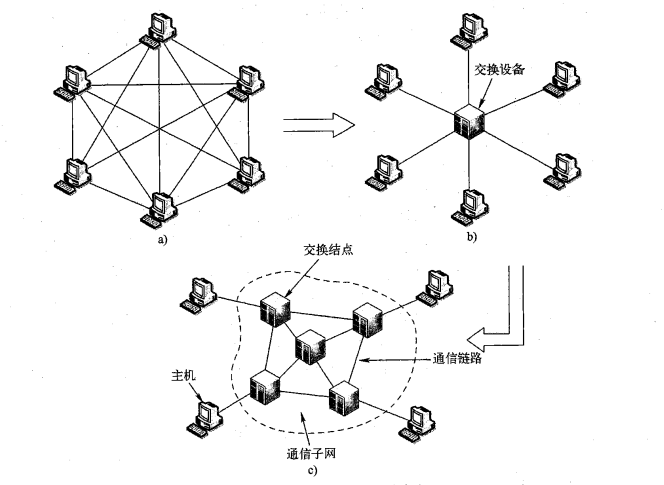

计算机网络的根本目的是在**网络边缘的主机之间**实现**相互的数据传输、信息交换**。

**完全网状网络**:

- **同时通信**: 一个主机为了**同时**与其他主机通信，可以选择**直接连接所有主机**，构成**完全网状网络**，如图a所示。
- **链路数量:**在完全网状网络中，如果主机数为N, 则每个主机需要同时建立(N-1)条链路，整个网络共需要$  \frac{N(N-1)}{2}$条链路。
- **完全网状网络的问题:** 每增加一个主机, 就要增加(N - 1)条链路, 当网络规模较大（即N较大）时，完全网状网络是不可行的。

**有交换设备的网络**

- **多通信端口:** 交换设备具有多通信端口，可以同时连接多个通信结点（即主机或交换设备)
- **并行通信:** 实现通信端口间物理或逻辑上的动态、并行通信。
- **只需一个链路:** 通过交换设备，每个主机只需一个通信链路与交换设备相连，即可实现与其他主机的通信，如图b所示。
- **有交换设备的网络的问题:** 一个交换设备的**端口数量是有限**的，并且也无法通过一条通信链路直接连接距离遥远的主机或通信设备，因此，只有在特殊情况下，如小规模局域网，才有可能如图b所示利用一个交换设备直接连接所有主机。

**数据交换网络:**

- **数据交换网络:**  将许多**交换设备互连**，构成一个数据中继与转发的“中间网络”，然后再将主机连接到距离较近的交换设备上，主机之间的数据传输通过“中间网络”实现中继与转发。这个"中间网络"称为数据交换网络.
- **数据交换网络的功能:** 数据交换网络**不关心传输数据的内容**，而只是为数据提供**端到端的数据中继和转发功能**
- **交换节点与网络核心:** 组成交换网络的结点（即交换设备）称为交换结点，交换结点和传输介质的集合称为通信子网，即网络核心. 如图c所示。
- **数据交换技术:** 常见的数据交换技术包括电路交换(circuit switching)、报文交换(message·switching)和分组交换(packet switching)。基于不同交换技术构建的网络分别称之为电路交换网络、报文交换网络和分组交换网络。

#### 电路交换


- **电话网络:**  电路交换是最早出现的一种交换方式，距今己有100多年的历史，而**电话网络则是最早、最大的电路交换网络**
- **电路:** 在电路交换网络中, 通过中间交换结点为两台主机之间建立一条专用的通信线路，称为电路. 电路是一种**面向连接**
- **电路交换三个阶段:**
  1. **建立电路:** 电路交换网络建立电路分为主机节点到交换节点和交换节点之间链路的建立两部分:
      1. **主机节点到交换节点的电路的建立:** 即主机节点到最近交换节点的电路的建立,  在电话网络中即通话的两部电话到离自己最近电话交换机的电路.
      2. **交换节点间电路的建立:** 交换节点之间通过选择和接续, 将端到端的电话机链接起来.
  3. **电路建立时间:** 电路交换的“接续”过程所需时间（电路建立时间)的长短与接续的中间交换结点的个数有关。
  2. **传输数据:**
  - **独享链路:** 主机节点为了充分利用物理链路的带宽，通常会采用相关的信道复用技术，如频分多路复用、时分多路复用等，将交换结点之间的线路进行信道共享，也就是说在交换结点之间通常包含有“n”条电路，这些电路彼此之间是独立的，每条电路专门为某一对特定主机间的通信服务，而主机到交换结点之间的链路则常为独占的。独享链路的优点是**速率稳定**
  - **透明传输:**中间结点也不对数据进行其他缓冲和处理，不需要添加额外控制信息，即为“透明”传输，因此交换效率高。
  3. **拆除电路:**
  1. **何时拆除:** 该释放动作可由两个通信主机之间任何一方发起并完成。如电话通信中, 可由任一方挂断电话.
  2. **通知节点:** 释放信号必须传送到电路所经过的各个结点(即所有交换节点和主机节点)，以便重新分配资源。
- **电路交换的优缺点:**
  1. **优点:** 透明传输 --> 传输速率高, 时延小
  2. **缺点:** 独享链路 ---> 信道利用率低, 传输速率单一

#### 报文交换

**报文交换的流程**

1. **附加信息生成报文:** 发送方把要发送的信息**附加上发送/接收主机的地址及其他控制信息**，构成一个完整的报文(Message)。发送方组装好报文之后即可向相邻的交换结点发出
2. **检查与存储:**交换结点收到整个报文并且检查无误后，暂时存储报文
3. **转发报文:**交换节点利用路由选择找出需要转发的下一个结点的地址，再把整个报文转发给下一个结点。

**报文交换的特点:**

1. 报文交换也称为消息交换。
2. **报文交换的节点间时延:** 一个报文在每个结点的延迟时间，等于在该节点的**处理时延**和**排队时延**。
3. **存储-转发:**然后以报文为单位在交换网络的各结点之间以**存储-转发**的方式传送，直至送达目的主机
4. **无连接:**报文交换不同于电路交换, 它是一个无连接的数据交换技术.  
5. **信道利用率高:**只有当报文被转发时才占用相应的信道，不存在电路交换中通信双方空闲时信道也要被占用的情况。因此，相对电路交换信道而言，报文交换线路利用率高。

**报文交换网络的缺点:**

1. **时延大:** 交换结点需要缓冲存储, 报文需要排队. 即增加了排队时延和处理时延.
2. **丢弃报文:** 当交换节点队列满时候, 不得不丢弃报文

#### 分组交换

**分组交换基本原理**

1. **分组交换的流程:**

   1. **分割报文:** 分组交换需要将待传输数据（即报文）分割成较小的数据块
   2. **附加信息:**每个数据块附加上地址、序号等控制信息构成数据分组(packet),每个分组独立传输到目的地，目的地将收到的分组重新组装，还原为报文。
   3. **存储-转发:**分组传输过程通常也采用存储转发交换方式。
   4. **重组报文:**当所有的分组到达对端后, 主机会根据分组的序号将分组重组成报文, 并交付给上层应用进程.

2. **分组交换的特点:**

   1. **最广泛:** 分组交换是计算机网络使用最广泛的一种数据交换技术，现代计算机网络几乎都是分组交换网络。
   2. **有限的分组长度:** 它将一个完整报文拆分成若干个分组，每个分组的长度有一个上限，**有限长度的分组使得每个结点所需的存储能力降低**，分组可以存储到内存中，提高了交换速度。

3. **分组交换的优点**

   1. **交换设备存储容量要求低**

      - 作为存储一转发交换方式，报文交换需要缓存整个报文，当报文很大时，要求报文交换设备具有很大的存储容量；分组交换将大报文拆分为较短的分组进行传输。理论上讲，分组交换设备只要能缓存一个小分组，网络就可以工作。
   2. **交换速度快**

      - 由于报文被分割成更小的分组, 所以在交换节点中的交换速度更快
   3. **传输效率高**

      - 对于传输过程出错的数据，纠正错误的最常见措施是请求发送方**重新发送出错的数据**，直到接收端接收到正确的数据为止。
      - 对于报文交换, 出错时需要重传整个报文, 而分组交换只用重传出错的分组. 故而效率高
   4. **更加公平**
        - 交换节点中若链路出现拥塞, 数据的传输需要排队.  
        - 报文交换可能会出现, 大报文持续占用链路, 从而小报文需要更长的时间才能到达目的地的情况. 分组交换由于将报文分割成更小的分组, 在单位分组的角度上, 每个报文的传输更加公平

#### 数据报网络和虚电路网络

> 数据报网络和虚电路网络是两种不同"分组交换网络"

**数据报网络:**

               1. **概念:** 分组交换网络中按照**目的主机地址进行路由选择(转发)**的网络称为数据报网络。
               2. **因特网:** 因特网的IP都是按照目的地址进行路由选择的，因此**因特网是一个数据报网络**。
               3. **无连接的:** 数据报网络提供"无连接的"服务, 无连接的发送方和接收方之间不存在固定的连接（或路径），所以发送的分组和接收的分组次序不一定相同，每个分组被传送的路径也可能不一致。

**虚电路网络:**

- **虚电路的构成:**
  1. **路径:** 从源主机到目的主机之间的一条路径（即一系列的链路和分组交换机)
  2. **VCID:**通讯路径中的**每段链路对应的虚电路都有虚电路号**，称为虚电路标识(VCID),  沿某条虚电路传输的分组中包含所属虚电路的VCID
  3. **转发表:** 该路径上每台分组交换机的转发表中记录虚电路标识的接续关系。

- **虚电路的特性:**
  1. **有序传输:** 由于虚电路确定了一条从源到目的的路径，因此沿同一条虚电路顺序传输的系列分组，一定可以按同样的顺序到达目的（丢失除外），也就是说，虚电路网络**可以保证分组传输顺序**，接收端**无须对分组重新排序**。
  2. **可靠传输:** 虚电路网络通常**由网络本身完成可靠传输的功能**，即虚电路网络分组交换机需要实现可靠传输, 分组交换机更加的复杂. 而数据报网络中的可靠传输由通信的端系统的传输层实现, 分组交换机相对简单
  3. **全部带宽:**分组在通过某链路（经过该链路可能存在多条虚电路）传输时，**通常使用该链路的全部带宽**，这是完全有别于电路交换的。
  4. **逻辑电路:** 虚电路网络是一种分组交换网络，虚电路只是标识了从源到目的的一条网络层逻辑连接，并不需要为每条虚电路分配独享资源。
  5. **面向连接:** 虚电路网络**在网络层提供面向连接**的分组交换服务。通信之前，双方需要先建立虚电路，通信结束后再拆除虚电路。为区别于电路交换中的电路，称之为虚电路。
- **虚电路网络中的转发:** 虚电路网络设备根据分组所携带的VCID判断其所属的虚电路，从而决策如何转发分组，并确保分组沿对应的虚电路送达目的地方。

**虚电路网络示意图:**

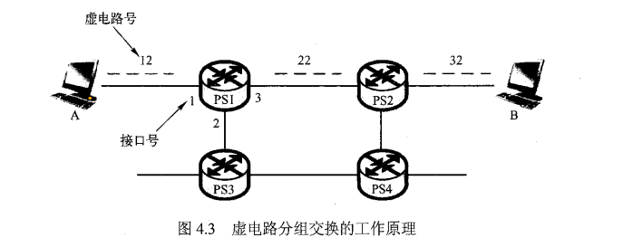

**虚电路网络转发表 :**

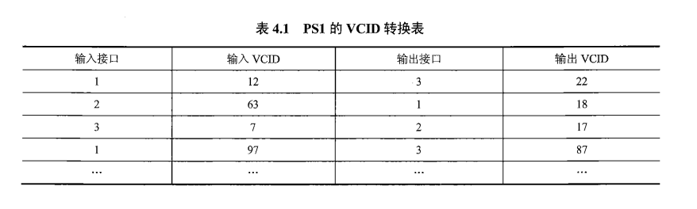

**虚电路与数据报电路对比**

| 对比点    | 虚电路分组交换网络             | 数据报分组交换网络             |
| ------ | --------------------- | --------------------- |
| 连接     | 面向连接的                 | 无连接的                  |
| 分组到达顺序 | 总是有序的                 | 未必有序的                 |
| 分组首部   | 每个分组必须有VCID           | 每个分组必须有源地址和目的地址       |
| 单点故障   | 虚电路中有交换节点故障, 整个虚电路不通  | 受单点故障影响较小.            |
| 可靠传输   | 可靠传输由虚电路网络, 即数据交换节点实现 | 可靠传输由端系统, 即通信主机的传输层实现 |
| 典型应用   | X.25, 帧中继,ATM         | 因特网                   |

### 接入网

接入网是将端系统接入网络核心的网络服务. 它提供了端系统与网络核心之间的**物理连接(物理线路)**和**接入服务(如DNS服务等)**

1.电话拨号接入

- **用户线路:**电话连接电话端局(电话交换机)的线路称为用户线路(Subscriber .Line), 拨号接入和下面的ADSL都是使用用户线路接入网. [端局与拨号上网示意图](https://www.20nn.cn/tongxin/ne-ju.html)

- **调制解调:** 电话拨号接入是利用电话网络,通过调制解调器(modem)将数字信号调制成模拟信号, 在电话线路传输. 传送到远端后,再利用调制解调器将模拟信号解调成数字信号。

- **链路带宽有限:** 拨号上网方式的接入链路带宽有限,**最大带宽通常为56 kbps**,对于现代 Internet W络用户来说,显然带宽太低,所以这种接入方式现在已经很少使用。

2.非对称数字用户线路ADSL (Asymmetrical Digital Subscriber line)

- **用户线路:**ADSL也是利用现有的电话网络的用户线路实现的接入网络。
- **同时进行语音通信与网络通信:** ADSL 使用**频分多路复用技术**实现电话语音通信与数字通信(即网络数据传输)共享一条用户线路,**同时进行电话语音通信与网络通信**,这与传统的拨号接入存在很大差异。
- **"非对称":**之所以称为“非对称”数字用户线路,是因为在ADSL接入网络中,在用户线路上实现的**上行(上传数据)带宽比下行(下载数据)带宽小**。
- **上行与下行速度:** 可以实现的上行和下行带宽与用户线路的长度有关系,当用户线路长度在3~5km范围时,典型的上行带宽为512 kb/s~1 Mb/s,下行带宽为1~8 Mb/s.当用户线路长度在13km内时,可以实现更高速率的ADSL,其典型的下行带宽可以达到55 Mb/s,上行带宽可以达到19.2Mb/s。(注: 在不超过上限情况下用户线路越长, 上下行速度越快)

3.混合光纤同轴电缆HFC接入网络

- **有线电视网络:** HFC (Hybrid Fiber-Coaxial)接入网络也称为**电缆调制解调器(cable modem)**接入, 是利用**有线电视网络**实现网络接入的技术。
- **用户端的连接过程为:**HFC接入网络的用户端的连接过程为: 终端--> 电缆调制解调器 --> 有线电视网的入户同轴电缆 ---> 光纤结点(光电转换器) ---> 光纤传输 ---> 有线电视网络公司 --> 接入网络
- **频分多路复用技术**: HFC基于频分多路复用技术,利用有线电视网络同轴电缆剩余的传输能力实现**电视信号传输与网络数据传输**的共享。
- **"非对称":**HFC也是“非对称”的,即上行带宽小于下行带宽,典型上行带宽为30.7 Mb/s,下行带宽为42.8 Mb/s.
- **共享式接入:** HFC是共享式接入, 即连接到同一段同轴电缆上(比如同一栋住宅楼内)的用户共享上行和下行带宽。假设同一段同轴电缆的接入用户数为10个,上行带宽为30Mb/s,下行带宽为40 Mb/s, 如果所有用户都进行通信,则每个用户平均占有的上下行带宽分别是3Mb/s 4Mb/s.可见,当 HFC 享用户数量较大时,每个用户获得的实际带宽可能并不高。因此,虽然HFC接入的上下行带宽表面看要比ADSL带宽高,但是当用户数量较大时, HFC 入没有ADSL 入速率快,因为,**ADSL是独享式接入**。

4.局域网

- **边缘路由器连接:** 企业、学校等机构会在组织范围内建设局域网, 连接所有需要接入外部网络(如Internet)的主机, 然后通过企业网络或校园网的**边缘路由器连接**网络核心。
- **局域网技术:**典型的局域网技术是以太网、Wi-Fi等。事实上,除了企业、校园等机构网络在用局域网接入网络核心, 现在随着光纤到户(Fiber to the Home,FTTH)的推广与普及,越来越多住宅小区的家庭用户也采用局域网技术实现网络接入。

5.移动接入网络

- 移动接入已成为Internet 入的重要途径;尤其对于个人移动设备的接入,移动接入网络是不可替代的,而且将成为个人设备接入网络的首选途径。

### 分组时延及计算方式

1. 处理延时
   - **出错:**检查分组是否出错的时间
   - **检查:** 检查分组首部的时间
   - **查询:**查询分组路由表的时间
2. 排队延时
   - 输出链路拥塞情况下, 在队列排队等待输出的时间, 不固定
   - ${I(流量强度)} = { \frac{ {L(1个分组的bit数, 长度 )}   *   {a (每秒到达的分组数量 )} }{ R(链路的带宽 ) } }$ **, 当流量强度 >= 1时候, 排队延时趋向无穷大**. 举个例子, 如果链路的带宽为1mbps, 在1s中经过该链路的数据大于等于1mb, 则该链路排队延时无限大, 会导致瘫痪
   - $ {t(排队延时)} = {\frac{ I }{ 1 - I }} * {\frac{ L }{ R }}  $ , 其中I是流量强度, L是分组的平均长度, R是链路的带宽
3. 传输延时(transmission)
   - $ R = 带宽({bps}) $ ,$ L = 数据量({ bits }) $  
   - 则:  $ {一个bit的传输时间} = { \frac{1/bit}{R/bps} }  $ , $  t (传输延时) = \frac{L}{R} $
4. 传播延时(propagation)
   - 传播延时在距离近的时候可以忽略不计, 在超长链路时候必须计算
   - $ {d}={物理链路的长度} $, $ {s} = {在媒体上的传输速度} $
   - $ {传播延时} = {\frac{d}{s}} { (s/秒 )}$

**例题1 :**  假设分组长度L = 1000B, 链路带宽R = 10Mbit/s, 则传输延迟为?

解: $因为: 1B = 10^{-3}KB = 10^{-6}MB, 故L = (1000 *10^{-6})MB = 10^{-3}MB = 8*10^{-3}Mb $

​     $故 T_{传输} = \frac{L}{R} = \frac{8*10^{-3}Mb}{10Mb/s} = 8* 10^{-4}s$

### 物理设备

#### 路由器

##### 异构网络互联

- **异构网络定义:**  
  1. 异构网络主要是指两个网络的**通信技术**和**运行协议**的不同。
  2. **通信技术的不同:**如以太网和无线局域网, 前者是基于双绞线的有线通信. 后者是基于无线电波的无线通信.
  3. **运行协议不同:**如以太网和无线局域网, 前者是的协议是IEEE 802.3标准. 后者的协议是IEEE 802.11标准
- **实现异构网络互联基本策略:**
  1. 实现异构网络互连的基本策略主要包括**协议转换**和**构建虚拟互联网络**。
  2. **协议转换实现机制**: 协议转换机制采用一类支持异构网络之间协议转换的网络中间设备，实现异构网络之间数据分组的转换与转发.
  3. **构建虚拟互联网络:** 通过构建虚拟互联网络机制的异构网络互连是在现有异构网络基础上，构建一个同构的虚拟互联网络，异构网络均只需封装、转发虚拟互联网络分组，同时引入虚拟互联网中间设备互连异构网络，实现在异构网络间转发统一的虚拟互联网的数据分组。
  4. **关于构建虚拟互联网络自己的理解**
     1. **异构互联网网络:**  底层如以太网, 无线局域网连接的网络由于是不同结构的, 即通信技术和运行协议不同, 所以是异构互联网网络.
     2. **构建异构互联网:**即在**异构互联网的基础上构建虚拟互联网**. 在上例中即在以太网和无线网上构建网络层的IP层.
     3. **异构互联网的中间设备:**异构互联网的中间设备的作用即转换协议. 在上例中, 异构互联网的IP层, 中间设备为路由器.  路由器负责实现以太网和无线局域网协议的转换.
     4. **中间设备转换协议:** 中间设备如路由器, 它的转换协议是通过**解封装-再封装**实现的, 即如果接受到一个以太网帧, 将其解封装成IP数据报, 查表后明确转发的接口. 转发前需要将其再封装成输出接口的链路层的帧.

##### 路由器概念

1. 路由器是一种具有**多个输入端口**和**多个输出端口**的专用计算机
2. 路由器主要任务是**获取与维护路由信息以及转发分组**。
3. 路由器从功能体系结构角度，可以分为**输入&输出端口**、**交换结构**、与**路由处理器**。

##### 输入端口

1. **输入端口的组成:**输入端口由**物理层, 数据链路层, 网络层, 路由转发表, 缓冲队列**组成.

2. **物理层的作用:** 物理层的作用是将**基带信号编码成数字信号**, 还原出数据链路层帧并交付给数据链路层.

3. **数据链路层的作用:** 数据链路层的作用是**提取IP数据报(或其他网络层协议分组)**, 并将IP数据报交给网络层.

4. **网络层的作用:** 网络层的作用是根据IP数据报的IP地址, 检索路由表, 找出转发输出的接口. 并将数据报交给交换结构来进行转发.

5. **路由转发表**:

   1. **转发表副本:**通常路由器 **每个输入端口**内都会存有转发表的一份副本，转发表由路由处理器进行计算和更新，并通过某种方式复制到每个输入端口。
   2. **分布式查询**: 路由器的查表转发是将位于路由处理器的集中式路由查询，转换为在每个输入端口分布式路由查询，不仅降低了路由处理器的压力，而且提高了查询效率。

6. **缓冲队列**

   1. **为什么输入端口需要缓冲队列:** 假设输入端口接收到分组的速率超过了交换结构对分组进行交换的速率，如果不对输入端口到达的分组进行缓存，那么将导致大量丢包情况的发生，所以输入端口除了需要提供查找、转发的功能，还需要提供对到达分组的缓存排队功能。

   2. **缓冲队列的种类(调度策略):**

      1. **普通队列**: 先入先出( FIFO )
         - 先到达的分组线输出, 后到达的分组后输出
      2. **优先级队列**
         1. **对分组标记优先级:**通过某种办法( 高级计网的知识 )在到达的分组上做标记( 优先级 ), 以此可以将到来的分组区分为若干类
         2. **创建队列:** 为每个优先级再建立先进先出的队列, 该队列满足FIFO的特性
         3. **先高后低:**优先将高优先级队列的分组输出, 再输出低优先级队列的分组
      3. **循环输出队列**
         1. **对分组标记优先级:**通过某种办法( 高级计网的知识 )在到达的分组上做标记, 以此可以将到来的分组区分为若干类
         2. **创建队列:**为每个类再建立先进先出的队列, 该队列满足FIFO的特性
         3. **循环队列:**从优先级高的队列开始输出, 每次输出一个不同类队列里的**所有分组**,  循环这个过程
      4. **加权平均队列( WFQ ) + 时间片轮转**
         - **对分组标记优先级:**通过某种办法( 高级计网的知识 )在到达的分组上做标记, 以此可以将到来的分组区分为若干类
         - **分配权重:**为每以类分配权重, 循环每一个类输出
         - 若第$ i $ 类的权重标记为$ Wi $, 则每个类享受的带宽比例为 $    \frac{Wi}{ {\sum} {Wi} } $
         - **划分带宽能力采用时间片轮转的方式, 假如时间周期的时间为T, 则每一类在单位时间中使用的时间为$     \frac{Wi}{ {\sum} {Wi} }  * T ​$**

      ​

##### 交换结构

- **交换结构的作用:** 输入接口处理完比特流后, 被解封装出的IP数据报经过查表转发, 会**通过交换结构交付**给对应的输出接口

- **交换结构的种类:**交换结构有以下实现方式, 分别是基于内存, 基于网络, 基于总线的的交换结构.

  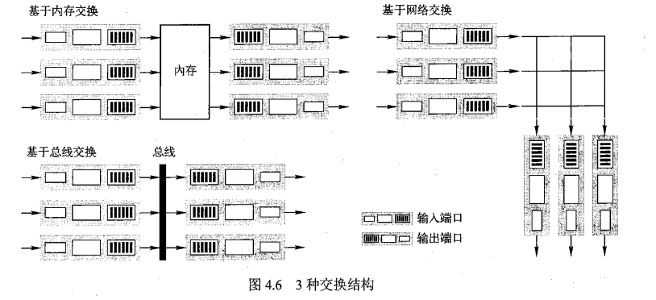

  1. **第一代: 基于内存的交换结构**

     - **交换过程:**  输入端口时将分组送至内存，路由处理器读取内存, 对分组首部进行解析，获取其目的IP地址，并根据目的地址查找转发表，确定将该分组发至哪个端口，进而将分组由内存复制到相应的输出端口.
     - **交换速度的局限:** 交换速度主要受限于内存的**读写速度**.

  2. **第二代:基于总线的交换结构**

     - **交换过程**
       1. 路由器的输入端口与输出端口同时连接到一条数据总线上
       2. 输入端口的分组首先经过查询转发表，确定要转发到的输出端口
       3. 分组经由数据总线传输至指定输出端口
     - **交换速度的局限:**
       1. 交互速度受限于总线的带宽, 即总线的数据传输能力.
       2. **总线竞争:** 由于总线具有独占性特征，因此，当多个输入端口有分组到达时，只有一个分组能够通过总线传输到相应输出端口，而其他输入端口的分组只能排队等待。

  3. **第三代: 基于网络的交换结构**

     - **网络的种类:** 基于网络的交换结构又细分为**纵横网络**和**榕树网结构**.

      - **网络结构:** 在基于总线交换的交换结构中，同一时刻只能有一个分组通过总线进行传输，这显然会影响分组交换的效率。因此，为了克服单一、独占式的总线所带来的限制，可以使用一个复杂的互联网络来实现交换结构。
      - **网络交换的优点:**相比于基于总线交换，基于网络交换可以实现并行交换传输，使得交换效率得到了较大的提高。
      - **交换速度的局限:**需要注意的是，若两个分组经由不同的输入端口到达，且均需要转发到相同的输出端口，则在同一时刻只能转发其中一个分组，而另一个需要等待。

##### 输出接口

**输出接口的组成:**路由器的输出接口由**队列,网络层, 物理层, 数据链路层组成**

1. **缓冲队列**: 输入接口解封装成IP数据报, 查路由表后, 通过交换结构传送给输出接口. 每个数据包先在缓冲队列中排队.
2. **网络层:** 将队列中的IP数据报按照调度策略(详细见输入接口的调度策略)依次取出, 若IP数据报大于输出链路的MTU, 则需要将其分片. 将处理好的IP数据报交给数据链路层.
3. **数据链路层:** 根据输出接口的链路的网络类型封装成帧. 将帧传送给物理层.
4. **物理层:** 将数据帧调制信号, 通过传输媒介传输.

##### 路由处理器

- **路由处理器:** 路由处理器就是路由器的CPU,负责执行路由器的各种指令，包括**路由协议的运行**、**路由计算**以及**路由表的更新维护**等。
- **路由处理器的基本功能:** **转发**与**路由选择**是路由器两项最重要的基本功能。
- **路由表的配置方式:** 通过静态（人工方式）或者动态（运行路由协议)获取的路由信息被保存在路由表（即转发表）中，供分组转发时使用。
- **路由表的匹配原则:**  路由表的匹配原则即**最长前缀匹配原则**: 如果除默认路由外，只有一条路由项匹配成功，则选择该路由项对应的接口，转发该IP数据报：如果除默认路由外，有多条路由项匹配成功，则选择网络前缀匹配成功位数最长的路由项，通过该路由项指定的接口转发该IP数据报.

#### 中继器

1) **功能:** 信号的再生,整形,放大. ( 信号在传输过程可能有一定程度的失真和衰减 )

2) **端口要求**

- 中继器一般**只有两个端口**
- 两个端口需要**同处于一个子网**
- 两个端口可以**连接不同的传输媒体**( 如一端连接双绞线, 另一端链接同轴电缆 )
- 两个端口的的网络不能使用不同的数据链路层协议, 即**不能连接异构网络**

3) **连接要求**

1. **不能无限制的连接:** 中继器的使用要遵循5-4-3原则，这是对中继器使用的限制，受网络延迟和负载情况的限制，不能无限制的连接
2. **5-4-3原则:** 所谓543原则，是指在一个10M网络中，一共可以分为5个网段，其中用4个中继器连接，允许其中3个网段有设备可以连接客户机，其他2个网段只是传输距离的延长。


#### 集线器

**集线器**

1. **MAC协议:** 集线器使用的媒体访问控制协议为CSMA/CD协议
2. **碰撞:**集线器不检测碰撞, 由各站的网卡负责碰撞检测
3. **集线器的能力:** 集线器有部分**纠错能力**和**网络管理能力**, 如站点故障, 逻辑上自动断开与该站点上的连接
4. 集线器是**物理层设备**.
5. **集线器的分组交换原理:** 若干主机连接到集线器上, 形成数据交换网络, 当一个主机将数据发向集线器后, 集线器会向除发送方的所有主机广播该数据. 各主机通过比对目的MAC地址, 决定是丢弃还是保留该帧

**集线器以太网**

1. **组成:**集线器以太网由**RJ-45接口的接线器, 双绞线电缆, 集线器, 主机**组成
2. **拓扑:** 集线器以太网物理上是星形网络, **逻辑上是总线型以太网**(HUB相当于总线)
3. **通讯方式:**集线器以太网为**半双工通讯**, 即双方都支持发送和接收数据, 但同一时间只允许支持或发送数据
4. **集线器扩展以太网:**会导致成冲突域和广播域的扩展

==集线器的特点==

==集线器扩展网络==
扩展前的集线器网络

扩展后的集线器网络, 扩大了冲突域


#### 网卡


| 网卡电子元件    | 作用                                       |
| --------- | ---------------------------------------- |
| EEPROM    | 1) ROM即Read-Only Memory 只读存储.存储在制造过程中被写入的**永久性数据和指令, 如MAC地址**.**一般不能操作**.<br />2) EEOROM是ROM的一种, 允许了**重新写入**, 使用**电子方式擦除原有永久性数据, 允许重新编程**. |
| 芯片        | 1) 实现网卡物理层和链路层的功能<br />2) **物理层:** 对于发送方的网卡来说, 功能是数据链路层的帧调制信号后通路传输媒体发送, 对于接收方的网卡来说, 作用是信号解调出数据链路层的帧, 并交付给上层数据链路层.<br />3) **数据链路层:** 数据链路层的功能是将IP数据报的封装成帧, 或者将MAC帧解封装成IP数据报. |
| BootROM插槽 | 1) 用于网络无盘工作站的启动<br />2) "无盘工作站" 是指计算机或终端设备在**启动**过程中**不使用本地硬盘来加载操作系统**，而是从网络上的服务器获取操作系统镜像或其他必要的启动信息。 |
| 网络隔离变压器   | 使核心芯片与外部隔离, 提高干扰能力, 对核心芯片进行保护.           |

#### 交换机

**二层交换机**

> 二层交换机工作在数据链路层和物理层(因为能看到MAC帧)

##### **交换机的基本工作原理**

交换机的每个端口都工作在混杂模式（即**无论帧的目的MAC地址是什么，都会接收该帧**)，可以接收任何一个帧，是否需要转发处理，由查询交换表后来决策。


**交换机的接口**

1) **接口通讯模式:** 交换机的每个接口都是**全双工的**
2) **接口带宽:**交换机常见的以太网接口: Fast Ethernet(支持10/100Mbps, 百兆网口) Gigabit(支持1000Mbps,千兆网口)

##### 交换机的交换方式

- **主要方式: 存储一转发:** 以太网交换机的基本工作方式是**存储一转发**.

  - **存储:** 存储的含义即将帧进行暂存, 进行差错控制检验, 等操作
  - **转发:**即通过查询MAC帧交换表, 将帧从输出接口转发出去.

- **其他方式: 直通交换方式**

  - **底层实现:** 交换机内部采用了专用的交换结构芯片, 是**基于硬件的交叉矩阵**

  - **工作原理:**
    1. **主要特点:** 直通交换主要特点是**边接受**数据帧, **边查表**, **边转发**帧.
    2. **例子:** 对于以太网帧，直通交换的交换机在接收到前6个字节的目的MAC地址后，就可以通过查交换表，知道该如何转发该帧，于是就可以边接收边转发；这样一个帧在交换机最理想情况下，只产生6字节(目标MAC地址的大小)传输时延。
  - **直通交换方式的优缺点**
    1. **优点:** 如果在这种交换机的内部采用基于硬件的交叉矩阵，**处理(交换)时延就非常小**。
    2. **缺点:** 直通交换的一个缺点是**不检查差错**就直接将帧转发出去，因此有可能也将一些无效帧转发给目的（或其他）主机。

##### 自学习算法

1. **初始交换表状态:**  初始时（比如刚一上电时)，交换机的交换表是空的, 交换机的交换表是在网络的运行过程中，通过自学习算法自动地逐渐建立起来的。
2. **接收帧并查询交换表:**
   - 当交换机的某个接口接收到数据帧后, 立即将数据帧的MAC地址提取出来, 并查询交换表中是否有对应的表项.
   - **若不存在表项:** 若不存在表项, 立刻新增一条该数据帧MAC地址与输入接口编号的表项. 这个过程即自学习的核心步骤.
     1. **泛洪:** 新增表项后, 还需要以泛洪的形式, 向除了输入该数据帧的接口外的所有接口, 转发该数据帧.
     2. **核对MAC地址:** 接收到数据帧的所有主机, 通过核对网卡中EEPROM中的MAC地址与数据帧的MAC地址是否相同, 决定是否留下该数据帧.  
   - **若存在表项:** 若存在目标MAC地址与输出接口对应的表项, 则直接将数据帧从表项中的输出接口输出
3. **周期性删除表项**: 帧转发表每条表项不是永久的, 有自己的最大生命周期, 是因为MAC地址与接口不是永远一一对应的关系. 数据交换机会周期性的删除一些表项.
4. **接口转发的特点:**
   - 接口有**类似水平逆转**的特性, 即不会**向同一接收帧的接口转发该帧**,而是丢弃该帧.
   - 例如下图从G->A, 数据帧不会通过A接口存储转发


假设以上述网络拓扑为例,由A->B, B->A,E->A依次发送包,你能 阐述自学习算法的过程吗?(忽略ARP的过程)

##### 交换机的冲突域

- **扩展广播域, 隔离冲突域:** 以太网交换机，可以实现帧的选择性转发，通过交换机互连的主机，不再属于一个冲突域，不会发生传统的冲突，交换机实现了冲突域的分割。可以说交换机**只扩展广播域, 隔离冲突域**
- **交换以太网:**
  - 如果以太网的主机全部通过交换机互连，则一个冲突域最多只有一台主机, 传统的冲突便不会发生, 这类以太网称为交换以太网.

##### 交换机的生成树协议(STP)

> 生成树协议是为了解决交换机以太网组网中的环路问题
> 生成树协议属于超纲内容, 了解即可

下图为以太网环路拓扑, 其会导致

1) 广播风暴导致的环路, 广播帧在网络帧内顺时针和逆时针两个方向旋转
2) 广播风暴导致的帧交换表震荡, 对于每交换机, 同一广播帧不断从除了发出原帧的接口接收, 导致不断修改帧交换表
3) 主机收到冗余的数据帧


下图为一个物理环形拓扑结构, STP通过算法算出一个逻辑上的生成树作为其逻辑拓扑结构


## 章二: 应用层

### DNS

#### 层次化域名空间

**层次结构:** DNS服务器按层次结构进行组织, 并且该**服务器层次与域名的层次相对应**。

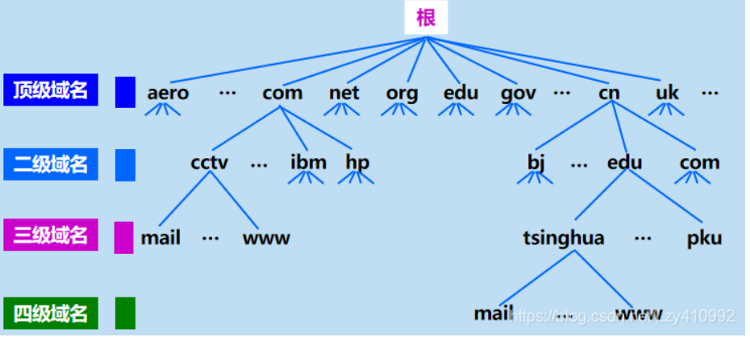 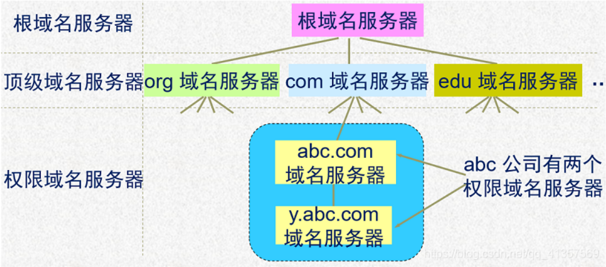

**域名**
域名的结构各符号之间用点隔开, 级别高的域名排列在后方. 例如,“….三级域名.二级城名.顶级城名”

**顶级域名:**

1) 国家顶级域名: 如`cn` 中国,us 美国,`uk` 英国等。
2) 通用顶级域名: 如com (公司和企业)、net (网络服务机构)、org (非盈利性组织)、edu (教育机构)、 gov (政府部门)、mil (军事部门)、int(国际组织)。
3) 基础结构域名: 这种顶级域名只有一个,即 arpa,用于反向域名解析,因此又称为反向域名。

#### 域名服务器

**域名服务器的分类:** 域名服务器分为根域名服务器、顶级域名服务器、权威域名服务器、中间域名服务器4类。

**根域名服务器:**

- **13个根域名服务器:** 在因特网上共有13个根域名服务器, 它们的名字是用一个英文字母命名,从a-直到m(前13个字母),如arootservers.net. b.rootservers.net,…"、m.rootservers.net.
- **保存管理:**每个根域名服务器都知道所有的顶级域名服务器的域名和IP地址。
- **查询服务:** 根域名服务器通常只提供迭代查询服务, 当根域名服务器收到本地域名服务器的迭代查询请求报文时, 通常在响应报文中告诉本地域名服务器下一步应当查询哪一个域名服务器, 本地域名服务器则继续查询下一个域名服务器, 直到查询到被查询域名主机的权威域名服务器。

**顶级域名服务器:**

- **保存管理:** 顶级域名服务器负责管理在该顶级域名服务器注册的所有二级域名。
- **顶级域名服务器的名称:** 顶级域名服务器的名称对应一个域名的最后一个名字, 是对一个行业的命名,如com, org ,或对一个国家的命名,如cn, us 。

**权威域名服务器:**

- **保存管理:**  一个服务器所负责管辖的范围叫作区。每一个区设置相应的权威域名服务器, 用来保存该区中的所有**主机的域名到IP地址的映射**。
- **域名解析:** 在进行域名解析时,只要查询到被查询域名主机注册的权威域名服务器, 就可以获得该域名对应的地址信息。

**中间域名服务器:**

- **三不是:**既不是根域名服务器, 又不是顶级域名服务器,也不是权威域名服务器的域名服务器,这些域名服务器称为中间域名服务器。
- 例如,某主机域名为www.abc.xyz.com,则可能存在的域名服务器包括顶级域名服务器.com,中间域名服务器xyz.com,权威域名服务器 abc.xyz.com.

**默认域名服务器:**

- **本地域名服务器:** 任何一台主机在网络地址配置时, 都会配置一个域名服务器作为默认域名服务器. 通常称为本地域名服务器,是主机进行域名查询过程中**首先被查询**的域名服务器。
- **域名解析过程:** 主机任何时候进行域名解析, 都会将査询请求发送给默认域名服务器;  该服务器如果缓存了被查询域名的信息, 则直接做出响应, **如果没有, 则首先求助于根域名服务器**, 直到查询到结果,最后将查询结果发送给查询主机。
- **查询服务:**通常本地域名服务器都提供递归查询服务。

#### 域名解析过程

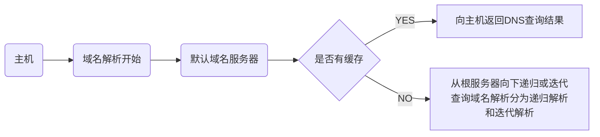

- **提供递归查询服务的域名服务器**:
  - **可以代替:** 可以代替查询主机或其他域名服务器, 进行进一步的域名查询, 并将最终解析结果发送给查询主机或服务器

- **提供迭代查询的服务器:**
  - **不会代替:** 不会代替查询主机或其他域名服务器, 进行进一步的查询, 只是将下一步要查询的服务器告知查询主机或服务器

### 电子邮件

> 电子邮件系统主要包括邮件服务器、简单文件传输协议( SMTP )、用户代理和邮件读取协议等.

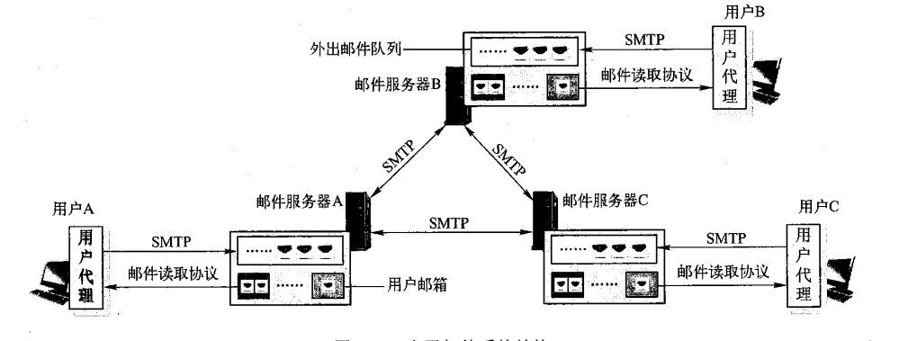

#### **邮件服务器**

- **功能:**  邮件服务器的功能是收发邮件, 同时还要向发信人报告邮件传送的状态( 已交付、被拒绝、丢失等 )
- **注册:** 用户需要向某个邮件服务器申请注册一个邮箱, 邮件服务器为每个邮箱分配一定的存储空间,  用于存储发送给该用户的邮件。
- **地址:** 每个用户的邮箱都有一个唯一的电子邮件地址,格式为: 收件人邮箱名@邮箱所在主机的域名(或IP地址)
- **队列:** 邮件服务器维护管理一个外出邮件队列, 队列中暂存注册用户等待向外发送的邮件。
- **工作方式:**邮件服务器之间发送和接收邮件时按照C/S方式工作。一个邮件服务器既可以作为Client,又可以作为Server。
- **进程:** 一个邮件服务器通常至少包含两个进程: 邮件发送进程((mail sender)和邮件接收进程(mail receiver)。
- **端口:** 邮件接收进程通常绑定25号端口, 用于接受邮件并放入发送队列. 邮件发送进程实时监测外出邮件队列,只要队列不空, 就依次从队列中取出一个邮件, 向接收方的邮件服务器的25号端口发送。

#### **用户代理**(User Agent)

- **软件:**用户代理是电子邮件应用的客户端软件,为用户提供使用电子邮件的接口。
- **功能:** 用户代理的主要功能是支持用户撰写、显示、处理和收发邮件, 为用户阅读、回复、转发、保存和撰写邮件等提供编辑与操作环境。

#### **SMTP( 简单文件传输协议 )**

- **功能:** SMTP是实现邮件**邮件服务器间**发送邮件的应用层协议 另外, **用户代理向注册邮件服务器**发送邮件时,通常也是基于SMTP。

- **可靠数据传输:** SMTP 使用用传输层**TCP** 现可靠数据传输, 在发送邮件时, SMTP客户端首先请求与服务器端的25号端囗建立TCP接

- **基本交互方式:** SMTP 基本交互方式是客户端发送可能携带参数的命令, 服务端对命令进行应答。

- **命令与应答:** SMTP定义了14条命令和21种应答信息, **每条命令用4个字母组成**, 而每一种一般 由一个**3位数字的代码**开始, 后面附上(也可不附上)**简单的文字说明**。

  - 命令示例: HEL0 163.com
  - 回答示例: 250 Hello 163.com, pleased to meet you.

- **特点:**

  > SMTP是一个基于ASCII码的, 持久的推送协议

  1. **基于ASCII:** SMTP 只能传送7位ASCII 文本内容, 包括SMTP 命令、应答消息以及邮件内容。因此, SMTP**不能直接传送可执行文件或其他的二进制对象**(例如,图像、声音、视频等), 包括许多其他非英语国家的文字(例如,中文、俄文等)都无法通过SMTP 直接接传送。在通过SMTP 传送送这类内容时,必须将这些内容转换为7位ASCⅡ码文本形式,接收邮件一方再将这些内容还原。
  2. **“推送”协议:** SMTP是“推动”协议。当客户端有邮件发送给服务器时,客户主动与服务器(25号端口)请求建立TCP 接,然后将邮件“推送”给服务器。这与HTTP “拉动”协议有很大区别。
  3. **持久的:** SMTP 的TCP连接接是持久的。在SMTP 邮件传输阶段, 在客户完成一封邮件传输后,**并不要求必须进入关闭阶段**。如果客户还有邮件需要继续向同一个服务器发送, 则可以利用已建立的TCP连接继续发送后续的邮件,直到没有邮件需要发送为止。

#### **电子邮件报文格式**

- **基本格式:** 电邮的基本格式分为 1. 首部 2. 空行 3.主体( body )

- **首部字段:**

  > 以下字段, 除To必填外, 都为选填. 且大部分由用户代理软件自动填写.

  1. To: 收件人的邮箱
  2. Subject: 邮件主题( 标题 )
  3. Cc: 抄送人的邮箱地址
  4. From: 发信人的邮箱
  5. Date: 发信日期
  6. Reply-to: 对方回信所用地址. 用于当前发信地址与届时回信地址不相同时填写.

#### **MIME**

- **转化成ASCII码:** MIME是在SMTP上的扩展. 解决了**如何将非ASCII码信息如何转化成ASCII码信息的问题**.  转换后的非ASCII码信息继续使用SMTP传输邮件.
- MIME在电子邮件报文的基础上, 扩展了以下首部字段:
  1. MIME-Version: 版本号.
  2. Content-description: 内容描述. 对邮件的概括
  3. Content-Id: 邮件的唯一标识符
  4. **Content-Transfer-Encoding:**采用的编码规范. 如通过邮件任意二进制文件, 则将此项设置为base64.
  5. **Content-type:** 邮件的内容. 如: image/jpg, text/html.  http协议也沿用了此首部

#### **文件读取协议**

> 由于SMTP是“推动”协议，所以不能用于用户从自己邮箱中读取邮件的操作。
> 当用户需要访问自己的邮箱，读取其中的邮件时，所使用的应用层协议是邮件读取协议。
> 显然，邮件读取协议需要以“拉动”方式运行

##### **POP3**

- **TCP:** 为了保证读取邮件过程的可靠性，POP3协议使用传输层TCP**。**
- **端口:** POP3客户端运行在用户代理中. POP3服务器运行在邮件服务器上, 通常守候在110端口号。
- **读取邮件流程:**
  1. **"推送: "**发送方用户代理先通过SMTP协议与服务器的25号端口建立TCP链接, 将邮件推送至服务器. 服务器将邮件存储在其队列中
  2. **"拉取: "**接收方用户代理使用POP3协议与邮件服务器的110端口建立TCP链接, 并拉取对应邮件.
- **POP3协议交互过程:**
  1. **授权阶段:**
     接收方用户代理需要向服务器发送用户名和口令（以明文形式，即非加密），服务器鉴别用户身份，授权用户访问邮箱。由于用户名和口令是明文传输的，所以其安全性并不高。授权阶段主要有两个命令：user\<username>和pass\<password\>,分别向服务器发送用户名和口令。
  2. **事务处理:** 用户代理向服务器发送POP3命令，实现邮件读取(下载)、为邮件做删除标记、取消邮件删除标记以及获取邮件的统计信息等操作。
  3. **更新阶段**: 客户发出了quit命令，结束POP3会话，服务器删除那些被标记为删除的邮件。

##### **IMAP**

- **解决的问题:** POP3允许用户下载邮件到本地尽心管理和存储. 不允许用户对远程服务器中的邮件进行管理, 比如为不同邮件创建不同的目录. IMAP解决了这个问题, 支持用户**创建远程文件夹并为邮件指派文件夹**, 并可以对邮件进行移动、查询、阅读、删除等操作.
- **IMAP的额外特性:**
  1. **维护了用户状态信息:** 与POP3不同，IMAP服务器维护了用户状态信息，例如，文件夹的名字以及哪些邮件与哪些文件夹相关联等。
  2. **允许读取邮件的部分内容:**  IMAP的一个重要特性是允许用户代理只读取邮件的部分内容，例如，一个用户代理可以只读取一个邮件的首部等。当用户代理访问IMAP服务器的网络带宽比较低，或者想先看一下邮件主题然后再决定是否要下载整个邮件时，这个特性就非常有用。

##### **HTTP**

- **现状:** 20世纪90年代中期，Hotmail率先采用了基于Web的电子邮件，时至今日，谷歌、网易以及几乎所有大学或者大型企业等也都提供了基于Web的电子邮件服务。
- **优点:** Web邮件的优点之一是用户代理就是普通的Web浏览器，用户无须为了使用邮件而安装专用的电子邮件用户代理软件，并且基于用户熟悉的Web操作方式收发邮件，用户体验更好。
- **Web邮件系统特点:**传统的邮件系统, 发送邮件以及邮件在邮件服务器中传递使用的是SMTP协议, 接收(下载)邮件使用的是POP3或者IMAP协议.  而在Web邮件系统中, **发送邮件和接收(下载)的协议使用的都是HTTP, 邮件在邮件服务器中传递时, 使用的是SMTP协议.**  

### 应用层协议应用使用的端口号与传输层协议

| 应用层协议 | 守候的端口号 | 基于的传输层协议 |
| ----- | ------ | -------- |
| HTTP  | 40     | TCP      |
| HTTPS | 443    | TCP      |
| POP3  | 110    | TCP      |
| SMTP  | 25     | TCP      |
| DNS   | 53     | UDP      |
| FTP   | 21     |          |

## 章三: 传输层

### 套接字( Socket API )

**套接字的定义:**

- **操作系统提供给进程的一组API:** Socket API是操作系统提供给进程的一组API。不同的编程语言可以基于操作系统提供的Socket API封装自己的网络请求函数/方法，从而实现对Socket API的使用。
- **套接字是用于标识对等层实体的网络会话的标识**: 当两个应用进程之间建立网络会话时, 操作系统会为会话建立唯一的socket标识. 操作系统会为该socket标识分配一个编号, 称为端口号

**TCP与UDP的Socket标识**

| 协议   | 组成                                       | 备注                                       |
| ---- | ---------------------------------------- | ---------------------------------------- |
| TCP  | 四元组: [ `src_ip, des_ip, src_port, des_port` ] | 1) TCP用四元组标识唯一Socket<br />2) TCP是面向连接的. 对同一个进程, 只用目的端口和目的IP是不能唯一标识Socket, 缺少了源端信息.  只用目的端口, 源端口, 目的IP也不能唯一标识Socket, 因为不同主机的源端口号可能相同, 源端口--> 目的端口不能标识唯一的连接. 只能用四元组标识两个主机之间的对等进程的会话关系 |
| UDP  | 二元组: [ `des_ip`, `des_port` ]            | 1) UDP使用二元组标识Socket<br />2) 在传输数据时, 传输层协议自动添加上[`src_ip, src_port`], 作用是让对等进程可以回传数据<br />3)为UDP套接字分配目的端口号有两种方法：<br />     - **自动分配:** 一种方法是创建一个UDP套接字时，传输层自动地为该套接字分配一个端口号<br />     - **bind()函数:** 在创建一个UDP套接字后，通过调用bind()函数为该套接字绑定一个特定的端口号。 |

**套接字API：**

| 套接字API                                   | 作用                                       |
| ---------------------------------------- | ---------------------------------------- |
| `SOCK_STREAM`                            | 常量: 表示创建的是面向TCP的会话                       |
| `SOCK_DGRAW`                             | 常量: 表示创建的是面向UDP的会话                       |
| `SOCK_RAW`                               | 常量: 表示创建的是绕过传输层, 直接与网络层通信的会话.<br />如应用直接收发ICMP协议报文 |
| `int socket( int family, int type, int protocal  )` | 创建Socket<br />family: 协议簇名, 是IPv4还是IPv6<br />type: 套接字类型, 是面向TCP, UDP, 还是直接面向网络层<br />protocol: 进一步指明TCP使用的协议, 是TCP还是UDP |
| `int close(int socket)`                  | 关闭socket连接                               |
| `int bind(int socket, socketaddr* myaddr)` | `socketaddr是一个具有IP和端口号的结构体.`<br />该API的作用是将套接字绑定与本地IP的端口号绑定<br />服务端一般会为TCP创建一个Welcome Socket( 监听套接字 ), 并绑定在一个端口上, 等待客户端的请求. 当客户端请求时候, Welcome Socket会再为每个会话创建Connect Socket <br />客户端一般不需要绑定端口号, 客户端会在发送请求时, 为会话分配临时端口号. |
| `int listen( int socket )`               | 将Welcome Socket 置与监听状态.<br />只用于服务端, 且是面向TCP连接的套接字 |
| `int connect( int socket, socketaddr* desaddr )` | 客户端调用该函数, 与服务端建立链接                       |
| `int accept()`                           | 接受TCP连接.<br />服务端会为TCP维护一个队列, 客户端所有尝试建立TCP链接的Socket被存储在此. 当调用这个API后, 会从队列中取出最靠前的Socket, 并创建一个新的Socket( Connect Socket ) |
| 其他.. 如 接受/ 发送数据, 查看/ 设置socket选项          |                                          |

### 传输层的功能

传输层的核心任务是**为应用进程提供端到端的**逻辑通信服务.

具体来说传输层需要实现以下功能

1. 传输层寻址( 端口号 )
2. 对应用层报文分段和重组
3. 差错控制检测
4. 可靠数据传输
5. 面向应用层实现多路复用/解复用
6. 流量控制
7. 拥塞控制

### 可靠数据传输

#### 不可靠传输

不可靠传输即数据在网络中传输中出现的 1. 乱序 2. 错误 3. 重复 4. 丢失等错误

1. 乱序

   **发送顺序和接收顺序不同:** 报文被划分为若干个分组在网络中分组传输,  每个数据包的传输路径都可能不相同, 每个传输路径的传输能力也可能不相同.  在这种情况下, **数据包的发送顺序和接收顺序可能不同, 即出现乱序**. 停等协议没有乱序问题.

2. 错误

   **位翻转:** 数据以二进制表示,  在信道中传输数据时会先由调制/解调设备将二进制数字信号调制为模拟信号(比如电磁波信号, 光信号)在信道中传输.  若信号在信道传输的过程中受到了噪声的影响,  在信号到达目的, 经过解调变成二进制数据的时候, 会出现错误. 其表现就是原本的01发生翻转.  这种错误被称为**位翻转**

3. 重复

   重复的原因主要来源有两点.

   1. **超时重传机制**, 如TCP协议, 发送方会在接收端长时间未收到包时, 即超时定时器到时时会再发一遍包, 此时接收方可能会出现收到多次包的情况.
   2. **重传机制:** 发送方接收到上一个分组ACK会立刻重发分组. (接收方会因为缓冲区满, 分组错误等原因丢弃该包, 并向发送方回复上一个分组的ACK, 等同于NAK)

4. 丢失

   分组丢失主要有以下情况

   1. 终点不可达( 路由器没有转发的表项 )
   2. 参数错误( 差错控制编码没有通过校验 )
   3. 拥塞( 路由器缓冲或者主机缓冲区满 )
   4. 超时( TTL减为0 )

#### 停等协议中的可靠传输

停等协议可靠传输的特点:

1. **窗口大小:** 发送窗口和接收窗口都为1
2. **序号大小**  用1个比特表示包的序号大小.  即0或者1两位.
3. **超时定时器:** 为**每一个**发送的分组开启超时定时器. 若超时则立刻重发分组
4. **检错与重发机制**: 可通过差错控制编码, 检查出错误的ACK(由传输过程中的位翻转导致的)或者非法的ACK(即NAK), 立即重发分组, 同时重启超时定时器.  
5. **非累积确认:**  接收方接收到**冗余分组**或者**对分组校验失败**会回复上一次分组的ACK.

**发送方FSM:**


**接收方FSM**

> 冗余分组的产生原因:
>
> 1. 若分组在网络滞留, 会触发超时重传
> 2. 若分组的ACK发生位翻转, 会触发重传
>
> 上层: 如果可靠数据传输是在传输层实现的,上层指应用层.如果是在链路层实现的, 上层指网络层.每一层都可以实现自己的可靠数据传输


#### 流水线协议中的可靠传输

| 滑动窗口基本概念 | 概念解释                                     |
| -------- | ---------------------------------------- |
| 发送缓冲区    | 1) 发送方的一块内存区域<br />2) 发送缓冲区由两部分构成, 一部分是**已发送但未确认接收**的分组, 另一部分是剩余空间, 用于存放**一部分待发送**的分组. |
| 发送缓冲区的大小 | 发送缓冲区**可容纳的分组的数量**,  停止等待协议的发送缓冲区的大小等于1,  Pipeline协议发送窗口大小大于1 |
| 发送窗口     | 1) 发送缓冲区中**已发送但未确认接收**的分组的区域. <br />2) 发送窗口的后沿与前沿, 划分出了发送缓冲区中发送窗口的大小<br />3) 发送缓冲区的大小 - 发送窗口的大小 = 待发送分组的大小 |
| 接收窗口     | 1) 接收窗口 = 接收缓冲区<br />2) 接收窗口是接收方的一块内存区域<br />3) 接收窗口表示**已经接收但还未向上层提交**的分组, 未向上层提交的愿意为, 接收窗口内的分组未按序到达 |
| 接收缓冲区    | 同上                                       |

文字叙述:

1. 上层应用调用接口发送数据报文
2. 数据报文被分段, 依次添加序号.
3. 一部分数据段被加载进发送缓冲区内, 这里的一部分是指, 若数据报的大小小于发送缓冲区的大小, 则所有数据段会被加载进缓冲区内. 若数据报的大小大于发送缓冲区的大小, 只会加载一部分数据段进入缓冲区
4. 发送数据, 发送窗口的右沿向右滑动.
5. 数据到达接收方后, 会被放入接收窗口, 即接收缓冲区中.  

##### Select-Repeat 协议

假设发送/接受窗口的大小为4


发送方: 为发送的每个分组开启定时器.
接收方: 1. 对按顺序到来的分组滑动窗口 2.记录每个分组的到来情况. 3. 对每个分组回复非累计确认ACK


发送缓冲区将ACK确定的0, 1删除, 4,5添加进缓冲区.  滑动窗口左沿从0 移到2 **(图中未体现)**

将4,5的分组发送, 滑动窗口右沿从3移动到5(**图中未体现**)


接收方接受新到的4, 5分组. 并记录, 并回复ACK = 4, ACK = 5

发送接受ACK = 4, ACK = 5.并记录.

双方滑动窗口都不滑动


丢失的2号分组的超时定时器触发

发送方重发2号分组

接收方 接收2号分组, 滑动窗口右移四位. 并回复ACK = 2

发送方接受ACK = 2, 滑动窗口右移四位


##### Go-Back-N 协议

初始状态

假设发送缓冲区的大小为4, 第一次发送数据为1,2,3,4. 到达接收端的顺序为3,1,2,4


发送1-4数据包


3号包最先到达, 被丢弃. 回复ACK = 0. GBN总是回复顺序到达包的前一个序列号, 代表该序列号以及之前的序列号的包被确认.

发送窗口和接收窗口都不动


第二个包1到来, 回复ACK = 1. 接收窗口前移. 发送窗口后沿(左边界)前移, 发送缓冲区前移.


​ 第3个包4到来, 回复ACK = 1. 发送窗口和接收窗口都不动


第四个包过程略, 类似于第二个包1的

超时定时器启动. 由于3,4不是顺序到达, 被接收端丢弃. 发送方长时间没接收到3,4的ACK, 则开启充实定时器将3,4重发


#### 停等协议与流水线协议对比

**Go-Back-N协议与Select Repeat协议**

|             | Go-Back-N协议                              | Select Repeat协议                          | ARP 协议                                   |      |
| ----------- | ---------------------------------------- | ---------------------------------------- | ---------------------------------------- | ---- |
| **发送窗口大小**  | \> 1 且 ≤$2^{n} - 1 $  , 其中n为表示序号的二进制位数<br />一次可以发送多个包 | \> 1 且 ≤ $2^{n -1}$<br /> 一次可以发送多个包      | = 1 <br />一次只发送一个包                       |      |
| **接收窗口大小**  | = 1 <br />不能接收乱序到来的包                     | 大小 \> 1 <br />可以接收乱序到来的包                 | = 1 <br />不能接收乱序到来的包                     |      |
| **序号大小**    |                                          |                                          | 1 bit                                    |      |
| **发送机制**    | 每次发送缓冲区内所有剩余分组, 即发送缓冲区 - 发送窗口内的分组        | 每次发送缓冲区内所有剩余分组, 即发送缓冲区 - 发送窗口内的分组        |                                          |      |
| **超时重传**    | 1) 发送若干分组后, 会开启**一个**定时器.<br />2) 当超时后, 会**将发送窗口内的所有分组重发**. | 1) 为每个分组开启一个定时器<br />2) 超时时只重发对应的分组.     | 1) 为**每一个**发送的分组开启超时定时器. <br />2) 超时时则重发对应分组 |      |
| **ACK确认机制** | 累计确认机制<br />1) 接收方接收分组后, 总是**回复接收窗口内第一个分组序号的前一个分组序号**, 代表对过往分组的确认.<br />2) **顺序到来:** 对顺序到来的分组, 先移动接收串口的右沿, 再回复接收窗口内第一个分组序号的前一个分组序号, 即刚刚顺序到来分组的序号.<br />3) **乱序到来:** 对乱序到来的分组, 丢弃该分组, 再回复接收窗口内第一个分组序号的前一个分组序号, 代表未收到分组. | 非累计确认机制<br />1) 接收方接收分组后, 总是**回复接受分组的序号**, 代表对过往分组的确认.<br />2) **顺序到来:** 对顺序到来的分组, 先移动接收串口的右沿, 再回复接收窗口内第一个分组序号的前一个分组序号, 即刚刚顺序到来分组的序号.<br />3) **乱序到来:** 对乱序到来的分组, 丢弃该分组, 再回复接收窗口内第一个分组序号的前一个分组序号, 代表未收到分组. |                                          |      |

### 多路复用/ 解复用

多路复用/解复用由两方面含义

1. **多路复用:** 支持**多个应用进程共用同一个协议**, 即该协议被多个应用进程复用.
2. **解复用:**  能够**将接收到的数据准确交付给不同的应用进程**. 协议接收到的报文段中，可能封装了不同应用进程的数据，将数据交付给正确的应用进程，即实现解复用, 传输层协议通过端口号实现解复用。

在源主机，传输层协议从不同套接字收集应用进程（可能是不同的网络应用）发送的数据块，并为每个数据块封装上首部信息（包括用于分解的信息）构成报文段，然后将报文段传递给网络层，这一过程就是多路复用。

在接收端，传输层协议读取报文段中的目标端口号，标识出接收套接字，进而通过该套接字，将传输层报文段中的数据交付给正确的套接字，这一过程就是多路分解。

### UDP

#### UDP的服务

UDP提供无连接、不可靠、尽力而为传输服务。

- **无连接:**UDP是无连接的，因此在两个进程间通信时，没有握手过程。
- **不可靠:**
  - UDP并不保证将该报文送达到目的接收进程。即对数据包在传输过程中的乱序, 位翻转, 重复, 丢失等情况做的处理很少( 只实现了checksum ).
- **尽力而为:** 除了多路复用/解复用功能以及简单的差错检测外，几乎没有对网络层的增加任何功能。

#### UDP报文段格式

UDP报文段由共**8字节64位的首部, 每个首部占2字节, 16位**,   若干字节的载荷部分

| 首部字段        | 作用                          |
| ----------- | --------------------------- |
| 源端口号        |                             |
| 目标端口号       |                             |
| (首部 + 载荷)长度 | 记录数据段的总大小, 单位为字节            |
| 校验和         | 提供报文段的差错检测. 当校验失败后, 会直接丢弃该包 |


#### UDP的校验和

参加校验和的字段

1. UDP伪首部
   - UDP伪首部由[ 4字节源IP, 4字节目标IP, 1字节0, 1字节协议号, 2字节UDP长度 ]**共计12字节**组成.
   - 1字节0的作用的用于16位对齐
   - 协议号为标识是UDP的伪首部, 值为17
   - **UDP伪首部仅用于checksum的计算**, 即不向上提交, 也不向下传递
2. UDP首部
   - UDP首部由 [ 2字节源端口, 2自己目标端口, 2字节UDP长度, 2字节校验和 ]**共计8字节**组成
   - 计算校验和时, **校验和首部字段为2字节全0**
   - UDP长度**参与计算两次**, 分别出现在伪首部一次, 首部一次.
3. UDP载荷
   - UDP载荷即应用层的数据报文
   - UDP数据段载荷部分, **若不是16位的倍数, 需要在后方补足0**

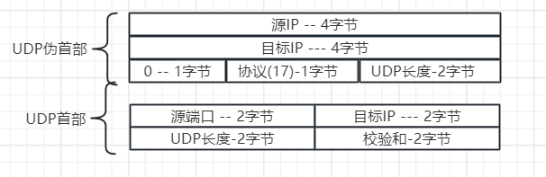

**校验和的计算**

1. **16位对齐:** 将校验和字段全为0.  UDP数据段载荷部分, **若不是16位的倍数, 需要在后方补足0**
2. **按位相加**: 将UDP伪首部12字节, 首部8字节共计20字节按照2字节16位对齐, 按位相加
3. **进位回卷:** 即16位相加时, 若出现超出16位的数, 加到最低位上.
4. **按位取反:** 将相加的结果, 且回卷后的二进制按位取反后即得到校验和
5. **验证:** 重新计算Checksum, 并且不用按位取反.  将两次计算的checksum相加若为1则验证通过.

```js
// 报文数据
const message = 'Hello, World';

// 目标IP和端口
const sourceIP = 'xxxx.xxxx.xxxx.xxxx';
const targetPort = 3000;

// 源IP和端口
const sourceIP = 'xxxx.xxxx.xxxx.xxxx';
const sourcePort = 44;

// 将报文转换为ArrayBuffer
const messageBuffer = new TextEncoder().encode(message).buffer;

// 创建UDP数据报的ArrayBuffer
const udpPacketSize = 8 + messageBuffer.byteLength; // 头部长度为8字节
const udpPacketBuffer = new ArrayBuffer(udpPacketSize);

// 创建DataView来操作ArrayBuffer
const udpPacketView = new DataView(udpPacketBuffer);

// 设置源端口（2字节）
udpPacketView.setUint16(0, sourcePort);

// 设置目标端口（2字节）
udpPacketView.setUint16(2, targetPort);

// 设置UDP长度（2字节，头部长度+数据长度）
udpPacketView.setUint16(4, udpPacketSize);

// 设置校验和（2字节，初始化为0，稍后计算）
udpPacketView.setUint16(6, 0);

// 复制报文数据
const dataView = new DataView(messageBuffer);
for (let i = 0; i < messageBuffer.byteLength; i++) {
  udpPacketView.setUint8(8 + i, dataView.getUint8(i));
}

// 计算校验和
const checksum = calculateChecksum(udpPacketBuffer);

// 更新校验和字段
udpPacketView.setUint16(6, checksum);

console.log('封装的UDP数据报:', new Uint8Array(udpPacketBuffer));

// 模拟接收端校验过程
const receivedChecksum = udpPacketView.getUint16(6);
const calculatedChecksum = calculateChecksum(udpPacketBuffer);

console.log('接收到的校验和:', receivedChecksum);
console.log('计算得到的校验和:', calculatedChecksum);
console.log('校验和是否匹配:', receivedChecksum === calculatedChecksum);

// 计算校验和的函数
function calculateChecksum(buffer) {
  const dataView = new DataView(buffer);
  let checksum = 0;
  
  // 求校验和, 因为校验和是2字节, 所以以16位读二进制数据, 相加
  for (let i = 0; i < buffer.byteLength; i += 2) {
    checksum += dataView.getUint16(i);
  }
 
  // 防止校验和进位导致信息丢失, 所以进行进位回卷, 将高位贴到低位上
  while (checksum >> 16) { // 右移16位, 看是否有超出16位的高位
    // 0xffff 是 65535, 即2个字节的1. 
    // (checksum & 0xffff) 保留除了最高位的数字
    // (checksum >> 16) 保留高位
    // 相加即回卷进位
    checksum = (checksum & 0xffff) + (checksum >> 16);
  }

  checksum = (~checksum) & 0xffff;
  return checksum;
}
```

#### UDP相较于TCP的优势

1) 应用进程更容易控制**何时发送**。

- 采用UDP时，只要应用进程将数据传递给UDP, UDP就会将此数据打包进UDP报文段并立即将其传递给网络层。
- 采用TCP时, 由于拥塞控制和流量控制, 数据的真实发送情况收到链路拥塞程度和对方应用缓冲区情况限制.

2)无需建立连接。

- 与TCP需要三次握手建立连接过程不同（后面将要讨论)，UDP不需要任何准备即可进行数据传输。因此，UDP不会引入建立连接的时延。

3)使用UDP端系统的资源开销小。

- TCP需要在端系统中维护连接状态，包括接收和发送缓存、拥塞控制参数以及序号与确认号的参数等；而UDP是无连接的，因此也无需维护连接状态。
- 因此，TCP系统资源开销大，UDP系统开销小。

  通常情况下，某些服务器当运行在UDP之上而不是TCP上时，一般都能支持更多的活跃客户。

4) 首部开销小。

- 每个TCP报文段都至少有20字节的首部开销，而**UDP仅有8字节**的开销。
- 需要说明的一点是，虽然UDP提供不可靠传输服务，但使用UDP的应用仍然可以实现可靠数据传输。
- 这可以通过在应用程序自身中建立可靠传输机制来完成，如前面介绍的停-等协议或滑动窗口协议等。也就是说，应用进程可以使用UDP的同时进行可靠通信，只是需要在应用层设计可靠传输即可

## 章四: 网络层

### IPV4

#### IPV4数据报格式


| 首部名称                    | 中文名称    | 大小        | 含义                                       |
| ----------------------- | ------- | --------- | ---------------------------------------- |
| Version IP              | IP版本    | 4bit      | 指定IP的版本, 即是IPV4还是IPV6                    |
| Header Length           | 首部长度    | 4bit      | 1) IPV4数据报除了固定的首部字段外, 还有一些可选的首部字段. Header Length是指所有首部字段, **包括可选首部字段的大小**.<br />2) Header Length共占4bit, 即**最大表示数字15**. <br />3) **Header Length的单位是4字节**. 例如Header Length为15, 表示此数据报的首部长度为4 * 15 = 60字节. 同时**60字节也是IP数据报首部的最大长度.**<br />5) 除了一些特殊情况下, IP数据报一般不携带可选首部. 此时Header Length的大小为**固定首部的大小, 即20字节**. |
| Type of Service         | 服务类型    | 8bit-1字节  | 1) 用来指示期望当前IP数据报获得哪种类型的服务。<br />2) 只有路由器提供了区分服务时，该字段才有效. 目前在大多数情况下基本不使用该字段 |
| Total  packet length    | 分组总长度   | 16bit-2字节 | 1) 用来指示IP数据报的总长度. 即首部长度加数据载荷部分的长度.<br />2) 单位为字节. 因为有16bit可以表示, 所以最大可表示的数为2^16 - 1 = 65535, 这意味着一个IP数据报最大的大小为65535. |
| Identifier of IP packet | IP分组标识符 | 16bit-2字节 | 1) IP协议利用一个计数器，每产生一个IP数据报计数器加1，作为该IP数据报的标识(ID)。<br />2) 由于IP产生标识的机制, 不同主机产生的IP数据报完全有可能具有相同的标识, 所以该字段不能作为IP数据报的唯一标识. 实际上，**IP是依靠标识字段和源IP地址和目的P地址以及协议等字段共同唯一标识一个IP数据报**。<br />3) 标识字段最重要的用途是在IP数据报分片和重组过程中，用于标识属于同一原IP数据报。 |
| **FLAGS**               | 标志位     | 3bit      |                                          |
| -                       | 第一位为保留位 |           |                                          |
| -                       | DF 禁止分片 |           | 1)  DF=O表示允许路由器将该IP数据报分片，DF=1禁止路由器将IP数据报分片<br />2)  如果路由器在转发一个DF=1的IP数据报时，其总长度超过输出链路的MTU,路由器不会对该IP数据报进行分片，路由器会丢弃该分组。 |
| -                       | MF更多分片  |           | MF=1表明该IP数据报一定是一个IP数据报的分片，并且不是最后一个分片，同样，到底是哪个分片要结合片偏移字段确定。 |
| Fragment Offset         | 片偏移     | 13bit     | 1) 表示一个IP数据报分片封装与原IP数据报数据的相对偏移量，即封装的数据分片从原整个数据报的哪个字节开始，<br />2) **片偏移字段以8字节为单位**<br />3) 该字段值为0时，其含义还要结合MP标志位来确定，如果MF=0,表示这是一个未被分片的IP数据报, 若MF=1表示该分片为第一个分片. |
| TTL                     | 生命周期    | 8bit-1字节  | 1) 表示IP数据报在路由器中的最大跳数. 每经过一个路由器-1, 减到0时, 路由器会将该IP数据报丢弃<br />2) 当TTL减到0时, 路由器会将分组丢弃, 并且向源主机回复一个Type=11, Code=0的ICMP报文, 报告已丢弃分组. |
| Next Level protocol     | 上层协议    | 8bit      | 1) 表示上层协议即传输层协议是什么<br />2)6表示TCP, 17表示UDP |
| IP Header Check Sum     | 校验和     | 16bit-2字节 | 1) 与UDP的校验和计算方式完全一致<br />2) 校验和字段在路由器每次转发分组时, 需要重新计算后重置. 因为IP数据报中的某些首部字段如TTL, 会在转发过程中发生变化. 所以IP数据报的校验和字段是**逐跳检验, 逐跳计算的** |
| Source IP address       | 源IP地址   | 32位-4字节   |                                          |
| Destination IP address  | 目的IP地址  | 32位-4字节   |                                          |
| Options of Header       | 可选首部字段  | 1-40字节    |                                          |

#### IP数据报分片

- **为什么要分片**

  1. **异构网络:**Internet是全球最大的互联网络，一个IP数据报从源主机到目的主机的传输过程中，可能经过多个运行不同数据链路层协议的网络，如以太网、IEEE802.11无线局域网等。
  2. **MTU:** 一个数据链路层协议帧所能承载的最大数据量即**帧的数据载荷部分的最大长度**称为该链路的**最大传输单元**(Maximum Transmission Unit, MTU)
  3. **链路层的限制:**异构网络中不同数据链路层协议所能承载的MTU不尽相同，这意味着, **上层的网络层的数据报的大小受到下层链路层MTU大小的限制**.  以太网帧可以承载的数据最大长度为1500字节，而有一些数据链路层协议所能承载的数据最大长度远小于这个值。
  4. **路由器分片**: 当路由器要将一个IP数据报转发至某个输出端口，而该数据报总长度大于该输出端口所连接链路的MTU时，路由器如何处理该IP数据报呢？答案是路由器将IP数据报进行分片(DF=0时)，或者将其丢弃(DF=1时)。

- **如何分片**

  1. **分片时的首部字段:**由于执行完分片过程的IP分片都属于同一个数据报，因此这些IP分片的协议版本、标识、源IP地址、目的IP地址等**直接继承**原IP数据报对应字段的值即可, 只有少量首部字段如标志位, 片偏移等需要重新修改。

  2. **重组分片:**

     1. **目的主机负责重组分片:**路由器只负责IP数据报分片，不进行IP分片重组，**IP分片的重组任务由最终目的主机的IP层来完成。**
     2. **识别分片是否属于同一数据报:**目的主机在重组分片时，首先根据各分片首部的标识字段来判断这些分片是否属于同一个IP数据报，即**同一个IP数据报分出来的IP分片具有相同的标识字段**
     3. **是否是最后一个分片**: 目的主机通过各分片首部的标志字段(MF)可以判断某个分片是否是分片, 以及是否是最后一个分片
     4. **重组数据报:**目的主机根据各分片的片偏移字段，判断各IP分片的先后顺序，结合每个IP分片首部的数据报长度字段，还可以判断是否缺少IP分片（比如某个IP分片丢失）。

  3. **分片的计算:**

     

     1. **片偏移的计算:**片偏移 = 该分片数据载荷的第一字节相对与原IP数据报数据载荷的偏移量 / 8
     2. **分片的数量的计算:** 数据报可分片的数量 = 原IP数据报数据载荷大小 / 分片最大载荷( 即MTU - IP首部大小 )
     3. **分片的首部**
        - **标识首部相同:**每一片的标识和原数据报的标识相同
        - **标志位:** 标志位首部中MF字段, 若是最后一片分片MF为0, 不是最后一片分片MF = 1
        - **其他字段:**其他首部字段大部分直接从原IP数据报中拷贝

#### IPV4地址

- **IPV4地址的作用:**主机在发送应用层数据时，在网络层会将源主机IP地址以及目的主机IP地址填充到IP数据报的首部中。路由器依据目的IP地址**查询**转发表，**转发**IP数据报，并最终将其送达目的主机。
- **路由器的IP地址:** 路由器通常有多个网络接口（若干输入接口与输出接口)，**每个接口都具有一个IP地址。**
- **IP地址与接口:**严格地说，IP地址是与接口相关联的，而并不是与某台主机或是路由器一一对应的。而主机往往只有一个接口, 所以习惯上来说我们称"主机的IP地址"而不是主机接口的IP地址.

**分类编址**

> 根据高位bit的数字, 将网络分为A,B,C,D,E类, 只有A,B,C类可分配给网络中的主机或路由器的各接口

| 类别   | 高位比特 | 网络号所占字节 | 主机所占字节 | 网络数              | 每个网络所占IP数            | 范围        | 用途              | 示例地址            |
| ---- | ---- | ------- | ------ | ---------------- | -------------------- | --------- | --------------- | --------------- |
| A类地址 | 0    | 1       | 3      | $ 2^7 - 2 = 126$ | $2^{24} - 2$         | 1 - 126   | 大型网络            | 10.0.0.1        |
| B类地址 | 10   | 2       | 2      | $ 2^{(6 + 8)} $  | $2^{16} - 2 = 65534$ | 128 - 191 | 中等规模网络          | 172.16.0.1      |
| C类地址 | 110  | 3       | 1      | $2^{(5 + 8+8)}$  | $2^{8} - 2 = 254$    | 192 - 223 | 小型网络            | 192.168.0.1     |
| D类地址 | 1110 |         |        |                  |                      | 224 - 239 | 组播（Multicast）通信 | 239.255.255.250 |
| E类地址 | 1111 |         |        |                  |                      | 240 -255  | 保留地址，特殊用途       | 保留              |

**分类编址中A,B,C类网的网络号数量, 网络地址, ip地址数量的计算**

A类地址的计算 **( A类地址中网络号0位保留号, 1位环回测试地址号 )**


B类地址的计算


C类地址的计算


#### 特殊地址

> 特殊地址指A,B,C类地址中( 不包括D,E类 )不能分配给用户的地址.

| 特殊地址            | 不能分配原因                                   | 其他说明 |
| --------------- | ---------------------------------------- | ---- |
| 主机号全0的地址        | 主机号全0的地址为网段专属地址                          |      |
| **A类地址中的0网段**   | 0网段为保留网段<br />                           |      |
| 0.0.0.0         | 1) **用于分配给DHCP.:** 当运行DHCP协议获取IP地址时, 由于此时主机尚未获得IP地址, 故在报文的源IP地址上写上0.0.0.0 代表本机<br />2) **默认路由:** 在路由表中, 0.0.0.0表示默认路由 |      |
| A类地址中的127网段     | 1) 127网段为环回地址网段<br />2) 最大的环回地址为127.255.255.254, 最小的环回地址为127.0.0.1 |      |
| 主机号全1           | 表示直接广播地址, 只在本局域网内广播                      |      |
| 255.255.255.255 | 本地广播地址.<br /> 发送到本网广播地址的数据包会在整个网络中传播，但在现代网络中，通常被路由器配置为不允许从外部网络发送到本网广播地址。 |      |

#### 私有地址

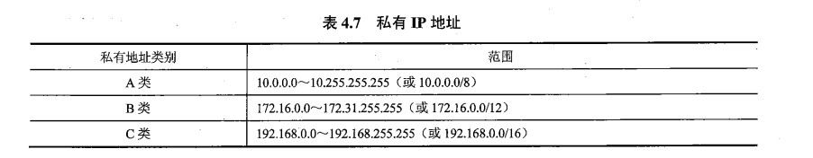

#### CIDR( 无类别域间路由 )与子网掩码

**CIDR介绍**

CIDR是一种对IPv4地址编址的方式. 它取消了A, B, C, D, E的类别, 按需的分配ip地址, 一定程度缓解了地址的浪费和紧缺的问题.

举一个例子理解CIDR: 作为一个企业, 想要申请一个网络, 他的选择有

1. 申请一个C类网络, 一个C类网络可以分配给$2^{8} - 2 = 254$个主机/路由器接口
2. 申请一个B类网络, 一个B类网络可以分配给 $ 2 ^{16} - 2 $ 大约6万个主机/路由器接口.

可见前者很容易导致不够分, 后者太多.  CIDR解决了这个问题, 可以按需的去申请网络, 其可分配的主机不至于太多也不至于太少.

**子网掩码的作用**

1. 对IPV4地址划分子网 (详细划分过程在下方)
   - 对分类ip地址划分子网
   - 对CIDR ip地址划分子网
2. 对CIDR的IPV4地址按需分配子网
   - 如果$220.55.10.0$这个C类网络分配给一个企业, 最多给$ 2^{8} - 2 = 254 $个网络接口分配IP
   - 如果$220.55.10.0/23$这个CIDR地址分配给一个企业, 最多可以给$2^{9} - 2 = 510$  个地址

**子网划分**

**对分类ip地址的子网划分**

例1


例2


**对CIDR地址的子网划分**

假如一个企业分派到一个网段, IP为 $200.23.16.0/20$ 演示其划分为**四个**子网的划分过程

```ruby
200.23.16.0/20  ==等价于==> IP为: 200.23.0001 0000.0000 0000 子网掩码为: 255.255.1111 0000.0000 0000

# 原本用20位标识网络号, 12位标识主机号. 现在划分为4个子网, 即借用2个主机号划分子网
子网1 (00子网): 
ip: 200.23.0001 0000.0000 0000   子网掩码: 255.255.1111 1100.0000 0000   CIDR表示法:200.23.16.0/22
子网2 (01子网)
ip: 200.23.0001 0100.0000 0000   子网掩码: 255.255.1111 1100.0000 0000   CIDR表示法:200.23.20.0/22
子网3 (10子网)
ip: 200.23.0001 1000.0000 0000   子网掩码: 255.255.1111 1100.0000 0000   CIDR表示法:200.23.24.0/22
子网3 (11子网)
ip: 200.23.0001 1100.0000 0000   子网掩码: 255.255.1111 1100.0000 0000   CIDR表示法:200.23.28.0/22
```

#### 子网聚集与最长前缀匹配

> 路由器学习到一些子网的信息后，可以将其聚集成一个更大的子网信息向外通告。 子网通告有利于减少路由器所存的表项


**最长前缀匹配**

假如上图的网络拓扑更改成下图

在R2新增了链路与192.168.1.0/24网络直连， 则R2的路由表则会多出一条表项\<192.168.1.0/24,FA0/1,0\>

此时若一个目标ip为192.168.1.3的分组达到R2，R2则会按照最长前缀匹配算法将分组从FA0/1接口转发出去

因为表项\<192.168.1.0/24,FA0/1,0\>能匹配上的前缀为24位 \<192.168.0.0/22,FA0/0,1\>能匹配上的前缀为22，前者匹配的最多


### IPV6

#### IPV6产生的原因

为什么要有ipv6, **主要原因是因为IPv4的地址分配完了**, 没有新的地址供给新的网络端口.

还有一些其他的原因, 如**路由器的负担重**:

1. **切片:**
   - IPV4网络中的路由器需要实现对IP数据报进行切片的功能
2. **校验:**
   - IPV6路由器需要核对校验和以及重新计算校验和( 由于每次经过路由器TTL - 1, 所以还需要重新计算检验IP头部的校验和 )

这一定程度上加重了网络核心的负担, 网络要求将复杂性放在网络边缘, 而非核心

#### IPV6数据报格式


| 字段             | 含义       |            | 说明                                       |
| -------------- | -------- | ---------- | ---------------------------------------- |
| Version        | IP版本     | 4bit       |                                          |
| Traffic Class  | 流量类型 优先级 | 8bit       | 1. 可以让网络对不同优先级的IP分组进行快速/慢速的服务<br />2. 功能类似于IPV4中的 Type of Service |
| Flow Label     | 流标签      | 20bit      | 标识不同的IP分组在同一流,  也是想让网络区分不同的优先级的字段        |
| Payload Length | 载荷长度     | 16bit      |                                          |
| Next Header    | 下一首部     |            | 1) 用于标识数据报承载的数据应该交付给哪一个上层协议. 如UDP, TCP等<br />2) 或者指向其他选项首部 |
| Hop limit      | 跳数       |            | 同IPv4的TTL                                |
| Source IP      | 源IP      | 128bit-16B |                                          |
| Destination IP | 目标IP     | 128bit-16B |                                          |

#### IPV4与IPv6的对比

| 变化项      | v4表现                    | v6表现        | 详细说明                                     |
| -------- | ----------------------- | ----------- | ---------------------------------------- |
| IP所占字节   | 4Byte                   | 16Byte      | 可提供2^128个IP地址. <br />V6可给整个地球每平方米提供1000万个IP |
| 固定首部大小   | 20Byte                  | 40Byte      |                                          |
| Checksum | 2Byte, 对头部的Checksum     | 移除          | 去除Checksum降低网络核心对分组处理的负担                 |
| 扩展头部     | Options of Header       | Next Header | 1) 若无选项首部, IPV6的Next Herder指向上层协议, 如TCP或者UDP<br />2) 若有选项首部, IPV6的Next Herder指向第一个选项首部 |
| ICMP     | ICMPv4                  | ICMPv6      | 当Ip分组在路由器被丢弃后, 路由器要返回一个ICMP协议报, 汇报丢弃分组   |
| 与分片相关的字段 | Fragment offset 和 FLAGs | 移除了与分片相关的字段 | 1) IPv6不允许分片, 如果某个链路MTU太小, **由于不允许切片, 分组会被路由器直接抛弃**并向主机发送ICMPv6: Packet too big.<br />2) 主机接到ICMP报文后,  会发送更小长度的IPV6数据报 |

#### IPV6地址

- **IPv6地址长度为:** IPv6地址长度为**16字节128位**，通常采用**8组冒号分隔**的**十六进制数**地址形式表示，例如，5000:0000:00A1:0128:4500:0000:89CE:ABCD。
- **IPV6的压缩表示形式:**即对于连续的多组“0000”, 可以使用::代替，例如8000：0000：0000：0000：4321：0501：AB96:56CD,可以压缩表示为8000::4321:0501:AB96:56CD, 但在**一个Pv6地址中只能用一次::**。
- **IPV6地址中嵌入IPV4地址的表示方法:**  IPv6地址的另外一种形式是在IPv6地址中嵌入IPv4地址，即IPv6地址的低32位写成点分十进制形式，例如6700::89A1:0321:206.36.45.19。
- **IPV6地址的种类:**  IPV6地址包括单播地址、组播地址和任播地址3种类型。
  1. **单播地址:** 单播地址唯一标识网络中的一个主机或路由器网络接口，可以作为IPV6数据报的源地址和目的地址；
  2. **组播地址:** 组播地址标识网络中的一组主机，只能用作IPv6数据报的目的地址，向一个组播地址发送IP数据报，该组播地址标识的多播组**每个成员**都会收到一个该IP数据报的一个副本；
  3. **任播地址:** 任播地址也是标识网络中的一组主机，也只能用作IPv6数据报的目的地址，但当向一个任播地址发送IP数据报时，只有该任播地址标识的任播组的**某个成员**收到该IP数据报。

## 章五: 数据链路层
### 多路控制协议
**数据链路层使用的信道**
1. 点对点信道: 点对点信道使用 一对一的通信方式，信道被通信双方独享
2. 广播信道: 广播信道上连接的结点很多，信道被所有结点共享，必须使用多路访问控制(Multiple Access Control,MAC)协议来协调结点的数据发送。

概括起来，主要可以分为3种类型的MAC协议：**信道划分MAC协议**、**随机访问MAC协议**及**受控接入MAC协议**。

#### 信道划分MAC协议
**频分多路复用FDM**

> 1. 以频带(HZ)区分多路信号
> 2. 将多路信号通过复用器调制到共享信道中
> 3. 通过分用器将共享信号解调成多路信号
> 4. 在共享信道中, 子信道之间有隔离信道


**波分多路复用FDM**

> 1. 以波长区分多路信号
> 2. 通过合波器将信号调制到共享信道中(光纤)
> 3. 通过分波器将信号解调成多路信号


**时分多路复用(TDM)**

> 1. 划分单位TDM帧(时间片)的长度
> 2. 在单位TDM帧中等分成若干时隙
> 3. 每路信号**按顺序依次**在单位时隙内使**用全部带宽**


**码分多路复用(CDM)**

**前置概念**

- **码片**: 二进制片段. 码片的位数就是二进制片段的位数. 如如1000 0110为一个八位的码片
- **码片序列**: 用码片标识一个站点(信号源),称为码片序列. 例如用1010 1010标识一个手机, 1010 1010则为这个手机的码片序列
- **码片序列向量**: 对终端的码片序列中的1用1标识, 0用-1标识则可得到一个终端的码片序列向量. 如1010 1010码片序列的终端的码片序列向量为(1,-1,1,-1,1,-1,1,-1)
- **规格化内积**: 向量的内积 / 向量维数. 假如一个码片序列向量为(1,-1), 另一个为(1,1)其规格化内积为 (1 * 1 + (-1) *
  1 ) / 2 = 0
- **CDM规定任意两个终端的码片序列不同, 并且其码片序列向量的规格化内积为0**


用A代表一个终端的码片序列向量, B代表除A以外的任意码片序列向量,  则有以下公式(无需证明, 记住就好)

**口诀: 不相干的码片序列的规格化内积为0, 自己与自己的规格化内积为1, 自己与自己反码的规格化内积为-1**


**CDM流程**

> 1. 给每个终端分配**互异且规格化内积为0**的码片序列
> 2. 基站通过广播发送信号
     >    - 若想给A终端发送比特1, 则用A的码片序列代替
>    - 若想给A终端发送比特0, 用A的码片序列的反码代替
>    - 将所有码片序列叠加成二进制码 **(码片向量相加)** 后, 广播给每一个终端
> 3. 每一条终端接到广播后, 用自身码片向量与接收的码片向量做规格化内积运算
     >    - 结果为1, 则收到1
>    - 结果为-1. 则收到0
>    - 结果为0, 则不是本终端的信息

==例子1==


==例子二==

发送端


接收端


==例3==


#### 随机访问协议
随机访问MAC协议的含义
1. **都可以发送信息:** 所有用户都可以根据自己的意愿随机地向信道上发送信息
2. **一个用户在发送信息:** 如果一个用户在发送信息期间没有其他用户发送信息，则该用户信息发送成功
3. **多个用户在发送信息:** 如果两个 或两个以上的用户都在共享的信道上发送信息，则产生冲突或碰撞(collision),导致用户 
   信息发送失败，每个用户随机退让一段时间后，再次尝试，直至成功。

典型的随机访问协议有**ALOHA协议**、**载波监听多路访问协议**以及**带冲突检测的载波监听多路访问协议**等。

###### ALOHA协议
ALOHA协议模型
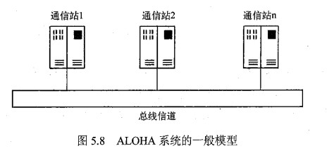

**纯ALOHA**

纯ALOHA协议的工作原理
1. **随时发送:** 任何一个站点有数据要发送时就可以**直接发送**至信道。
2. **侦听信道:** 发送站在发出数据后需要对信道侦听一段时间。通常这个时间**为电波传到最远端的站再返回本站所需的时间(RTT)**。
3. **发送成功:** 
   如果在这段侦听时间里**收到接收站发来的应答信号**，说明发送成功。
4. **发送失败:** 未发送成功则则说明数据帧遭到破坏（发生冲突），则**等待一个随机时间后再进行重发**，如果再次冲突，继续等待一个随机时间，直到重发成功为止。

**时隙ALOHA**
时隙ALOHA的基本思想
1. **划分时隙:** 是把信道时间分成离散的时隙(Slot),每个时隙为**发送一帧所需的发送时间**
2. **发送数据帧:** 每个通信站**只能在每个时隙开始时刻发送帧**
3. **发送失败:** 如果在一个时隙内发送帧出现冲突，下一个时隙以概率P重发该帧，以概率(1-P)不发该帧（等待下一个时隙），直到
帧发送成功。显然，P不能为1，否则协议会死锁。
4. **时钟同步:** 时隙ALOHA协议需要所有通信站在时间上同步。

###### 载波监听多路访问协议
- **ALOHA协议的缺点:** 发送之前无论信道是否空闲都进行发送，这会大大增加冲突的可能性。
- **载波监听多路访问协基本思想:** -在发送帧之前，若能先判断一下信道是否空闲，如果空闲则发送帧，否则椎迟发送，这样，冲突的可能性便会减少。
- **载波监听多路访问协议的忒点:** CSMA(Carrier Sense Multiple Access,CSMA)的特点是**通过硬件装置**，即**载波监听装置**， 使通信站在发送数据之前，**监听**信道上其他站点是否在发送数据，如果在发送，则暂时不发
送，从而减少了发生冲突的可能，提高了系统的吞吐量。所以，有时候又称CSMA的工作方式为 **“先听后说”**。

**CSMA/CD协议**
> CSMA/CD即载波侦听, 多路访问, 冲突检测协议. 对应的IEEE标准为802.3以太网

| 载波侦听 (Carrier Sense CS)                  | 多路访问 (Multiple Access MA) | 冲突检测 (Conflict Detection CD)             | 强化信号(Jam Single)                         |
| ---------------------------------------- | ------------------------- | ---------------------------------------- | ---------------------------------------- |
| 1) **发送数据前监听局部**链路是否占用<br />2) 空闲后的**96位时**才发送数据帧 | 多路信号在一条共享信道传输             | 1) 边发送边监听链路<br />2) 发送时如果冲突, 立刻停下. **并通过指数退避算法算出一个时间后, 在该时间后重新发送** | 当冲突后, 发送一个Jam信号通知各站点链路已经发生拥塞. (其原因是**信号的衰减**) |


**CSMA/CD协议中为何冲突**
尽管CSMA/CD协议使用硬件监听信道, 当信道空闲时候才发送数据, 但依然可能产生冲突.
CSMA的问题是**无法准确监听信道**的占用情况.

- 例子1: **同时发送:** 在某一个时刻信道没有被占用, A和B站点同时发送数据帧, 则会造成冲突
- 例子2: **局部监听:** 在某一个时刻, A站点通过信道发送数据帧, 但由于传播延迟, 此数据还未传递到A站点附近, A认为信道没有占用, 
  于是发送数据帧, 造成冲突


**冲突示意图和争用期**

在不考虑传输, 排队与处理时延的情况下. 假设主机A和B通过共享信道传输, 其**传播延迟为**$τ$

假设主机A在时刻**t0 = 0** 发送数据, 主机B是在 $t= τ - ∂$ 发送的数据
则 
1. **B主机感知到冲突的时间为$τ$**
2. 冲突发生时为 $t= τ - \frac{∂}{2}$, 
3. 主机A收到冲突信号的时间为 $t=τ-∂ + τ = 2τ + ∂$


可以看出当**∂趋向0**时候, 主机和主机B都**接收到冲突信号的时间为2τ**

我们将从∂趋向0时, 主机和主机B都接收到冲突信号的时间$2τ$ 称为**争用期(也称碰撞窗口)**, 也就是说**争用期是每个主机发出数据后搭到知道冲突的最大时间**


#### 差错控制

##### 四种差错控制方式

典型的差错控制方式包括检错重发、前向纠错、反馈校验和检错丢弃4种基本方式。

- **检错重发**
  1. **差错编码:** 发送端对待发送数据进行差错编码，
  2. **传输检测:** 编码后的数据通过信道传输，接收端利用差错编码检测数据是否出错
  3. **重发:** 对于出错的数据**，接收端请求发送端重发数据**加以纠正，直到接收端接收到正确数据为止。第三章介绍的停等协议和滑动窗口协议实现的都是这类差错控制方式。
- **检错丢弃**:
  1. **差错编码:** 发送端对待发送数据进行差错编码，
  2. **传输检测:** 编码后的数据通过信道传输，接收端利用差错编码检测数据是否出错
  3. **丢弃**: 不纠正出错的数据，而是直接丢弃错误数据
- **前向纠错**
  - **前向纠错编码:**
    1. **接收端纠错:** 前向纠错(Forward Error Correction,FEC)**是接收端进行差错纠正**的一种差错控制方法
    2. **前向纠错编码作用:** 前向纠错编码不仅可以检测数据传输过程中**是否发生了错误**，而且还可以**定位错误**位置并直接**加以纠正**。
  - **前向纠错编码过程:**
    1. **纠错编码:** 在前向纠错机制中，发送端首先对数据进行纠错编码，
    2. **传输检测:** 然后发送包含纠错编码信息的帧，接收端收到帧后利用纠错编码进行差错检测，
    3. **纠错:** 对于发生错误的帧直接进行纠错。前向纠错机制比较适用于单工链路或者对实时性要求比较高的应用。
- **反馈校验**
  - **发送数据:** 发送端发送数据到接收端
  - **返回数据:**接收端将收到的数据**原封不动发回发送端**
  - **对比检错:** 发送端通过比对接收端反馈的数据与发送的数据可以确认接收端是否正确无误接收了已发送的数据。
  - **重发数据:** 如果发送端发现有不同，则认为接收端没有正确接收到发送的数据，则立即重发数据，直到收到接收端反馈的数据与已发数据一致为止。

##### 奇偶校验

 **奇偶校验的流程**

**奇校验**

1. **奇校验的规则:**
   - 将数据位**增加1位冗余位,** 冗余位的值为0或者1, **使得1的总数为奇数.**
   - 例: 如数据位1010 1111, 增加1位冗余位使1的总数为奇数后, 1010 1111 1
2. **奇校验的验证**
   - 设⊕为异或操作, 对于$ i  $位的数据, 增加冗余位后共有 $ i + 1 $位, 则有$ a_1 ⊕ a_2⊕ a_3...⊕ a_{i}⊕ a{i+1} = 1 $
   - 对于上述公式的解释: 数据位的0位数不变, 数据位的1为奇数, 所有的0进行异或操作后依然为0, 所有的1进行异或操作后为1, 最后0与1再异或运算结果为1
3. **偶校验的规则:**
   - 将数据位**增加1位冗余位**, 冗余位的值为0或者1, **使得1的总数为偶数**.
   - 例: 如数据位1010 1111, 增加1位冗余位使1的总数为偶数后, 1010 1111 0
4. **偶校验的验证**
   - 设⊕为异或操作, 对于$ i  $位的数据, 增加冗余位后共有 $ i + 1 $位, 则有$ a_1 ⊕ a_2⊕ a_3...⊕ a_{i}⊕ a{i+1} = 0 $
   - 对于上述公式的解释: 数据位的0位数不变, 数据位的1为偶数, 所有的0进行异或操作后依然为0, 所有的1进行异或操作后为0, 最后0与0再异或运算结果为0
5. **奇偶校验的弊端:** 若同时发生位翻转的位数为**偶数个, 则无法检测出误码**, 若同时发生位翻转的个数为**奇数个, 则可以检测出误码**. 误检率为50%

##### CRC循环冗余校验

**循环冗余校验流程**

1. 双方约定一个生成多项式( 一般用现成的 )
2. 通过生成多项式和二进制数据计算出冗余码, 将其添加到**数据后方**传输
3. 接收方通过生成多项式计算, **若余数为0则无误码**, 否则误码

**发送/接受方计算过程**

发送方

1. **拼接:** 将待发送二进制数据后拼生成多项式最高次数个0( 相当于左移n位 )
2. **还原**: 将生成多项式还原成二进制位串
3. **模二运算:** 将拼接好的二进制数据位串与生成多项式的二进制位串进行模二运算, **取其余数**
4. **向前补0**: 若模二运算后的二进制位串, 其位数要少于生成多项式最高次数, 则需要在运算后的二进制位串高位除补足所差个数个0. **补足0后的二进制位串即CRC循环冗余码**
5. 例子:
   - 二进制数据为: 1011 1001, 生成多项式$G(x) = x^4 + x + 1$
     1. **拼接:** 拼接后的数据为1011 1001 0000
     2. **还原:** $G(x) = $ 1 0011
     3. **模二运算:**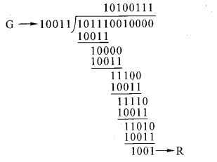
     4. **向前补0:** 余数为4位, 不需要补足0, 直接将其拼接在原二进制的数据的后方即得到经过CRC编码的数据串: 1011 1001 + 1001

接收方:

1. 将接收数据串模二运算(异或)生成多项式的二进制位串

2. 余数为0则无误码, 反之误码

   ​


**例题讲解**


## 章六: 物理层
