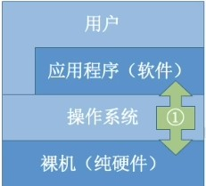

# 操作系统

## 第一章: 操作系统概述

### 1.1 操作系统概念
**操作系统( Operating System, OS )**
1. **控制,管理与调度:** 管理整个计算机系统的硬件和软件资源,合理的组织调度计算机的工作和资源的分配
    - 操作系统管理计算机的资源. **资源包括硬件资源和软件资源**.操作系统为每个应用分配一定的资源.
2. **向上层提供服务**: 以提供给用户和其他软件方便的接口和环境
   - 
   - 操作系统与用户和软件直接交互, 向上层提供方便好用的服务
3. **向下层扩展功能:** 他是计算机系统中最基本的系统软件.
   - 操作系统是最接近硬件的软件. 

### 1.2 操作系统的功能
**1. 从如何管理系统资源的看操作系统的功能**

操作系统通过以下4个模块处理系统资源:
1. 处理机管理
   - 如何给不同应用分配cpu资源, 用于计算数据等
2. 存储器管理
   - 内存如何读写, 磁盘如何读写, 如何分区等
3. 文件管理
   - 文件系统, 文件按照树状结构存储在磁盘当中
4. 设备管理
   - 如同一个摄像头如何给不同的应用使用

操作系统的目标是安全且功效的管理系统资源.

**2. 从向上层提供服务看操作系统的功能**
1. 向用户层提供GUI服务
   - 用户可以通过图形用户接口直接与操作系统交互. 如用户可通过拖拽的方式改变文件存储位置.
2. 向软件层提供程序接口服务
   - **系统调用:** 操作系统提供的程序接口一般又称为**系统调用或者广义指令**
   - **二次封装:** **普通用户不能直接使用系统调用**, 一般来说,高级程序语言会对系统调用进行二次封装, 提供给程序员使用. 
     如操作系统关于网络请求的SocketAPI, 会经过各种高级语言如c++的二次封装, 提供给程序员使用.
   - **系统调用种类(从用户的角度对系统调用分类)**
      1. 脱机命令接口: 又称为批处理接口. 用户说一堆, 系统做一堆.
      2. 联机命令接口: 又称为交互式处理接口. 用户说一句, 系统做一句.

**3. 从向下层拓展功能看操作系统的功能**
裸机指没有**任何软件支持**的计算机.

不太恰当的说, 裸机就是一堆废铜烂铁, 操作系统对逻辑进行扩展, 将逻辑改造成功能更强使用更方便的机器.

通常把覆盖了软件的机器称为扩充机器, 又称为**虚拟机**
