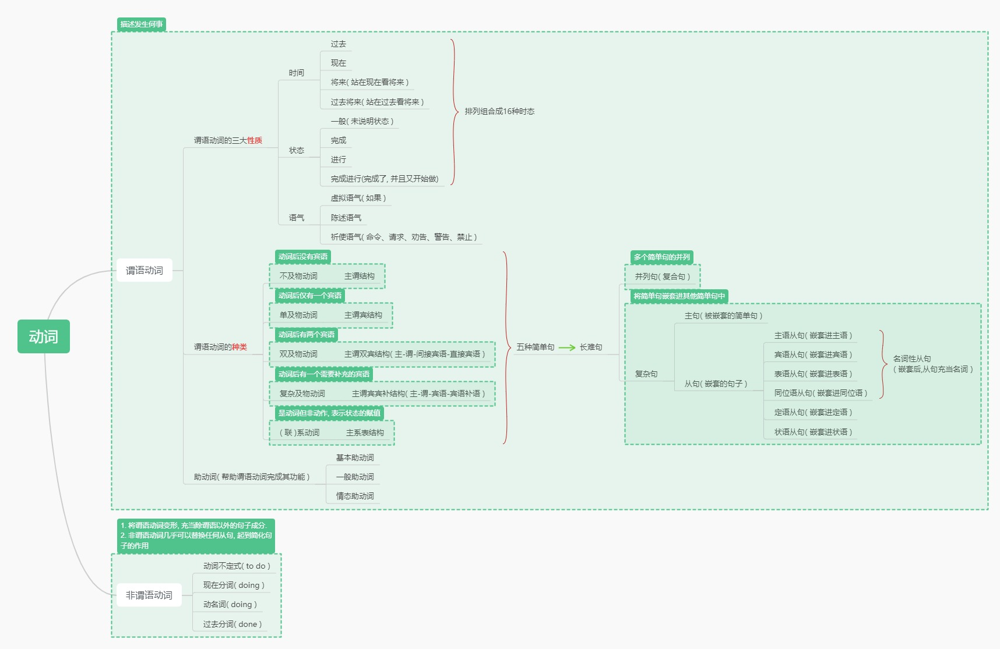
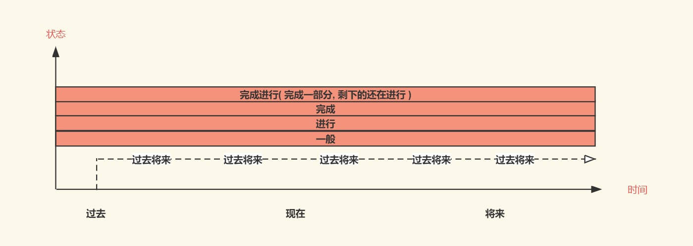
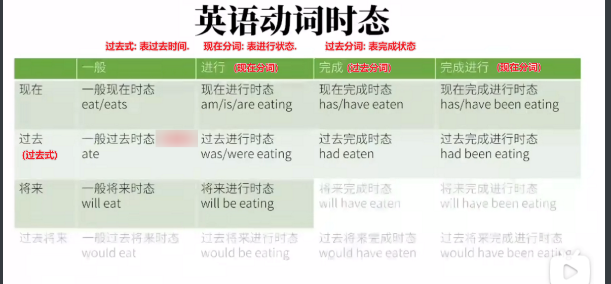

#  英语语法

## 一: 英语语法框架

### 1.1 词类

| 词类   | 作用        | 例子                                       |
| ---- | --------- | ---------------------------------------- |
| 名词   |           |                                          |
| 动词   |           |                                          |
| 冠词   |           |                                          |
| 代词   |           |                                          |
| 形容词  |           |                                          |
| 数词   |           |                                          |
| 介词   | 表示词之间关系的词 | 我在房子里. 在...里( in )表示了我和房子之间的关系           |
| 副词   | 修饰形容词或者动词 | 1) 修饰形容词:       非常开心. 开心的为形容词, 非常为副词, 表示加深形容词的程度 2) 形容动词       跑的快. 跑为动词, 快地为副词 |
| 叹词   | 表示感叹      | Ah: 意思为啊, 表感叹                            |
| 连词   | 连接句子      | 连词有 and, but... 比如我很贫穷, 但我很努力. 但( but )连接了两个句子 |

###  1.2 句子成分

**句子成分:** 将英语语句, 按照某种逻辑划分为若干段, 每一段可以由若干个单词组成, 每一段称为一个句子成分

| 句子成分       | 作用                                       | 举例                                       |
| ---------- | ---------------------------------------- | ---------------------------------------- |
| 主语         | 动作的发起者.                                  | 你, 我, 他                                  |
| 谓语         | 动作                                       | 吃, 喜欢                                    |
| 宾语         | 动作的承受者                                   | 我喜欢吃萝卜.  萝卜是吃这个动作的承受者, 是宾语          |
| 宾语补语       | 对宾语的状态的补充说明                              | 他种好了花. 花是宾语, 种好了是对花状态的补充说明, 是宾语补语   |
| 主语补语( 表语 ) | 对主语的状态的补充说明, 出现在系动词后                     | 她是个医生 医生是对主语状态的描述是表语                |
| (限)定语      | 限定主语或者宾语                                 | 一辆白色的法拉利.  法拉利是主语, 一辆白色的对法拉利起限定作用   |
| 状(态)语      | 状语是语法上修饰动词、形容词、副词或整个句子的成分    位置自由：句首、句中、句末都可以。    状语多为副词或短语 | 我吃饭很快 吃是谓语, 很快修饰谓语的状态, 是状语.         |
| 同位语        | 主语和宾语的再描述                                | 而你, 我的朋友, 你才是真正的英雄 你是主语, 我的朋友对你的再描述 |

### 1.3 动词及衍生出的英语语法 

## 二: 动词的时态

### 2.1 时态概述

### 2.2 动词变位

动词变位是指动词会根据不同的时态、语态(气)和情态来变化.

例如: 

​	一般现在时: She **works** at a bank. 她现在在银行工作 

​	一般过去时: She **worked** at the bank. 她过去在银行工作.

可见work在不同时态下, 动词进行了变位.

### 2.3 有关现在的四种时态

#### 一般现在时

一般现在时主要强调一般的状态, 而不强调现在的时间.

一般的意思为:"客观的, 默认的"

| 语法特点       | 例子                          | 详细说明                                     |
| ---------- | --------------------------- | ---------------------------------------- |
| 动词变位       | 动词原型 或者 动词原型 + s            |                                          |
| **用于表达事实** | I eat carrots. 我吃胡萝卜        | 当表达 "我吃胡萝卜" 时，通常不使用 "I eat a carrot." 这种表达方式.因为它可能会引起误解: "难道一根胡萝卜能天天吃吗?"      好的表达方式可以是 "I eat carrots."（ 胡萝卜做复数, 泛指胡萝卜这种食物，意思为我吃胡罗卜这种食物,表示一种事实 ) |
| -          | I am going to lunch.我去吃午饭.  | 当表达 "我去吃午饭" 时，如果使用 "I go to lunch." 虽然在语法上没有错误, 是一般现在时, 但会引起别人的疑惑: "我天天去吃午饭", 会很奇怪         好的表达方式是 "I am going to lunch." 现在进行时, 我正在去吃午饭 |
| **用于表达习惯** | `I play basketball.` 我习惯打篮球 |                                          |

#### **现在完成时** 

| 语法特点 | 例子                              | 详细说明                                     |
| ---- | ------------------------------- | ---------------------------------------- |
| 动词变位 | `have的动词变位 + 动词的过去分词(通常是ed) `   | 1) have的动词变位: `I you we they -have / he She it -has` 2) 动词的过去分词: 通常在动词末尾 `+ ed` |
| -    | `I have eaten a carrot` 我吃过胡萝卜了 | have的动词变位为原型have, eat的过去分词为`eaten`       |

#### **现在进行时**

| 语法特点 | 例子                              | 详细说明                                     |
| ---- | ------------------------------- | ---------------------------------------- |
| 动词变位 | be动词变位+ 动词的现在分词                 | 1) be动词变位指的是 am, is, are 2) 动词的现在分词: 通常在动词后加`ing` |
| -    | `I am eating a carrot. 我正在吃胡萝卜` |                                          |

#### **现在完成进行时**

| 语法特点 | 例子                                       | 详细说明 |
| ---- | ---------------------------------------- | ---- |
| 动词变位 | `have的动词变位 + been + 动词的现在分词 `            |      |
| -    | `I have been eating carrots. 我已经吃了一些胡萝卜, 还在继续吃 ` |      |

### 2.4  有关过去的四种时态

#### 一般过去时

| 语法特点        | 例子                             | 详细说明                                     |
| ----------- | ------------------------------ | ---------------------------------------- |
| 动词变位        | 动词过去式                          | 区分过去式与过去分词与现在分词的区别 1) 过去式: **表过去**, 2) 过去分词: **表完成.**  3) 现在分词:  **表进行**: |
| **表达过去的事实** | `You wathed my video` 你观看了我的视频 | 表过去发生的事实. 不能表示习惯                         |

**常见过去式与过去分词**

| 动词原型           | 动词过去式 | 动词过去分词 |
| -------------- | ----- | ------ |
| do             | did   | done   |
| go             | went  | gone   |
| take           | took  | taken  |
| eat            | ate   | eaten  |
| blow( 刮风, 吹气 ) | blew  | blown  |
| begin          | began | begun  |
| speak( 谈话 )    | spoke | spoken |

#### 过去进行时

| 语法特点 | 例子                                       | 详细说明                                   |
| ---- | ---------------------------------------- | -------------------------------------- |
| 动词变位 | `助动词的时间变位 + 动词的现在分词 `                    | `I it she he -was / they you we were ` |
| -    | `The rabbit was eating a carrot.`这兔子在过去的某时间点内正在吃胡萝卜 |                                        |

#### 过去完成时

| 语法特点 | 例子                                       | 详细说明                            |
| ---- | ---------------------------------------- | ------------------------------- |
| 动词变位 | `have的时间变位 + 动词的过去分词`                    | `I you we they he she it - had` |
|      | `I had eaten 5 carrot for lunch yesterday.` 我昨天吃了5根胡萝卜 |                                 |

#### 过去完成进行时

| 语法特点 | 例子                                       | 详细说明                             |
| ---- | ---------------------------------------- | -------------------------------- |
| 动词变位 | ` have的时间变位 + been + 动词的现在分词 `           | ` 人称代词 + had + been + 动词的过去分词  ` |
| -    | `The rabbit had been eating a carrot.`这个兔子在过去时间已经吃了一根胡萝卜了, 在那个时间后还要继续吃. |                                  |

### 2.5  有关将来的四种时态

#### 一般将来时

| 语法特点 | 例子                                       | 详细说明                                     |
| ---- | ---------------------------------------- | ---------------------------------------- |
| 动词变位 | `will / shall + 动词原型`                    | 其他的不借助will表示将来的用法 1) 一般现在时表将来: `The bus leaves at 8PM. 公交车将在下午8点离开` 2) `be (going) to do `: `I am going to eat a carrot 我将要吃胡萝卜 ` 3)  `be about to do`: `I am about to eat a carrot 我将要吃胡萝卜` |
| -    | `The rabbit will eat a carrot.这兔子将要吃胡萝卜` |                                          |

#### 将来进行时

| 语法特点 | 例子                                       | 详情   |
| ---- | ---------------------------------------- | ---- |
| 动词变位 | `will be + 动词原型`                         |      |
| -    | `I will be eating a carrot for lunch tomorrow from 1PM to 3PM.`明天下午1点到3点, 我将正在吃胡萝卜 |      |

####  

#### 将来完成时

| 语法特点 | 例子                                       | 详细说明 |
| ---- | ---------------------------------------- | ---- |
| 动词变位 | ` will + have + 动词的过去分词  `               |      |
| -    | `The rabbit will have eaten a carrot.`这兔子在将来的某个时间点已经吃了胡萝卜 |      |

#### 将来完成进行时

| 语法特点 | 例子                                       | 详细说明 |
| ---- | ---------------------------------------- | ---- |
| 动词变位 | `will have been + 动词的现在分词 `              |      |
| -    | `You will have been watching my video. `你在将来已经看了我的视频, 并且接下来还有继续看 |      |

### 2.6 有关过去将来的四种时态

#### 一般过去将来时

| 语法特点        | 例子                                       | 详细说明                                     |
| ----------- | ---------------------------------------- | ---------------------------------------- |
| 动词变位        | `would + 动词原型 `                          |                                          |
| -           | `I said i would eat a carrot for lunch.我之前说过, 我中午将吃一个胡萝卜` | 其中 `would` 可用`was/were going to do` 或者 `was / were about to do` |
| `would的多义 ` |                                          | 1) will的时间变位, 构成过去将来时 2) 动词的虚拟语气, 表达和事实相反 |

#### 过去将来进行时

| 语法特点 | 例子                                       | 详细说明 |
| ---- | ---------------------------------------- | ---- |
| 动词变位 | `would be + 动词现在分词 `                     |      |
| -    | `I said i would be eating a carrot at 1PM tommorow. 我之前说我将在明天下午1点吃胡萝卜` |      |

#### 过去将来完成时

| 语法特点 | 例子                                       | 详细说明 |
| ---- | ---------------------------------------- | ---- |
| 动词变位 | `would have + 动词过去分词 `                   |      |
| -    | `I said i would have eaten a carrot by 1PM tomorrow. 我之前说我我将在明天下午一点吃掉胡萝卜` |      |

#### 过去将来完成进行时

| 语法特点 | 例子                                       | 详细说明 |
| ---- | ---------------------------------------- | ---- |
| 动词变位 | `would have been + 动词的现在分词`              |      |
| -    | `I said i would have been eating lunch for 2 hours by 1PM tomorrow. 我之前说我将在明天下午一点时在吃中饭这个过程中, 之前吃了2钟头, 之后还会继续吃 ` |      |

### 三: 语气

#### 陈述语气 

`The rabbit ate the carrot. 这兔子吃了这胡萝卜` 

#### 疑问语气

将陈述语气的be动词提前, 若无be动词, 则将助动词提前便是疑问语气.

如: 

​	陈述语气:  `The rabbit ate a carrot.` 这兔子吃了胡萝卜

​	疑问语气: `Did the rabbit ate a carrot?` 这兔子吃胡萝卜了吗? 用助动词Did提前, 表示疑问语气

​	陈述语气: `The rabbit is hungry. 这兔子饿了`

​	疑问语气: `Is the rabbit hungry ?` 这兔子饿了吗? be动词提前, 表示疑问

#### 祈使语气

>  祈使语气表命令和请求. 祈使句通常没有明确的主语

写出祈使语句的方法

1. 将命令或请求写成陈述句. 用一般现在时, 用第二人称
2. 去掉第二人称, 并保证动词原形( 如are 变成 be )

例子: 

​	`You go to hell. `你去死吧!  

​	去掉 "第二人称, 保证动词原形"后变为`Go to hell!` 去死吧

​	`You are quiet. 你是安静的.`

​	去掉"第二人称, 保证动词原型"后变为 `Be quiet! 安静点 `

####  虚拟语气

**表示与事实相反的假设**

| 假设                             | 条件句(if)变形                                | 主句变形                                    | 例句                                       |                                          |
| ------------------------------ | ---------------------------------------- | --------------------------------------- | ---------------------------------------- | ---------------------------------------- |
| **与现在事实相反的假设**                 | 1) 动词过去式 2) 如果动词是Be动词, 无论是is, are, am一律变型为were | `would + 动词原形`                          | `If i knew it, i would tell you. 如果我知道就告诉你`. 现在的事实是"我不知道", 所以这是一个与现在事实相反的假设 | `If i were you, i would go to school. 如果我是你, 我会去学校.` 现在的事实是"我不是你", 所以是一个与现在相反的假设. 并且条件句中动词为Be动词一律改为were. |
| **与将来事实相反的假设( 或者将来发生的可能性很小 )** | `should / were to + 动词原形`                | ``would /should /could /might  + 动词原型`` | `If i should see the rabbit tomorrow, i would bite him.` 如果我明天看见那个兔子, 我要揍他. "明天我看见那个兔子"发生在将来, 且可能性很小 |                                          |
| **与过去事实相反的假设**                 | `had + 动词过去分词`                           | `would have + 动词过去分词 `                  | `If i had watched ths video before, i would have aced my test.如果我之间看了这视频, 那绝对能考个好成绩` 过去的事实是"我没有看这个视频", 所以是一个与过去事实相反的假设 |                                          |

**表达愿望, 请求, 建议, 命令等**

1. 表达愿望( `wish`可换成`would rather` 宁愿 )

| 表达               | 句子结构                                     | 备注                               | 例句                                       |
| ---------------- | ---------------------------------------- | -------------------------------- | ---------------------------------------- |
| 表达**对现在的**愿望, 希望 | wish + 从句. 从句中的动词使用过去式              | wish表示可能性很小的希望 hope 表示中立的希望 | `I wish that i were a rabbit` 我希望自己是兔子.  |
| 表达**对过去的**愿望, 希望 | wish + 从句 从句中动词变成 `had / would have + 动词过去分词` |                                  | `I wish that i had eaten the carrot.`  我希望我已经吃过胡萝卜了 |
| 表达**对将来的**愿望, 希望 | wish + 从句 从句中动词变为 `should / could / might /would + 动词原形 ` |                                  | `I wish that i could eat the carrot.`我希望我能吃那个胡萝卜 |

2. 表达请求, 建议, 命令. 

   `demand 要求 / suggest 建议, insist坚持 / order 命令.. ` + 从句 ( 从句中动词变位 should + 动词原型 )

    `eg: I demand that you should give me a carrot. 我要求你给我个兔子( should 不翻译为应该, 只做虚拟语气 )`

## 四: 非谓语动词

> 非谓语动词 = 动词不定式(todo) + 现在分词 (doing)+ 动名词(doing) + 过去分词(done)

#### 动词不定式

| 知识点       | 解释        | 例子                                       |
| --------- | --------- | ---------------------------------------- |
| 动词不定式基本形式 | To + 动词原型 |                                          |
| 完全不定式     | 不省略to     | To be or not to be, this is a question.生存, 毁灭是个问题 |
| 裸不定式      | 省略to      | You helped me (to) cook the carrot. 你帮我做了胡萝卜 |

**非谓语动词做主语**

**例句**: **To eat** a carrot every day is good for the rabbit. 

**释义**: 每天吃胡萝卜对兔子有好处. 

**语法解析**: to eat为动词不定式做主语. 谓语动词为 is.

**语法升级:**  **It** is good for the rabbit **to eat** carrot.  It做形式主语, 实际主语还是to eat.

**非谓语动词做宾语**

**例句:** The rabbit likes **to eat** carrots. 

**释义:**  兔子喜欢吃胡萝卜

**语法解析**: to eat为动词不定式做宾语. 谓语动词为likes.

**例句: ** I consider(认为) the rabbit smart.

**释义:** 我认为这个兔子很聪明

**语法解析:** consider为复杂及物动词, the rabbit为宾语, smart为宾语补足语, 是对the rabbit的补充说明

**语法升级:** I consider **it** important **to eat** carrots every day. 我认为每天吃胡萝卜很重要

 - **语法解析:** consider为谓语动词, important为宾语补语, **it为形式宾语**, **to eat**是实际宾语(不定式做宾语) 

**不定式做宾语补语**

**例句:** The rabbit expected the wolf **to eat a carrot**.

**释义:** 兔子希望狼吃一根胡萝卜

**语法解析:** 谓语动词为 expected , 宾语为the wolf, to eat 为不定式充当宾补

**例句:** Carrots make the rabbit feel happy. 

**释义:** 胡萝卜使兔子感到开心

**语法解析:**  make为谓语动词, the rabbit为宾语, **feel不定式做宾补, 需要注意的是例如feel这类的使役动词变为不定式做宾补时候, 需要省略, 即裸不定式**

**不定式做主语补语(表语)**

**例句:** The rabbit's dream is **to eat** every kind of carrot in the world.

**释义: ** 兔子的梦想是吃掉世界上每一种胡萝卜

**语法解析:** to eat 充当表语

**不定式做定语**

**例句: ** The rabbit has a lot of carrots **to eat**.

**释义:** 兔子有很多胡萝卜要吃

**语法解析: ** to eat 为不定式做**后置**定语

**不定式做状语**

**表原因** 

​	I was surprised to get a thumbs-up. 我很吃惊(因为)得到一个赞

**表目的:**

​	I will do anything to get a thumbs-up. 我为了得到一个赞会做任何事

**表结果: **

​	I Got enough thumbs-up to make another video. 我得到足够的赞, 可以去做另外一个视频了.

#### 动名词

>  基本形式: 动词 + i ng 在句子中充当名词

**动名词做主语**

**例句:** Carrots are healthy for the rabbit. 胡萝卜对兔子很健康

**例句改造:** Eating carrots are healthy for the rabbit. 吃胡萝卜对兔子很健康

**语法分析:** Eating carrots 为动名词做主语, healthy为表语

**动名词做表语**

**例句:** The rabbit's hobby is growing carrots. 兔子的爱好是中胡萝卜

**语法分析:** growing carrots为动名词做表语

**动名词做定语**

a sleeping pill 一个助眠药片. sleeping为动名词, 对药片的限定词.

**动名词做宾语**

**不定式作宾语:** The rabbit likes to eat carrots. 兔子喜欢吃胡萝卜

**动名词做宾语:** The rabbit likes eating carrots. 

**介词 + 动名词宾语**

**例句:** The rabbit is fond of **eating** carrots. 兔子喜欢吃胡萝卜

**语法解析:**  is fond of 为动词短语, 意为喜欢. 由于of是介词, 后面只能跟动名词eating做宾语

**例句:**The rabbit is looking forward to **seeing** the wolf again. 兔子期望再次见到狼.

**语法解析:** be look forward to为动词短语, 意思期望. **to是介词, 不是不定式中的to** , 后面的动词需要转为动名词.

**动名词和不定式做宾语的区别**

**不定式做宾语:** The rabbit stopped **to eat** a carrot. 兔子停下**(停下手中的活)**去吃胡萝卜

**动名词做宾语:** The rabbit stopped  **eating** a carrot. 兔子停下吃胡萝卜**(停下正在吃胡萝卜的动作)**

 

#### 现在分词

> 现在分词不等于现在时间, 现在分词没有时间状态

**现在分词做定语**

**例句:**  a sleeping rabbit 一只沉睡的兔子. 

**语法分析:**现在分词一般充当**形容词**, sleeping意为沉睡的, 做主语的定语

**语法辨析:** a sleeping pill 一片安眠药. 此时不是现在分词, 而是动名词, 等同于a pill for sleeping. 区分现在分词和动名词做定语, 要看其是**做名词还是做形容词**

**现在分词做表语**

例句

​	The story is **interesting**. 故事是有趣的.   interest为动词, interesting为现在分词, 形容词属性, 意为感兴趣的

​	The game is **exciting**. 游戏是刺激的. 

​	The news is **encouraging**. 新闻是鼓舞人心的.

​	

**现在分词做宾语补语**

 现在分词做宾语补语, 表示动作正在进行

  The Wolf saw the rabbit **eating** a carrot . 狼之前看见兔子正在吃一根胡萝卜

**现在分词做状语**

 现在分词做状语表示时间, 原因, 条件, 结果, 让步, 目的, 方式和伴随情况等

| 表示   | 例句                                       | 备注                                       | 语法解析 |
| ---- | ---------------------------------------- | ---------------------------------------- | ---- |
| 表示时间 | **Hearing** the news, the rabbit became excited. 听见这个消息, 兔子变得很激动 | 等价于 When he heard the news, the rabbit became excited. |      |
| 表示原因 | **Not knowing** what to eat, the rabbit skipped lunch. 不知道吃什么, 兔子没吃中午饭 | 等价于 Because he didn't know what to eat, the rabbit skipped the lunch |      |
|      |                                          |                                          |      |

#### 过去分词

1. 过去分词**不表示过去的时间**. 如minced meat意为绞肉, 而非过去搅的肉
2. 过去分词一般是 `动词原型 + ed `

**不规则过去分词**

| 动词原型 | 不规则过去分词 |
| ---- | ------- |
| eat  | eaten   |
| see  | seen    |
|      | cut     |
| grow | grown   |
| tell | told    |
|      | stolen  |

**过去分词做后置定语**

The carrot **eaten** by the rabbit is delicious. 被兔子吃了的胡萝卜很美味

胡萝卜为主语, eaten为过去分词做后置定语

**过去分词做表语(主语补语)**

The rabbit is **interested** in growing carrots. 兔子对种胡萝卜很感兴趣

interested为不定式做表语. **过去分词作表语, 表示被动**

The story is interesting. 故事很有趣.

interesting为**现在分词做表语, 表示主动**

**过去分词做宾语补语**

The rabbit found his carrot **stolen**. 兔子发现他的胡萝卜被偷了

stolen被偷了,为过去分词, 做宾语补语

**过去分词做状语**

**Seen** from the hill, the carrot field looks beautiful. 从山上看, 胡萝卜田很美

**Born** in a rabbit family, the rabbit has been growing carrots all his life. 由于出生在一个兔子家庭里, 兔子种了一辈子胡萝卜.

## 五: 独立主格

 **The wolf** inviting him, the rabbit decided to go to the party. 因为狼邀请了兔子, 所以兔子决定去参加聚会了.

the rabbit为主语.  the wolf 为逻辑主语(即独立主格), inviting为非谓语动词(现在分词)表主动(邀请).

**独立主格对从句的简化(名词+过去/现在分词)**

**If** the weather permits, the rabbit will go out. 如果条件允许, 兔子就会出门(条件状语从句).

**The weather** permitting, the rabbit will go out. 

After the work was finished, the rabbit went home. 工作完成后兔子回家了(时间状语从句)

**The work** finished, the rabbit went home. 

  **名词+ 不定式**

The rabbit **to come**, the wolf is overjoyed. 兔子要来, 狼乐翻天. **不定式表将要**

**名词+副词**

The rabbit sat on a chair, **head down**, 兔子垂着头坐在椅子上. head为独立主格, down为副词

**名词+介词短语**

The rabbit came in, **carrot in hand**. 兔子进来了,手里拿着胡萝卜.carrot为独立主格, in hand为介词短语

## 六: 助动词&情态动词

###  什么是助动词? 

The rabbit will eat a carrot. 这兔子将吃胡萝卜. eat为谓语动词, 本身不能表达将来, 需要will帮助表示将来的时间, will本身没有含义.

助动词: 1. 辅助谓语动词完成功能 2.做情态动词时不能独立做谓语动词.

### 基本助动词

be  do have 有实际意义, 但做助动词时候没有含义, 只起辅助作用. **但他们做实义动词时候, 可以独立做谓语动词**

To be or not to be this is a question. Be做实义动词的含义是存在

Just do it. do做实义动词, 含义是做.

I have a pen. have做实义动词, 含义是拥有.

**基本助动词的应用**

The rabbit is eating a carrot. 兔子正在吃一根胡萝卜.  助动词be 变位为is, 辅助eat 完成语法

The rabbit was eaten by the rabbit. 胡萝卜被兔子吃了. 助动词be变位为was, 辅助构成被动语态 

The rabbit has eaten a carrot. 兔子吃掉了根胡萝卜. 助动词have变位为has辅助构成现在完成时态.

The rabbit does like carrot. 兔子真的喜欢胡萝卜.  助动词do变位为does, 表示强调.

### 情态助动词

情态助动词和基本助动词的相同点是: 辅助谓语完成语法, 做情态动词时不能独立做谓语动词

不同点是, 基本助动词在做助动词"舍弃了实际含义, 或没有实际含义", 情态助动词在做助动词时, 有实际含义, 并且有的情态动词也可以做实义动词.

总结: 做助动词时, 

 故有的语法书可能将情态助动词和助动词划分为两类.

| 助动词               | 辅助谓语动词完成语法? | 做情态动词时有实意? | 能否做实义动词从而做谓语动词?                          |
| ----------------- | ----------- | ---------- | ---------------------------------------- |
| 基本助动词(do have,be) | 是           | 无          | 能  Just do it. do做实义动词, 含义是做. I have a pen. have做实义动词, 含义是拥有. |
| 情态助动词             | 是           | 有          | 部分能 can做实义动词时有装进..罐头的意思             |

**情态助动词的应用**

**can/could**

Anything can/could happen. 什么事情都可能发生. can做情态助动词 辅助happen完成语法.  又有实意, 意为可能, 能够

****

**may/might**

表示可能性

May/might i borrow your book? 我能借用你的书吗, may/might作为情态动词辅助borrow完成语法, 同时有可能得含义. may/might的可能性比can弱, might的可能性比may弱

表祝愿

 May you succeed! 祝你成功. May做情态动词辅助succeed, 实意为祝愿

------

**must**

表必须

You must finish your home work first! 你必须先做完作业. must作为情态动词辅助finish, 又有实际意思, 表必须

和not连用表禁止, 必须不

You must not smoke here. 禁止你吸烟. must和not连用不是"不必须"的意思, 而是必须不的意思.

------

will/would

构成将来时, 无实意

I will get up. 我(将)要起床了. will 作为情态助动词没有实意

表请求

 Will/Would you lend me that book? 你能借给我那本书吗?  Will既是情态动词, 辅助完成语法, 又有含义为请求

表推测

 Ask him. He will/would know. 问他吧, 他可能知道. will 即是情态动词, 辅助完成语法, 又有含义为推测

---

shall/should

shall构成将来式, 无实意

I shall be there at 9AM. 我早上九点会在哪里. shall作为情态助动词构成语法, 无实意

shall 表请求或征求意见

Shall we meet at 9AM. 我们早上九点见面如何. Shall作为情态助动词构成语法, 同时具有实意, 表示征求某人的意见,

shall 表示警告, 命令

You shall not pass! 你不许通过 

You shall not steal.你不可偷窃

shall表示除了情态动词,构成语法, 同时表示警告

should表应该

You should go to bed. 你应该睡觉去了.

 

should表推测

It should rain tomorrow. 明天应该会下雨. 情态动词除了辅助谓语动词rain完成语法, 另有意思, 表推测

should表竟然

It's surprising that he should be late. 真的奇怪, 它竟然迟到. 

从句是个主系表结构, 其中should作为情态助动词, 表示竟然

should构成虚拟语气

If it should rain tomorrow, i wouldn't go. 如果明天万一下雨, 我就不去了.  should”引入了虚拟条件，表示对未来的可能性

----

**ought to**

ought to表应当

We ought to treat the rabbit well. 我们应该对兔子好点. ought to为情态动词, 辅助treat, 且有实意为应该

---

**need**

need 做实义动词(不是情态动词), 含义为需要

I need your coins.  我需要你的硬币

need做情态动词, 表有必要, 需要

The rabbit need wait. 兔子需要等待, 谓语动词为wait, 情态动词为need, 有含义, 为需要

need做实意动词和情态动词时候的否定

The rabbit need not wait. 兔子不必等待, need做情态动词, 含义为需要, **need做情态动词时候, 否定直接在后面加not**

The rabbit doesn't needs to wait. 兔子不必等待, 该句中needs做实义动词, 也是等待的含义. **但need做实义动词时候, 否定需要借助do/does not**

---

dare

dare做实义动词时候(不是做情态动词时), 表示敢

I don't dare to speak. 我不敢说. dare做实义动词, 表否定时候, 要在前加do not, to speak为不定式.

dare做情态动词时, 也表示敢

I dare not speak. 我不敢说. 跟need做情态动词的时候用法一致, 直接在dare后加not, 表示否定, 不敢.

---

used to

表示过去习惯的动作, 强调和现在的对比

The rabbit used to eat apples. Now he only eats carrots. 兔子**过去习惯**吃苹果, 现在只吃胡萝卜.   

used to / use / be used to的辨析

| 短语                   |       |                                          |
| -------------------- | ----- | ---------------------------------------- |
| use                  | 使用    | Could i use your phone? 我可以用你的电话吗?       |
| be used to doing sth | 习惯于   | I am used to getting up early. 我习惯早起     |
| used to              | 过去习惯于 | The rabbit used to eat apple. 这兔子过去习惯吃苹果.  和be used to doing不同的是, 后面跟的是原型 |

### 半助动词

半助动词是介于谓语动词和助动词之间的一类结构, 也有实际含义

be able to 能够

I'll be able to reach school on time if i leave right now.如果我现在就离开, 就能按时到学校.

---

was/were able to. 表示能成功做成某事

I was able to reach school on time because i left home early.因为我离开家很早, 所以能抵达学校	

---

be going to/be about to/ be to  和will一样表示将来要做某事

---

had better 缩写为 'd better.

表示最好做, 暗含如果不这么做, 会有不好的结果

## 七: 系动词

系动词的作用状态的赋值.

The rabbit **is** smart. 这兔子聪明.  将聪明赋值给兔子

The carrot **smells** nice. 胡萝卜闻起来香, 系动词为smell, 将香赋值给胡萝卜, 但是多了一层闻的意思

The room **remained**(保留, 一直) empty. 这房间一直是空的. 将空的赋值给房间, 但多了一层一直的意思

 

| 常见的系动词      | 意义       |
| ----------- | -------- |
| 是 (be)      | 存在、等同、归属 |
| 变成 (become) | 变化、转变    |
| 变得 (get)    | 变得、变成    |
| 显得 (seem)   | 看起来、似乎   |
| 感觉 (feel)   | 感觉、觉得    |
| 呈现 (appear) | 出现、呈现    |
| 保持 (remain) | 保持、仍然是   |
| 似乎 (appear) | 似乎、好像    |
| 看起来 (look)  | 看起来、似乎   |
| 听起来 (sound) | 听起来、好像   |
|             | 保持, 维持   |

## 八: 使役动词

表示 使... 让... 令...的动词, 并且后不仅要跟宾语还要跟宾语补语的一类词, 称为使役动词. 使役动词是可以充当谓语动词

make

I make the wolf eat carrots from time to time. 我让狼偶尔吃些胡萝卜. 

此时make不翻译做"制作", 而是作为使役动词, 后面接宾语eat carrots, 并且 make the wolf 让狼的意思不完整, 再接宾语补语 eat carrots(此时eat不是谓语动词. 是裸不定式, 不用+to)

合起来的意思为让狼吃胡萝卜

make后的宾语补语的形式

1. 宾语补语为裸不定式, 如上面的例子

2. 宾语补语为形容词

   The carrot made the wolf full.  胡萝卜让狼饱了. made为使役动词, 后跟宾语the wolf,  宾补为full, 形容词

---

let

意思为允许(让)某人做某事, (但不绝对)

1. let..宾补为裸不定式

I'll let the wolf eat some chocolate. 我会让狼吃点巧克力. l

let为使役动词, 表示让.

the wolf为宾语

eat 为裸不定式, 做宾语补语

2. let.. 宾补为副词

   Let me out! 让我出去.  out为宾补, 是副词，指示动作的方向或位置，这里表示向外。

---

have

 have的用法

1. 做实义动词, 表拥有, I have a pen
2. 做助动词. I have eaten the apple. 我把苹果吃了
3. 做使役动词  

had.. 宾补为裸不定式

I had the wolf wash the dishes. 我让狼洗盘子. 

have做使役动词

the wolf为宾语

wash..做宾补, 为裸不定式

had... 宾补为过去分词

I had my car washed. 我使车被洗了

had为使役动词(充当谓语), 意思为使

my car为宾语

washed为过去分词, 表完成, 洗完了

---

get

 get... +完整不定式的宾补

I'll get the wolf to clean the kitchen after she washes the dishes.

​    	我会让狼洗完盘子再把厨房清理了

​	get为使役动词, 意为让

​	the wolf为宾语

​	to clean.. 为宾补, get后的宾补需要跟完整不定时, 即有to的不定式

get... + 过去分词的宾补

​	I got my nails done. 我让某人修了指甲

## 九.从句

###句子的分类

1. 简单句: 句子成分不能再拆, 只有五种, 详细看最上面的图
2. 复合句(并列句): 简单句通过连词连在一起, 两个句子不分主次
3. 复合句(长难句). 主句中的某个成分被句子替代, 也就是嵌套. 比如一个句子嵌套进另一个主句的主语中就是主语从句, 嵌套进另一个句子中的宾语中, 就是宾语从句

### 从句的分类

从嵌套的句子成分区分, 分为

主语从句, 宾语从句, 表语从句....

从嵌套进句子后, **从句句子整体体现的词性分类**, 分为

名词性从句,  形容词从句, 副词从句

### 形容词(定语)从句

1. 形容词从句又称关系从句, 定语从句.
2. 句子嵌套进定语中, 表现出形容词性的从句称为形容词从句.
3. 形容词从句中只有定语从句.(其他的句子结构不体现形容词性)

---

**中文思维:** 

​	这兔子在吃一根我买来的胡萝卜.

**英文思维:** 

​	这兔子在吃一根胡萝卜(胡萝卜的关系词)我买

​	The rabbit is eating a carrot that i bought.

​	其中that为连接宾语胡萝卜和定语从句的关系词, 又称

​       a carrot为主句中的宾语, 对于从句而言, 在关系词前的词, 称为先行词

​	i bought 为形容词性, 意思为我买的.  做定语限制主句中的先行词.

**例句**

一根好吃的胡萝卜.     		a tasty carrot.

一根兔子吃了的胡萝卜	a carrot that the rabbit ate

一个是兔子的老师		a teacher who is rabbit.

一个是我昨天看见的老师	a teacher who i saw yesterday

兔子吃胡萝卜的地方		the place where the rabbit ate the carrot.

兔子吃胡萝卜的原因.		the reason why the rabbit ate the carrot.

#### 关系词(又称关系词)

 关系词分为关系代词和关系副词

---

**关系代词**

The Teacher who ate a carrot is a  rabbit.  吃胡萝卜的老师是一个兔子.  Who是关系代词, 代指老师

That和which

that和which大多时候可以互换, 条件如下

1. 先行词是唯一的: that
   - The rabbit ate the largest carrot that I've ever seen. 这兔子吃了我看到的最大的那根胡萝卜 
2. 先行词多选一: which(限制先行词)
   -  The rabbit ate a carrot which i bought. 这兔子吃了我买的胡萝卜.  先行词一根胡萝卜被限制成我买的那一份, 用which

---

**关系副词**

This was place **where** the rabbit ate the carrot. 这是兔子吃胡萝卜的地方..

This is the reason **why** the rabbit ate the carrot. 这是兔子吃胡萝卜的原因

That was the day **when** the rabbit ate the carrot for the first time. 那天, 兔子第一次迟到了胡萝卜.

上面的关系词充当副词, 所以称为关系副词. 他们都可以用which改写

This was place **where(at which)** the rabbit ate the carrot. 这是兔子吃胡萝卜的地方..

This is the reason **why(for which)** the rabbit ate the carrot. 这是兔子吃胡萝卜的原因

That was the day **when(on which)** the rabbit ate the carrot for the first time. 那天, 兔子第一次迟到了胡萝卜.

#### 限定性和非限定性

The rabbit ate the carrot which was on the table. 这个兔子吃的胡萝卜是桌子上的那根.

which was on the table在桌子上, 限定了carrot胡萝卜的范围, 属于限定性形容词性从句

---

The rabbit ate the carrot, which was on the table. 这兔子吃胡萝卜, 这胡萝卜在桌子上.

这句话相当于

The rabbit ate the carrot, the carrot was on the table. 从句和主句是"并列的", 没有限定的作用, 只是接着补充 所以称为非限定性从句

---

非限定性形容词从句可以代指整句话

The rabbit ate the carrot, which was not surprising. 这兔子吃了胡萝卜, 不用太吃惊, which代指这兔子吃了胡萝卜整件事

### 名词从句

名词从句包括: 主语从句, 宾语从句, 表语从句, 同位语从句, 宾语补语从句

#### **主语从句**

That the rabbit ate a carrot is obvious. 兔子吃了胡萝卜, 这件事是明显的.

That the rabbit ate a carrot充当主句的主语, That为主语从句的关系词(在主语从句中又称从属连词)

That the rabbit ate a carrot happened. 兔子吃胡萝卜的事发生了. 

主句是一个主谓结构, 谓语动词为happened. 主语为That the rabbit ate a carrot, 是一个主语从句.

---

关系代/副词引导的疑问名词从句

| 疑问代/副词  | 含义   |
| ------- | ---- |
| Whether | 是否   |
| Where   | 哪里   |
| When    | 什么时候 |
| How     | 怎样   |
| Who     | 谁    |
| What    | 什么   |

例句: 

Whether the rabbit ate the carrot is obvious. 兔子是否吃了胡萝卜是明显的.

Where the rabbit ate the carrot is obvious. 兔子在哪吃的胡萝卜是明显的.

When the rabbit ate the carrot is obvious.兔子什么时候吃的胡萝卜是明显的.

How the rabbit ate the carrot is obvious. 兔子怎么样吃的胡萝卜是明显的.

Who ate the carrot is obvious. 谁吃了胡萝卜是明显的

What the carrot ate is obvious. 兔子吃了什么是明显的 

---

形式主语的主语从句

**That the hungry rabbit had already eaten a carrot for dinner this evening** is obvious. 饿了的兔子晚餐吃了胡萝卜是明显的.

这That关系代词引导的主语从句, 只说了一个信息"某件事是明显的". 但明显的头重脚轻, 英语习惯将其后置改成如下

It is obvious that t**he hungry rabbit had already eaten a carrot for dinner this evening**. 这样并不会头重脚轻 

#### 宾语从句

确定信息的宾语从句

I saw that **the rabbit ate a carrot.** 我看见这兔子吃了根胡萝卜 the rabbit ate a carrot 作为句子嵌套进主句的宾语中, 所以是宾语从句. 并且宾语从句兔子吃胡萝卜是个确定的信息

 

不确定信息的宾语从句

I saw **whether** the rabbit ate the carrot. 我看到兔子是否吃了胡萝卜

I saw **who** ate the carrot.  我看到了谁吃胡萝卜

I saw **what** the rabbit ate. 

I saw **where** the rabbit ate the carrot. 

I saw **when** the rabbit ate the carrot. 

I saw **how** the rabbit ate the carrot. 

**在非书面中, 宾语从句的引导词往往可以省略, 其他的地方不能省略**

I know (that) the rabbit ate a carrot. 我知道兔子吃了胡萝卜

---

宾语从句的否定

I don't think that the rabbit is smart. 我认为这兔子不聪明

这句话不是"我不认为兔子很聪明的意思, don't是对从句的否定". 宾语从句中的否定需要提到主句中

I don't think (that) you are right. 我认为你不是对的.

---

**主从状态一致**

宾语从句中主句的时态要和宾语从句时态一致

I don't think (that) you're right.我认为你不是对的. 主句是一般现在时, 从句也使一般现在时

如果上句子改成过去时态

I didn't think you were right. 需要主从一起改

主从状态不一致的特例

I knew that the sun rises in the east. 我知道太阳从东方升起. 主句是一般过去时, 从句是一般现在时, 这是因为, 东方升起是永恒, 客观的显示, 如果用过去时, 很奇怪

---

be +形容词+that

(这种类型归类有争议, 有的把他归于宾语从句, 有的归为同位语从句, 或者状语从句) 

I am sure that there's a carrot on the table. 我很确定桌子上有胡萝卜

---

#### 表语从句

例句:

The problem is that the rabbit is hungry. 问题是这兔子很饿

---

主语从句改成表语从句

**That the rabbit ate a carrot** is a secret. 这兔子吃胡萝卜是个秘密. 加粗的是主语从句

The secret is **that the rabbit ate a carrot**. 秘密是这个兔子吃胡萝卜 

---

非be动词的表语从句

It seems that the rabbit is hungry.看起来兔子很饿. It为形式主语, seems是系动词, that是引导词, 这是一个表语从句

---

#### 同位语从句

同位语就是用不同的方式把一个概念再说一遍, 并且用逗号隔开.

---

同位语示例

You, my friend, are the real hero. 而你, 我的朋友才是真正英雄.  主语是you, my friend是you的同位语, **同位语前后都要加逗号**

I like my teacher, Papa rabbit. 我爱我的老师, 兔老爹. Papa rabbit是同位语, 由于处在句子最后, 后面不用加逗号

---

同位语从句示例

The fact that **the rabbit ate the carrot** did not surprise me. 这兔子吃胡萝卜的事实没有让我吃惊

主句的结构是: The fact ..... did not surprise me. 加粗的实际上同位语从句. 由于有了引导词, 从而不需要逗号

---

表示未知信息的同位语从句

The question **whether the rabbit will eat the carrot** is on all our minds. 兔子是否会吃胡萝卜这个问题, 萦绕在我们所有人心中

---

宾语的同位语从句

上面的例句都是主语的同位语从句(不信回去看看), 下面是一个宾语的同位语从句的例子

I have no idea **who ate the carrot**. 我不知道谁吃了那胡萝卜.  加粗是同位语从句, 修饰的宾语

---

#### 宾语补语从句

宾语补语示例

You can call me father. 我可以叫我爹. 爹是对我的补充说明, 是宾语补语

---

宾语补语从句

You can call me **what you like**. 你可以叫我你想叫我的(你可随便称呼我) 

### 副词从句

副词从句又称状语从句

#### 状语

状语是语法上修饰动词、形容词、副词或整个句子的成分，它可以说明动作的时间、地点、原因、目的、方式、条件等。状语可以是单个词、短语或从句，常常用来增加句子的信息量和表达的精确度

**状语示例:** 

修饰动词

"Tom **often** goes **to the park** to play with his friends **after school**."

1. "often" - 表示频率的副词，修饰动词"goes"，说明了**动作发生的频率**。
2. "to the park" - 表示地点的介词短语，修饰动词"goes"，说明了**动作发生的地点**。
3. "after school" - 表示时间的短语，修饰动词"goes"，**说明了动作发生的时间**。

---

修饰名词： "The book **on the shelf** is mine." 这里的状语"on the shelf"修饰名词"book"，说明了书的位置。

---

修饰形容词： "She was **extremely** happy with the results." 这里的状语"extremely"修饰形容词"happy"，表示了她的高度快乐。

---

修饰副词： "He ran **very quickly** to catch the bus." 这里的状语"very quickly"修饰副词"ran"，说明了动作的速度。

#### 时间副词从句

**在某一时间点前的 时间副词从句**

引导词: before

例句:

The rabbit ate a carrot at home **before the wolf stopped by**.大灰狼串门前, 兔子吃在即胡萝卜

1. "at home" - 表示地点的短语，修饰动词"ate"，说明了动作发生的地点。
2. "before the wolf stopped by" - 表示时间的状语从句，修饰动词"ate"，说明了动作发生的时间。

----

**在某一时间点当中的 时间副词从句**

引导词: when while as

| 引导词   | 强到侧重点 | 例句和分析                                    |
| ----- | ----- | ---------------------------------------- |
| when  | 突然的时间 | The rabbit was eating a carrot **when I reached home**.我到家得时候兔子在吃胡萝卜. 我突然到家时, 兔子再吃胡萝卜 |
| while | 时间段   | The rabbit was eating a carrot **while i was making a video**.我只做视频时候兔子在吃或萝卜 做视频是个时间段, 这时间段兔子一直在吃胡萝卜 |
| as    | 同时    | I ate a carrot **as i made the video.** 我一边吃胡萝卜一边做视频. 在我做视频时, 同时在吃胡萝卜 |

---

**在某一时间点之后**

引导词: after

The rabbit ate a carrot **after the wolf stopped by**.大灰狼串过门之后, 兔子吃了根胡萝卜.

---

**从之前某一时间点开始算**

引导词: since

The rabbit **has shared** three carrots **since the wolf stopped by.** 

从狼串门后, 兔子已经分享了三根胡萝了. 

**从句意思为自从xxx以来, 主句一般用完成时态**

---

**直到之后某一时间点(since的对立面, 某事件点之前)**

引导词: until

The rabbit waited **until the wolf stopped by**. 兔子一直在等, 直到狼来了

---

**一...就**

引导词: as soon as

The rabbit will eat carrot **as soon as the wolf leaves**. 大灰狼一离开, 兔子就吃胡萝卜. 由于是大灰狼离开后兔子才吃, 主句用将来时.

---

 **下次**

引导词: the next time

The rabbit will share the biggest carrot **the next time the wolf stops by.** 下次大灰狼拜访时候, 兔子分享最大的胡萝卜

#### 地点副词从句

引导词: where 

例句: 

The rabbit ate the carrot **where he found it**. 兔子在找到胡萝卜的地方吃了它.

---

| 引导词        | 强调的含义 | 例句                                       |
| ---------- | ----- | ---------------------------------------- |
| wherever   | 不管在哪里 | The rabbit will go wherever he can find a carrot. 不论你在哪发现的胡罗, 兔子都会去 |
| everywhere | 所有地方  | The rabbit sees a carrot **everywhere he goes.** 兔子去的每个地方都看见了胡萝卜 |
| anywhere   | 任何地方  | The rabbit can eat a carrot **anywhere he likes**  兔子可以在任何地方吃胡萝卜 |

#### 比较副词从句

比较级:

| 单词   | 比较级                 |
| ---- | ------------------- |
| 大    | 更大 (bigger)         |
| 小    | 更小 (smaller)        |
| 高    | 更高 (taller)         |
| 短    | 更短 (shorter)        |
| 快    | 更快 (faster)         |
| 慢    | 更慢 (slower)         |
| 多    | 更多 (more)           |
| 少    | 更少 (fewer)          |
| 远    | 更远 (farther)        |
| 近    | 更近 (closer)         |
|      | 更漂亮(more beautiful) |

---

引比较副词从句: than

例句

1. 简单句: He is smarter **than me**.
   他比我聪明。
2. 复合句: He is smarter **than I am**.
   他比我聪明。

1. 简单句: This carrot is bigger **than that one**.
   这根胡萝卜比那根大。

2. 复合句: This carrot is bigger **than that one is**.
   这根胡萝卜比那根大。

   ​

3. 简单句: She is **more** beautiful **than Snow White**.

   她比白雪公主更美丽。

4. 复合句: She is **more** beautiful **than Snow White is**.
   她比白雪公主更美丽。

以上的比较副词从句**修饰的是主句中的主语, 所有的than后面的从句部分可以省略(口语化)**

---

**同样的比较**

1. He is **as smart as** I am.
   他和我一样聪明。
2. This carrot is **as big as** that one is.
   这根胡萝卜和那根一样大。
3. She is **as beautiful as** Snow White is.
   她和白雪公主一样美丽。

可以发现   as 比较词 as 后的从句有系动词, 是一个条件副词从句

---

**越...越..**

引导词: the(more)..the(more)..

**The more** you practice English, **the more** fluent(越流利) you become.
你越多练习英语，你就越流利

**The more** coins you give me, **the more videos** I make.
你投币越多，我做的视频也越多

#### 条件副词从句

条件状语从句与虚拟语气

If I saw a carrot,I would eat it. 如果我看见胡萝卜, 我就吃它

语法解析: 

1. 该句属于虚拟语气中"对现在事实相反的假设"的虚拟语气, 从句的谓语动词用过去式, 主句中谓语动词用would+动词原型, 为一般过去将来时
2. 从句的时态为一般过去时, 主句的时态为一般过去将来时态
3. 该句子同样是if引导的条件状语从句, 修饰主句中的eat

If I had seen a carrot,I would have eaten it.

1. 该句属于虚拟语气中"对过去事实相反的假设"的虚拟语气, 从句的谓语动词用过去完成时态, 主句中谓语动词用would+have + 动词现在分词, 为过去将来完成时.
2. 从句的时态为过去完成时态,, 主句的时态为过去将来完成时态
3. 该句子同样是if引导的条件状语从句, 修饰主句中的eat

通常情况下，条件状语从句中的时态与主句中的时态会有所不同，而且**主句中的时态会领先于从句中的时态(看上面两个例子)**。这是因为虚拟条件表示的是与现实不符的假设情况，所以主句的时态要领先于从句的时态，以表达这种假设关系。

---

**unless引导的条件状语从句**

unless是除非的意思

if引导的条件状语从句

**If you like this video**,you will give it a thumbs-up.
如果你喜欢这个视频，你会给它点赞. 主句是一般将来时, 从句是一般现在时, 主句比从句时态上领先一个时间

**Unless you like this video,** you will not give it a thumbs-up.
除非你喜欢这个视频，你不会给它点赞. 主句用一般将来时, 从句用一般现在时. 主句领先一个时态. 

---

**其他引导词引导条件状语从句**

下面三个引导词都表示条件, "如果"

**Provided that** my video is excellent, you will give it a thumbs-up.
如果我的视频很棒，你会给它点赞

**As long as** I make excellent videos, you will remain my follower.
只要我一直做高质量视频，你就会继续关注我，

**In case** you don't understand, please comment below.
如果你不明白，请在下方评论.

#### 让步副词从句

让步状语从句可以视作特殊的条件状语从句, 

表示相反的假设: "即使... 也"

---

Even引导的让步副词从句

**Even** if I see a carrot,I will not eat it.
即使我看到了一根胡萝卜，我也不会吃它.

---

其他引导词: Although, though, even though, 都表示尽管

**Although** I see a carrot,I will not eat it.
尽管我看到了一根胡萝卜，但我不会吃它.

---

"no matter/regardless + 疑问句" 式的条件状语从句,  no matter可以用regardless替代, 含义一样

no matter/regardless的意思为"不管"

**No matter what happens**,I will not eat the carrot
不管什么事会发生，我都不会吃这胡萝卜.

**No matter who orders me**,I will not eat the carrot.
不管谁命令我，我都不会吃这胡萝卜.

#### 方式副词从句

引导词: as if, 就好像

I feel good **as if I had just eaten a carrot**.
我感觉良好，就好像我刚吃了根胡萝卜一样.

上面这个方式副词从句, 也可用虚拟语气改写: 

If I had eaten a carrot,I would have felt good.
如果我刚才吃了根胡萝卜的话，我现在就会感觉良好

主句用过去将来完成时, 从句用过去完成时, 这是对过去事实的假设的虚拟语气.

跟上面的方式副词从句不一样的是, 这句虚拟语气表示的是:"如果xxx, 我就会感觉良好", 方式副词从句表示:"我感觉良好, 就像xxx", 前者感觉良好的事实没发生, 后者感觉良好的事实发生了

---

方式副词从句: as, 像 

Eat the carrot **as i do**.
像我一样吃胡萝卜

#### 原因副词从句

引导词: because

The rabbit ate the carrot **because he was hungry**
兔子吃了胡萝卜，因为他饿了

---

引导词: since 既然, 因为(区别时间副词从句中引导词since. 不是时间段的意思)

**Since you are hungry,**you can eat the carrot.
既然你饿了，你可以吃这胡萝卜.

---

引导词: as 因为(区别方式副词从句中的引导词as, 不是像的意思)

**As you were not here,**we ate the carrot without you.
因为你之前不在这儿，所以吃胡萝卜没带你一 个.

---

引导词: for (因为)

You must really like me,**for you have given all my videos**
**a thumbs-up**.
你肯定很喜欢我英语兔，因为你给我所有视频都点赞啦

for是特殊的, 这里for不是构成的主从复杂句, 而是并列句, 主句和从句是两个句子, 用","分割

---

**since, as, because的区别**

根据因果的程度排序为

because >> since >> as

**语序的区别:**

because引导的从句, 可以放在主句前或者后都可以

since/as引导的从句, 一般只能放在主句之前

#### 目的副词从句

引导词: **in order that**  (就为了)

**In order that** I could finish the video in time,
I pulled an all-nighter.
为了及时完成视频，我熬夜不睡（肝视频）

---

引导词: so that(就为了)

I pulled an all-nighter **so that I could finish**
**the video in time.**
我熬夜不睡（肝视频），就为了及时完成视频

注意: so that引导的目的状语从句, 不能放在主句的前面

#### 结果副词从句

引导词: so that 所以(区别目的副词从句中的目的副词从句, 不是就为了的意思)

The temperature was low **so that the lake froze.**
气温很低，所以湖结冰了.

---

引导词: so

I like this video,**so I'll give it a thumbs-up.** 我喜欢这个视频, 所以我会给它投个币

注意这里的so后面的不是从句, 他跟so that看起来一样, 但不是从句, 是并列句. 跟愿意副词从句中的for结构类似

---

引导词: so...that (如此..以至于)

I ate **so** many carrots for lunch **that** I felt sick afterwards.
我吃了那么多胡萝卜，导致（结果是）我之后感到不舒服.

---

引导词: such...that...(如此..以至于)

It was **such** a tasty carrot **that** I ate it all at once.
这是个如此好吃的胡萝卜，以至于（结果）我一下次就吃完了它，

such...that和so...that的含义一样, 都是导致的意思. 

so后跟的是形容词性成分, such后跟的是名词性成分

## 冠词

### 不定冠词

不定冠词指的a, an, the

---

使用a, 或者an是根据后面的单词的**发音**决定的, 发音为辅音则用a, 发音为原因则为an

---

**a, an的用法**

泛指某一只

I saw a rabbit. 我看见一只兔子. 一只是泛指兔子当中的一只

泛指某一类

A rabbit is smarter than a wolf. 兔子比狼聪明. 兔子比狼聪明, 兔子和狼都是泛指一类

表示数字1

I gave you a hundred carrots.
我给你一百个胡萝卜.

表示每

I eat 10 carrots a day. 我每天吃10根胡萝卜

主谓一致

a teacher and video creator
一位老师兼视频创作者

a teacher and a video creator
一位老师和一位视频创作者

规定表达 

have a good time
玩得开心
as a result
因此；结果
in a hurry
匆忙地
all of a sudden
突然

这些固定表达中的a不能改成an, 也不能改成the, 也不能省略

### 定冠词

读音: the在辅音发音单词前读:"则", 在原因单词前读"zei"

用法: 特指某物

示例略

---

用法: 再次提到的人或物

I saw a rabbit.**The** rabbit ran fast. 我看见一只兔子, 那兔子跑的好快. 上文中提到了兔子, 所以下文是已经提到过的兔子, 用the

如果这么用

I saw a rabbit.**A** rabbit ran fast.

两个A会导致别人认为, 是否有两只兔子?

---

用法: 用在序数词和最高级之前

the first rabbit. 特指第一名的兔子

the biggest carrot. 最大的胡萝卜

---

用法: 用在独一无二的事物前

the Great Wall 长城.

the sun. 太阳

the moon. 月亮

the earth. 地球

---

用法: 泛指(某些情况下可以泛指, 但比较少)

I like play the guitar. 我喜欢弹吉他, the是泛指弹吉他这件事

如果改为:

I like play a guitar. 我喜欢吉他. 含义就变成喜欢谈吉他, 吉他可能有很多, 随意找了一个吉他弹. 此时讨论的不是谈吉他这件事的行为艺术爱好, 而是谈吉他这件事本身, 是机械的一种感觉

The computer has changed our way of life. 电脑改变了我们的生活. the computer泛指电脑

不推荐使用the泛指一类, 最好的方式使用零冠词泛指一类, 见下文

---

用法: 用在形容词之前(the + 形容词指代一类人)

the rich. 富人

the poor. 穷人

The rich should help the poor. 富人应该帮助穷人

---

固定表达:

all the time
一直；总是
by the way
顺便
out of the question
不可能；没门

### 零冠词

名词前不用冠词的情况, 称为零冠词, 主要作用是泛指

---

**泛指一类**(可数名词+s, 不可数名词不变)

Rabbits are smart. 兔子很聪明. rabbit不需要冠词, 即零冠词, 泛指兔子一类

Computers have changed our way of life.
计算机改变了我们的生活.

不可数名词零冠词泛指的例子:

Water is important. 水很重要.  Water为不可数名词, 不用变化则泛指一类.

---

**泛指概念:**

Summer is hot.Winter is cold. 夏天热, 冬天冷

Summer和Winter使用了零冠词, 但不是泛指一类, 没有一类夏天, 一类冬天这种说法, 这里的夏天和冬天是一个概念, 可以理解为"夏季", "冬季"这两个概念	

I want to play football. 我喜欢题踢足球. 这里的football指"足球运动"这一概念, 所以用零冠词泛指

I like play (the) guitar. 我喜欢弹吉他. 在定冠词中的例子中, the在这里可以泛指吉他运动这件事, 这里用零冠词也是可以的(PS: 但是对于西洋古典乐器来说, 更多的是用the, 如果是二胡, 直接play erhu就可以)

 

反例:

I saw rabbit. 我看见兔子.

这里rabbit使用零冠词, 而且没加s, 说明不是泛指一类, 那就是泛指兔子这个概念, 但兔子是具体的, 不是概念, 所以是错误的用法

其他的泛指概念的例子

in spring 在春天

in August 在八月
on Monday 在周一
on National Day 在国庆节

---

**专有名词**(专有名词前是零冠词)

如 Rose, Jake等人名

---

零冠词的固定表达

from time to time
不时地
face to face
面对面地
out of question 毫无疑问 (out of the question的含义为不可能)

## 介词

### 介词的原理

介词的介的来源

“凡虚字用以连实字相关之义者，曰‘介字’。介字云者，犹为实字之介绍耳。”
​								一马建忠

翻译: 介词属于虚词, 是为了介绍实词存在的. 虚词是实词的对立面, 一般是抽象的概念

**介词通常放在名词和代词之前, 为他们增添附加信息(时间, 空间, 逻辑等信息).**

如:    

补充时间信息

before 8 o'clock在8点前

after 8 o'clock在8点后

at 8 o'clock在8点时

补充(空间)位置信息

in the room在屋子里
on the roof在屋顶上
under the table在桌子下

补充逻辑信息

for health (reasons)为了健康
except (for)carrots 除了胡萝卜

### 介词的构成形式

> 介词无法单独使用, 他是补充信息用的, 需要承载物 即 承载物称为**介词宾语**(介词宾语可以用名词, 代词, 数词, 形容词, 副词代替)

**表示空间的介词**

| 介词          | 含义                                       | 例句                                       |
| ----------- | ---------------------------------------- | ---------------------------------------- |
| above       | 在...之上  表示在某物或某地的正上方。                | 鸟在云层上方飞行。 The bird is flying above the clouds. |
| below       | 在...之下  表示在某物或某地的正下方。                | 鱼在水面下游。 The fish are swimming below the surface. |
| under       | 在...下面  表示在某物或某地的正下方，通常是部分覆盖或接触。     | 猫躲在桌子下面。 The cat is hiding under the table. |
| over        | 在...之上  表示在某物或某地的正上方，通常不接触。          | 飞机飞越山脉。 The plane is flying over the mountains. |
| between     | 在...之间  表示两个物体或位置之间的空间。              | 两个城市之间有一条河。 There is a river between the two cities. |
| among       | 在...之中  表示在三个或更多物体或位置之间的空间。          | 他在书架上的书中找到了他的钥匙。 He found his keys among the books on the shelf. |
| behind      | 在...后面  表示在某物或某地的后面，相对于观察者的位置。       | 狗在汽车后面奔跑。 The dog is running behind the car. |
| in front of | 在...前面  表示在某物或某地的前面，相对于观察者的位置。       | 孩子们在房子前玩耍。 The children are playing in front of the house. |
| beside      | 在...旁边  表示在某物或某地的旁边。                 | 河边有一棵树。 There is a tree beside the river. |
| near        | 靠近  表示接近某物或某地，但不一定是直接接触。             | 商店靠近学校。 The store is near the school. |
| inside      | 在...内部  表示在某物或某地的内部。                 | 小猫在箱子里睡觉。 The kitten is sleeping inside the box. |
| outside     | 在...外部  表示在某物或某地的外部。                 | 孩子们在屋外玩耍。 The children are playing outside the house. |
| around      | 在...周围  表示在某物或某地的周围。                 | 蝴蝶在花丛周围飞舞。 The butterflies are flying around the flowers. |
| through     | 穿过  表示通过某个空间。                        | 光线穿过窗户照进屋子里。 The light is coming through the window into the room. |
| across      | 横过  表示从一个一边到另一边。                     | 桥梁横跨河流。 The bridge spans across the river. |
| in          | 在...之内  表示在某个封闭空间内。                  | 猫在房间里睡觉。 The cat is sleeping in the room. |
| on          | 在...上面  表示在某个平面或表面之上。 可以接触, 也可以不接触. | 书放在桌子上。 The book is on the table.    |
| at          | 在...处  表示在某个具体位置或地点。                 | 我们在车站等车。 We are waiting for the train at the station. |

**表示时间的介词**

| 介词        | 含义      | 例句                                       |
| --------- | ------- | ---------------------------------------- |
| during    | 持续      | during the past 2 days. 在过去的两天之中         |
| for       | 持续      | I've been learning English for 2 years. 我持续学英语两年时间 |
| since     | 自从      | since last week 自从上周以来                   |
| from...to | 从某时到某时  |                                          |
| by...     | 不迟于..之前 | Please finish your homework by 8PM.不能迟于晚上八点完成你的作业 |
| before    | 在...之前  | Please finish your homework before 8PM.请在八点前完成你的作业 |
| until     | 直到...为止 |                                          |
|           |         |                                          |

**表示方式的介词**

| 介词      | 含义                    | 例句                                       |
| ------- | --------------------- | ---------------------------------------- |
| in      | ...方式                 | Let's talk in English.请说英语(使用英语)         |
| through | 通过...方式               | We succeed through hard work.我们通过努力工作儿成功 |
| by      | 通过...方式               | We learn English by watching videos.我们通过看视频学习英语 |
| with    | 通过...方式(with后一般加有形工具) | We write with pens.我用用笔写字                |
| on      | 通过.. (on后一般跟电子设备比较多)  | We talked on the phone.我们通过电话进行交谈        |
|         |                       |                                          |

**表示原因的介词**

| 介词                                      | 含义               | 例句                                       |
| --------------------------------------- | ---------------- | ---------------------------------------- |
| for                                     | 因为               | This rabbit is famous for being able to speak.  这兔子因会说话出名 |
| with                                    | 密不可分的原因(更强的因果关系) | The rabbit is shaking with cold.  兔子冷的发抖(发抖和冷是很强的因果) |
| because of                              | 因为...            | The rabbit didn't go out because of the rain. 兔子因为下雨没有出去. |
| due to owing to on account of | 由于..             | The rabbit didn't go out due to the rain.  兔子由于下雨没有出去. due to和其他两个可以互换 |

**表示关于的介词**

| 介词    | 含义       | 例句                                       |
| ----- | -------- | ---------------------------------------- |
| about | 关于       | Could u tell me something about your school.你能讲一些关于你们学校的事吗 |
| of    | 此外的, 附加的 | He thought of something important. 它想起来重要的事情(重要的事是额外的, 本来没想起来的) |
|       | 关于       | Would you like some advice on learning English? 你想要些关于英语的建议吗? |

**表示数值点的介词**

| 介词   | 含义       | 例句                                       |
| ---- | -------- | ---------------------------------------- |
| at   | 在某点      | at a high price.在一个高的价格(点)               |
| by   | by+ 度量标准 | They get paid by the hour. 他们按小时那标准      |
| for  | 以...的价格  | I bought these books for 100Yuan. 我买书花了100元 |
|      |          |                                          |

**表示状态的介词**

| 介词    | 含义      | 例句                                       |
| ----- | ------- | ---------------------------------------- |
| in    | 在...状态中 | I am in the process of learning. 在学习(状态中) |
| on    | (支持的)状态 | on a diet. 节食(在节食支持的状态)                  |
| at    | 在某状态(点) | at work. 在工作                             |
| under | 在某个状态下  | under construction. 在施工中(在施工这个状态下)       |
|       |         |                                          |

**表示排除的介词**

| 介词         | 含义                              | 例句                                       |
| ---------- | ------------------------------- | ---------------------------------------- |
| besides    | 除了..还                           | I like many things  besides carrots. 除了胡萝卜, 我还喜欢别的东西 |
| except     | 除了                              | Everyone studies hard except you. 每个人学习很努力, 除了你 |
| except for | 除了, 用法和except相似, 往往用来和之前的内容进行反驳 | The party is great except for the loud music. 除了吵闹的音乐, 派对非常棒 |
|            |                                 |                                          |

---

**in on at辨析**

对于被修饰的实词来说, 三者有时都能用, 但代表不同的意思

三者有时都可以互换

I'm walking in the street.
我在大街上走平. in 代表在街道上走在这段空间上

There is some trash on the street.
街上有些垃圾.  代表垃圾在街道这个面上

Right now I'm at Carrot Street and Apple Street.
现在我在胡萝卜街和苹果街的交界处.

at 代表在两条路交叉口的点上

---

**当修饰时间时, in on at辨析**

in a year 在一年内

in the month 在一个月内

in the week在一星期内

**(天用on, 可以简单的理解为是时间的基本单位, 面)**
on that day 在那一天

on Monday 在星期一

On April 1st在4月1日

at 8 o'clock在8点钟
at that moment在那一刻

---

**on over above辨析**

相同点: 三者都有在...上方的含义

不同点: 
​	on 表示物体与物体接触的上方

​	above表示物体与物体不接触的上方

​	over既可以表示接触的上方, 也可以表示不接触的上方. 当表示不接触的上方时, 上方的物体可以是动态的, above上的物体不能移动 

---

### **介词短语**

介词 + 介词宾语称为介词短语. 如in the room. 

短语介词和介词短语的区别是, 前者不能独立使用, 意思不完整. 后者可以独立使用, 意思完整

**介词短语可以充当各种句子成分**

主语
**Between 10 and 11** is a good time for me.10点到11点间适合我，

主语补语(表语)
The meeting is **at 2 o'clock**.会议在2点钟，

定语
This is the key **to the house**. 这是房子的钥匙，

宾语补语
I found the carrot **in good condition**. 我发现那个胡萝卜保存完好

状语(状语修饰动作, 描述动作的时间,地点,方式等)
The rabbit ate a carrot **at noon**.中午，兔子吃了一根胡萝卜.

### 介词固定搭配

有些介词的含义很弱, 不适合直接翻译, 往往是一组单词直接理解. 如 check out. 不能翻译为"向外的检查". 他就是一个整体, 含义为"退房".

介词固定搭配相当于新的单词, 需要背诵, 不能直接用介词翻译

## 名词

**专有名词和普通名词**

独一无二的事物的名字称为专有名词, 如地球(Earth), 亚洲(Asia), 专有名词的首字母大写, 另外每个人都是独一无二的, 所以人名也是专有名词, 首字母也要大写, 如Rose

---

**单数名词和复数名词**

规则的复数名词:

一般是在末尾+s, 如 carrots,  rabbits

不规则的复数名词:

box--boxes

child--children

---

### **普通名词的可数**

普通可数名词分为两类, 

1. 个体名词: 名词指代个体
2. 集体名词: 名词本身指的不是个体, 而是"多个个体的集合"的这类名词

如rabbit为个体性的可数名词, a rabbit.

team(队伍), audience(听众), fruit(水果), 这些单词本身就带有集合的概念. 这类名词称为集体名词

(1)指一个队伍（单数）：
This is a large team.

这是一个大团队：
2)指队伍中的所有成员（复数）：
The team are working together.

可以用a team代表一个队伍, 也可以直接用team, 代表这个队伍中所有的成员(即单词本身就是复数形式)

---

### 普通名词的不可数

不可数名词分为两类

1. 抽象名词: 如阳光, 和平等 都是代指概念没有数量
2. 数不清的物质名词: 如水, 空气, 啤酒, 牛奶等 无法计量数量, 是不可数名词

---

### 专有名词的可数和不可数

一般专有名词是不可数的

但在某些特定语境下, 专有名词也可数

如:

There's **a Michael** downstairs looking for you
楼下有个叫Michael的人在找你.

这句话指, 世界上有很多叫Michael的, 楼底下有一个Michael在喊你, 所以用了a, 此时Michael是可数的

---

### 到底什么是可数的

**一句话, 看具体语境**

1. 数不清的名词

如water, 当意思为水的时候是不可数的

当意思为水域的时候是可数的, 可以 two waters, 两片水域

2. 抽象名词

如pleasure, 意思为愉快时候是不可数

It's a pleasure. 我很高兴, 此时pleasure用了a, 但不是指的一份愉快, 这句话暗含这"a thing of pleasure "一件愉快的事. 

3. 专有名词

There are **three Michaels** in my class.
我班上有三个（叫）Michael(的同学). 这里人名虽然不可数, 但是在特殊语境下也能数

### 名词所有格

英语语法中的格, 反应某个词在句中的语法功能.

即格 = 语法功能

例: 

主格: 该词在句子中充当主语

宾格: 该词在句子中充当宾语

**名词的主格和宾格都是名词本身的形式**

Rabbits love carrots.
兔子喜爱胡萝卜.

---

**名词所有格**

名词所有格是为了表示所有/从属关系存在的.

the rabbit's carrot. 兔子的胡萝卜, 表示兔子的胡萝卜

---

共有的/非共有的名词所有格

Tom and Jerry's room. 汤姆和杰瑞共有的房间

Tom's and Jerry's rooms. 汤姆和杰瑞各自的房间. 注意房间指的两间房子, 需要变复数

---

有生命的/无生命的名词所有格

1. 's**一般**表示有生命的人物的所有权

   如Tom's room, 表示汤姆是有生命的动物的屋子

2.  of**一般**表示无生命的人物的所有权, 用来描述无生命的人物的"性质", of的所有格语法和's是相反的

   如: the quality of the paper. 纸张的质量. 要倒着翻译, 用of后面的词修饰前面的词

---

### 双重所有格

> 双重所有格指的是既有 's 又有of的情况

例: 

I am a friend of Rose'. 我是Rose的朋友中的一个朋友 

Rose's代指Rose的朋友, a friend of 指的是Rose的朋友中的一个朋友. 

a photo of Rose's.  Rose拥有的照片中的某一张

a photo of Rose. 一张Rose出镜的照片

## 代词

**为什么要有代词**

There is a rabbit.**The rabbit** is white.**The rabbit** is eating a carrot.**The rabbit** looks happy.
有只兔子.这兔子是白色的.这兔子在吃一根胡萝卜.这兔子看起来很开心

There is a rabbit.**It** is white.**It** is eating a carrot. **It** looks happy.
有只兔子.它是白色的.它在吃一根胡萝卜.它看起来很开心

显而易见第一个例句没有使用代词, 很啰嗦.

### 人称代词

 

人称代词的格. 格指的是在句子中充当什么成分. 充当主语就是主格, 宾语就宾格

**人称代词的宾格**

例子:

I saw **him**.He also saw **me**.  我看见他了。他也看到了我。

| 主格      | 宾格   |
| ------- | ---- |
| I 我     | me   |
| you 你   | you  |
| he 他    | him  |
| she 她   | her  |
| it 它    | it   |
| we 我们   | us   |
| you 你们  | you  |
| they 他们 | them |
| they 它们 | them |

例子: 

You and I saw him.你和我看见了他. you and I 做主语, 所以用主格, you和i都用主格. him做宾语所以用宾格.

He saw you and me. 他看见了我. 语法同上理

### 物主代词

属格: 表示单词在句子中强调所属关系. 这样的单词称为物主代词. 即"谁的?"

---

形容词性/名词性物主代词

形容词性物主代词
It is **my** carrot.
它是我的胡萝卜

名词性物主代词:
The carrot is **mine.**
它是我的胡萝卜.这胡萝卜是我的.

可以看出my是由形容词性的. mine是名词性的

| 形容词性物主代词 (Possessive Adjectives) | 名词性物主代词 (Nominative Case) |
| -------------------------------- | ------------------------- |
| 我的 (My)                          | 我的 (mine)                 |
| 你的 (Your)                        | 你的 (Yours)                |
| 他的 (His)                         | 他的 (His)                  |
| 她的 (Her)                         | 她的 (Hers)                 |
| 它的 (Its)                         | 它的 (Its)                  |
| 我们的 (Our)                        | 我们的 (Ours)                |
| 你们的 (Your)                       | 你们的 (Yours)               |
| 他们的 (Their)                      | 他们的 (Theirs)              |

### 反身代词

称呼自己的人称代词, 称为反身代词

如果按照"人称代词充当主语用主格, 人称代词充当宾语用宾格"的说法, 那么我看见我, 应该如下翻译:

I saw me.我看见了我

实际上, 英语中称呼自己, 要是用反身代词, 如下:

I saw myself. 我看见了我自己.

| 反身代词(Reflexive)   |
| ----------------- |
| 我自己 (Myself)      |
| 你自己 (Yourself)    |
| 他自己 (Himself)     |
| 她自己 (Herself)     |
| 它自己 (Itself)      |
| 我们自己 (Ourselves)  |
| 你们自己 (Yourselves) |
| 他们自己 (Themselves) |
| 她们自己 (Themselves) |
| 它们自己(Themselves)  |
|                   |

### 强调代词

> 有时候反身代词不翻译成"...自己", 而是其强调作用, 此时这样的反身代词称为强调代词

反身代词的例子
The rabbit washed **himself**.
兔子把自己洗白白. himself作宾语

The rabbit washed the carrots **himself**.
兔子自己洗了胡萝卜. himself是强调代词而不是反身代词；强调**亲自**, 而不翻译成他自己洗

The rabbit will do it himself.
兔子将亲自去做它（一件事）.himself做状语, 强调**亲自做事**, 而不翻译成他自己洗

### 相互代词

> 相互代词是指用来表示两个或多个人或物之间相互关系的代词

1. **each other**（彼此）：Tom and Mary love each other.（汤姆和玛丽彼此相爱。）
2. **one another**（互相）：The team members help **one another**.（队员们互相帮助。）

一般两者的相互关系用each other, one another指三者以上的关系.

母语人士有的时候并不严格区分两者

### 指示代词

 **指示代词的一般用法**

这/这些/那/那些

**This** is a rabbit.
这是一只兔子.
**These** are carrots.
这些是胡萝卜
**That** is a wolf.
那是一只狼。
**Those** are apples.
那些是苹果，

---

**指示代词限定名词的范围**

指示代词 + 名词. 表示这/这些/那/那些 名词(如兔子)

this rabbit
这只兔子
that rabbit
那只兔子
these rabbits
这些兔子
those rabbits
那些兔子

### 不定代词

> 不确定的代表名词数量的词称为不定代词. 如有几个, 一些等

| 不定代词      | 含义                                       | 例句                                       |
| --------- | ---------------------------------------- | ---------------------------------------- |
| many      | 许多,很多  只能描述可数名词                     | may rabbits                              |
|           | 很多,许多  只能描述不可数名词                    | much water                               |
| a few     | 一些  只能描述可数名词的复数                     | a few carrots 一些胡萝卜                      |
| few       | 几乎没有  只能描述不可数名词                     | few carrots 很少（几个）胡萝卜                    |
| a little  | 一些 只能描述不可数名词                        | a little water 一点水                       |
| little    | 几乎没有  只能描述不可数名词                     | little water 很少水                         |
|           | 一些  一般用在肯定句中                        |                                          |
|           | 一些(用在否定句中)  任何(用在肯定句中)              | The rabbit can eat any carrot.兔子可以吃任何一个胡萝 |
| each      | 两者或两个以上的每一个 each可以单独做主语, 代表每一个,every不可以 | There are many carrots. **Each is big.**这有很多胡萝卜.每个都很大 |
|           | 三者或三者以上的每一个                              |                                          |
|           | 两者中的每一个 either做主语, 谓语动词要用单数         | Give the rabbit this or that carrot.Either is good.给兔子这根或者那根胡萝卜，（两者中）哪一个都很好 |
| neither   | 两者中每一个都不  neither做主语, 谓语动词要用单数      | Don't give the rabbit this or that carrot.Neither is good.不要给兔子这根或那根胡萝卜.（两者中）哪一个都不好 |
| both      | 两者..都 both做主语谓语动词要用复数               | Both of the two rabbits are cute.两只兔子都很可爱 |
|           | 三者即以上都 all做主语谓语动词要用复数               | All of the rabbits are cute. 全部兔子都很可爱    |
| other     | 另外的                                      |                                          |
| the other | 两者之中的另一个                                 | This carrot is bigger than the other carrot.这根胡萝卜比另一根胡萝卜大 |
|           | 三者或三者以上的另一个                              | The rabbit doesn't like this carrot.Give him another carrot. 兔子不喜欢这个胡萝卜，给他另一个 |
|           | 一个 one指上文提及的同类事物中, **同类但不同物体**      | The rabbit doesn't like this carrot.Give him another **one**.(不定代词) 兔子不喜欢这个胡萝卜，给他另一个 |
|           | 一个 it指上文提及的事物, **同类也同物体**           |                                          |
|           |                                          |                                          |

---

**复合不定代词**

指: every-, some-, any- ,no-和其他代词复合而成的不定代词

everyone / everybody 每人；人人
everything 每件事；一切事
someone / somebody 某人
something 某事
anyone / anybody任何人
anything任何事
no one / nobody没人
nothing没有事

例句

**Everyone** is here.
每个人都到了

The rabbit needs **something** to eat.
免子需要一些吃的东西

**Nothing** can stop the rabbit from eating carrots.
没什么能阻止兔子吃胡萝卜.

**形容词在修饰复合不定代词要后置**

The rabbit has **something important** to do.
免子有些重要的事情做

### 疑问代词

谁（疑问代词who作主语)
Who saw the rabbit?  谁看见兔子了？

谁（疑问代词whom作宾语）
**Whom** did the rabbit see? 兔子看见谁了？whom是who的宾格, 这句话中 疑问代词做的是see的宾语, 所以用whom

其他疑问代词: 

What did the rabbit see?
兔子看见了**什么**？
Which is the best carrot?
**哪一个**是最好的萝卜？
Whose is this carrot?
这是**谁的**胡萝卜？

### 连接代词

连接代词的作用是引导主语从句, 宾语从句和表语从句

引导宾语从句
I don't know **who** you are. 我不知道你是谁

引导主语从句
**What** he said isn't true. 他说的话不是真的

引导表语从句

The important thing is **which** rabbit is smarter.
重要的是哪只免子更聪明，

另外还有whoever, whomever, whatever, whatever, whichever. 其中ever表示"任何, 一切"的意思, 表示强调意思.如

The rabbit wants to eat **whatever** he likes.
免子想吃他喜欢的任何东西.

### 关系代词

The rabbit **who** became hungry ate a carrot.
饿了的兔子吃了根胡萝卜

The rabbit **whom** I saw ate a carrot.
我看见的那只兔子吃了根胡萝卜

The rabbit **whose** ears are long ate a carrot.
那只耳朵长的兔子吃了根胡萝卜.

The rabbit ate the carrot **which/that** I bought.
兔子吃了我买的胡萝卜

The rabbit ate the carrot,**as** was expected.
兔子如预料的那样吃了胡萝卜

## 数词

> 数词分为基数词和序数词.  

### 基数词

1-10: one two three four five six seven eight nine ten

11-19: eleven twelve thirteen fourteen fifteen sixteen seventeen eighteen nineteen

几十: twenty thirty forty fifty sixty seventy eighty ninety

几十几: 就是几十-几, 中间**用连字符连接**

例21,97: twenty-one, ninety-seven

几百: 

1百:one hundred, 2百: two hundred

几百几十几: 几百和几十几之间**用and连接**

例123: one hundred and twenty-three

几千: 

1千, 五千: one thousand, five thousand

几千几百几十几: 几千几百+ and + 几十几

例: 1234: one thousand two hundred and thirty-four

几万:  英文没有万, 用千表示万

一万: ten thousand, 十万: one hundred thousand

百万:

五百万: five million 

千万: 英文没有千万, 用百万代替千万

一千万: ten million

亿: 英文用百万代替亿

一亿: one hundred million

十亿: one billion

超大数字:

如: 478,(billon)873,(million)467,(thousand)823

从右到左, 三位一划分, 然后从左到右念出来即可

four hundred and seventy-eight **billion** 

eight hundred and seventy-three **million**

four hundred and sixty-seven **thousand** 

eight hundred and twenty-three

---

**基数词可充当的句子成分**

充当主语:

One and two is three.
一加二等于三

宾语
It costs fifty (Yuan).
它要（花费）50元.

定语
There are two hundred students.
有二百个学生

同位语:
You **two** can go with me. 你们两个可以跟我一起去.

two将you又重复说了一遍, 其强调作用所以是同位语

---

**基数词表不确定的数量**

hundred==s== of 数以百计
thousand==s== of 数以千计
million==s== of 数以百万

### 序数词

表示"第几个"的词, 是序数词

大多数序数词只要在相应的基数词后+``th``

例: 

 第七: seventh, 第十三: thirteenth

 

不能在基数词后直接加``th``的序数词one first
two→second 
three→third 
five→fifth
eight→eighth
nine→ninth
twelve→twelfth

第20-第90(第整几十): 将...ty变为...``tieth`` 

twentieth
thirtieth
fortieth
fiftiethsixtieth
seventieth
eightieth
ninetieth

第几十几，第几百几十几: 只有个位数变序数词, 其他的还是基数词

twenty-**second**
fifty-**sixth**
one hundred and **first**

---

序数词的缩写形式

序数词在书写中, 以缩写比较多, 一般是数词+``th``, 如

7th
13th

其中有1,2,3的缩写是特殊的, 缩写形式为: 数词+该序数词英文最后两个字母

fir**st**→lst
seco**nd**→2nd
thi**rd**→3rd

二十以上的序数词, 结尾中包含1,2,3的, 使用和1,2,3相同的后缀

21st
52nd
73rd
 101st

注意: 上面的是20以上的基数词, 且以1,2,3结尾的写法. 11,12,13的序数词还是在结尾加``th``:``11th,12th,13th``

---

**序数词可充当的句子成分**

(主语)
**The fifth** to pay the bill will get this prize.
第五个付款的人)将得到这个奖品

(宾语)
Please give me **the second.**
请给我第二个.

(定语)
He is **the 13th** person to fall over this morning.
他是今天早上第13个摔倒的人了

(表语)
She was **the fifth** to pay the bill.
她是第五个付款的人

一般序数词充当句子成分时候, 可以加the

有的地方不能加the

如This is my first book.这是我的第一本书, 加the很奇怪

### 数词的常见用法

**分数**

分子用序数词, 分母用基数词. 如one third  1/3

如果分子大于1, 则分母需要加s, 如three fifths  3/5

另外有2分之1, 和4分之几比较特殊

1/2: one second;或者 a half

1/4: one fourth;或者 a quarter

3/4: one fourth;或者 three quarter==s==

 

带分数的表达: 整数的序数词 + and + 真分数

如: 1又四分之三:  one and three quarters

**小数**

序数词+point + 按顺序写出个位的序数词

如

one **point** three four  1.34
zero **point** five seven  0.57
twelve **point** eight nine six  12.896

**百分数**

基数词 + percent

twenty-five percent 25%
two point five percent  2.5%

**倍数**

倍数= 倍数词+times

倍数搭配:

倍数+the+计量+of

This carrot **is half/twice/three times the size of** that one.
这根胡萝卜是那一根的一半/两倍/三倍大小

倍数+as…as.…

I have **half/twice/three times as many carrots as** he has.
我有的胡萝卜是他有的一半/两倍/三倍.（我有两倍于他的胡萝卜）

倍数+比较级+than

I can eat **three times faster than** he can.
我吃东西的速度比他快三倍.

by+倍数

I have increased my income **by three times**.
我增加了三倍收入.

---

**数词与算数**

2 plus 2 is 4.                             2+2=4
2 squared is 4.                          2^2=4
4 minus 2 is 2.                          4-2=2
2 cubed is 8.                             2^3=8
2 multiplied by times 3 is 6.     2×3=6
4 is more than 3.                       4 >3
8 divided by 4 is 2.                   8÷4=2
2 is less than 3.                         2<3

---

**表示时间:**

一般半点之前(包括半点)用past表示, 半点之后用to表示

at seven
7:00

a quarter **past** seven 或 seven fifteen(更口语)
7:15

half **past** seven
7:30

ten to eight 或 seven fifty(更口语)
7:50

---

**表示日期**

中国的表示日期格式: YYYY/mm/dd

英国的表示日期格式: dd/mm/YYYY

美国的表示日期的格式: mm/dd/YYYY

如: December 12th 2020. 2020年十二月12号

---

**表示长宽高**

​	

| 计量单位 | 形容词  | 名词     |
| ---- | ---- | ------ |
| 长    | Long | Length |
| 宽    | Wide | Width  |
| 高    | High | Height |

基数词+单位词（复数）+形容词（长宽高)

The river is **1000 meters long**.
这条河有1000米长，

基数词+单位词（复数）+in+(长宽高)名词

The river is **1000 meters in length**
这条河有1000米长，

---

**表示面积或体积**

This room is 20 **by** 35 meters.
这个房间是20米×35米.

This room is 700 **square meters.**
这个房间有700平方米

This box is **8 by 5 by 6 centimeters**.
这个盒子的长宽高分别是8厘米，5厘米和6厘米.

---

**表示温度**

37 degrees (centigrade)
37度

37 degrees (Fahrenheit)
37F

10 degrees below zero
-10°

在大家都知道度数单位时候, 括号中的摄氏度单位可以省略

## 形容词

形容词的常见用法

---

### 形容词充当的句子成分

**形容词作前置定语**

**a hungry** rabbit
一只饿了的兔子

通常情况下，可以使用形容词来描述名词，但是在一般情况下，一个名词通常只需要一个形容词来修饰。但是，有时候为了强调某种特质或者表达更具体的意思，也可以使用多个形容词来修饰同一个名词。

**a little white** rabbit 
一只小白兔

两个不相关的形容词形容名词, 需要加逗号

1. A big, red apple. （一个又大又红的苹果）
2. The old, abandoned house. （那座又老又废弃的房子）
3. A beautiful, sunny day. （一个又美又晴朗的日子）
4. The tall, dark stranger. （那个又高又黑的陌生人）
5. A small, cozy cafe. （一家又小又舒适的咖啡馆）

----

**形容词作后置定语**

某些情况下形容词只能做后置定语

**形容词形容复合不定代词需要做后置定语**

somebody nice
某个好人
anybody absent
不在场的人
everything possible
所有可能的事儿
nothing wrong
没不对的事儿

**形容词短语作修饰名词需要做后置定语**

carrots **good for the rabbit**
对兔子有好处的胡萝卜

the rabbit **eager to eat carrots**
急于吃胡萝卜的兔子

the rabbit **busy eating carrots**
忙着吃胡萝卜的兔子

----

**形容词作表语**

She is beautiful. 他是漂亮的

---

**形容词作补语**

Carrots make rabbits happy.
胡萝卜让免子开心.

happy做宾语rabbits的宾语补语

---

**形容词作状语**

The rabbit came home, **tired and hungry**.
兔子回到家，又累又饿

形容词并列短语tired and hungry做came的状语, 表示动作的状态

---

### 复合形容词

> 复合形容词指, 几个词组合起来构成一个形容词

 形容词+形容词

a red-hot coal
一块红热的煤

形容词+过去分词

a new-born baby
一个新生儿

形容词+现在分词

a good-looking rabbit
一只好看的兔子

副词+形容词
all-round
全面的

副词+现在分词
hard-working
努力的

副词+过去分词
recently-built
最近建成的

形容词+名词

white-haired
白发的
kind-hearted
好心的；善良的

### 形容词的比较级/最高级

示例

Magic mirror on the wall,who is **the fairest** one of all?
魔镜魔镜告诉我，谁是世上最美的人？

**比较级**

一般比较级: 形容词+(e)r

一般最高级: 形容词+(s)t  

---

以y结尾辅音字母的比较级, 最高级: 变y为i加er(est).

如: happy->happier, happiest. busy->busier,busiest

---

重读闭音节单词的比较级/最高级: 重写最后的辅音字母+er/est

如big->bigger, biggest , fat->fatter,fattest

---

多音节字母比较级前加more, 最高级前加most

---

**不规则变化的比较级和最高级**

| 形容词       | 比较级             | 最高级               |
| --------- | --------------- | ----------------- |
| good      | better          | best              |
| bad       | worse           | worst             |
| little    | less            | least             |
| much/many | more            | most              |
| far       | farther/further | farthest/furthest |

---

**比较级的用法**

比较级+than

This carrot is bigger **than** that one.
这根胡萝卜比那根大.

This carrot is three times bigger than that one.
这根胡萝卜比那根大三倍

---

**比较级表示越来..越..** 

语法: 比较级+and+比较级(比较级需要是不加more的, 因为会啰嗦)

prettier and prettier(pretty有漂亮的意思)
越来越漂亮

语法二: more and more + 形容词(形容词需要是比较级加more的)

more and more beautiful. 越来越漂亮

(ps: 不能用more beautiful and more beautiful. 因为太啰嗦了)

---

**比较级表示: 越..(原因). 越..(结果)**

语法: the + 比较级(原因) + 补充内容, the+比较级(结果)+补充内容

The harder you work, the luckier you get. 越努力越幸运

---

**最高级**

形容词的最高级在修饰名词时, 一般＋the 

Snow White is **the most beautiful woman** in the world.
白雪公主是世界上最漂亮的女人.

最高级使用时, 通常需要指明比较的范围或者上下文。"in + 地点" 和 "of + 所属范围" 是两种常见的方式来表达这种关系

- "He is the tallest student **in the class**."（他是班上最高的学生。）
- 在这个例子中，"in the class" 表示了比较的范围，即在班级里比较身高，因此使用了 "in" 来指明地点或范围。

- "She is the smartest employee **of the company**."（她是公司里最聪明的员工。）
- 在这个例子中，"of the company" 表示了比较的范围，即在整个公司范围内比较聪明程度，因此使用了 "of" 来指明所属范围。

## 副词

### 副词修饰哪些词性

  **副词修饰动词**

This rabbit runs **fast**
这只兔子跑得快. fast是副词修饰run, **通常情况下，副词会放在动词之后**

**副词修饰形容词**

This is a **very** fast rabbit.
这是只很快速的兔子. very是副词, 修饰形容词fast

**副词修饰副词**

This rabbit runs **very** fast.
这只兔子跑得快. very是副词修饰副词fast

**副词修饰名词**

在某些情况下，副词也可以用来修饰名词，但这种情况相对较少见，而且并非所有的副词都可以这样使用。

This rabbit **here** runs very fast.
这里的这只兔子跑得很快. here为在这里, 副词, 修饰了rabbit. 这里副词后置了, 是一种较少见的语法, 没什么规律, 靠积累

**副词修饰句子**

**Obviously**,this rabbit here runs very fast.
显然，这里的这只兔子跑得很快. Obviously修饰后面的整个句子

###  副词在句子充当的成分

**充当表语**

The wolf is abroad.
狼在国外. 

She is here.
她在这

abroad为副词, 含义为在国外, 这句话里的副词充当了表语. 

注意: 

1. 不是所有的副词都能充当表语的, 只有一部分描述状态的副词才可以做表语, 最终能否使用需要根据上下文判断

如: She is beautifully. 是一个错误的表达. beautifully不常用做表语

The food is well. 是一个正确的表达.

2. 这样的做表语的副词只能用在(变位的)系动词be之后，

**充当宾语补语**

Let me in! 让我进去. in在这里是副词, 不是介词, 做宾语补语修饰me

### 副词的种类

方式副词 (Adverbs of Manner):

描述动作或事件的方式。

例子：She **sings beautifully.** （她唱得很美。）

**这些副词可以出现在动词句首/句尾/句中，用来描述动作的方式。**
例子: 
**Suddenly**,the driver turned left.
The driver **suddenly** turned left.
The driver turned left **suddenly**.
司机突然左转.
注意不是所有方式副词都能出现在三个位置, 要看具体情况.

除了 "beautifully" 外，还有 "carefully"（小心地）、"quickly"（迅速地）、"quietly"（安静地）等。

程度副词 (Adverbs of Degree):

表示程度或程度的大小。

例子：He is very happy. （他非常开心。）
very是程度副词, 程度副词一般在他修饰的副词或形容词词之前

除了 "very" 外，还有 "extremely"（极其）、"highly"（非常）、"quite"（相当）等。这些副词通常出现在形容词或副词之前，用来表示程度的大小。

地点副词 (Adverbs of Place):

表示动作发生的地点。

例子：She is sitting there. （她坐在那里。）
**地点副词一般出现在句尾, 但有时候表示强调也出现在句首**
如: 
**Here** you can relax and forget about all your troubles.
在这里你可以放松并忘记所有烦恼.

除了 "there" 外，还有 "here"（这里）、"everywhere"（到处）、"somewhere"（某处）等。这些副词通常出现在动词之后，用来表示动作发生的地点。

时间副词 (Adverbs of Time):

表示动作发生的时间。

例子：He will come tomorrow. （他明天会来。）
**时间副词一般出现在句尾, 但又是也会放在句首或句中**
如: 
The rabbit has **already** eaten some carrots.
这兔子已经吃了些胡萝卜，

除了 "tomorrow" 外，还有 "today"（今天）、"yesterday"（昨天）、"soon"（很快）、"now"（现在）等。这些副词通常出现在动词之前或之后，用来表示动作发生的时间。

频率副词 (Adverbs of Frequency):

表示动作发生的频率。

例子：She always arrives early. （她总是早早地到达。）
**大多位于行为动词之前，be动词/助动词/情态动词之后**
如:
I will **always** love you. 我总是爱你, always谓语情态动词will后, 动词前

除了 "always" 外，还有 "often"（经常）、"sometimes"（有时候）、"rarely"（很少）、"never"（从不）等。这些副词通常出现在动词之前，用来表示动作发生的频率。

疑问副词 (Interrogative Adverbs):

用于提问。

例子：When will you go? （你什么时候去？）

除了 "when" 外，还有 "where"（哪里）、"why"（为什么）、"how"（怎样）等。这些副词通常用于开放性或特定问题的提问。

连接副词 (Conjunctive Adverbs):

用于引导名词性从句的副词。

例子：How the rabbit eats carrots is interesting.
这兔子如何吃胡萝卜这件事很有趣. 这是一个How引导的主语从句

除了 "How" 外，还有 "Where"、"That"等。

关系副词 (Relative Adverbs):

用于引导形容词性从句。

例子：I know the place where we met. （我知道我们相遇的地方。）

除了 "where" 外，还有 "when"（什么时候）、"why"（为什么）等。这些副词用来引导关系从句，修饰名词或代词，通常用于描述时间、地点或原因。

句子副词 (Sentence Adverbs):

用于表达整个句子的观点或态度。

例子：Frankly, I don't care. （坦率地说，我不在乎。）

除了 "frankly" 外，还有 "fortunately"（幸运地）、"interestingly"（有趣地）、"honestly"（诚实地）等。这些副词用于表达整个句子的态度或观点，通常出现在句首或句尾。

## 连词

### 并列连词

并列连词是连接有着"并列的，同等语法地位的"单词，词组或句子, 增加逻辑性的词

The rabbit is smart **and** cute.
这兔子聪明且可爱.
The rabbit teaches English **and** makes videos.
兔子教英语并做视频
**Both** the rabbit **and** the wolf like carrots.
兔子和狼都喜欢胡萝卜，
The rabbit **not only** teaches English **but also** makes videos.
免子不仅教英语还做视频.
The rabbit teaches **not only** English **but also** German.
兔子教的不仅是英语还有德语.

**并列连词还可以表示否定**
The rabbit likes **neither** apples **nor** pears.
兔子既不喜欢苹果也不喜欢梨子
**Neither** the rabbit **nor** the wolf likes apples.
兔子和狼都不喜欢苹果，
Hurry up,**or/or else/otherwise** you'll be late.
快点，否则你要迟到了，

**并列连词表选择关系**
What does the rabbit like? Apples **or** carrots?
兔子喜欢什么？苹果还是胡萝卜？
**Either** the rabbit **or** the wolf is going to the party this evening.
不是兔子就是狼会去要参加今晚的聚会.

**并列连词表示转折关系**
The rabbit cooked some carrots,**but** he didn't eat any.
兔子煮了些胡萝卜，但他没吃
并列连词（表转折
The rabbit cooked some carrots,**yet** he didn't eat any.
兔子煮了胡萝卜，但他没吃

**并列连词表示因果关系**
The rabbit is busy,**so** he won't go to the party tonight.
兔子很忙，所以今天晚上他不能参加聚会了

The rabbit is busy.**Therefore**,he won't go to the party tonight.
兔子很忙，所以今天晚上他不能参加聚会了

The rabbit will skip lunch,**for** he is
busy making a video.
兔子不吃午餐了，因为他在忙着做视频，这里是(前果后因), for不是介词, 而是连词

**并列连词的就近原则**
Either the rabbit or I **am** going to the party
this evening.
不是兔子就是我将要参加今晚的聚会. 之所以使用am, 是因为并列连词有就近原则, 离I近, 离the rabbit远所以用am

**从属连词**
即主从复合句中的连词, 具体看从句

##叹词
叹词的定义: 负责表达情感的声音，单词，词组

叹词没有固定的拼写, 如Oh, 可以拼写成O, Ohh,OHHH等, 所以不必纠结叹词的拼写.
叹词的含义, 高度依赖于语境和语调.比如Oh(尖锐声)可以表示恐惧? 惊讶?等

| 叹词 (Interjection) | 含义 (Meaning)   |
| ----------------- | -------------- |
| 哎呀                | Oh no / Oh my  |
| 啊                 | Ah             |
| 哇                 | Wow            |
| 哦                 | Oh             |
| 呀                 | Oh / Ouch      |
| 哎哟                | Ouch / Oh dear |
| 唉                 | Alas / Oh well |
| 哈哈                | Haha / LOL     |
| 哎哟                | Ouch / Oh dear |
| 嗯                 | Mmm / Um       |
| 呃                 | Uh / Er        |

## 限定词

只要是限定了后面的名词的词, 都可以称为限定词. 限定词可以是物主代词, 数词等, 只要是限定词即可

常见的限定词

冠词：a;the
名词所有格：the rabbit's;the wolf's..
物主代词my;your;his,her.
指示代词：this;that
疑问代词：whose;which..
关系代词：whose;which.
不定代词：some;many;each;any..
量词：a lot of;plenty of.
基数词：one;tWo;three..
序数词：the first;the second;the third..

## 被动语态

被动语态的构成由谓语动词的变化构成

语法: be+动词的过去分词

例句

The carrot **was eaten** (by the rabbit).
胡萝卜被兔子吃了

is eaten表明被吃, by...表示动作的执行者是谁, 起强调作用, 如果不需要强调不加也可以.

The wolf **was made** to laugh (by the rabbit).
狼被（兔子）逗笑了.

---

**时态与被动语态结合**

兔子吃了胡萝卜

The rabbit **has eaten** the carrot.  原句现在完成时态
The carrot **has been eaten** by the rabbit. 被动句也是现在完成时态(不要和现在完成进行时态搞混)

The rabbit **would have eaten** the carrot. 原句过去将来完成时态
The carrot **would have been eaten** by the rabbit.被动句是过去将来完成时态(不要和过去将来完成进行时态搞混)

The rabbit might **eat** the carrot. 
The carrot might **be eaten** by the rabbit.

---

**被动语态与否定结合**

否定加载be前面(具体前多少, 看语境)

The carrot **has not been eaten** by the rabbit

The carrot **would not have been** eaten by the rabbit. 

The carrot **might not be eaten** by the rabbit

---

**被动语态和疑问结合**

**Has** the carrot **been eaten** by the rabbit?

**Would** the carrot have **been eaten** by the rabbit?

**Might** the carrot **be eaten** by the rabbit?

## 倒装句

倒装句就是为了**强调某些信息**而调换了了原有语序的句式. **要强调的东西放在句首!**

### 完全倒装

完全倒装中谓语动词完全放在主语前

完全倒装主要分为

1. 副词/介词短语在句首的倒装 (谓语动词提到主语前)
2. 主语补语（表语）的倒装(系动词两边换位置)

---

**副词倒装**

地点副词(here,there..)在句首的倒装

原句: The last bus goes.

倒装句: **There** goes the last bus.
末班公共汽车开走了，

时间副词(now,then)在句首的倒装

原句: The wolf's turn comes now! 现在轮到大灰狼了

倒装句: **Now** comes the wolf's turn! 现在轮到大灰狼了

表运动方向的副词在句首的倒装

原句: The carrots went up into the air. (go up的意思是上升)

倒装句: **Up** went the carrots into the air.
胡萝卜飞向空中.

**介词短语在句首的倒装**

原句:A rabbit sat at the table.

倒装句: At the table sat a rabbit. 桌边上坐着一只兔子

**表语的倒装**

主语补语（表语）的倒装(系动词两边换位置)

做表语的形容词, 分词, 介词短语, "such"做倒装时, 需要完全倒装

Seated on the ground is a group of rabbits.
席地而坐的是一群兔子们

Such were the wolf's tricks.
这就是大灰狼的把戏，

### 部分倒装

**部分倒装中仅助动词提前, 谓语动词不提**

 主要分为下面几种

**句首有否定意义词时的倒装**

原句:

I have never before eaten such a delicious carrot.
我以前从未吃过如此美味的胡萝卜

倒装句: 

Never before have I eaten such a delicious carrot.
我以前从未吃过如此美味的胡萝卜.

将谓语动词的助动词（"have"）提到主语（"I"）之前，以实现强调或突出表达的目的。正常语序可能是："I have never before eaten such a delicious carrot." 但是在这句话中，谓语动词 "have" 被移到了主语 "I" 之前，从而形成了倒装句。

**句首有"only"时的倒装**

原句: We can grow delicious carrots **only in this way.** 

倒装句: **Only in this way** can we grow delicious carrots.
只有用这种方法我们才能种出美味的胡萝卜

为了强调 "Only in this way" 这个状语，将助动词 "can" 移到了主语 "we" 之前，形成了倒装句。

**"if.should."构成虚以语气的倒装**

原句: 

If I should win the lottery, I would buy a huge pile of carrots.
如果我能赢得大奖，我就会买一大堆胡萝卜.
食

倒装句:

Should I win the lottery, I would buy a huge pile of carrots.
如果我能赢得大奖，我就会买一大堆胡萝卜.

"Should I" 是倒装结构(并且去掉了if)，将助动词 "should" 放在主语 "I" 之前，表示假设或可能性。

**固定句型中的倒装**

 

**表示也是:** 如果上句是一个动作或行为，通常使用 "so + do+主语"；如果前面是一个系动词，通常使用 "so + 系动词 +主语"。

例

Rabbits love eating carrots; **so do wolves.**
兔子喜欢吃胡萝卜，狼也是

I was afraid.- 我害怕
**So was I**.(=I was afraid,too).-我也是

**表示也不是**

The rabbit can't ride a bicycle; **neither/nor can the wolf.**
兔子不会骑自行车，狼也不会，

### 形式倒装

**谓语动词不提前**

**感叹句中的倒装**

What a delicious carrot it is!多么美味的胡萝卜

**比较级句型中的倒装（如"the more.,the more..")**

The more carrots you eat, the healthier you become.
吃胡萝卜越多，你就越健康.

**"however'";"whatever'".引导让步状语从句时的倒装**

However long this video is,you should watch it till the end.
不论这个视频多长，你都应该看完

**"as";"though"引导让步状语从句时的倒装**

Much as he likes the carrot,he doesn't want to eat it.
尽管他非常喜欢胡萝卜，但他不想吃它

## 强调

**使用额外的词表强调**

常见的表示强调的词

really
adv.实在：真正地：事实上

very
adv.很 adj.恰好的；最.的

just
adv.刚才；正好；简直

ever
adv.曾经

例句

Rabbits **really** like carrots!
兔子真的喜欢胡萝卜！

I eat **very,very,very** fast!
我吃东西很很很快！

I missed the **very** beginning of the movie.
我错过了电影刚刚开始那一段(the **very** beginning为一开始)

This is **just** unbelievable!
这绝对难以置信！(just简直)

All I **ever** wanted is that carrot.
我所要的就是那根胡萝卜

What **in the world** are you talking about?
你到底在说什么？(用in the world强调word)

He went on and on and on. 他走个不停.
He walked and walked and walked.他说个不停

**使用助动词表示强调**

Rabbits do like carrots!
兔子确实喜欢胡萝卜！

Did you give me a thumbs-up?
你给我点赞了没有啊？

I **did** give you a thumbs-up!
我给你点过赞啦！

**强调代词(使用反身代词表示强调)**

I can do it **myself**!
我自己能做！
I **myself** went there!
我本人去了那里！

**使用倒装句表强调**

见倒装句

**感叹句表示强调**

The carrot is big!
↓
How big the carrot is!
这胡萝卜真大！

You've grown a big carrot!
↓
What a big carrot you've grown?
你种了好大一根胡萝卜！

**it+be+that...句式表强调**

The rabbit will eat the carrot. 兔子将要吃这根胡萝卜

**It is** the rabbit **who/that** will eat the carrot. 是这只兔子将要吃胡萝卜.

**it be that句可以强调任何句子成分**

原句:
I met a lovely rabbit in the field this morning.

我今早在田野中遇见一只可爱的兔子，

**It was I** that/who met a lovely rabbit in the field this morning
是我今早在田野中遇见一只可爱的兔子，
(强调主语)

**It was a lovely rabbit** that/who I met in the field this morning.
有一只可爱的兔子，我今早在田野中遇见了它
强调宾语)
(=where I met a lovely rabbit this morning)

**It was in the field** that I met a lovely rabbit this morning.
就是在田野中，我今早遇见一只可爱的兔子
(强调地点状语)
=when I met a lovely rabbit this morning)

**It was this morning** that I met a lovely rabbit in the field.
就是今早，我在田野中遇见一只可爱的兔子，
(强调时间状语)

## 省略

### 词法省略

**独无无二的称号身份前的定冠词可以省略.**

The rabbit was appointed (the)**chairman** of the Carrotown Committee.
兔子被任命为胡萝城委员会主席.

The wolf served as (the) **head of our team**.
狼是我们组的头儿（队长）.

**并列关系中相同的冠词可以省略**

Both the rabbit and **(the )**wolf will be invited to the party.
兔子和狼都会被邀请参加这个
Is this bunny a boy or **(a)** girl.
这只小兔子是男孩还是女孩？

**某些独立主格**

The rabbit came in,**(with a) **carrot in **(his)** hand.
兔子进来了，手里拿着一根胡萝卜

 

**省略时间介词**

I ate 10 carrots **(on)** that day.
我那天吃了10根胡萝卜.
I worked **(for)** 60 hours last week.
我上周工作了60小时.

**表达做某事** 

I am busy **(in)** making videos.
我正忙着做视频
There's no use (**in**) crying over spilled milk.覆水难收，
英文谚语.字面意思：牛奶泼出来就没办法了)

**引导词省略**

This is the rabbit (that)  we met yesterday.
这就是我们昨天见到那只兔子.
The rabbit said (that) the carrots were tasty.
兔子说胡萝卜很美味，

What did you eat?
(I ate) a carrot.
-你吃了什么？
-(我吃了)一根胡萝卜

Who ate the carrot?
The rabbit (ate the carrot).
-谁吃了胡萝卜？
-兔子（吃了胡萝卜）

Who is Papa Rabbit?
I am (Papa Rabbit.)
-哪位是兔老爹？
-我就是（兔老爹）.

Would you like to eat a carrot?
Yes,I'd like (to eat a carrot).
-你想来一根胡萝卜吗？
-是的，我想（来一根胡萝卜）.

**并列句中的省略**
省略主语
The rabbit went home after work,and (the rabbit) ate a carrot.
兔子下班后回家，然后（他）吃了一根胡萝卜，

省略谓语+宾语
The rabbit has eaten a carrot,but the wolf hasn't (eaten a carrot.)
兔子吃了一根胡萝卜，但狼没（吃一根胡萝卜）

省略主语+谓语
The story made the rabbit happy,but (the story made) the wolf sad.
这故事让兔子高兴，让狼悲伤：

省略谓语动词
The rabbit likes carrots and the wolf (likes) apples.
兔子爱吃胡萝卜，狼（爱吃）苹果，

## 主谓一致
主语和谓语传递的信息是一致的, 称为主谓一致
如:You were late.
你迟到了.
you是第二人称, were也是第二人称时的be的变位, 主谓传递的信息是一致的

主谓一致的三大原则
### 语法一致
主谓一致指的是:句子的**谓语动词**在形式上**和主语的单复数保持一致**。

---

**谓语动词加 + s 表示单数**
**名词 + s表示复数**

---

Time is money.时间是金钱.
Carrots are delicious.胡萝卜好吃（是好吃的）
主语用单数, 谓语动词也用单数形式
主语用复数, 谓语也用复数形式. 

可数名词复数(carrots)+ 谓语动词复数
**不可数名词(carrot juice)+ 谓语动词单数**
如: 

---

**不定式/动名词做主语 + 谓语动词单数**
To eat a carrot every day is good for the rabbit.
一天吃一根胡萝卜对兔子有好处（是有好处的）.
Eating carrots is healthy.
吃胡萝卜很健康（是健康的） 

---

**用and连接不同名词作主语, 一般用复数**

The rabbit and the wolf are at the party.
兔子和狼都参加了聚会，

---

**假象主语**

包含了一些特定的短语, 如as well as, except, but, 这样的搭配让人看起来容易弄混单复数.

The rabbit **as well as other animals** gets a carrot.
兔子还有其他动物都得到了一根胡萝卜.

主语 "The rabbit as well as other animals" 虽然包括多个动物，但由于 "as well as" 结构中的第一个名词 "the rabbit" 是单数形式，所以整个主语被视为单数。因此，谓语动词应该使用单数形式 "gets"。

All the animals except the wolf get the carrots.
除了狼，所有的动物都得到了胡萝卜.

- 主语 "All the animals except the wolf" 是复数形式，因为它包括多个动物。因此，谓语动词应该使用复数形式。
- "Get" 是复数形式，适用于第三人称复数主语

**不定代词做主语**

**Everyone** gets a carrot.
每一位都得到了一根胡萝卜，
**Each of** them gets a carrot.
他们中的每一个都得到了一根胡萝卜.

上句中everyone,Each of是每一个, 谓语动词用单数:gets

**Both of** them like carrots.
他俩都喜欢胡萝卜.
**Some of** them are afraid of the wolf.
他们中有一些害怕狼

上句中Both of,Some of是一些, 谓语动词用复数:get

**None of** them get/gets a carrot.
它们中谁都没得到胡萝卜.
**Neither of** them is/are afraid of the wolf.
他们都不怕狼.

上句中的None of, Neither of代表没有的意思, 可以用单数也可以用复数

### 意义一致

意义一致就是主语意必为单数，则谓语动词用单数;主语意义为复数，则谓语动词也需要用复数

**同一个主语有多种身份**

The teacher and video creator is a rabbit.
这位老师兼视频创作者是只兔

这句话的主语"The teacher and video creator"指的是一个即使老师也是视频创作者的人, 意义是一个人, 所系动词用单数

The teacher and the video creator are rabbits.
这位老师和这位视频创作者是兔子

这句话的主语"The teacher and the video creator"指的是两个人, 所以系动词用复数

----

**复数名词的单数意义**

Ten years is a long time.
十年是一段很长的时间.

这句话主语Ten years不表示十个年, 十年是个整体,代表时间段, 所以用单数

A knife and fork is needed for eating the carrot.
一副刀叉是吃胡萝卜必需的，

这句话的主语刀叉是一个整体, 代表一副刀叉, 所以用单数

****

**不定代词单复数意义**

当不定代词做主语时,有时候也要根据具体意义判断是单数还是负数

All is quiet.
一切都很安静. 这里的All指抽象的一切, 所以用单数

All are quiet.
大家都很安静. 这里的All指所有的人, 很多人, 所以用复数

---

**形单意复**

指的是看起来是单数, 但意义是复数的名词, 要用复数形式

The cattle are on the hill. 牛群在山上

这里的The cattle指的牛群, 所以用复数

The rabbit's family is huge.
这个兔子家庭很大，
The rabbit's family are all at home
这个兔子家庭的所有成员都在家

The rabbit's family可以指一个兔子家庭用单数, 也可以指兔子家庭中的每个兔子, 用复数. 看语境

### 就近一致

就近一致只是谓语动词的单复数由最近的名词决定

---

**由以下链接两个名词作代词主语时候, 遵循就近一致原则**

0r..
或者…
either...or...
要么.要么
neither...nor...
既不…也不…
not only...but also...
不仅..而且

例句

Either you or I **am** going to the party.
不是你就是我会去参加聚会，
Not only the rabbit but also many other animals **like** carrots.
不只是兔子，还有其他很多动物也喜欢胡萝卜.

---

**There be句型遵循主谓一致**

**There is** a carrot and two apples on the table.
桌上有一根胡萝卜和两个苹果，

is和离他最近的a carrot保持一致

## 英文标点

### 逗号

**用来断句**

 逗号在英文的作用类似中文的句号, 

Let's eat rabbit.
让我们吃兔肉吧，
Let's eat,rabbit.
让我们一起吃饭饭吧，兔兄

---

**列举**

Let's eat carrots,apples and bananas.
让我们吃胡萝卜，苹果和香蕉

---

**避免歧义**

Let's eat carrots,**red apples and bananas**.
让我们吃胡萝卜，红苹果和香蕉.

这句话中"red apples and bananas"可能引起歧义, 红色的苹果和红色的香蕉? 所以可以改成下句

Let's eat carrots,red apples,and bananas.
让我们吃胡萝卜，红苹果，和香蕉

I love my parents,**the rabbit and the wolf**.
我爱我父母，兔子和狼

这句话如果将the rabbit and the wolf看成parents的同位语, 含义为"我爱我的分母, 它们分别是兔子和狼".为了消除这种歧义, 可以用改成下述方式

I love my parents,the rabbit, and the wolf.(这种在句子末尾连续用逗号的方式叫做系列逗号, 或牛津逗号)
我爱我父母，兔子，和狼.

---

**做引语**

The wolf said to the rabbit, "Let's eat,rabbit."
狼对兔子说："我们吃饭吧，兔子"

"Well,yes,let's eat,my dear wolf,"the rabbit said.
"哦，好的，我们吃饭吧，亲爱的狼”兔子说.

**插入语**

"Well,**yes,**"said the rabbit, "let's eat,my dear wolf."
"哦，好的，”兔子说."我们吃饭吧，亲爱的狼”

This carrot,**I think**,is very tasty！
这根胡萝卜，我觉得，很好吃！

**并列句和主从复合句**

**并列句之间的连接需要用逗号, 和并列连词**

The rabbit was hungry,and he ate some carrots.
兔子饿了，于是他吃了些胡萝卜.
并列句

The rabbit ate some carrots,but he was still hungry.
兔子吃了些胡萝卜，但他还是饿
并列句)

**主从复合句 **

The rabbit didn't eat more carrots,**because he was on a diet.**
兔子没吃更多胡萝卜，因为他在减肥

**附加疑问句**

This is a tasty carrot, isn't it?
这胡萝卜很美味，不是吗？

**时间, 地点数字格式**

Dec,2021
2021年12月

Dec 1st,2021
2021年12月1日

Shanghai,China
中国上海市

Chengdu,Sichuan,China
中国四川川省成都市

### 句号

陈述句的句尾是句号

**用于缩略语**

Mr. Rabbit
Rabbit先生
Dec.
十二月

8:30A.M.
上午8：30

也可以省略句号, 看习惯

**小数点和网址**

0.01
www.YingYuTu.com

### **分号**

**连接两个独立的句子**

The rabbit likes carrots;the wolf likes apples.
兔子喜欢胡萝卜；狼喜欢苹果，

### 冒号

**用来解释后面的内容**

We have two lunch options:carrots,apples
我们有两个午餐选项：胡萝卜，苹果

**做引语**

The rabbit said,"I want to eat carrots."
The rabbit:I want to eat carrots.

做引语时候可以使用逗号也可以使用冒号, 使用逗号, 后面要加双引号. 使用冒号, 后面不能加双引号

**区分主标题副标题**

Carrots: Rabbits' Favorite Food

### 引号

**引号遵循外双内单的原则** 

''Please give this video a thumbs-up,"I always said
"and don't tell me **'I'll do so next time.'** ''

**表示强调**

Please don't be a "freeloader".
请不要做个"白嫖怪，

**表示书名号**

英文没有书名号, 用""或者将书名斜体代替

Have you read "The Little Prince"?
你看过《小王子》吗？

### 破折号

**用来解释说明**

You've met my best friend-the wolf.
你见过我最好的朋友了—狼

All the animals-the rabbit,the wolf, and their friends-will go to the party.
所有的动物一兔子，狼和他们的朋友们—都将去参加聚会.

**表示句子的中断(在思考中)**

Carrots or apples?Hmm,I don't-well,
I guess I'll choose carrots.
胡萝卜还是苹果？嗯，我不一好吧，我还是选胡萝卜吧.