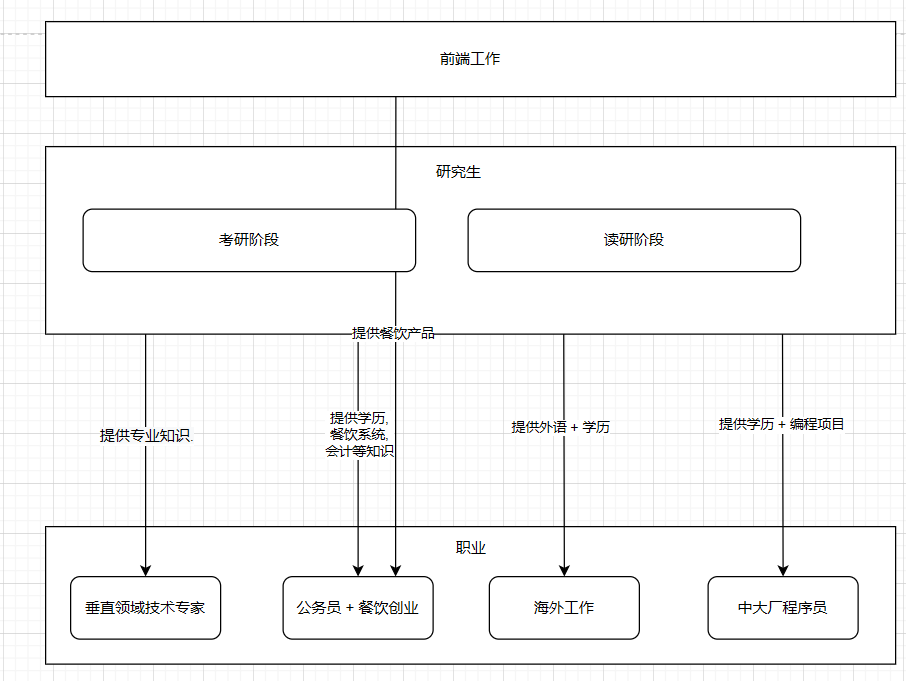

# 职业规划

## 职业规划思维导图

## 垂直领域专家
### 计划1: 寻找合适的垂直领域-0.1
1. 看技术指针等节目筛选出"有前景 + 感兴趣"的领域. 比如人工智能、大数据、云计算等, 这一步需要找3到5个意向领域。
2. 查看该意向领域比较有名的项目. 对于用户侧的项目(比如音视频方向的腾讯会议), 使用产品, 感受产品. 对于基建类项目(比如音视频方向的编码器)可采用以下方式
   1. 看官方介绍和文档首页, 只看主页和“Getting Started”部分，了解项目的用途和特点。
   2. 找对比文章或测评, 搜索“XXX vs YYY”之类的对比文章，快速理解项目的优劣势和使用场景。
   3. 看视频讲解或演讲 ,在 Bilibili 或 YouTube 上找“项目速览”视频，10~15 分钟了解核心信息。
   4. 快速试用,用官方提供的示例项目跑一下，亲自感受效果和易用性。
   5. 查社区评价和使用情况, 看 GitHub 的 Star 数和 Issue 讨论，判断项目的受欢迎程度和活跃度。
3. 使用python抓取该领域, boss直聘上工作岗位, 地域 ,薪资待遇情况
4. 查看垂直领域招考的研究生专业招生情况

### 计划2: 研究生阶段在该领域深耕

## 公务员 + 餐饮创业
### 计划1: 餐饮产品力
1. 每两个星期为一个周期, 第一个星期日选"练习巩固: 一新一旧"或"复习: 两旧". 温习技术要点, 总结失败原因, 填写采买清单. 第二个星期星期日, 根据温习的技术,失败原因的解决方案进行实践.每周两小时
2. 我去工作, 宝宝没来找我之前的这段时间, 没有正式租房, 没有灶台可以研究菜单. 筛选各大饭店的菜单,总结出自己的菜单(50道菜作用). 并找靠谱的学习视频, 贴上链接. 每周两小时

### 计划二: 餐饮系统开发

### 计划三: 餐饮运营, 成本等知识学习

