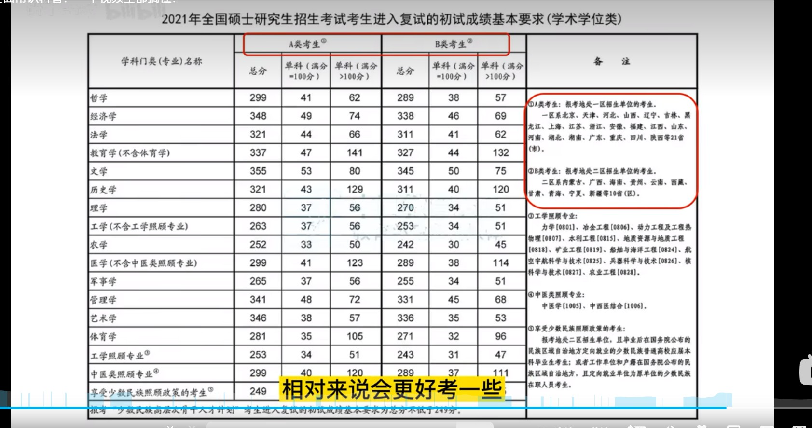

## 终于有人把24考研说清楚了

[终于有人把24考研说清楚了](https://www.bilibili.com/video/BV16M4y197QR/?spm_id_from=333.337.search-card.all.click)

### 考研时间节点

1. 出考试大纲, 各学校出招生简章 --- 2024/9月
2. 考研预报名 --- 2024/9月中旬
3. 考研正式报名(报考学校+专业+方向) --- 2024/10月中旬
4. 现场确认报名(不确认不能考试) --- 2024/11月中旬
5. 下载准考证 --- 2024/12月中旬
6. 初试 --- 2024/12月最后一周的周末
7. 公布初试成绩 --- 2025/2月
8. 公布**国家线, 自划线, 开始复试和调剂** --- 2025/3月
9. 复试结束 --- 2025/5月

## 考研常识

1. 国家线: 
   - 国家出的分数线, 不过线什么学校都不能复试
   - 分为**单科线**和**总分线**. 单科线和总分线都必须过国家线
2. 院校线: 
   - 院校线高于国家线
   - 学校在生源良好的情况下, 在国家线的基础上再次划线, 筛选高分学生
3. 复试线
   - 复试线高于院校线
   - 如果在经过院校线限制后, 所剩学生还是很多, 通过对院校线再次划线, 筛选高分学生
4. 自划线: 34所学校自己划的线, 不考这34所不用管
5. 专硕与学硕
   - 专硕: 一般读2-3年, 想读博士必须**考博**, 考试较难, 专硕费用一般较高
   - 学硕: 一般三年, 考试较简单, 学硕费用一般较低, 想读博士可以**硕博连读, 提前读博, 考博
6. 调剂
   - 调剂是**过了国家线, 但没过学校的复试**同学再次选择学校的过程

[【考研小白扫盲】考研常识科普(上)‖你所有的考研疑惑这个视频都讲了](https://www.bilibili.com/video/BV13h411y7qc/?spm_id_from=333.337.search-card.all.click)

[考研需要知道什么？](https://www.zhihu.com/question/305966486/answer/1456645815)
