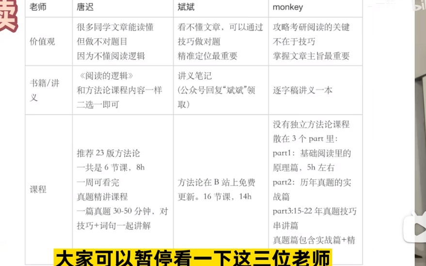

# 重新起航
2023年11月22日08:59:55

## 计算机考研时间安排
6月前
基础过一轮
- 英语
    - 单词一轮
    - 语法一轮: 2周
    - 阅读解题技巧
    - 前10年阅读真题

- 专业课一轮
    - 看书 + 做笔记 + 理解

- 数学一轮
    - 视频 + 辅助刷题

- 政治: 不看

7-8月 强化轮
- 英语
  - 单词: 第2-3遍
  - 阅读:10-18年阅读真题练习

- 专业课
    - 真题训练

- 数学: 刷习题

- 政治: 每天30min - 1小时

冲刺轮9-11月
- 英语
    - 写作: 背诵模版
    - 新题型: 完善新题型
    - 翻译: 写翻译题
    - 完形填空: 写完形填空
    - 模拟考试

- 专业课:
    - 背书 + 刷题 + 回顾笔记

- 数学: 刷真题 + 模拟题

- 政治
  - 9月-11月刷题,先选择后分析题. 12.10左右肖8上市, 背肖8 

## 408备考经验贴
6月前
-  5月前: 1刷408所有视频, 并完成王道单科书所有选择题
-  建立思维导图: 每天20-30min 408复习知识点
-  建立错题本: 记录错误原因

6-9月强化轮
  - 计网, 计组, 
    数据结构用教材:袁春⻛的《计算机组成与系统结构》第二版（紫皮）和第三版（白皮）都可以，谢希仁的《计算机⽹络》第八版，汤⼩丹的《计算机操作系统》第四版，这三本书是必买的。数据结构推荐王道+天勤, 不推荐教材
  - 复习思路: 看教材 + 回顾选择错题本 + 做王道单科书大题(真题必做, 王道题选做)
  - 每天20-30min 408复习知识点

10-12月冲刺轮
  - 每天20-30min 408复习知识点
  - 刷真题
  - 王道八套卷
  - 错题的回顾
  - 真题和王道八套卷可以考虑三刷

[23考研跨考408感想——408各科目复习建议](https://zhuanlan.zhihu.com/p/602861747)

[23考研跨考408感想——本人复习过程](https://zhuanlan.zhihu.com/p/598335087)

[浅谈*408*真题之举一反三](https://zhuanlan.zhihu.com/p/652646449)

[408考研138分经验分享｜408备考流程](https://www.bilibili.com/video/BV1Jq4y1Y7yQ/?spm_id_from=333.337.search-card.all.click&vd_source=f0597bff9d28f459976cfa5b23ec3128)

**分值分布**

数据结构: 45分

组成原理: 45分

操作系统: 35分

计网: 25分

共计: 150分

**所用资料**

09-24年15套真题

王道四本单科书

对应课本

## 考研数学复习

[23一战跨考11408浙大计算机考研经验贴442分](https://zhuanlan.zhihu.com/p/618604292)

**学习顺序**是高数->线代->概率

**用过的书籍** : 数学教材、李范全书、张宇基础30讲和提高36讲、李林880、张宇1000题、真题卷和各种模拟卷。

关于数学我自己有两个很重要的点可以分享：

**1.** **做笔记。**好记性不如烂笔头。把你做错的题，或者一个巧妙的方法、重要的公式、易忘的知识点写在你的笔记本上，一条一条标好序号。**错题笔记不是抄题目，是把这道题考察的知识点简明扼要地写下来**，比如这道题你做错了是因为没掌握二维正态分布的公式，那你把二维正态分布公式抄下来就好了，没必要抄题目。我到考前有好几本笔记，都是重难点，易忘点，后期只要看笔记复习就行，比看辅导书更高效。

**2.** **做套卷。**二轮完了之后刷套卷。这是提高你的水平最最关键的事情。套卷我觉得市面上有的都可以刷。张宇的、李林的、合工大的、李艳芳的、加上10年真题。刷题就3个小时限制，不能超时，当然你很自信可以提前结束。不管这张模拟卷是不是真题的难度，刷卷子就把它想象成你在考研考场上面对这张卷子，你怎么样在3个小时内拿到尽量高的分。改完卷子后看看自己的分数，分析自己为什么没有拿到150分，没有满分就有改进的空间，改进了问题就是提高了自己的水平。当然你张张150分的话当我没说。大概9月份开始刷，一开始错得比较多，可以2天一张，一天做卷子加改分，一天订正分析，如果是知识点掌握有问题就回到辅导书对应章节看看。记得要做错题笔记。如果你模拟卷张张140+，考场上低于140的概率是很小的。

如果没有做到吃透40张卷子以上的话，考差了很正常奥。

[二本院校考研数学零基础的我考研数学的复习准备过程](https://zhuanlan.zhihu.com/p/378353005)

**3-5月初: **樊顺厚 + 同济七版高数 + 课后习题

**5月初-5月底**: 高数880题, 遇到不会的题的知识点回顾苏德矿老师的高等数学

**6月初-6月底**- :开始线代: 

- 书籍: 清华大学居余马老师的线性代数和陈维新老师的线性代数简明教程
- 视频:徐小湛老师线性代数
- 习题: 课本习题
- 备注: 刷题的时候，有不太会的章节，再看李永乐老师的视频

**七月初-七月底**

- 书籍:茆诗松老师的概率论与数理统计教程
- 视频: 方浩老师的视频

**八月初-八月底-真题阶段**

- 李林历年真题解析
- 李永乐真题
- 武忠祥真题

**九月份—十一月份巩固阶段**

- 毛纲源客观题简化求解和660题
- 李林108题
- 李永乐六套卷，李林四套卷（都是20年的），哈工大超越共创近五年的卷子

**十二月份模拟阶段:** 刷了21年李林6+4当然是数一数二数三，哈工大超越共创，李永乐6套卷。

[考研数学怎么学?](https://www.zhihu.com/question/22527928/answer/130117447)

**高数：**杨超（或者汤家凤）基础 + 张宇强化

**线代：**李永乐线代强化（主）+ 张宇线代（辅）

**概率**：张伟概率 +方浩（卷积公式部分）+ 张宇（假设检验部分)

1.**基础阶段**(3月一6月)
(1)视频
​	·杨超（或汤家凤）高数基础班（跟着做题，他写什么你写什么）
​	·张宇2012线性代数强化班（对线代宏观把握，对线代全新认识）
(2)书籍
​	·高数课本（定积分、不定积分、多元函数Q、重积分这几章课后习题一定要做)
​	·线代课本（只做一些证明除外的练习题）
​	·1800题（做前面的基础题，高数和线代）

2.**强化阶段**(7月一9月)
(1)视频
​	·张宇高数强化班
​	·李永乐线代强化班（重中之重，多听两遍都不为过）
​	·张伟概率强化班13版一一（概率重点）
(2)书籍
​	·高数：李王复习全书（红皮）（主）+张宇高数18讲（辅）
​	·线代：李永乐线性代数Q讲义
​	·概率率：张伟率强化班讲义
​	·1800题（全科练手）

3.**冲刺阶段**(10月一一考前)
(1)视频
​	·高数杨超高分题型精讲一（看一遍，理解，自己做一遍）

(2)书籍
​	·1800题+1000题（大量训练）
​	·李永乐真题试卷版（红皮）(近十年真题做至少两遍)
​	·合工大Q超越五套卷
​	·A4纸重点难点集合本Q

**额外解题技巧训练:** 

微分方程—陈文灯微分算子法（解题速度极快！）  一天搞定

**无穷级数 ** - 毛纲源老师的数学复习全书Q无穷级数部分，很有用！  一个下午搞定

不定积分
多项相乘用陈文灯老师的表格法Q!一不到两个小时掌握

线性代数
张宇老师用一个向量Q将第一章到第六章所有内容穿针引线“、一气呵成

多维随机分布一方浩老师应用的卷积公式Q计算起来很方便一一个下午搞定

[大数据统计，考研数学120+有多难？需要做多少题？看哪些书？](https://www.bilibili.com/video/BV1b7411g79b/?spm_id_from=333.999.0.0&vd_source=f0597bff9d28f459976cfa5b23ec3128)

**基础轮: 7月初前**

​	以教材为主, 无死角过知识点, 和课后习题. 同济七版高数, 同济六版线代, 浙大四版概率论

**强化轮: 7-9月底**

​	跟某个考研名师, 以复习全书全书为主, 刷强化视频, 刷全书

​	**推荐老师**: 武忠祥高数, 线代李永乐, 概率论方浩/余炳森

​	**推荐习题:** 毛纲源常考题型解题方法技巧归纳(只有例题, 没有习题), 

**拔高轮10-11月底**

​	真题: 张宇真题大全解/李永乐真题解析

​	习题集: 

      		1. 张宇1000题
       		2. 李永乐660 + 330
           3. 汤家凤1800
            4. 李林880

**冲刺12月**

​	李林6+4

​	合工大五套卷

​	张宇8+4

​	李正元400题

​	李永乐模拟题

**初中数学查漏补缺**

[考研数学120训练——中学数学基础](https://www.bilibili.com/video/BV1Gy4y1p7aK/?spm_id_from=333.337.search-card.all.click&vd_source=f0597bff9d28f459976cfa5b23ec3128)

[考研数学中必备初高中知识合集（小白版）](https://www.bilibili.com/video/BV1eY4y1s7uh/?spm_id_from=333.788.recommend_more_video.0&vd_source=f0597bff9d28f459976cfa5b23ec3128)

[考研数学基础差，完美的解决方案！](https://www.bilibili.com/video/BV1EP4y1C7Gr/?spm_id_from=333.337.search-card.all.click&vd_source=f0597bff9d28f459976cfa5b23ec3128)

[《高等数学基础》苏德矿 余继光 编](https://www.bilibili.com/video/BV1aK4y177RB/?spm_id_from=333.337.search-card.all.click&vd_source=f0597bff9d28f459976cfa5b23ec3128)

**考研数学书籍选择**

[考研数学书籍大全](https://www.bilibili.com/video/BV1oz4y127qf/?spm_id_from=333.337.search-card.all.click&vd_source=f0597bff9d28f459976cfa5b23ec3128)

[考研数学书籍大全2025版](https://www.bilibili.com/video/BV1Tq4y1i7A7/?spm_id_from=333.788&vd_source=f0597bff9d28f459976cfa5b23ec3128)

**考研数学课本用法**

[数学课本看不懂怎么办？有一个最简单粗暴的办法](https://search.bilibili.com/all?keyword=%E6%80%8E%E4%B9%88%E7%94%A8%E5%A5%BD%E6%95%B0%E5%AD%A6%E8%AF%BE%E6%9C%AC&from_source=webtop_search&spm_id_from=333.1007&search_source=5)

## 考研英语复习

[考研435分！0基础英语备考经验！真挚有效！**](https://www.bilibili.com/video/BV1Tm4y1Y7FR/?spm_id_from=333.337.search-card.all.click&vd_source=f0597bff9d28f459976cfa5b23ec3128)**

**五种题型和最低努力就能上的分数分数**

- 阅读: 26/40
- 完型:3/10
- 新题型:4/10
- 翻译3/10
- 作文:18/30

**阅读技巧课推荐**

**新题型推荐**

刘琦老师

**翻译题型推荐**

唐静老师

**完型题型推荐**

宋逸轩老师

**作文推荐**

石磊鹏老师

[*英语零基础考研*经验分享](https://zhuanlan.zhihu.com/p/495746343)

田静老师的语法课

唐迟阅读的逻辑

[23一战跨考11408浙大计算机考研经验贴442分](https://zhuanlan.zhihu.com/p/618604292)

唐迟阅读的逻辑、三小门的逻辑

[八月考研英语零基础备考方法｜针对艺术生体育生二三本专升本等基础薄弱同学「AI归来」**](https://www.bilibili.com/video/BV1mN4y157iL/?spm_id_from=333.337.search-card.all.click&vd_source=f0597bff9d28f459976cfa5b23ec3128)

**前七天:** 背诵核心2000词(背不等于背诵)

**第一个月- 分五步+1步 + 刷三遍:**

      1. 背单词: 做阅读前一天把阅读的涉及的单词背诵
       2. 做题: 20-25min 仔细阅读阅读试题, 做题, **不对答案**
      	   3. 翻译: 80min  简单的句子口译, 复杂的句子笔译
           4. 修改: 拿出**逐词逐句精讲**. 对照翻译, 修改翻译, 学习语法. 学习看不懂的句子
               5. 再做: 再做一遍试题
               6. 对答案
               7. 看解析
               8. 做总结 

**由以下可以出一张诊断量表**

如果第一遍做错了, 再做作对了, 问题处在词汇和语法

如果两遍都错了, 问题出在理解和逻辑

第一遍做对了, 第二遍做错了, 问题出在理解 问题出在过度推断

两步都对了, 可以先放一放

