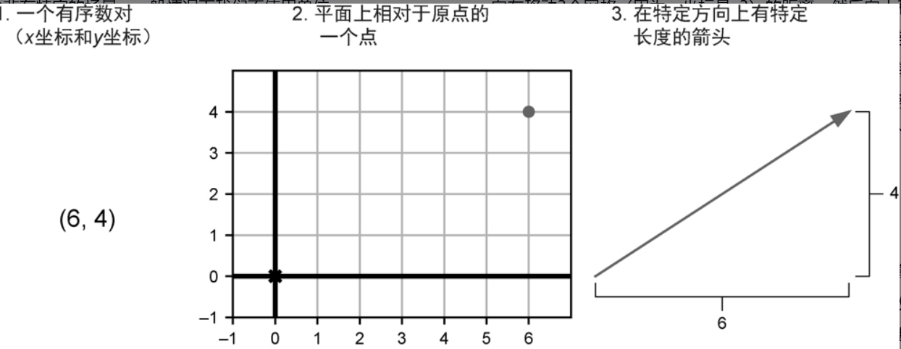
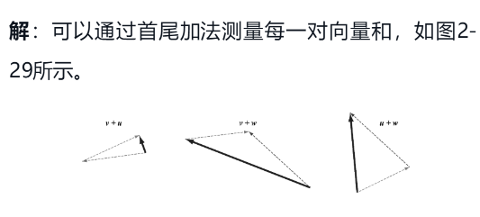
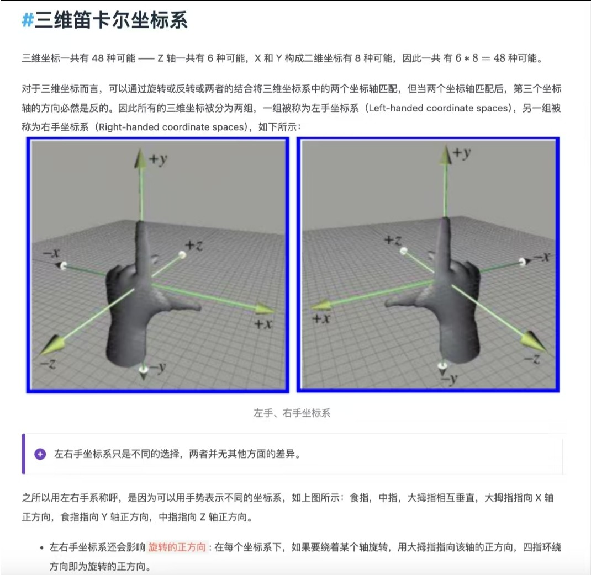

# 用python学习线代和微积分

> 这个笔记是 《程序员数学: 用python学透线性代数和微积分》的读书笔记

## 章节一、通过代码学数学

### 1.1 向量

在数学里，用**有序的数字列表**来描述的对象被称为向量（vector）​，有一个领域专门研究它，称为线性代数。

例如，一辆二手车可能对应的是一个四维向量，也就四个数的元组。例如：(2015,41,22.27,16980) 含义为(出厂日期,里程数,停留时间, 价格)

### 1.2 线性回归

我们可以通过找到一条“最佳拟合”线来衡量股票价格会涨还是会跌，这条线大致遵循价格的变动方向。

因为数据是不断变化的，所以可以在“最佳拟合”线上下再计算出两条线，以显示价格上下浮动的区域


## 章节二、向量和图形

## 2.1 向量基础概念

| 概念                          | 释义                                       | 备注                                       |
| --------------------------- | ---------------------------------------- | ---------------------------------------- |
| 向量(vector)                  | 可以把它看作某个多维空间中的一个数据点                      | 平面上的一个点(x, y), 三维空间中的一个点(x,y,z)          |
| 线性变换(linear transformation) | 线性变换是一种函数，将一个向量作为输入并返回一个向量作为输出，同时保持所操作向量（在特殊意义上）的几何形状 | 如果一个向量（点）的集合位于二维平面的一条直线上，在应用线性变换后，它们仍然会位于一条直线上 |


尽管我们日常生活在三维世界中，但处理更高维度的数据也很有用。物理学上通常把时间看作第四维，事件会发生在特定的时间和地点。

数据科学中的数据集通常也包含更多维度。举例来说，网站跟踪的用户可以有数百个可测量的属性，这些属性描述了用户的使用习惯。要解决这些和图形学、物理学以及数据分析相关的问题，需要一个能够处理高维数据的框架，即向量数学。

> 如: 一辆二手车可能对应的是一个四维向量，也就四个数的元组。例如：(2015, 41, 22.27, 16980) 含义为(出厂日期,里程数,停留时间, 价格)

### 2.2 二维向量

二维即平面, 为了描述点在平面中的位置，你需要一个参考点。这个特殊的点称为原点

二维向量（two-dimensional vector）是平面上相对于原点的一个点。换言之，可以把一个向量想象成平面上的一个直线箭头，从原点指向一个具体的点.


用更专业的数学定义一个二维向量:




### 2.3 使用pillow绘制二维向量图形

效果如下: 


```python
# [pillowApi简易文档](https://blog.csdn.net/qq_57143062/article/details/141938953)

# pip install pillow
from PIL import Image, ImageDraw
from math import inf

# 创建空白图像
width, height = 1000, 800
image = Image.new("RGB", (width, height), "white")

# 创建画笔, 画笔要指定画布(会话的图像)
draw = ImageDraw.Draw(image)

# 定义原点
origin_x, origin_y = width // 2, height // 2


# 定义坐标轴点转换函数
# pillow的原点位于左上角, 数学直角坐标系原点位于画像中点, 所以需要一个转换函数
def convert(math_point):
    x = origin_x + math_point[0]
    y = origin_y - math_point[1]

    if x == inf:
        x = width
    elif x == -inf:
        x = 0

    if y == inf:
        y = height
    elif y == -inf:
        y = 0

    return (int(x), int(y))


draw.line([convert((-inf, 0)),convert((inf, 0))],fill="black")  # x轴
draw.line([convert((0, inf)), convert((0, -inf))], fill="black")  # y轴

# 恐龙的二维向量点集
points = [
    (6, 4),
    (3, 1),
    (1, 2),
    (-1, 5),
    (-2, 5),
    (-3, 4),
    (-4, 4),
    (-5, 3),
    (-5, 2),
    (-2, 2),
    (-5, 1),
    (-4, 0),
    (-2, 1),
    (-1, 0),
    (0, -3),
    (-1, -4),
    (1, -4),
    (2, -3),
    (1, -2),
    (3, -1),
    (5, 1),
    (6, 4),
]

# 将所有数据放大50倍, 要不画出的恐龙太小
scaled_points = [(x * 50, y * 50) for x, y in points]

draw.line([(convert(point)) for point in scaled_points], fill="blue", width=2)
image.save("output.png")
image.show()  # 可选：直接显示图像

```

**绘制x^2的图像**

```python
# [pillowApi简易文档](https://blog.csdn.net/qq_57143062/article/details/141938953)

from PIL import Image, ImageDraw
from math import inf

# 创建空白图像
width, height = 1000, 800
image = Image.new("RGB", (width, height), "white")

# 创建画笔, 画笔要指定画布(会话的图像)
draw = ImageDraw.Draw(image)

# 定义原点
origin_x, origin_y = width // 2, height // 2


# 定义坐标轴点转换函数
# pillow的原点位于左上角, 数学直角坐标系原点位于画像中点, 所以需要一个转换函数
def convert(math_point):
    x = origin_x + math_point[0]
    y = origin_y - math_point[1]

    if x == inf:
        x = width
    elif x == -inf:
        x = 0

    if y == inf:
        y = height
    elif y == -inf:
        y = 0

    return (int(x), int(y))


draw.line(
    [
        convert((-inf, 0)),
        convert((inf, 0)),
    ],
    fill="black",
)  # x轴


draw.line([convert((0, inf)), convert((0, -inf))], fill="black")  # y轴


# 定义 f = x^2, 并返回点
def get_point(x):
    y = x**2
    return (x, y)


# 获得 -400 到 401 的所有函数点
points = [get_point(x) for x in range(-400, 401)]


for point in points:
    x, y = point
    radius = 2  # 绘制半径为2的圆
    draw.ellipse(
        # 第一个参数是 绘制的椭圆的外接矩形 的左上角坐标和右下角坐标
        # 如果第一个参数是正方型， 则会绘制一个圆
        [convert((x - radius, y + radius)), convert((x + radius, y - radius))],
        fill="gray",
        outline="gray",
    )


image.save("output.png")
image.show()  # 可选：直接显示图像

```


### 2.4 平面向量运算

| 概念    | 释义                                       | 备注                                       |
| ----- | ---------------------------------------- | ---------------------------------------- |
| 向量加法  | 1） 给定两个输入向量，将它们的x坐标相加，得到新的x坐标，然后将它们的y坐标相加，得到新的y坐标。用这些新的坐标创建一个新的向量，就得到了原始向量的向量和<br />2）添加一个向量意味着**移动或平移一个现有的点或点的集合** | 1. (4, 3) +(-1, 1) = (3, 4) <br/> 2. 向量加法有时被称为首尾加法 |
| 分量    | 1）把一个已有的向量分解成更小的多个向量之和，每个被分解的小向量成为原向量的分量<br />2）任意一个向量，总能分解成至少一个垂直分量(向量的x坐标)和水平分量(向量的y坐标) |                                          |
| 向量的长度 | 向量的长度（length）就是代表它的箭头的长度，等价于从原点到它表示的点的距离 | 我们把向量看成点，但同时也用原点到该点的箭头代表该向量              |
| 标量乘法  | 1）将向量乘以数的运算称为标量乘法。处理向量时，普通的数通常被称为标量（scalar）。<br />2）标量乘法的几何意义就是向量在原直线上进行按照系数进行缩放<br />3）标量乘法对应到向量分量上，即每个分量都按相同的系数进行缩放 | scalar这个名字非常贴切，因为运算的效果是将目标向量按给定的系数进行缩放（scale |
| 负向量   | 负向量是长度相同，方向相反的箭头                         |                                          |
|       | 1）v-w 的结果是从w到v的一个箭头<br />2）v-w代表从w到v的距离  |                                          |


**向量加法的几何意义, 又称为首尾加法**: (被加的向量平移到另一个向量的头部)


**添加一个向量意味着移动或平移一个现有的点或点的集合**

下面的恐龙代表的向量集合中，每个点都加了（-2，-3），整体图案向左下平移，如果从每个点的角度来看，实际上是每个点都在向下平移


```python
# 省略恐龙向量代码。。。

# 恐龙的二维向量点集
points = [
    (6, 4),
    (3, 1),
    (1, 2),
    (-1, 5),
    (-2, 5),
    (-3, 4),
    (-4, 4),
    (-5, 3),
    (-5, 2),
    (-2, 2),
    (-5, 1),
    (-4, 0),
    (-2, 1),
    (-1, 0),
    (0, -3),
    (-1, -4),
    (1, -4),
    (2, -3),
    (1, -2),
    (3, -1),
    (5, 1),
    (6, 4),
]
def add(old_point, add_point):
    return (old_point[0] + add_point[0], old_point[1] + add_point[1])


# 将每个向量加上(-2,-3) 意味着让整个恐龙向左下平移
points = [add(point, (-2, -3)) for point in points]

```


**把一个已有的向量分解成更小的多个向量之和，每个被分解的小向量成为原向量的分量**

下图将一个向量分解成一个水平分量和一个垂直分量


**任意一个向量，总能分解成至少一个垂直分量(Y坐标)和水平分量（x坐标）**


```python
from math import sqrt 

# 计算一个向量的长度的函数
def vector_length(vector):
	return sqrt(vector[0]**2 + vector[1]**2 ) # 对x平方和y平方的和开方
```


**标量乘法的几何意义就是向量在原直线上进行按照系数进行缩放**


**标量乘法对应到向量分量上，即每个分量都按相同的系数进行缩放**

在章节2.3中，我们曾经写出过如下代码, 以期望恐龙能放大一些，这就是标量乘法

```python
# 恐龙的二维向量点集
points = [
    (6, 4),
    (3, 1),
    (1, 2),
    (-1, 5),
    (-2, 5),
    (-3, 4),
    (-4, 4),
	# ...
]

# 将所有数据放大50倍, 要不画出的恐龙太小
scaled_points = [(x * 50, y * 50) for x, y in points]
```

我们也可以优化这段代码

```python
def vector_mul(scalar,vector):
    return (vector[0] * scalar, vector[1] * scalar) #标量乘法 = 分量按相同的系数缩放

# 将所有数据放大50倍, 要不画出的恐龙太小
scaled_points = [vector_mul(50, point) for point in points]
```


**v-w 的结果是从w到v的一个箭头， v-w代表从w到v的距离**


**作业**

1. 练习2.7（小项目）：通过将所有向量各自的[插图]坐标和[插图]坐标相加，可以实现任意数量的向量相加。例如，向量和(1, 2) + (2, 4) + (3, 6) + (4, 8)有[插图]分量1+ 2 + 3 + 4 = 10与[插图]分量2 + 4 + 6 + 8 = 20，结果为(10, 20)。实现新的add函数，接收任意多个向量作为参数。

```python
# 用reduce实现也行
def add(*vectors):
    return (sum([v[0] for v  in vectors]), sum([v[1] for v  in vectors]))
```

2. 练习2.8：实现函数translate(translation,vectors)，接收一个平移向量和一个向量列表，返回一个根据平移向量平移后的向量列表。例如，对于translate ((1,1), [(0,0), (0,1,),(-3,-3)]) ，它应该返回[(1,1), (1,2), (-2,-2)]。

```python
练习2.8：实现函数translate(translation,vectors)，接收一个平移向量和一个向量列表，返回一个根据平移向量平移后的向量列表。例如，对于translate ((1,1), [(0,0), (0,1,),(-3,-3)]) ，它应该返回[(1,1), (1,2), (-2,-2)]。
```

```python
def translate(translation, vectors):
    return [add(translation, v) for v  in vectors]
```

3. 练习2.10：在如图2-28所示的三个箭头向量中，哪一对的和对应的箭头最长？哪一对的和对应的箭头最短？


解答： U,V,W三个向量相加，有三种可能 U+V,U+W ,V+W, 可以用首尾相加。 可以看到u+v最短（u和的v方向几乎相反，接近于互相抵消）​，最长的是v+w。




3. 练习2.9 画出121个不重叠的恐龙


```python
# [pillowApi简易文档](https://blog.csdn.net/qq_57143062/article/details/141938953)

# pip install pillow
from PIL import Image, ImageDraw
from math import inf

# 创建空白图像
width, height = 1000, 1000
image = Image.new("RGB", (width, height), "white")

# 创建画笔, 画笔要指定画布(会话的图像)
draw = ImageDraw.Draw(image)

# 定义原点
origin_x, origin_y = width // 2, height // 2


# 定义坐标轴点转换函数
# pillow的原点位于左上角, 数学直角坐标系原点位于画像中点, 所以需要一个转换函数
def convert(math_point):
    x = origin_x + math_point[0]
    y = origin_y - math_point[1]

    if x == inf:
        x = width
    elif x == -inf:
        x = 0

    if y == inf:
        y = height
    elif y == -inf:
        y = 0

    return (int(x), int(y))


draw.line([convert((-inf, 0)), convert((inf, 0))], fill="black")  # x轴
draw.line([convert((0, inf)), convert((0, -inf))], fill="black")  # y轴

# 恐龙的二维向量点集
points = [
    (6, 4),
    (3, 1),
    (1, 2),
    (-1, 5),
    (-2, 5),
    (-3, 4),
    (-4, 4),
    (-5, 3),
    (-5, 2),
    (-2, 2),
    (-5, 1),
    (-4, 0),
    (-2, 1),
    (-1, 0),
    (0, -3),
    (-1, -4),
    (1, -4),
    (2, -3),
    (1, -2),
    (3, -1),
    (5, 1),
    (6, 4),
]


# 1. 计算恐龙的宽高
def get_kl_weight(points):
    weight = 0

    for p1 in points:
        x1, y1 = p1

        for p2 in points:
            x2, y2 = p2
            if y1 == y2 and abs(x1 - x2) > weight:
                weight = abs(x1 - x2)

    return weight


def get_kl_height(points):
    height = 0

    for p1 in points:
        x1, y1 = p1

        for p2 in points:
            x2, y2 = p2
            if x1 == x2 and abs(y1 - y2) > height:
                height = abs(y1 - y2)

    return height


kl_weight, kl_height = get_kl_weight(points), get_kl_height(points)


# 2. 每个点向上下左右方向平移 n 个恐龙的大小
# 121个恐龙就是11*11的矩阵

# 11*11的矩阵： 每个矩阵点代表平移的抽象操作
translators = [(x, y) for x in range(-5, 6) for y in range(-5, 6)]

# 平移的点要乘上恐龙的宽高，才是真正的平移的宽高，+2 是为了恐龙之间有一点间隙，好看，要不堆在一起
kl_traslators = [(x * (kl_weight + 2), y * (kl_height + 2)) for x, y in translators]


# 向量加法: 向量加法是两个点的相加
def add(old_point, add_point):
    return (old_point[0] + add_point[0], old_point[1] + add_point[1])


# 向量平移： 向量平移是一个向量集合的所有点都与另一个向量相加
def translate(vectors, add_vector):
    return [add(v, add_vector) for v in vectors]


# 画恐龙： 1.先把恐龙向量集合放大若干倍(标量乘法) 2.将坐标转为直角坐标系
def draw_konglong(vectors, scaler):
    # 把恐龙放大五倍，好看
    scaled_points = [(x * scaler, y * scaler) for x, y in vectors]
    draw.line([(convert(point)) for point in scaled_points], fill="blue", width=2)


for kl_translate in kl_traslators:
    new_points = translate(points, kl_translate)
    draw_konglong(new_points, scaler=5)


image.save("output.png")
image.show()  # 可选：直接显示图像

```
## 章节三、 python中的三角函数

### 3.1 三角函数 

> Python不使用角度，事实上大多数数学家也不使用角度。他们使用弧度（radian）来替代角度
>
> 所以不能使用 `tan(45)`这样的角度表达式
>
> 1rad 约等于57°

```python
from math import tan,sin,cos, pi

res = tan(pi / 4)
print(res) # 0.9999999999999999

res = sin(pi / 6)
print(res) # 0.49999999999999994

res = cos(pi / 3)
print(res) # 0.5000000000000001
```

###3.2 极坐标转直角坐标

```python
from math import tan, sin, cos, pi


def polar_to_cartesian(polor_vector: tuple):
    r, theta = polor_vector
    return r * cos(theta), r * sin(theta)

```

### 3.3 反三角函数

#### 3.3.1 反函数自反性在反三角函数的应用

根据反函数的特性, 如下所示, 当已知一个角的三角函数值时, 用反三角函数能快速得到"角度"


```python
from math import tan, sin, cos, atan, asin, acos, pi

tan_x = tan(pi / 4)  
x = atan(tan_x)     
print(x)  # 0.785398... ≈ π/4

sin_x = sin(pi / 6)  
x = asin(sin_x)     
print(x)  # 0.523598... ≈ π/6

cos_x = cos(pi / 3)  
x = acos(cos_x)     
print(x)  # 1.047197... ≈ π/3

# 注: 这里的x都是弧度,不太直观 可以手动转成弧度验证下结果
import math
print(math.degrees(x))
```

#### 3.3.2  反函数自反性的注意点


如上图所示, 求$sin \theta$ 

解: $sin \theta = sin(π-\theta) = \frac{3}{\sqrt{13}}$ (根据诱导公式, 奇变偶不变, 符号看象限得)

我们尝试用反函数的自反性, 即 $arcsin(sin\theta) = \theta$ 求出角度

```python
from math import  asin pi, degrees, sqrt

theta = asin(3/sqrt(13))

print(degrees(theta)) # 56.30993247402022 大约56度
```

很明显, 我们找到的$\theta$不是希望得到的, 它是下面这样的


仔细看看定义:


即当用$arcsin(sin\theta) = \theta$时, 求出的$\theta$应在定义域内, 而此时$\theta∈(-\frac{π}{2},\frac{π}{2})$, 所以求出来是$56°$


以上只是在说明, 用反三角函数求解$\theta$是不稳定的, 正确的方式如下

```python
# atan2(y, x) 传入一个点的y, x直角坐标, 返回与正向x轴的夹角
theta = atan2(3, -2)

print(degrees(theta))  # 123.69006752597979
```

### 3.4 直角坐标转极坐标

如上小节所示, 直角坐标转换为

```python
from math import  sqrt, atan2, degrees


def cartesian_to_polar(cartesian_vector):
    x, y = cartesian_vector
    r = sqrt(x**2 + y**2)
    theta = atan2(y, x)
    return r, theta


r, theta = cartesian_to_polar((1,1))

print(degrees(theta)) # 45
```


### 3.5 章节作业


```python
import math


# 练习2.27：确认笛卡儿坐标(-1.34, 2.68)对应的向量的长
def length(cartesian_vector):
    x, y = cartesian_vector
    return math.sqrt(x**2 + y**2)

print(length((-1.34, 2.68))) # 2.9963310898497184


# 练习2.28：tan(22度)的近似值是多少？
rad = math.radians(22) # 将角度转为弧度
print(math.tan(rad)) # 0.4040262258351568


# 练习2.29：转换问题的角度，假设我们知道了一个向量的长度和方向，想找到它的分量该如何做呢？
# 一个长度为15的向量指向37°角，其 分量和 分量是多少？

def polar_to_cartesian(polar_vector):
    r, theta = polar_vector
    return r * math.cos(theta), r * math.sin(theta)

rad = math.radians(37)
print(polar_to_cartesian((15, rad))) # (11.979532650709393, 9.027225347280725)


# 练习2.31：0°、90°和180°的正弦和余弦各是多少？换句话说，在这些方向上，每单位距离经过多少个垂直和水平单位？

# 对"换句话说，在这些方向上，每单位距离经过多少个垂直和水平单位？"的理解
# 当角度在单位圆（半径为1的圆）上定义时，任何角度的终边与圆交点的坐标即为(cos(ß), sin(ß))。
# 若沿某个方向移动1单位长度（单位圆的半径），则：
#   - 水平单位（x方向）移动量 = cos(ß)
#   - 垂直单位（y方向）移动量 = sin(ß)

# 解： sin(0) = 0, cos(0) = 1, sin(90) = 1， cos(90) = 0, sin(180) = 0, cos(180) = -1


# 练习2.34：已知50°的余弦值是0.643。 那么sin(50)和tan(50)正弦值又是多少？不能通过诱导公式算。

# 假设有一斜边长度为1，各角度为50度，40度，90度的直角三角形
# 则【插入图片】 


## 练习2.36：cos(10π/6)和sin(10π/6)的值为正还是为负？
# 使用Python计算它们的值并确认。
```

## 章节四、向量集合的变换

### 4.1 旋转恐龙

我们已经看到，用笛卡儿坐标移动（或平移）向量集合很容易( 只需要对x, y进行加减 )，而在极坐标中就不那么自然了。不过，由于极
坐标包含角度信息，会使得旋转向量更为方便。


回顾之前在直角坐标系下画的恐龙代码, 现在我们希望将恐龙逆时针旋转45°, 我们可以先把恐龙的直角坐标向量集合转成极坐标向量集合, 然后把每个极坐标角度 + 45° 完成这一点


示例代码如下

```python
# 恐龙的二维向量点集
points = [
    (6, 4),
    (3, 1),
    (1, 2),
    (-1, 5),
    (-2, 5),
    (-3, 4),
    (-4, 4),
    (-5, 3),
    (-5, 2),
    (-2, 2),
    (-5, 1),
    (-4, 0),
    (-2, 1),
    (-1, 0),
    (0, -3),
    (-1, -4),
    (1, -4),
    (2, -3),
    (1, -2),
    (3, -1),
    (5, 1),
    (6, 4),
]

# 极坐标转直角坐标
def to_polar(cartesian_vector):
    x, y  = cartesian_vector
    r = math.sqrt(x**2 + y**2)
    theta = math.atan2(y,x)
    return r, theta

# 直角坐标转极坐标
def to_cartesian(polar_vector):
    r, theta = polar_vector
    return r * math.cos(theta), r * math.sin(theta)

# 将恐龙直角坐标点集转成极坐标点集, 因为极坐标涉及到角度, 更容易旋转
polar_points = [to_polar(point) for point in points]

# 将恐龙的每一个点 +45°, 即逆时针旋转45°
rotate_points = [(r, theta + math.radians(45))  for r, theta in polar_points]

# 将点转回直角坐标, pillow画图库只支持直角坐标
points = [to_cartesian(point) for point in rotate_points]
```


完整代码如下

```python
# [pillowApi简易文档](https://blog.csdn.net/qq_57143062/article/details/141938953)

# pip install pillow
from PIL import Image, ImageDraw
from math import inf

# 创建空白图像
width, height = 1000, 800
image = Image.new("RGB", (width, height), "white")

# 创建画笔, 画笔要指定画布(会话的图像)
draw = ImageDraw.Draw(image)

# 定义原点
origin_x, origin_y = width // 2, height // 2


# 定义坐标轴点转换函数
# pillow的原点位于左上角, 数学直角坐标系原点位于画像中点, 所以需要一个转换函数
def convert(math_point):
    x = origin_x + math_point[0]
    y = origin_y - math_point[1]

    if x == inf:
        x = width
    elif x == -inf:
        x = 0

    if y == inf:
        y = height
    elif y == -inf:
        y = 0

    return (int(x), int(y))


draw.line([convert((-inf, 0)),convert((inf, 0))],fill="black")  # x轴
draw.line([convert((0, inf)), convert((0, -inf))], fill="black")  # y轴

# 恐龙的二维向量点集
points = [
    (6, 4),
    (3, 1),
    (1, 2),
    (-1, 5),
    (-2, 5),
    (-3, 4),
    (-4, 4),
    (-5, 3),
    (-5, 2),
    (-2, 2),
    (-5, 1),
    (-4, 0),
    (-2, 1),
    (-1, 0),
    (0, -3),
    (-1, -4),
    (1, -4),
    (2, -3),
    (1, -2),
    (3, -1),
    (5, 1),
    (6, 4),
]

# 将所有数据放大50倍, 要不画出的恐龙太小
scaled_points = [(x * 50, y * 50) for x, y in points]

draw.line([(convert(point)) for point in scaled_points], fill="blue", width=2)
image.save("output.png")
image.show()  # 可选：直接显示图像

```

### 4.2 通用的旋转, 平移, 缩放函数

到目前为止，我们已经学习了如何平移、缩放和旋转向量。

将这些变换应用于向量的集合，会对这些向量在平面上定义的形状产生同样的效果。

当依次应用这些向量变换时，效果会非常惊人. 

想象一下，适当地结合旋转和平移，可以将恐龙（或任何图形）移动到平面中任意需要的位置和方向。无论是在电影中还是在游戏中制作恐龙的动画，都可以通过向量变换灵活地移动恐龙。如此一来，就以编程的方式赋予了它生命


下面实现对二维向量通用的旋转, 平移, 缩放函数

```python
# 旋转向量(直角坐标系下的向量点)
def rotate_vector(vector, rotate_theta):
    def to_polar(cartesian_vector):
        x, y  = cartesian_vector
        r = math.sqrt(x**2 + y**2)
        theta = math.atan2(y,x)
        return r, theta

    def to_cartesian(polar_vector):
        r, theta = polar_vector
        return r * math.cos(theta), r * math.sin(theta)
    
    r, theta = to_polar(vector)
    x, y = to_cartesian((r, theta + rotate_theta))
    return x, y

# 缩放向量. 
def scale_vector(vector, scale):
    return vector[0] * scale, vector[1] * scale

# 平移向量
def translate_vector(vector, x, y):
    return vector[0] + x, vector[1] + y
 
```


可以尝试用这些函数将恐龙移动你任何位置, 比如


## 章节五、三维向量

### 5.1 左右手直角坐标系


### 5.2 三维向量的画法

> 本图以右手坐标系为例


### 5.3 用matplotlib画图

**画二维图像**


```python
import matplotlib.pyplot as plt
import numpy as np

# 创建一个图形和坐标轴
# Doc: https://matplotlib.org/stable/api/_as_gen/matplotlib.pyplot.subplots.html
fig, ax = plt.subplots()

# 定义向量
origin = [0], [0]        # 起点在 (0, 0)
vector = [3], [2]        # 向量 (3, 2)

# 绘制向量箭头
# Doc: https://matplotlib.org/stable/api/_as_gen/matplotlib.axes.Axes.quiver.html
ax.quiver(*origin, *vector, angles='xy', scale_units='xy', scale=1, color='blue')

# 设置坐标轴范围
# Doc: https://matplotlib.org/stable/api/_as_gen/matplotlib.axes.Axes.set_xlim.html
# Doc: https://matplotlib.org/stable/api/_as_gen/matplotlib.axes.Axes.set_ylim.html
ax.set_xlim(0, 5)
ax.set_ylim(0, 5)

# 设置网格和坐标轴等比例
# Doc: https://matplotlib.org/stable/api/_as_gen/matplotlib.axes.Axes.grid.html
# Doc: https://matplotlib.org/stable/api/_as_gen/matplotlib.axes.Axes.set_aspect.html
ax.grid(True)
ax.set_aspect('equal')

# 标注向量
# Doc: https://matplotlib.org/stable/api/_as_gen/matplotlib.axes.Axes.text.html
ax.text(3.1, 2.1, r'$\vec{v} = [3, 2]$', fontsize=12)

# 添加坐标轴线
# Doc: https://matplotlib.org/stable/api/_as_gen/matplotlib.axes.Axes.axhline.html
# Doc: https://matplotlib.org/stable/api/_as_gen/matplotlib.axes.Axes.axvline.html
ax.axhline(0, color='black', linewidth=1)
ax.axvline(0, color='black', linewidth=1)

# 设置图标题
# Doc: https://matplotlib.org/stable/api/_as_gen/matplotlib.pyplot.title.html
plt.title("2D Vector Visualization")

# 显示图形
# Doc: https://matplotlib.org/stable/api/_as_gen/matplotlib.pyplot.show.html
plt.show()

```


**画三维图像**


```python
import numpy as np
import matplotlib.pyplot as plt

# 创建一个图形和三维坐标轴
# Doc: https://matplotlib.org/stable/api/figure_api.html#matplotlib.figure.Figure.add_subplot
fig = plt.figure()
ax = fig.add_subplot(projection='3d')

# 定义向量的起点和方向
origin = [0, 0, 0]  # 向量起点
vector = [3, 2, 1]  # 向量方向

# 绘制三维向量箭头
# Doc: https://matplotlib.org/stable/api/_as_gen/mpl_toolkits.mplot3d.axes3d.Axes3D.quiver.html
ax.quiver(*origin, *vector, color='blue', arrow_length_ratio=0.1)

# 设置坐标轴范围
# Doc: https://matplotlib.org/stable/api/_as_gen/matplotlib.axes.Axes.set_xlim.html
# Doc: https://matplotlib.org/stable/api/_as_gen/matplotlib.axes.Axes.set_ylim.html
# Doc: https://matplotlib.org/stable/api/_as_gen/matplotlib.axes.Axes.set_zlim.html
ax.set_xlim(0, 5)
ax.set_ylim(0, 5)
ax.set_zlim(0, 5)

# 设置坐标轴标签
# Doc: https://matplotlib.org/stable/api/_as_gen/matplotlib.axes.Axes.set_xlabel.html
# Doc: https://matplotlib.org/stable/api/_as_gen/matplotlib.axes.Axes.set_ylabel.html
# Doc: https://matplotlib.org/stable/api/_as_gen/matplotlib.axes.Axes.set_zlabel.html
ax.set_xlabel('X')
ax.set_ylabel('Y')
ax.set_zlabel('Z')

# 添加向量标签
# Doc: https://matplotlib.org/stable/api/_as_gen/matplotlib.axes.Axes.text.html
ax.text(3.1, 2.1, 1.1, r'$\vec{v} = [3, 2, 1]$', fontsize=12)

# 设置图标题
# Doc: https://matplotlib.org/stable/api/_as_gen/matplotlib.pyplot.title.html
plt.title("3D Vector Visualization")

# 显示图形
# Doc: https://matplotlib.org/stable/api/_as_gen/matplotlib.pyplot.show.html
plt.show()
```


